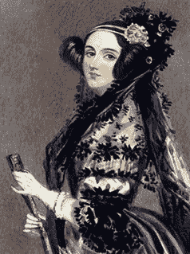
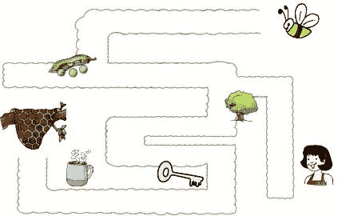

# 图灵测试的替代方案

> 原文：<https://learnetutorials.com/artificial-intelligence/turing-test-alternatives>

众所周知，图灵测试有很多弱点。通过图灵测试的机器展示的是技巧，而不是真正的智能。这不是图灵的意图。于是几位思想家就如何改进或取代图灵测试提出了一些想法。让我们讨论一些替代方法。

## Winograd 模式挑战

多伦多大学计算机科学教授赫克托·莱弗斯克先生介绍了一种比图灵测试更好的替代方法，叫做“T2”维诺格拉图式挑战(WSC) 。这项测试以计算机科学家**特里·维诺格拉德**的名字命名。该测试的引入是为了弥补图灵测试的一个主要缺陷，即机器可以很容易地通过测试，而不是真正的智能。名为 Eugene Goostman 的聊天机器人的性能暴露了图灵测试的一些缺陷，Levesque 评估了这些问题，并将其总结为

*   欺骗或诡计-机器被迫展示一个虚假的身份来通过测试
*   对话——大量没有智能推理的互动
*   评价-法官有时可能不同意结果。

这种方法区别于图灵测试的关键因素是问题的特殊格式。这是一种特定格式的选择题测试。Levesque 认为，一台机器必须使用知识和常识推理才能通过这项测试，并被宣布为智能的。该测试旨在测试理解歧义句子深层含义的能力。

让我们举个例子:

**问题** -这件衬衫不适合 X 先生，因为这件衬衫太大(小)。什么东西太大(小)？

**回答 0** :衬衫

**回答 1**:X 先生

如果用“大”这个词来提问，答案是“0:衬衫”。如果用“小”这个词来提问，那么答案是“1:X 先生”。
上述问题对于人类来说相当简单，但对于计算机来说，它必须知道物体的大小、人际关系推理以及一些常识才能回答这个问题。

**优势**:

*   需要常识推理和知识
*   不需要人类审讯者
*   可以用来测试推理能力

Winograd Schema Challenge 的主要困难在于，必须仔细开发问题，以确保回答时需要常识推理。

## 马库斯测试

NYU 认知科学家加里·马库斯认为图灵测试的获胜者并不真正聪明。图灵测试的当前形式几乎没有受到**马库斯**的批评。他最近开发了一个关于“T4”思维超越图灵测试的重要性的研讨会。“很多专家都被一些有趣的想法连锁在一起。马库斯自己设计了一个替代方案，这就是我们所说的马库斯试验。马库斯说，Goostman 和 ELIZA 主要依靠模式识别；他们没有任何真正的理解。根据他作为认知科学家二十年的经验，他提出了二十一世纪的图灵测试。他建议创建一个计算机程序，可以观看任何电视节目或任何 youtube 视频，并根据观看的节目内容回答问题。Goostman 只能短时间持有这些类型的问题，而且只能通过伪造。马库斯认为，目前还没有任何一个项目可以接近任何一个聪明的青少年所能做到的。

他的想法是，如果一台计算机能够发现并理解幽默、嘲弄，并能以有意义的方式解释它，那么这台计算机就有一定的思考能力。

## 洛夫莱斯测试 2.0

### 阿达·洛芙莱斯

这个测试是塞尔默·布林约尔德和他的同事在 2001 年提出的，作为克服图灵测试主要缺陷的一种补救措施。测试是基于创造力。这个名字是为了纪念被认为是第一位计算机程序员的阿达·洛芙莱斯女士而命名的。测试是检查一个人工智能体是否能以开发者甚至无法解释的方式创建一些输出。为了通过 Lovelace 测试，由人类程序员(h)编程的人工智能体(a)必须生成人类程序员自己无法解释的输出(o)。

为了通过测试，人工智能必须从被认为需要一些人类智能的流派中创建一个纪念品。制作的纪念品必须符合人类评估者给出的某些标准。人类评估者必须确定纪念品是否是具有所需标准的流派的有效表示。评估者还必须确保要求的标准和类型不是不可能的标准。

佐治亚理工学院教授马克·里德尔最近升级了这项测试

## 建筑挑战

图灵测试的主要缺陷是它只关注语言行为。为了克服这个缺点，查理·奥尔蒂斯(Charlie Ortiz)想出了一个办法来创建图灵测试的物理整合版本，以前被称为**宜家挑战**。奥尔蒂斯包含了智能行为的两个主要元素:感知和待测试的身体动作。

在建筑挑战中，能够建造家具等物理结构的机器人之间将会展开竞争。为此，机器人必须处理关于要构建的模型的口头指令，处理物理组件以创建目标模型，在构建的每个阶段识别结构以回答问题或提供解释。另一方面，使用人类智能体构建相同的模型。有一个跟踪调查物理模型常识知识的掌握情况。

## 视觉图灵测试

迈克尔·巴克利和**安东尼·高尔顿**开发了一种测试机器视觉能力的测试。

看图片。蜜蜂在回家的路上遇到了什么事情？

*   小便、树、钥匙、茶***
*   小便，树，钥匙，杯子

一个简单的问题问了人类和软件。"蜜蜂在回家的路上遇到了什么事情？"给定的多个选项在技术上都是正确的。有些人可能会选择“尿、树、钥匙、茶”，而有些人会选择“尿、树、钥匙、杯子”。但是当传递与 bee 押韵的单词时，并不是两个选项都有用。做出正确的选择需要几个提示和判断，包括特定情况下的相对声音、流动和相关性。人类可以更正确地处理它，但机器会失败。

这种人类在视觉描述上的智能是由巴克利和他的同事选择来评估一台机器的智能的。这激发了能够像人类一样与周围环境互动的设备的诞生。

## 数字解剖

为了证明机器是智能的，我们需要的不仅仅是行为测试。我们需要证明机器拥有某种相当于人脑的机器。为了实现这一点，我们必须确定意识的神经相关的机器等价物。对于神经科学家来说，人脑中的 NCCs 仍然是一个谜。作为图灵测试的替代方案，这个想法现在被搁置一边，但它是开发人工大脑和人工意识的潜在途径。

## 咖啡激发试验

人工智能研究员本·戈泽尔提出了一种有趣的测试方法，叫做咖啡测试。作为测试的一部分，人工智能应用程序必须去任何厨房，找到制作咖啡所需的配料，然后必须制作超级咖啡。煮一杯咖啡听起来很容易，但那只是对人类而言。但是对于一台机器来说，识别成分并以适当的量混合它们是很难的，它必须表现出它的智能。

## 机器人大学生测试

正如名字本身一样，考试是关于如何在大学注册人工智能，并使用与其他注册相同学位的学生相同的资源获得学位。这个测试是由本·戈泽尔提出的。Bina48 是第一个完成大学课程的人工智能。

## 就业测验

AI 研究员 Nils J. Nilsson 提出了一个想法，用一种被称为“就业测试”的替代测试方法来取代图灵测试。他的目标是完成最常见的人类活动“工作”。要通过这项测试，人工智能程序必须能够执行由人类执行的工作。

正在讨论的所有这些都是图灵测试的可能替代方案，以克服其缺陷，但一些专家认为，图灵测试本身并没有这种限制，它完全取决于测试是如何进行和判断的。如果一个完整的图灵测试被正确地执行，那么它就能完成图灵预测的工作。