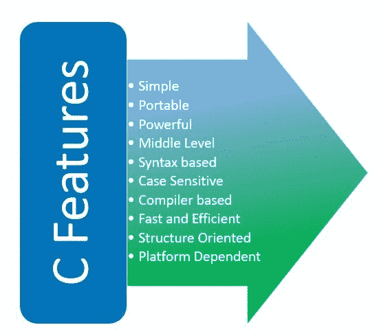
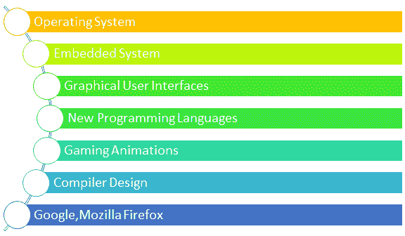

# C 语言概述

> 原文：<https://learnetutorials.com/c-programming/programming-language-tutorials>

在本教程中，您将熟悉一种叫做 C 的基本编程语言。本教程涵盖了事实、C 这个名字背后的原因、C 的关键特性以及使用 C 语言的应用程序。

## 关于丙的事实

c 语言是美国美国电话电报公司贝尔实验室著名的天才程序员丹尼斯·里奇于 1972 年发明的编程语言。它被认为是第一种标准的多用途编程语言，速度快、结构紧凑、用途广泛，甚至到今天，市场上 90%以上的操作系统都是用 c 语言编写的

尽管编程语言的发明始于 20 世纪 60 年代，但操作系统仍然是用严格的汇编语言编写的。这些语言对用户不友好；非常难以理解或调试，这让科学家们觉得需要一种用户友好的语言，可以从基础层面控制程序的执行。为了使用这种高级语言构建一个 UNIX 操作系统，开发了 C 语言。后来发现它很有用，几乎可以兼容编写每一个程序，因此，它在世界各地的程序员中很受欢迎。

## 为什么是 C

你可能想知道为什么它没有被命名为“A”或“B”而不是“C”。其实秘密就在于编程语言的进化故事。为了开发一种多用途编程语言，科学家首先开发了 ALGOL 60。后来，肯·汤普森在美国电话电报公司贝尔实验室发明了无类型语言“BPCL”和“B”，以达到这一目的，但最终未能达到预期标准。丹尼斯·里奇遵循了命名法的传统，因此他将其继任者命名为“C”。

20 世纪 70 年代，贝尔实验室之外的程序员开始定义自己的语法和方言，使得编码过程相当混乱。最后，程序员决定使用一套通用的标准代码，这导致了美国国家标准协会(ANSI)标准的形成。这个标准化过程发生在 1989 年，C 的基本代码第一次变得通用。

## C 语言的主要特点

### C 语言的主要特点

c 被称为所有编程语言之母。有很多论据可以证明为什么我们应该在掌握计算机编程艺术的旅程中首先学习 C 语言，这些论据如下:

1.  c 语言是迄今为止发明的所有语言中最容易的。与 C 有关的知识和概念对任何学习者来说都是一笔财富。
2.  它占用非常少的内存空间，因此运行程序非常快。此外，用户不需要高配置的计算机，一台基本的计算机就足以完成工作。
3.  大多数语言像 C++、Java 等。后来开发的实际上是用 C 构建的。所以，人们必须学习 C 编程才能理解其他高级语言。
4.  “C”的便携性确实是无与伦比的。在其他语言中，您必须有源代码才能顺利运行程序。但是 C 语言中的可执行文件是独立的，可以在任何计算机上独立运行。
5.  像 PVR 这样的小型嵌入式设备或设备驱动程序仍然提供非常少量的内存，数据处理也是必要的。在这些情况下，即使在今天，C 编程也几乎是不可避免的。

## C 语言的应用

c 编程被称为中级编程，因为它既接近机器，也接近人类。此外，C 语言是通用语言，因此它可以用于各种各样的应用。

### C 语言的应用

下面列出了其中的一些。

*   用于嵌入式系统。
*   用于开发数据库引擎。
*   广泛用于游戏开发。
*   用于操作系统开发
*   用于设计编译器
*   Unix 内核完全是用 C 语言开发的
*   作为开发新编程语言的基础