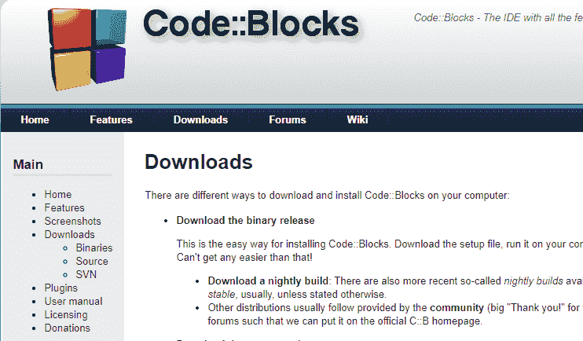
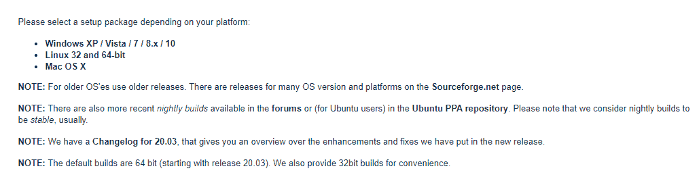
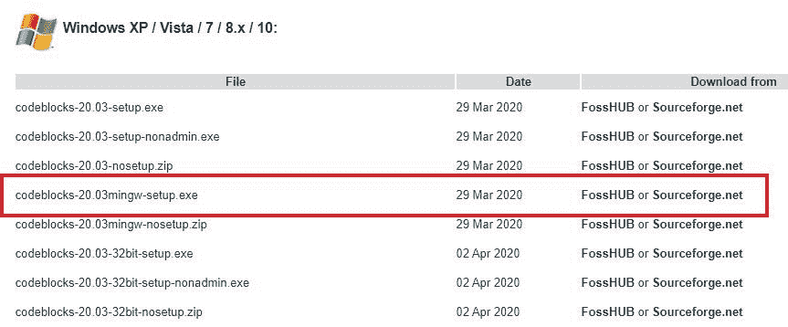
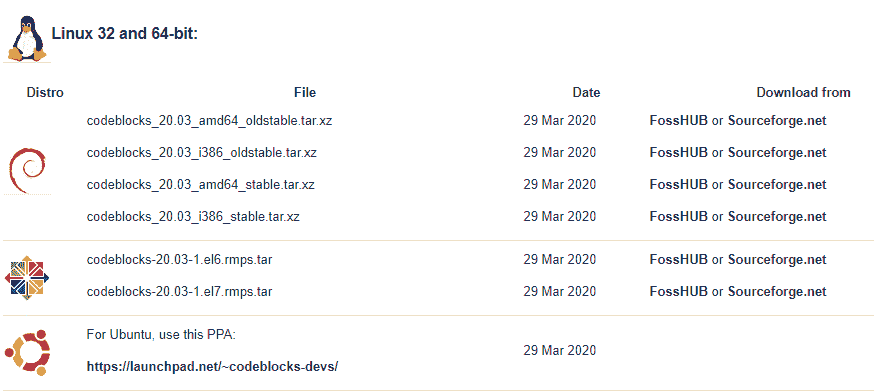

# 安装和环境设置

> 原文:[https://learnet utortials . com/c-programming/c-installation-environment-setup](https://learnetutorials.com/c-programming/c-installation-environment-setup)

在本教程中，您将学习如何自己在各种操作系统中安装和设置 C 编程环境。

## 在线试用选项

如今，在线编译 C 已经成为程序员进行短项目的一种趋势。它有许多好处，如下所示:

1.  C 编译器的较新版本过去经常发布，所以今天最新的离线编译器明天就会过时。在这里，在线编译器派上了用场，你永远不必担心软件的版本。
2.  下载和安装软件需要相当大的空间和速度，这成为一个因素，尤其是在机器配置较低的情况下。在线编译器帮助你摆脱这些问题。

c 程序设计

C 程序的编写通过编码和编译这两个简单的步骤来完成。您可以在不同的文本编辑器中进行编码，如 Windows 操作系统中的记事本、Mac 操作系统中的文本编辑和 Linux 操作系统中的 gedit。然后编译器操作系统运行，逐行读取代码并搜索错误。如果发现任何错误或异常，它们将被标记为“错误”和“警告”。调试完成并且编译器发现代码没有错误后，它会生成一个扩展名为“”的可执行文件。exe。下图展示了 C 语言编程的整体过程。

在大多数的 Mac 和 Linux 环境中，免费的 C 编译器是可用的，它们在命令提示符或终端窗口中工作。为了运行这些编译器，通常使用一些包含“cc”或“gcc”的指定命令或参数。在 Windows 的情况下，您可以选择使用集成开发环境的图形用户界面。最流行的 ide 有微软的 Visual C 和 C++，Eclipse(基于 Java)等。

## 本地环境设置

要在本地创建和执行程序，您的系统中需要两件重要的事情。它们是:

*   文字编辑器
*   编译程序

**文本编辑器**:文本编辑器习惯于把编程代码写成简单的文本。文本编辑器 l 只向编译器提供编译器容易理解和执行的代码。文本编辑器的另一大特点是语法高亮。在文本编辑器中，不同组的 C 关键字有不同的颜色，即使它会提醒您在编码过程中是否错过了左大括号或右大括号。大多数文本编辑器本质上都是通用的，它们通过检测扩展名来确定编程语言。快速导航是它们的另一个很好的特性，它允许你通过输入命令和行号跳到程序的某一行。

**C 编译器**:市场上有不同类型的 C 编译器，但是 Turbo C++最适合初学者。它继承了 1987 年首次推出的博兰 Turbo C 编译器。它可以在微软操作系统和视窗系统中运行，第一个 C++版本于 1990 年发布，在世界范围内获得了巨大的普及。

### 为什么是 IDE？

集成开发环境允许您从单个平台构建、编译和运行程序。最新流行的跨平台 IDE 是 Code ::Block。它支持 Mac、Windows 和 Linux 操作系统。这里可以看到如何在 Windows 10、Linux 和 Mac 中下载和安装 Code::Block。

## 如何将集成开发环境代码块下载到您的系统

Code :: block 是 Windows OS 中最新、最流行使用的 IDE。安装此集成开发环境的步骤如下:

1.  通过[www.codeblocks.org](http://www.codeblocks.org)T2T4 访问他们的官方网站下载 IDE
2.  你已经到达了 codeblocks.org 的官方主页，在那里你可以找到你需要点击的下载标签。单击下载选项卡，您将进入下载页面，许多选项正在等待您。只需点击页面中第一个出现的下载二进制版本。
3.  点击下载二进制版本将会把你带到另一个页面，在那里你可以找到多个选项来为你的操作系统下载合适的版本。
    1.  **Windows 版**
    2.  **Linux 版本**
    3.  **Mac 版**
4.  点击 sourceforge.net，自动下载，下载时可以看到如下窗口。
5.  下载完成后，您将收到如下所示的下载通知。您可以右键单击箭头并显示在文件夹中，该文件夹将带您进入系统中的下载文件夹