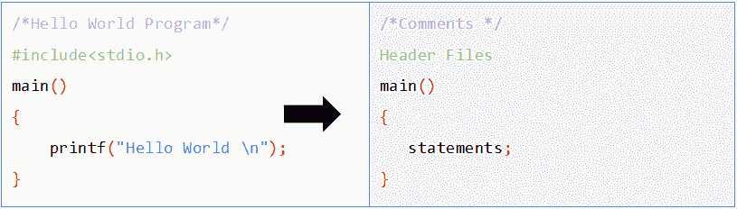

# C 语言的基本语法

> 原文:[https://learnetutorials.com/c-programming/c-basic-syntax](https://learnetutorials.com/c-programming/c-basic-syntax)

在本教程中，您将通过示例以精确的方式掌握 C 程序的基本结构。

## C 程序的基本语法

让我们从《你好世界》节目开始，这个节目传统上被认为是基础节目。如果你运行这个程序，它只会显示一条消息“你好，世界”。这个程序对于理解**任何语言的基本编程结构**都非常有用。



## C 中的注释

上述程序的第一行称为**注释**。注释是包含在“/*”和“*/”中的文本，以使代码更易读。在我们的案例中，我们从第一行本身理解，这是一个“你好，世界节目”。如果您在“/*”和“*/”之间写任何东西，它都不会被执行，相反，编译器会忽略这两个符号之间写的任何东西。评论区不是给前端用户的，而是给程序员的。这有助于他们跟踪程序的每个部分，而不会干扰编程结构。因为注释不是编程语句，所以它们可以出现在程序中的任何地方，但是是可选的。

在 C 语言中，我们可以用两种方式写评论:

*   **单行注释**:是以//开头的注释，其生命只存在于一行，当光标移动到下一行时结束。
*   **多行注释**:分别以/*和*/开头和结尾的注释。它可以是单线或多线。

## 预处理器指令

在 C 语言中，用预处理器指令开始一个程序是强制性的，因为这些指令包含执行某些特定功能的文件。在编码的第二行，' **#include** '是预处理器指令，它告诉编译器读取源文件(此处为 **stdio.h** )的内容，该文件在“<”和“>”符号中提到。具体来说，预处理器指令调用头文件。

**标准输入输出**代表“**标准输入输出**”。它是头文件，总是以。h 分机。在这个文件中，已经编写了一些库函数的编码。例如，要显示某些内容，您只需使用命令“printf”，因为整个“printf”函数的编码已经用 stdio.h 预先编写好了。

根据需要，您可以在一个程序中放置多个头文件。例如，如果您想执行一些算术和逻辑运算，您可以添加一个 **math.h** 头文件以及 **stdio.h** 。

```c
 #include<stdio.h>
#include<math.h> 

```

## C 语言中的函数

**main()** 是程序的必选部分。编译器只执行那些写在主函数体内的命令。所以每个 C 程序都必须包含一个主函数。如您所见，它被写成 main()，并且它里面的所有内容都必须写在开始大括号“{ 0 }”和结束大括号“{ 1 }”里面。简单地说，在 C 编译器的源代码中，它是预定义的，当它找到“main”时，它将开始执行里面写的任何东西。

**printf** 是另一个已经在 **stdio.h** 中定义的函数。在这个库函数的编码中，已经编写了它来显示()中所写的内容。但是，编译器只会打印写在“逗号”内的内容，而忽略其余内容。如果您编写 printf(“hello”world)，显示屏将只显示“hello”。

## C 语言中的语句

语句是程序开始执行时给编译器的指令。C 语言中的语句必须始终以分号结尾，因为它告诉编译器该语句已到达其结尾。

最后，上述程序的输出只是 printf 函数内部的文本。那只不过是**你好世界**。