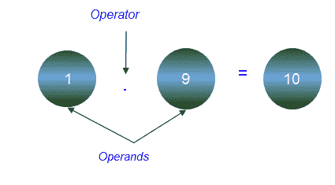
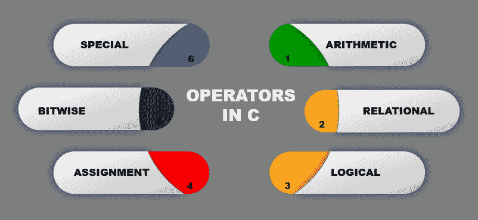
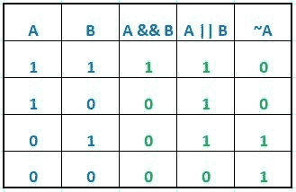
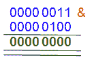
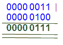
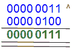
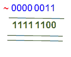
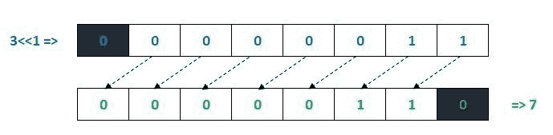
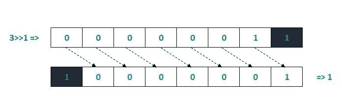

# C 语言中的运算符

> 原文：<https://learnetutorials.com/c-programming/operators>

在本教程中，您将掌握使用 C 语言中使用的不同运算符进行逻辑和算术计算的技巧，并借助简单易行的示例。
运算符是执行某种计算的唯一符号。运算符作用的对象或值称为操作数，运算符和操作数的组合在 c 语言中称为表达式。



c 语言支持多种内置操作符来操作数据和值，因此大致分类如下:



## 算术运算符:

像现实生活中的数学一样，C 的算术运算符做除法、乘法、加法和减法。涉及的运算符分别是“/”、“*”、“+”和“-”。除了这些，还有其他三个运算符模数、增量和减量运算符。模数或“%”输出任何数字除法的余数。

| 操作员 | 意义 | 描述 | 例子 |
| + | 添加 | 添加两个操作数或一元加号 | 10+2=12 |
| - | 减法 | 从左操作数中减去右操作数或一元减 | 10-2=8 |
| * | 增加 | 将两个操作数相乘 | 10*2=20 |
| / | 分开 | 将左操作数除以右操作数 | 10/2=5 |
| % | 系数 | 除法后的余数 | 10%2=0 |
| ++ | 增量 | 将值增加一个单位 | ++a **或** a++ = a+1 |
| - | 减量 | 将值减少一个单位 | - b **或** b - = b-1 |

### 算术运算符示例

```c
#include <stdio.h>
int main()
{
    int x = 7,y = 3, z;

    z = x+y;
    printf("Sum: x+y = %d \n",z);
    z = x-y;
    printf("Difference: x-y = %d \n",z);
    z = x*y;
    printf("Product: x*y = %d \n",z);
    z = x/y;
    printf("Quotient: x/y = %d \n",z);
    z = x%y;
    printf("Remainder: x%y = %d \n",z);

    return 0;
} Output:
```

```c
Sum: x+y = 10
Difference: x-y = 4
Product: x*y = 21
Quotient: x/y = 2
Remainder: xy = 1 
```

### 递增和递减运算符

递增运算符“++”将整数值增加一个单位，而递减运算符“-”将整数值减少一个单位。这些运算符可以用操作数作为前缀或后缀，在 C 语言的不同类型的循环中广泛使用。

### 递增和递减运算符示例

```c
Example of Increment and Decrement Operators
#include <stdio.h>
int main()
{
    int x = 7,y = 3;

    printf("Increment: ++x = %d \n",++x);
    printf("Decrement: --y = %d \n",--y);
    return 0;
}

```

**输出:**

```c
Increment: ++x = 8
Decrement: --y = 2 
```

## 关系运算符:

关系运算符确实比较数据以给出二进制输出，即真或假。下面是使用两个操作数 a 和 b 演示的六个运算符。

| 操作员 | 意义 | 描述 | 例子 |
| == | 等于 | 如果两个操作数相等，则返回真 | a==b |
| ！= | 不等于 | 如果两个操作数不相等，则返回真 | a！=b |
| > | 大于 | 如果左操作数大于右操作数，则返回真 | a>b |
| < | 不到 | 如果左操作数小于右操作数，则返回真 | a |
| >= | 大于或等于 | 如果左操作数大于或等于右操作数，则返回真 | a>=b |
| <= | 小于或等于 | 如果左操作数小于或等于右操作数，则返回真 | a<=b |

### 关系运算符示例

```c
#include <stdio.h>
int main()
{
    int x = 7,y = 3,z;
    z = x>y;
    printf("%d is greater than %d is %d\n",x,y,z);
    z = x<y printf="">=y;
    printf("%d is greater than %d is %d\n",x,y,z);
    z = x<=y;
    printf("%d is greater than %d is %d\n",x,y,z);
    z = x==y;
    printf("%d is greater than %d is %d\n",x,y,z);
    z = x!=y;
    printf("%d is greater than %d is %d \n",x,y,z);

    return 0;
}</y> 

```

**输出:**

```c
7 is greater than 3 is 1
7 is less than 3 is 0
7 is greater than 3 is 1
7 is greater than 3 is 0
7 is greater than 3 is 0
7 is greater than 3 is 1 
```

## 逻辑运算符:

这些运算符执行二进制运算，在机器级处理数据(逻辑门，如“与”、“或”、“或非”、“与非”等)。).如果结果为真，则通过返回“1”来表示。负结果用“0”表示。下面是 C 语言中三种基本逻辑运算符的描述，它们被广泛用于决策。

| 操作员 | 意义 | 描述 | 例子 |
| && | 逻辑与/合取 | 当且仅当两个语句都为真时，返回真 | x 和 Y |
| &#124;&#124; | 逻辑或/析取 | 如果任一语句为真，则返回真 | x 还是 Y |
| ！ | 逻辑非/否定 | 如果操作数是否定的，则返回真 | 不是 X |

为了更好地理解逻辑运算符，您应该了解真值表。



### 逻辑运算符真值表

“与”的补码称为“与非”，而“或”称为“或非”。它们与其他运算符一起使用，如 A！&B，A！=B 等。

### 逻辑运算符示例

```c
#include <stdio.h>
int main()
{
    int x = 7,y = 3,z;
    z = (x==7)&&(x>y);
    printf("(x==7)&&(x>y) is %d\n",z);
    z = (x==7)||(x>y);
    printf("(x==7)||(x>y) is %d\n",z);
    z = (x!=7)||(y!=3);
    printf("(x!=7)&&(y!=) is %d\n",z);
    return 0;
}

```

**输出:**

```c
(x==7)&&(x>y) is 1
(x==7)||(x>y) is 1
(x!=7)&&(y!=) is 0 
```

下表列出了常见的按位运算符。3 的二进制表示是 0000 0011，4 的二进制表示是 0000 0100。

| 经营者 | 意义 | 描述 | 例子 |
| & | 二进制与 | 如果两个操作数都为真，则结果为 1，否则为 0 | 3&4 =0  |
| &#124; | 二进制或 | 如果任何一个操作数为真，则结果为 1，否则为 0 | 3&#124;4=7  |
| ^ | 二进制异或 | 如果两个操作数不同，结果为 1；如果两个操作数相同，结果为 0 | 3^4=7  |
| ~ | 二进制一补码 | 结果是操作数的否定 | ~3= -(4)  |
| << | 二进制左移位 | 将位向左对齐 | 3<<2 = 12   |
| >> | 二进制右移 | 将位向右对齐 | 3>>2 = 0   |

第一个运算符“&”属于“与”类型，如果两个操作数中都有该位，它会将任意位复制到结果中。“|”用作或运算符。它复制一个位，-如果它存在于一个或两个操作数中。'^'表示异或运算。如果它存在于任何一个操作数中，但不存在于两个操作数中，则为正。除了这些，还有一个补码运算符，它具有翻转位的效果。它用“~”符号表示。

### 按位运算符示例

```c
#include <stdio.h>
int main()
{
    int x = 3,y = 4,z;
    z = x&y;
    printf("x&y is %d\n",z);
    z = x|y;
    printf("x&y is %d\n",z);
    z = x^y;
    printf("x&y is %d\n",z);
    printf("x&y is %d\n",~x);
    return 0;
} 

```

**输出:**

```c
x&y is 0
x|y is 7
x^y is 7
~x is -4 
```

### C 语言中的移位运算符

按位移位运算符“<>”分别称为二进制左移位运算符和右移位运算符。操作数的值是运算符右侧指定的移动量的左侧。



### 按位左移表示



### 按位左移表示

### 按位移位运算符示例

```c
#include <stdio.h>
int main()
{
    int x = 3;

    printf("x<<1 is %d\n",x<<1);
    printf("x<<2 is %d\n",x<<2);
    printf("x<<2 is %d\n\n",x<<3);

    printf("x>>1 is %d\n",x>>1);
    printf("x>>2 is %d\n",x>>2);
    printf("x>>3 is %d\n",x>>3);

    return 0;
} 

```

**输出:**

```c
x<<1 is 6
x<<2 is 12
x<<2 is 24

x>>1 is 1
x>>2 is 0
x>>2 is 0 
```

### 我们在哪里使用按位运算符？

由于按位运算符用于操作位序列据，因此在现实世界中并不常见。然而，它们统治着低级或所谓机器语言的世界。众所周知，低级操作使用二进制格式 0 和 1 来操作数据。下面列出了使用按位运算符的一些领域。

*   主要用于嵌入式系统
*   数据压缩
*   加密
*   建立关系网
*   硬件操作
*   制图法

## 赋值运算符

顾名思义，赋值运算符用于给变量赋值。=' (equals)是将右侧的值赋给左侧的最基本类型。C=A+B 将(A+B)的值强加给 C。下表给出了 C 中用于执行算术运算的其他赋值运算符。

| 经营者 | 例子 | 意义 |
| = | a = 10 |   |
| += | a+=10 | a=a+10 |
| -= | a-=10 | a=a-10 |
| *= | a*=10 | a=a*10 |
| /= | a/=10 | a=a/10 |
| %= | a%=10 | a=a |

### 赋值运算符示例

```c
#include <stdio.h>
int main()
{
    int x = 10, a;

    a = x;
    printf("a = %d\n", a);
    a += x;
    printf("a = %d\n", a);
    a -= x;
    printf("a = %d\n", a);
    a *= x;
    printf("a = %d\n", a);
    a /= x;
    printf("a = %d\n", a);
    a %= x;
    printf("a = %d\n", a);

    return 0;
} 

```

**输出:**

```c
a = 10
a = 20
a = 10
a = 100
a = 10
a = 0 
```

## 特殊运算符

### 运算符的大小

这个一元运算符以字节为单位返回操作数的大小。例如，如果是整数，它将返回 4。它对大型程序中的空间管理非常有帮助。

### 大小运算符示例

```c
#include <stdio.h>
void main()
{

int a;
int short b;
short c;
int long d;
long e;
 printf(" Size of  a is %d\n",sizeof(a));
 printf(" Size of  b is %d\n",sizeof(b));
 printf(" Size of  c is %d\n",sizeof(c));
 printf(" Size of  d is %d\n",sizeof(d));
 printf(" Size of  e is %d\n",sizeof(e));

}

```

**输出:**

```c
 Size of  a is 4
 Size of  b is 2
 Size of  c is 2
 Size of  d is 4
 Size of  e is 4 
```

### 条件/三元运算符(？:):

这些是 c 语言中一些唯一定义的运算符，称为三元运算符。？“:”也称为条件运算符，广泛用于决策和将程序执行流程路由到所需方向。语法通常是(exp)？这意味着如果表达式为真，它返回 A，否则返回 B。下面的程序说明了这一点:

### 条件运算符示例

```c
#include <stdio.h>
void main()
{
    int x=7,z;
    z=(x==8)? "True" : "False"  ;
     printf("Value of x is 7 ? %s\n",z);

} 

```

**输出:**

```c
 Value of x is 7 ? False 
```

### 引用或指针运算符(&):

引用操作符将返回任何变量的地址，并在其后写入变量名。在即将到来的 c 语言教程指针中，您将看到这个引用操作符的使用

### 取消引用运算符(*):

表示指针变量的广泛使用的运算符“*”属于这一类，您将在我们后面的指针教程中学习。

## 运算符优先级:

现在我们已经掌握了 c 语言中几乎所有运算符的知识。然而，我们经常会遇到这样的情况，我们必须同时与不同类型的运算符一起工作。如果我们不遵循正确的应用顺序，程序最终会崩溃。

运算符优先级是指运算符对表达式求值的顺序。下面是编译器维护的序列，我们必须遵守:

1.  后缀()[] ->
2.  一元的
3.  乘法/除法
4.  加法/减法
5.  变化
6.  有关系的
7.  平等
8.  按位“与”
9.  按位异或
10.  按位“或”
11.  逻辑“与”
12.  逻辑或
13.  有条件的
14.  分配