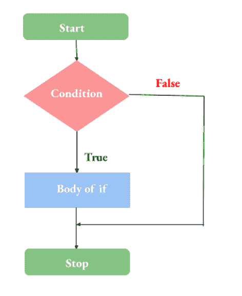
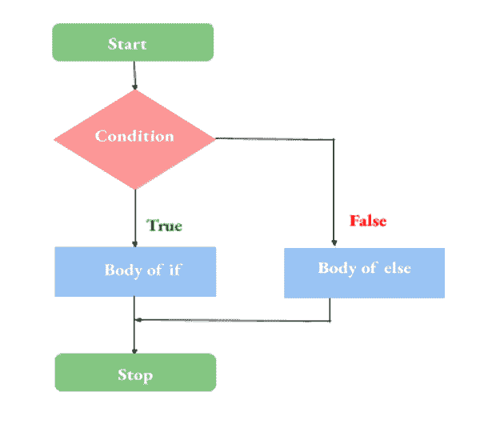

# C 语言中的决策

> 原文：<https://learnetutorials.com/c-programming/decision-making-statements>

在本教程中，您将掌握关于决策语句的一切，如 if、if-else、if-else、嵌套 if 等。此外，借助示例，您将学习如何在 C 语言中使用开关和嵌套 if。

程序中几乎每一个涉及逻辑运算的算法都必须经过决策架构。算术逻辑单元，计算机的算术和逻辑单元，通过“与”、“或”、“非”、“与非”等逻辑门来监督决策的执行。最简单的决策陈述形式是‘发现就做这个，否则就做这个’。在下一节中，我们将学习如何在 c 编程中使用它。

## C 语言中的 if 语句:

“if”是一个重要的关键字，它告诉编译器寻找一些条件或准则。如果数据满足给定的条件，将执行特定的代码块。如果提供的标准不匹配，它将执行控制切换到另一个预定的代码块。

### C 语言中 if 语句的原型

```c
 if (condition)
{
#body of if ;
} 

```



### IF 语句的流程图

假设，如果用户输入的数字是“0”，您想要打印“它是零”。这方面的代码如下:

```c
#include<stdio.h>
void main()
{
    int num;
    printf("Enter a number:");
    scanf("%d",&num);
    if(num==0)
    {
        printf("Entered Number is zero\n");
    }
    printf("Exit");
} 

```

**输出:**

```c
Enter a number:0
Entered Number is zero
Exit 
```

```c
Enter a number:2
Exit 
```

因此，您一定注意到条件紧接在圆括号()内的“if”之后，而当条件满足时要立即执行的代码块则紧接在大括号“{ 0 }”内。

单个 if 语句的缺点是，它只执行遵循真值的语句，而不处理真和假的情况。

## 如果..else 语句:

else 是另一个仅与 if 关键字一起使用的有用关键字。当编译器找到“else”时，只有当条件不满足时，它才会执行写在它旁边的代码块。原型

### C 语言中 if-else 语句的原型

```c
if (condition)
{
    #body of if ;
}
else
{
    #body of else ;
} 

```



### IF 语句的流程图

这是一个演示 If 用法的简单程序..否则原型。

```c
#include<stdio.h>
void main()
{
    int num;
    printf("Enter a number:");
    scanf("%d",#);
    if(num==0)
    {
        printf("Entered Number is zero\n");
    }
    else
    {
        printf("Entered Number is not zero\n");
    }

    printf("Exit");
} 

```

```c
 Output 1:
Enter a number:0
Entered Number is zero
Exit

Output 2:
Enter a number:2
Entered Number is zero
Exit 
```

## 如果..其他..如果..其他

到目前为止，我们已经处理了两个独立的代码块。但是很多时候你会遇到需要多组代码的问题，它们必须根据数据输入来执行。

### if 的原型..其他..如果..C 语言中的 else 语句

```c
 if (condition 1)
{
    #body of if ;
}
else if(condition 2)
{
    #body of elseif ;
}
else
{
    #body of else ;
} 

```


### 如果不是，如果不是的流程图

假设我们在比较两个数字 a 和 b，如果我们想比较它们，在 else、else if 和 else 语句中会分别出现 a>b、a=b 和 a <b. here="" the="" concept="" of="" else="" if..="" comes="" into="" play.="" we="" can="" channelize="" code="" execution="" by="" putting="" a="">b、a</b.>

```c
#include<stdio.h>
void main()
{
    int a,b;
    printf("Enter first number: ");
    scanf("%d",&a);
    printf("Enter second number: ");
    scanf("%d",&b);
    if(a>b)
    {
        printf("\n%d is greater than %d",a,b);
    }
    else if(a<b)
    {
       printf("\n%d is less than %d",a,b);
    }
    else 
    {
       printf("\nTwo numbers are equal");
    }

}
<stdio.h>

```

```c
 Output 1:
Enter the first number 8
Enter the second number 5
8 is greater than 5

Output 1:
Enter the first number 5
Enter the second number 8
5 is less than 8

Output 2:
Enter the first number 5
Enter the second number 5
Two numbers are equal 
```

## 嵌套如果:

我们可以在另一个 if 的块中使用 if-else 语句，而不是使用 if-else 结构。对于长而复杂的程序，这种体系结构总是程序员的首选。

### 嵌套 if 的语法

```c
 if (condition)
{
#body of if ;
} 

```


### 嵌套 IF 语句的流程图

以前的程序已使用“嵌套 if”重写:

```c
 #include<stdio.h>
void main()
{
    int a,b;
    printf("Enter first number: ");
    scanf("%d",&a);
    printf("Enter second number: ");
    scanf("%d",&b);
    if(a!=b)
    {
       if(a>b)
        printf("\n%d is greater than %d",a,b);
      else 
       printf("\n%d is less than %d",a,b);
    }  
    else 
       printf("\nTwo numbers are equal");

} 

```

```c
 Output 1:
Enter the first number 8
Enter the second number 5
8 is greater than 5

Output 2:
Enter the first number 5
Enter the second number 8
5 is less than 8

Output 3:
Enter the first number 5
Enter the second number 5
Two numbers are equal 
```

在上面的截取中，首先评估不相等的条件。如果计算结果为真，则控制转移到嵌套 If，在那里它比较两个值中的最大值，否则它将执行 else 部分。

## C 语言中的开关语句

顾名思义，它的工作是将执行流程切换到所需的代码部分。编码应该专门为每个不同的“情况”编写，后跟一个“中断”语句，该语句控制下一层编码。如果您想在没有定义的“案例”有效时运行另一个代码块，您可以在“默认”下编写它。

### C 语言中开关语句的语法

```c
 switch(Expression)
{
  Case 1: Statement(s);
                 Break;
  Case 2: Statement(s);
                 break;
  Case 3: Statement(s);
                 break;
                   .
                   .
                   .

  default: Statement(s);
                 break;
} 

```


### 切换语句的流程图

查看以下程序

```c
 #include<stdio.h>
void main()
{
    int day;
    printf("Enter the Day: ");
    scanf("%d",&day);

    switch(day)
    {
        case 0: printf("Today is Sunday\n");
               break;
        case 1: printf("Today is Monday\n");
               break;
        case 2: printf("Today is Tuesday\n");
               break;
        case 3: printf("Today is Wednesday\n");
               break;
        case 4: printf("Today is Thursday\n");
               break;
        case 5: printf("Today is Friday\n");
               break;
        case 6: printf("Today is Saturday\n");
               break;
       default: printf("Invalid Day");

    }

} 

```

```c
Output 1:
Enter the Day:3
Today is Wednesday

Output 2:
Enter the Day:5
Today is Friday

Output 3:
Enter the Day:10
Invalid Day 
```

在该程序中，如果您输入 0 到 7 以外的任何数字，则“默认”下的代码将显示“无效日”。

## 嵌套开关语句

嵌套开关语句与嵌套 if 对称。它允许程序员在一个案例下定义两个或多个独立的案例。其语法如下:

```c
 switch (variable)
{
    case 1:
        statement;
        switch (variable_1)
        {
            statement; 
        }
        break;

    case 2:
        statement;
        switch (variable_2)
        {
            statement;
        }
        break;

    default:
        statement;       
        switch (variable_x)
        {
            statement;
        }
        break;
} 

```

## 那个？操作员

符号'**？“**”在 C 语言中作为布尔运算符工作，将 if-else 语句组合在一行中。它使用三个操作数。这里可以用“**”写一个奇偶程序？**。

```c
 #include<stdio.h>
void main()
{
    int n,a;
    printf("Enter a number:");
    scanf("%d",&n);
    a = ((n%2==0)?0:1);
        if(a==0)
                 printf("\nEven");
        else
                  printf("\nOdd");

} 

```

```c
 Output 1:
Enter a number:6
Even

Output 2:
Enter a number:5
Odd 
```

你很容易理解，单行 **a= ((n%2==0)？1:0)** 表示，

**if(n % 2 = = 0)a = 1**；

**否则 a = 0**；

那么条件运算符**的使用呢？**可以大幅度减少代码量，让你的程序看起来紧凑。