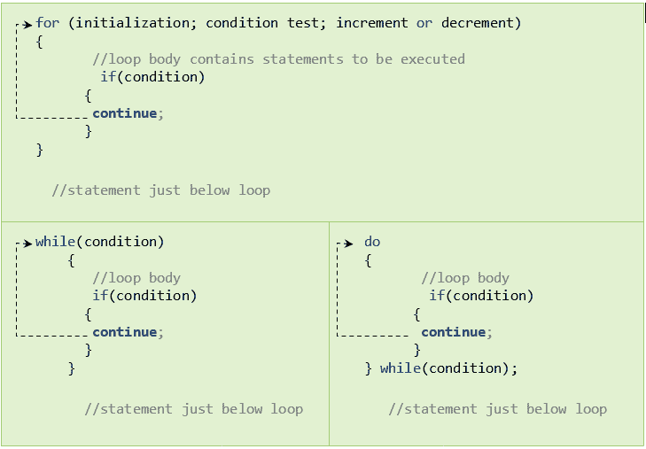

# C 语言中的循环控制语句

> 原文：<https://learnetutorials.com/c-programming/loop-control-statements>

在本教程中，您将通过简单的例子掌握循环控制语句，如 C 语言中的 break、continue 和 goto。C 编程语言以三种独特的方式支持循环，分别是 for 循环、while 循环和 do-while 循环，您已经在之前的教程[中学习过 C](loops) 中的循环。

## 中断声明

在 C 语言的 32 个关键词中，break 是与 loop 一起最常用的关键词。关键字 break 后跟分号时的一种 break 语句形式。breaks 语句用于立即中断循环执行序列。原型如下:

```c
break; 

```

### 循环中 break 语句的处理

break 语句主要用于循环和开关情况下的 if 语句。最初，我们可以追踪 break 语句如何在循环中工作来中断循环控制。


### For 循环中的中断语句-示例:

为了更清楚，请参见下面的代码片段，并观察循环控制在遇到 break 语句时如何终止。

```c
#include<stdio.h>
void main()
{
    int i;
      for(i=1;i<=10;++i)
       {
          if(i==5)
         {
             break;
         }

         printf("%d\n",(i*i));
       }
printf("Loop breaks and comes out of the loop ");
}

```

**输出:**

```c
1
4
9
16
Loop breaks and comes out of the loop 
```

这里 for 循环将继续打印数字 1、2、3 和 4 的平方。每当它发现 i=5 时，循环就会中断并退出循环，并打印刚刚在循环外编写的语句。

### While 循环中的 Break 语句-示例:

```c
#include<stdio.h>
void main()
{
    int i;
      i=1;
      while (i<=10)
       {
           {
               if(i==5)
         {
             break;

          printf("%d\n",(i*i));
          i=i+1;
      }
    printf("Loop breaks and comes out of the loop ");
}

```

**输出:**

```c
1
4
9
16
Loop breaks and comes out of the loop 
```

同样，我们可以在 do-while 循环中使用 break 语句。我们经常使用 break 语句的另一个场景是 C 语言中的 switch 用例，我们在前面的教程中已经学习过了。

## 继续陈述

C 语言中使用的另一个重要关键字是 continue，它跳过执行的某一部分，继续执行其余部分。continue 语句的语法如下所示:

```c
continue; 

```

### 循环中连续项的工作



如果 if 语句中的指定条件返回 true，则在“continue”之后写入的代码块将不会执行。

### For 循环中的继续语句-示例

假设我们要打印 1 到 10 之间的奇数，循环如下:

```c
 #include<stdio.h>
void main()
{
    for (int i=1;i<=10;i++)
   {
       if(i%2==0)
               continue;
         printf("\n%d",i);
   }
} 

```

**输出:**

```c
 1
3
5
7
9 
```

请注意，我们给了“I”一个初始值 1。在第一个循环中，for 检查 I 的值是否小于或等于 10。当 1<10 时，循环中的代码将在 if 语句检查 I 的值除以 2 是否会使提醒为零的地方执行。因为 1%2 不等于零，所以它打印值 1。当通过 i + +时，I 的值从 1 增加到 2。

现在“for”再次检查，发现 2<10，控制移到“如果哪个检查 2%2，收到的余数为零”，条件变为真，continue 语句将跳过下面的代码，继续递增。

类似地，3，4，....计算 till 10，并产生如代码片段所示的输出。

## C goto 语句

顾名思义,“goto”语句将程序控制转移到一个预定义的标签上。因此，它被称为跳转语句。“goto”语句可以在中间中断程序执行，并将其切换到另一个部分。由于它打破了正常的执行周期，除非不可避免，否则总是不鼓励在程序中使用它。

goto 语句的语法如下:

```c
goto label_name;
.. ..
.. ..
label_name: C-block or statements 

```

### 转到语句-示例:

考虑以下循环:

```c
#include<stdio.h>
void main()
{
    int i=1;
   printf("Square of numbers 1 to 10 :");
   square:
       printf("\n%d",(i*i));
       i++;

       if(i<=10)
       {
        goto square; 
       }
}

```

**输出:**

```c
Square of numbers 1 to 10 :
1
4
9
16
25
36
49
64
81
100 
```

在这个代码片段中，我们展示了`goto` 语句是如何工作的。最初，我们给 I 赋值为 1。接下来是`print` 语句，第三，流程转移到`if `语句，检查条件并执行 goto 语句。当遇到`goto` 语句时，其控制转移到该标签。这里的标签是方形的，包含打印语句和增量。这将持续到`if` 条件失效。