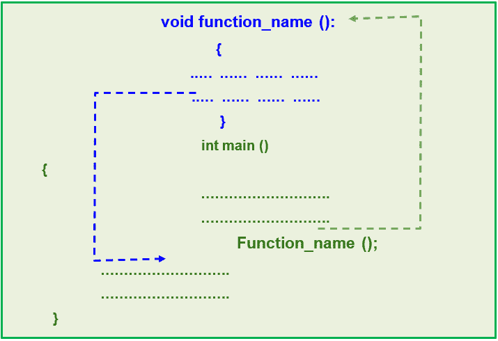
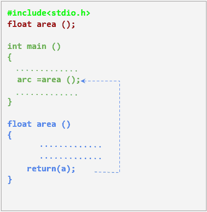

# C 语言中的函数

> 原文：<https://learnetutorials.com/c-programming/functions>

在本教程中，您将借助简单易行的示例，学习 C 语言中函数的所有知识。本教程将指导您如何定义函数以及调用函数的各种方法。

函数是 C 语言程序设计的一个基本而重要的部分。在大型程序的情况下，代码的编写和管理变得复杂。此外，我们必须一次又一次地执行类似的工作，这些工作使用一组通用的指令。为了解决这个问题，引入了函数。

## 在 C 语言中使用函数的好处

函数在所有编程语言中起着至关重要的作用，原因如下
A .函数增强了代码的可读性。
B .代码的可重用性是 C.
C .通过避免在多个位置重写相同的代码来减少代码的冗余。
D .功能使调试变得容易，因为模块化使错误易于跟踪。
E .由于函数调用取代了重复的代码块，代码的大小和复杂性都降低了。

## 功能类型

函数基本上有两种类型:

1.  标准库
2.  用户定义的

**标准库函数**是指编译器为执行特定任务而预先编写的一组代码。这些是已经在头文件中定义的内置函数。例如`scanf `存储输入数据，`printf `显示一些东西，都是头文件`stdio.h`中定义的标准库函数。通常所有的输入和输出操作，包括数学运算，都是由库函数实现的。而**用户定义函数**由程序员编写，并在程序运行过程中随时使用。

## 函数的重要方面

C 程序中的一个函数只有在这三个重要方面被正确指定时才变得完整。它们是:

*   函数声明
*   函数定义
*   函数调用

## 如何用 c 语言声明函数

函数声明在 C 语言中总是更好的做法，因为它为编译器提供了一个函数将在以后的程序中使用的线索。函数声明向编译器提供函数名称、函数中使用的参数数量和函数类型等信息。声明函数时需要考虑的一个要点是，它必须是全局声明的，这意味着在`main()`函数之外。

一个函数声明可以被看作是向编译器发出的一个通知，说明将来在程序中将使用一个函数。因此它没有功能体。

函数声明的语法是:

```c
return_type function_name ( data_type parameter(s));

```

## 如何在 c 语言中定义函数:

c 语言中函数定义的基本语法如下。

```c
 return_type function_name ( data_type arg(s))
{
    //function body with C statements
} 

```

上述功能定义的组成部分如下表所示。

| 成分 | 描述 |
| 返回类型 | 定义要返回的值的数据类型(int、float、char)。可选择的 |
| 函数名 | 应该是有效的标识符。([参考标识符规则](c-tokens)) |
| 参数 | 用于将输入值传递给函数。可选择的 |
| 函数 _ 正文> | 括在大括号{}中的一组有效的 C 语句 |

### 功能定义示例:

你必须在任何函数的主体中编写代码来定义它。假设我们要形成一个简单的函数‘show’，它的工作是打印‘hello’。在这种情况下，您可以在程序中的任何地方自由定义函数“show”

```c
void show()
{
       printf("hello");
}

```

对于处理变量的函数，定义如下

```c
float area(int r)
{
   pi=3.14;
   a = pi*r*r;
   return(a);
}

```

在这个例子中，我们定义了一个函数来计算圆的面积。这个函数仍然是一个脚本，直到进行函数调用时才执行。因此被称为函数定义。

## 如何用 C 语言调用函数

和函数定义一样，函数调用是函数的另一个重要方面。正确定义函数后，我们需要调用函数来完成工作，它是为。要做到这一点，我们只需写下函数的名称和()后跟一个分号。语法是:

```c
function_name(arg(s));

```

## 函数调用的各种方式

在 c 语言中，我们可以用下面列出的四种不同的方法进行函数调用，下面是一个简单的例子。

1.  没有参数和返回值的函数
2.  带有参数且没有返回值的函数
3.  没有参数但有返回值的函数
4.  既有参数又有返回值的函数

观察下面的例子，计算圆在这四个不同方面的面积:

### 示例 1:没有参数和返回值的函数。

```c
#include<stdio.h>

void area() {
    float a, pi;
    int r = 10;
    pi = 3.14;
    a = pi * r * r;
    printf("Area of Circle is : %f\n", a);
}

int main() {
    area();
}

```

**输出:**

```c
Area of Circle is : 314.000000 
```

当您观察上述程序时，您可以发现以下内容:

*   提供的返回类型是 void，这是一个空数据类型
*   函数定义中没有提到 return 语句
*   函数调用中没有指定参数

### 示例 2:不带参数且带有返回值的函数

```c
#include<stdio.h>

float area() {
    float a, pi;
    int r = 10;
    pi = 3.14;
    a = pi * r * r;
    return (a);
}

int main() {
    printf("Area of Circle is : %f\n", area());
}

```

**输出:**

```c
Area of Circle is : 314.000000 
```

在这个程序中，您可以找到以下内容:

*   提供的返回类型是 float
*   函数定义中提到了一个 return 语句，用于向函数调用返回值。
*   函数调用中没有指定参数

### 示例 3:带参数且不带返回值的函数。

```c
#include<stdio.h>

area(int r) {
    float a, pi;
    pi = 3.14;
    a = pi * r * r;
    printf("Area of Circle is : %f\n", a);
}

int main() {

    area(10);
}

```

**输出:**

```c
Area of Circle is : 314.000000 
```

在本程序中，您可以发现与前一个程序的以下不同之处:

*   未指定返回类型
*   函数定义中没有提到 return 语句
*   在函数调用中指定了参数 10

### 示例 4:既有参数又有返回值的函数。

```c
#include<stdio.h>

float area() {
    float a, pi;
    int r = 10;
    pi = 3.14;
    a = pi * r * r;
    return (a);
}

int main() {
    float arc;
    arc = area();
    printf("Area of Circle is : %f\n", arc);
}

```

**输出:**

```c
Area of Circle is : 314.000000 
```

在上面的代码片段中，您可以找到以下内容

*   提供的返回类型是 float
*   函数定义中提到了一个 return 语句，用于向函数调用返回值。
*   该参数在函数调用中指定。

## 函数在 C 语言中是如何工作的

让我们学习函数的整体工作和执行顺序。



### 函数如何在 c 语言中工作

在 C 语言中，程序的执行从函数调用所在的`main()`函数开始。当编译器遇到函数调用时，控件将转移到相应的函数定义，在那里它执行一些为其设计的任务。当遇到返回语句时，最终结果将返回给函数调用。如果不是，它输出函数本身的结果，并立即终止函数，将控制切换回`main()`函数。

## C 语言中的返回语句

C 语言中的 return 语句通过终止相应函数的执行来向调用函数返回值。要返回值，我们必须用任何有效的数据类型声明一个函数，除非可以保持它为 void。在我们前面的例子中， **a** 的值返回到主函数，并被分配给变量**弧**，如下图所示。



### c 语言中的返回语句