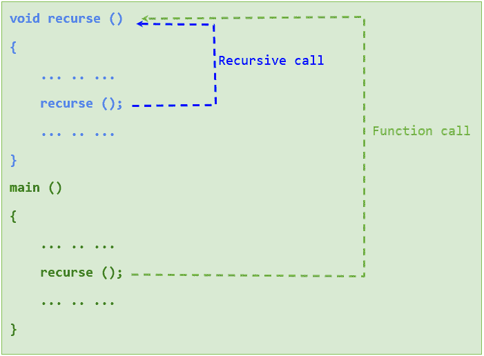
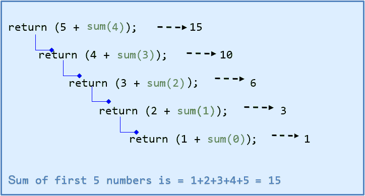
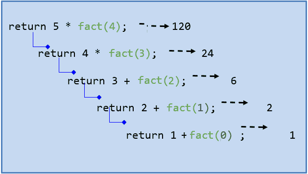
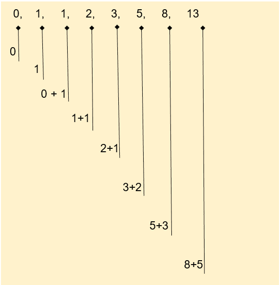
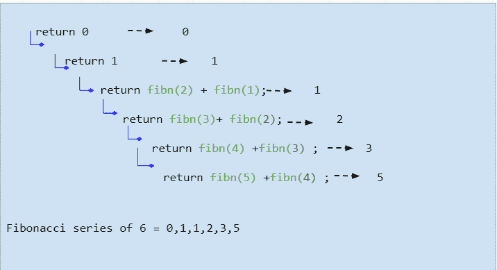

# C 语言中的递归

> 原文：<https://learnetutorials.com/c-programming/recursion-tutorials>

在本递归教程中，您将掌握一个名为递归的函数中唯一进程的所有信息。还有，你会看到一些很适合用递归解决的问题，比如数阶乘、斐波那契数列等。

## 什么是递归？

递归，一般来说，是指一个函数重复调用自身来处理较小问题的过程。如果一个函数调用自己，并且这样的函数调用被命名为递归调用，那么这个函数被称为递归函数。准确地说，递归调用在到达基本用例时结束。

在 C 语言中，递归和迭代是齐头并进的，但是两者都突出了一些为它们设计的特定任务。例如，递归对于执行一些数学计算、排序、搜索、遍历等非常有用。然而，它并不适用于所有问题。所以我们可以说，它只不过是一种定制功能。一些问题

在 C 语言中使用递归是一种减少代码大小的好方法。但事实是，很难理解工作。这是它的原型:

### 递归语法

```c
 void recurse() // recursive function
{
    ........
    recurse(); //recursive call 
    ........
}
main() {
    ........
    recurse(); // function call
    ........
} 

```

## 递归的工作原理

递归的工作可以最好地可视化如下，以使它更容易理解。



我们已经了解到，在 C 语言中，执行从主函数开始，当它遇到函数调用时遍历，控制将转移到相应的函数。我们可以看到，函数的调用就像一个循环一样在一个循环中执行。正如我们所知，每个循环中都必须有一个退出状态；否则它会变成一个无限的。递归函数也不例外。

在递归函数的结构中，它有两个不可避免的组成部分。它们是:

*   **基本情况**:递归函数中停止或终止递归的最终情况。
*   **递归情况**:是进行递归调用的情况

## C 语言中递归的例子

在下面找到一个简单的程序，通过一个递归函数将所有的数字加起来，直到定义的数字。

```c
#include <stdio.h>
int sum(int n);
int main()
{
    int num, tot;
    printf(" Calculate sum of the numbers upto:->   ");
    scanf("%d", &num);
    tot= sum(num);
    printf("\n The result is %d", tot);
}
int sum(int n)
{
        if (n !=0)
        return (n + sum(n-1));
        else
        return n;
}</stdio.h>

```

**输出:**

```c
 Calculate sum of the numbers upto:->   5

The result is 15 
```

```c
 Calculate sum of the numbers upto:->   10

The result is 55 
```

这种递归一直持续到变量“否”达到“0”。碰巧的是，编译器将退出程序。假设我们输入 5。主函数将数字作为参数传递。然后该数字减少到 4，再次调用该函数。因此，5+4+3+2+1 相加得到 15。

让我们用下图来分解递归方法调用的上述程序:



### 递归示例-数字阶乘:

借助于递归，我们可以确定任何数的阶乘。数 n 的数学阶乘定义为

**n！= n x (n-1) x (n-2)......x 2 x 1**

| 寻找阶乘的一般方法 | 例:5！ |
| n！= n x (n-1)！ | 5!= 5 x 4！ |
| n！= n x (n-1) x (n-2)！ | 5!= 5 x 4 x 3！ |
| n！= n x (n-1) x (n-2) x (n-3)！ | 5!= 5 x 4 x 3 x2！ |
|   | 5!= 5 x 4 x 3 x2 x1！ |
| n！= n x (n-1) x (n-2) x (n-3) ….3！ | 5!= 5 x 4 x 3 x2 x1 =>120 |
| n！= n x (n-1) x (n-2) x (n-3) ….3 x 2！ |   |
| n！= n x (n-1) x (n-2) x (n-3) ….3 x 2 x1！ |   |

我们可以观察到，问题被分成使用相同函数的子问题，并重复直到它达到基值。因此，每次调用时，整数都要重复乘以下一个较小的整数，直到它达到最小值“1”。现在我们可以这样构造一个递归函数“fact”:

```c
 #include <stdio.h>int fact( int n)
 {
        if(n <= 1)
          return 1;
        else
         return n * fact(n - 1);
}
  main()
  {
      int i;
      printf ("   Calculate factorial of -->    ");
      scanf("%d",&i);
      printf("Factorial of %d is %d\n", i, fact(i));
   }</stdio.h> 

```

```c
 Output:1
Calculate factorial of -->    5
Factorial of 5 is 120

Output:2
Calculate factorial of -->    10
Factorial of 10 is 3628800 
```

假设我们输入 5 作为输入。

*   当 i>1 时，它将返回 n*fact(n-1) = 5 x fact(4)
*   现在递归将传递 4 作为参数。由于 4 再次大于 1，它将返回 5*4*fact (3)。
*   这将一直发生，直到它达到基值 1。这样，我们得到了 120 的预期结果。

下图将向您清楚地展示在 C 语言中使用阶乘的递归。



### 递归示例-斐波那契数列:

斐波那契数列是一系列正整数，其中每一项都是前两项的和。该系列具有强烈的数学意义。斐波那契数列从数字 0 和 1 开始，序列如下所示:



下面是一个使用迭代执行斐波那契数列的示例程序:

```c
 #include <stdio.h>int main()
{
    int i,  n, c = 0, p = 1, t = 0;
    printf( " How many terms do you want to show ->    ");
    scanf("%d", &n);
    printf("Fibonacci Series: ");
     for (i = 1; i <= n; ++i)
    {
           printf("%d, ", t);
           t = c + p;
            p = c;
            c = t;
    }
    return 0;
}</stdio.h> 

```

在这个程序中，c 可以被认为是当前值，p 可以被认为是先前值。我们已经将 c 初始化为 1，将 p 初始化为 0。总数也存储在变量 t 中，该变量被初始化为 0。这里 for 循环用于防止迭代无限执行。在 for 循环的第一个循环中:

它打印 t = 0 的值，然后
t=0 +1=1
p= 0
c= 1
下一节循环:
打印“1”(t 的值)
t= 1+1=2
p= 1
c= 2
..等等。
现在使用递归，我们可以用更少的代码做同样的事情。我们要做的是定义一个函数“fibn”，并用适当的参数在内部调用它。

```c
 int fibn (int i)
{
         if(i == 0)
                return 0;
           if(i == 1)
                return 1;
          else
                return fibn(i-1) + fibn(i-2);
}
  main()
 {
              int i, n,a;
             printf( " How many terms do you want to show ->    ");
             scanf("%d", &a);
             printf("Fibonacci Series: ");
             for (i = 0; i < a; i++)
                   printf("%d, ", fibn(i));

    } 

```

这个程序将产生和以前完全一样的结果。fibn(i)将被调用‘a’次，次数由最终用户指定，并将递归调用该函数以产生精确的结果，直到它到达终点。

