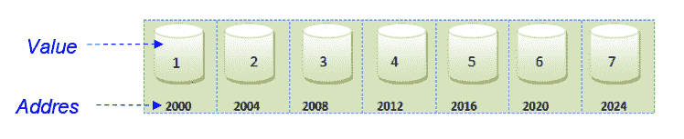
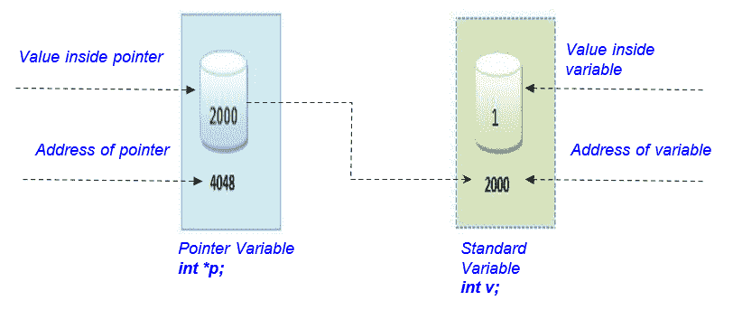
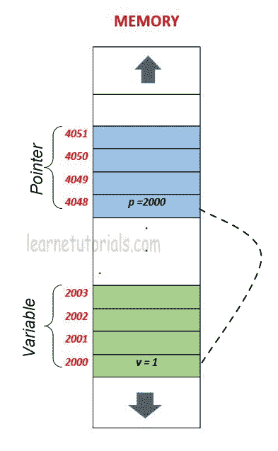
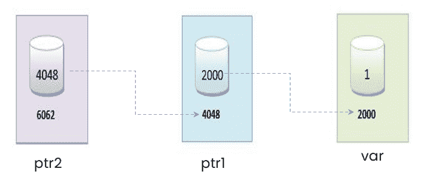

# C 语言中的指针

> 原文：<https://learnetutorials.com/c-programming/pointers>

在本教程中，您将学习 C 语言中的所有指针——什么是指针，如何在 C 语言中操作它们，指针有多有用，以及借助于一些示例的不同类型的指针。

## C 语言中的地址

我们知道编程中的一切都存储在存储器中，每个存储单元都包括两个实体——一个是**地址位置**，另一个是存储在其中的**值**。



假设我们声明一个 int 类型的变量 v，并用值 1 初始化它。

```c
 int v = 1; 

```

值 1 将存储在地址位置，比如这里的 2000，而“v”将指向或包含值 1。下一个整型值将被分配到前面声明中给出的连续内存位置。这表明每个变量都有一个唯一的地址位置，而不管它的值是多少。要获取变量的地址，我们在变量前面使用&符号。

```c
 &v; 

```

试试下面的例子，看看 v 和&v 有什么不同。

```c
 #include <stdio.h>int main()
{
  int v = 1;
  printf("variable value is : %d\n", v);

  // & to retrieve the address 
  printf("address of variable is : %p", &v);  
  return 0;
}</stdio.h> 

```

**输出:**

```c
 variable value is : 1
address of variable is : 000000000061FE1C 
```

## 什么是 C 语言中的指针

指针是一种特殊类型的变量，它存储另一个单元格的地址位置而不是值。因此，在指针的情况下，我们有指针本身的地址位置和存储在其中的另一个单元的地址位置。



## 如何在 c 语言中声明指针

要使用指针变量，我们必须声明它的数据类型，它应该与值的数据类型相同，值的地址将存储在指针变量中。指针变量由**星号(*)** 符号表示。

```c
 data_type * pointer_variable_name; 

```

下面列出了声明指针的有效方法。

```c
 int* p;
int * p;
int *p;

int* p1, v;   // p1 is a pointer variable while v is a normal variable 

```

## 如何在 c 语言中初始化指针

指针的初始化就像标准变量的初始化一样，只是地址被初始化为指针变量而不是值。语法如下:

```c
 Pointer_variable = &variable; 

```

考虑下面给出的代码片段

```c
 int v=1;  //variable initialization
int *p;   //declaration of pointer variable
p=&v;     //telling the compiler to store v's address in p 

```

在这个例子中，变量 v 的地址存储在 p 中，p 是一个指针变量。

要访问指针指向的变量的值，我们使用**星号(*)** 符号，该符号在使用指针时被视为取消引用操作符。

注意:变量和指针的数据类型是相同的。

## 声明期间指针初始化

到目前为止，我们已经学会了在 c 语言中声明和初始化指针。现在，我们可以将这两个步骤合并成一个步骤，这没有任何区别，就像我们对标准变量所做的那样。语法如下；

```c
 data_type * pointer_variable = &variable; 

```

上述代码片段可以更改为:

```c
 int v=1;  //variable initialization
int *p = &v;  //declaration and initialization of pointer variable 

```

当您不理解指针的完美含义时，这种语法经常会让初学者感到困惑。当你遇到`int *p = &v`时，你可能会解释`*p`是指针变量，但实际上，`p`是指针变量(*符号有助于区分指针变量和标准变量)。因此，这里，指针变量`p`保存标准变量`v`的地址。

## c 语言中指针的工作原理

内存中的指针可以最好地可视化如下:



从这个视觉上，我们可以看到变量和指针是如何存储的，以及它在内存中是如何工作的。在内存中，每个段或分区都是 1 字节的内存，每个字节都有一个地址，我们可以说 2000、2001、2002 等是每个字节的地址。每当我们声明一个标准变量时，在程序执行时，会根据其数据类型立即分配内存。由于在我们前面的例子中声明的变量 v 是一个整数类型，它从 2000 年到 2003 年分配了 4 字节的内存。

当我们声明一个指针变量时也会发生同样的情况。由于指针应该在相同类型的变量中声明，这里指针变量 p 是整数类型，并且在不同的位置分配 4 字节的内存，即从 4048 到 4051。

我们可以观察到指针变量 p 指向标准变量 v，并将 v 的地址存储为其值。指针变量保存地址 2000 作为它的值，并且在 4048 有它自己的地址。

由于我们处理地址，指针变量所做的任何改变都会反映在标准变量中。因此，在指针的帮助下，我们可以管理或处理地址。

## 如何用 c 语言打印指针

我们已经学习了指针的所有基础知识，包括声明和初始化语法。现在我们将按照这个程序来理解 c 语言中指针的打印格式。

```c
 #include <stdio.h>int main()
{
   int v=1;    //variable declaration
   int *p;      //pointer variable declaration
   p=&v;        // p stores the address of v

   //Standard variable
   printf("---Standard Variable Details---\n");
   printf("Address of variable v is :%x\n",&v);  
   printf("Value stored in v:%d\n",v);   

   //Pointer Variable
   printf("\n---Pointer Variable Details---\n");
   printf("Own Address of Pointer Variable p is: %x\n",&p);
   printf("Value stored in P :%x\n",p);  //accessing the address of v
   printf("Value of v accessing with p is:%d\n",*p);//accessing the value of v

   // Changing value in variable using pointer
     *p = 50;
     printf("\n Value stored in v changed to :%d\n",v);

   return 0;
}</stdio.h> 

```

**输出:**

```c
 ---Standard Variable Details---
Address of variable v is :61fe1c
Value stored in v:1

---Pointer Variable Details---
Own Address of Pointer Variable p  is: 61fe10

Value stored in P :61fe1c

Value of v accessing with p is:1 
```

在这个程序中，v 的地址和 p 中存储的值是相同的，这意味着指针变量总是保存它所指向的单元的地址。

注意:“*”表示“值在”，而“&”表示“的地址”

## c 语言中的指针是用来干什么的

指针不是程序的重要部分，而 c 语言支持的与硬件紧密交互的强大功能。由于 C 语言是一种低级语言，它主要依赖于机器，并且大量使用内存。因此指针是使用内存的有效方法，因为它提供了以下特性。

1.  使用指针的第一个也是最重要的优点是，指针不创建传递的变量或函数的本地副本，从而在很大程度上节省了内存空间。
2.  指针允许动态分配内存。具体来说，在任何基于需求的过程中，您都可以创建和销毁内存空间。
3.  通过使用指针，可以从多个位置引用内存中的相同空间。对一个位置所做的任何更改也将反映在所有其他位置。
4.  因为指针可以直接访问内存(地址)，所以指针的执行时间更快。
5.  指针允许通过引用调用，这使得一个函数能够改变另一个函数中的变量值。

这些是使指针成为 C 语言不可避免的一部分的主要特性。现在让我们看看指针经常使用的地方。

*   数组使用指针进行有效导航，对于表示 2D 和多维数组也很有用。
*   像链表和树这样的数据结构使用指针来分配和释放内存。
*   指针使文件处理变得简单。
*   由于指针与硬件交互良好，因此它是嵌入式系统的重要组成部分。
*   指针在内存管理中非常有效。

指针不限于 C 或 C++语言，而是在大多数高级语言中隐式用于后端交互。在 C 和 C++中，指针是显式定义的。

## 什么是指针对指针？

现在我们非常清楚，指针存储它所指向的变量的地址。但它也有自己的地址。在 c 语言中，指针也可以用来存储另一个指针的地址。这种类型的指针在 c 语言中被称为指针对指针(双指针)

这可以看做如下:



这里，第一个指针 ptr1 存储变量 var 的地址，而第二个指针 ptr2 保存第一个指针(ptr1)的地址。ptr2 是双指针。双指针的声明语法类似于指针的声明，除了需要一个附加的星号符号。

```c
 datatype **pointer_variable; 

```

下面的例子说明了双指针的含义。

```c
 //double pointer
#include <stdio.h>void main ()
{
    int var = 1;
    int *ptr1;
    int **ptr2;
    ptr1 = &var; // pointer ptr1 is pointing to the address of var
    ptr2 = &ptr1; // pointer ptr2 is a double pointer pointing to the address of pointer ptr1
    printf("Address of var: %x\n",ptr1); // Address of variable will be printed
    printf("Address of ptr1: %x\n",ptr2); // Address of ptr1 will be printed
    printf("value stored at ptr1: %d\n",*ptr1); // value stored at the address contained by ptr
    printf("value stored at ptr2: %d\n",**ptr2); // value stored at the address contained by the pointer stored at ptr2

    printf("address of ptr2: %x\n",&ptr2); // Address of ptr2 will be printed
}</stdio.h> 

```

**输出:**

```c
 Address of var: 61fe1c
Address of ptr1: 61fe10
value stored at ptr1: 1
value stored at ptr2: 1
address of ptr2: 61fe08 
```

## c 语言中何时使用双指针

为了理解何时在 C 语言中使用双指针，需要做一点解释。在一条语句中，我们可以将 Double 指针的使用定义为:

##### 双指针用于您想要更改在函数中作为参数传递的指针的情况。

假设您有一个指针`p1`，其值为变量`v1`的地址，还有另一个指针`p2`，其地址为`v2`。现在您希望将`p1`的地址改为`p2`。有可能改变存储在两个指针中的地址吗？当然可能，您可以通过分配`p1= p2`来实现这一点，这意味着`p2`的地址现在存储在`p1`中。您可以在以下示例中看到这一点:

```c
 #include <stdio.h>int main()
{

    int v1 = 10;
    int v2 = 20;

    int * p1 = &v1;
    int * p2 = &v2;

    printf(" p1's value: %x \n", p1);
    printf(" p2's value: %x \n", p2);

    printf("\n\n Can we change values of two pointers , say p1 and p2 ?");
    p1 = p2;
    printf("\n Value of p1 changed to: %x, same as 'p2' ", p1);
}</stdio.h> 

```

**输出:**

```c
 p1's value: 61fe04
p2's value: 61fe00

Can we change values of two pointers , say p1 and p2 ?
Value of p1 changed to: 61fe00, same as 'p2' 
```

现在我们来看看功能是否可以做到**一样，程序中会体现出哪些变化。是的，这可以通过函数来完成，但是唯一重要的是，即使退出函数后，对指针所做的更改是否仍然存在。这可以通过检查下面给出的例子来发现:**

```c
 #include <stdio.h>int main()
{
    int v1 = 10;
    int v2 = 20;

    int * p1 = &v1;
    int * p2 = &v2;

    printf(" p1's value: %x \n", p1);
    printf(" p2's value: %x \n", p2);

   printf("\n\n Can we change values of two pointers using function? \n");
   change_fun(p1, p2);
   printf("\n Outside Function : Value of 'p1' is : %x, same as 'p1' not 'p2'\n", p1);
  return 0;
}

void change_fun(int * x, int * z){
    x = z;
    printf(" Inside Function : Value of 'p1' is: %x  same as 'p2'", x);
}</stdio.h> 

```

**输出:**

```c
 p1's value: 61fe0c
p2's value: 61fe08

Can we change values of two pointers using function?
Inside Function : Value of 'p1' is: 61fe08  same as 'p2'
Outside Function : Value of 'p1' is : 61fe0c, same as 'p1' not 'p2' 
```

在本程序中，指针的值在函数内部从`p1`变为`p2`，这种变化存在于函数内部。在指针的函数值之外，`p1`保持不变，与变化无关。这表示对函数内部指针的任何更改都存在于该函数的本地。

这将导致错误，并且不是编程中的公平做法。所以为了解决这个问题，我们可以利用双指针。让我们观察程序，了解战术。

```c
 #include <stdio.h>int main()
{
    int v1 = 10;
    int v2 = 20;

    int * p1 = &v1;
    int * p2 = &v2;
    int ** pp = &p1;  // pointer to pointer 'v1'

    printf(" p1's value: %x \n", p1);
    printf(" p2's value: %x \n", p2);

    printf("\n\n Can we change values of two pointers with the help of double pointers? \n");
    change_doublepointer(pp, p2);
   printf("\n Outside Function : Value of 'p1' is : %x, same as  'p2'\n", p1);
  return 0;
}
void change_doublepointer(int ** x, int * z){
    *x = z;
    printf(" Inside Function: Value of 'p1' is: %x , same as 'p2', \n", *x);

}</stdio.h> 

```

**输出:**

```c
 p1's value: 61fe0c
p2's value: 61fe08

Can we change values of two pointers with the help of double pointers?
Inside Function: Value of 'p1' is: 61fe08 , same as 'p2',
Outside Function : Value of 'p1' is : 61fe08, same as  'p2' 
```

这个程序传递了双指针 pp 作为函数的参数，并执行相同的操作。我们知道双指针指向另一个指针的地址，因此函数内部的任何变化也会反映到外部。这是因为双指针使用的是地址而不是值。

在下一个教程中，您将了解 C 中不同的[类型的指针。](../c-programming/types-of-pointers)