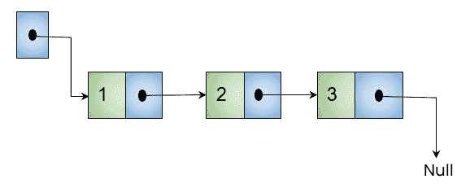

# c 语言中指针的类型

> 原文：<https://learnetutorials.com/c-programming/types-of-pointers>

在本教程中，您将看到 C 语言中常见的指针类型及其语法和用法。此外，您将浏览使用这些指针时出现的某些问题，以及如何借助简单的示例来解决这些问题。

## 空指针

在学习编程中的空指针之前，让我们先了解一下计算机内存环境中的空指针。在内存中，空指针是一个简单的命令，用于指示程序或操作系统指向一个空位置。

C 语言中的空指针是一类独特的指针，它不指向特定的地址位置。在空指针的情况下，我们设置一个空值而不是内存地址。下图显示了一个带有空指针的链表。



空指针的语法是:

```c
 data_type * pointer_variable = NULL; 

```

在编程语言中，' **NULL** '关键字是专门为此保留的。对于不同的数据类型，它们的声明如下:

```c
 int *pntr = NULL;
char *pntr = ‘\0’;
float *pntr = (float *)0; 

```

下面的程序将给出 c 语言中空指针的概念

```c
 #include<stdio.h>
int main()
{
 int* vp = NULL;

  printf("vp contains value:%d\n",vp);
}

```

**输出:**

```c
vp contains value:0 
```

与空指针不同，空指针是类型指针，因为它们指定指针变量的数据类型，但具有“空”值。因此它总是有值 **0** 。在程序中，vp 是一个整数类型的空指针，它包含值 0。

### 为什么使用空指针？

1.  **The first and foremost use of a null pointer is to initialize a pointer variable** 

    通常，当指针变量声明如下且未初始化时，

    ```c
     int * p; // uninitialized pointer 

    ```

    实际发生的是，它将指向一些随机内存地址，并存储一些垃圾值。当您试图使用此指针或作为参数传入函数时，此垃圾值可能会导致程序崩溃。为了避免这种情况，请始终使用空值初始化指针，如下所示。

    ```c
     int * p = NULL; // null pointer 

    ```

2.  **Secondly to pass a null pointer as an argument in the function**

    如果您不想将有效的内存地址传递给函数，可以使用空指针作为参数

    ```c
     float funct(int *p)
    {
    ::::::::::::
    }
    funct(NULL); 

    ```

3.  **Validate pointers with a null value**

    在访问指针之前，一定要确保指针变量被初始化为有效的内存地址或空值。否则，意外的错误可能会造成麻烦。

    ```c
     #include<stdio.h>

    void sum(int *p2)
    {
        if(p2 == NULL)
        {
            //Handle NULL pointer
            return;
        }
        else
        {
            //function body
        }
    }
    void main()
    {
        int *p1 = NULL;
        sum(p1);
    } 

    ```

    在上面的代码中，p1 是一个空指针，在函数 sum 中作为参数传递。该函数首先检查传递的参数是否为空指针。如果它是空指针，那么代码将处理空指针。在其他条件下，函数体将被执行。

4.  **To avoid dangling pointer cases while deallocating, you can use null pointers**

    考虑这样一种情况，其中有一个指针存储变量的内存地址并包含数据。如果您希望删除数据以释放内存，指针会发生什么情况？指针将保持原样，即使在删除数据后也将指向相同的内存位置。这些类型的指针被称为悬空指针。为了避免这种情况，最好的解决方案是将指针指定为空。

    ```c
     #include<stdio.h>

    void main()
    {
        int *p = (int *)malloc(SIZE);
        //. . . . . .
        //. . . . . .

        free(p);
        //pointer p is now a dangling pointer

        p=NULL;
        //Now p is a null pointer not a dangling pointer
    } 

    ```

    上面的代码片段告诉我们，在执行 free()方法后，指针中的数据被释放，指针变成了悬空指针。当指针设置为空值时，它将变为空指针。您可以在处理数据结构(如链表和树)时查看这一点。

## VOID POINTERS

从我们之前的教程中，我们了解到指针的数据类型必须等于存储地址的变量的相应数据类型。例如，整数指针必须指向整数变量。但是如果程序员事先不知道变量的类型会发生什么。

在这种情况下，空指针会派上用场。C 编程中的 void 指针，也称为**泛型指针**可以指向任何数据类型的变量，尽管它没有任何标准的数据类型。关键字 void 用于创建一个 **void** 指针。void 指针可以存储任何变量的地址，而不管其数据类型如何。

**空指针的语法为**:

```c
 void * pointer_variable ; 

```

void 指针的示例程序如下所示；

```c
 #include <stdio.h>
int main()
{
  int x = 10;
  char c = 'C';
  void* vp;

  vp = &x;
  printf("vp stores address of integer variable x:%x\n",vp);
  printf("size of void pointer is : %d\n",sizeof(vp));

  vp = &c;
  printf("vp stores address of character variable c:%x\n",vp);
  printf("size of void pointer is : %d",sizeof(vp));

} 

```

**输出:**

```c
 vp stores address of integer variable x:61fe14
size of void pointer is : 8

vp stores address of character variable c:61fe13
size of void pointer is : 8 
```

当你检查上面的代码时，我们有两个整数类型的变量`x`和字符类型的变量 c。`vp`是 void 类型的指针变量。因此`vp`有能力存储变量的地址，而不考虑它们的数据类型。最初`vp`存储整数变量`x`的地址，后来它存储变量`c`的地址。因此`vp`实现了可重用的特性。

### 取消对空指针的引用

在我们之前的教程[中，我们已经讨论了指针的解引用。现在让我们看看是否有可能取消引用一个 void 指针。观察以下示例:](../c-programming/pointers)

```c
 #include<stdio.h>
void main()
{
int x = 200;
void* vp ;

vp = &x;
printf("%d", *vp);

} 

```

**输出:**

```c
 Invalid use of void expression 
```

```c
 #include<stdio.h>
void main()
{
int x = 200;
int* p ;

p = &x;
printf("%d", *p);

} 

```

**输出:**

```c
 200 
```

上面的两个代码片段是一个空指针和一个典型指针的解引用的比较。从比较中我们可以理解，void 指针不能像典型的指针那样取消引用。如下所示，在取消引用之前，Void 指针必须被类型化为正确的数据类型。

```c
 #include<stdio.h>
void main()
{
int x = 200;
void* vp ;

vp = &x;
printf("%d", *(int *)vp); //type casting 

```

**输出:**

```c
200 
```

在这里，

*   (int *)进行类型转换，其中 void 指针`vp` 临时改为整数指针，表达式求值完成时类型转换的寿命结束。
*   *(int *)执行类型转换指针的解引用。

**带空指针的算术指针**

c 不支持带有空指针的算术指针。背后的原因是 void 不是一个真正的类型，所以 sizeof(void)没有一个合适的含义。由于指针算法将指针值改变为被指向对象大小的倍数，因此需要一个有意义的大小。这里 void 不能提供正确的大小，因此不适合算术指针。

## 野生指针

在学习空指针时，我们遇到了未初始化的指针，这些指针指向某个任意位置，导致程序错误运行或崩溃。这种类型的未初始化指针在 c 语言中被称为野指针。

```c
 int * p; // Wild pointer 

```

要将一个通配符指针转换成指针，我们需要在使用之前初始化它们。这可以通过示例中给出的两种方式来完成

```c
 #include<stdio.h>

#include <stdlib.h>int main()

{

    int * ptr; //wild pointer
    int
    var;

    // Method 1
    var = 100;
    ptr = &
        var; // Now ptr is no longer a wild pointer     printf("\n ptr c *(ptr));

    //Method 2 -creating memory allocation dynamically
    int * p = (int * ) malloc(sizeof(int));
    * p = 100;     printf("\n p c *(p));
    return 0;

}</stdlib.h> 

```

这里 ptr 和 p 是两个指针变量，它们在使用前被初始化。最初，ptr 是一个野生指针，后来在初始化时，它指向内存位置，变成了普通指针。另一种避免通配符指针的方法是使用 calloc、malloc 或 realloc 动态分配指针。

## 悬空指针

悬空这个词的意思是“松散悬挂”，我们知道指针是对内存位置的引用。因此，当指针指向无效或未预留的内存位置时，它被称为悬空指针。更准确地说，它是一个指针，在程序执行的某个时间点是活动的，并且当前没有指向对象。

悬空指针在对象销毁时引发，特别是当对象从内存中删除或取消分配时，而不修改指针的值，因此指针仍然引用被删除的原始内存位置。


上图显示指针 A 和指针 B 分别指向已分配对象 A 和 B 的内存。另一方面，指针指向被删除对象的内存，因此它被命名为悬空指针。

悬空指针的使用会导致许多不同类型的问题，例如:

*   不可预知行为
*   分段故障/一般保护故障
*   由于无关数据的静默损坏而导致的错误

**悬空指针的原因**

**1。解除分配或释放可变内存**

```c
 #include<stdio.h>

#include <stdlib.h>int main()

{

    int * ptr;

    //creating memory allocation dynamically
    ptr = (int * ) malloc(sizeof(int));
    printf("\n Memory allocated...");
    * ptr = 100;     printf("\n ptr c *(ptr));

    //Now ptr becomes a dangling pointer
    free(ptr);
    printf("\n Memory is freed ...\n ");     printf("ptr c *(ptr));

    //Now ptr is no longer a dangling pointer
    ptr = NULL

    return 0;

}</stdlib.h> 

```

**输出:**

```c
 Memory allocated...  ptr c

 Memory is freed  ptr c 
```

在本例中，在执行 **free()** 函数后，`ptr` 的内存被释放，因此成为悬空指针。

### 2.变量超出范围

```c
 #include<stdio.h>

int main()
{
    char **StrPtr;
    {
        char *StrVar = "Hai";
        StrPtr = &StrVar;
    }
    // Since StrVar falls out of scope StrPtr is now a dangling pointer

    printf("%s", *StrPtr);
} 

```

在这个例子中，我们最初创建了一个指针变量`StrPtr`。然后我们创建另一个变量，`StrVar `，它的可见性被限制在局部块中，因此在外部块中不可见。当包含`StrVar `地址的 StrPtr 从内部块中出来时，它就变成了一个悬空指针，因为 StrPtr 仍然指向外部块中的一个无效内存位置。

### 3.在函数调用中返回局部变量

```c
 #include <stdio.h>

 int * func() {
     int l = 10;
     return &l;
 }
 int main() {
     int * p = func();
     printf("%d", * p);
     return 0;
 } 

```

在这个例子中，我们首先创建了一个指针变量，存储 func()的返回值。调用 func()时，将返回局部变量“l”的值。但是当涉及到主函数时，l 的值不再可见，因此 p 变成了悬空指针。

## 如何避免悬空指针的出现

为了避免悬空指针的出现，在将指针从内存中删除或释放后，用空值初始化相应的指针。我们已经在空指针部分看到了这一点。