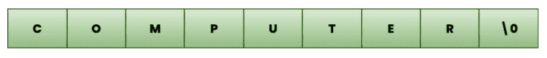
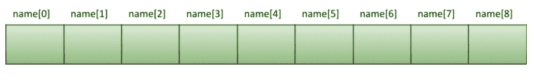

# C 语言中的字符串

> 原文：<https://learnetutorials.com/c-programming/strings>

在本教程中，您将掌握 C 编程语言中关于字符串的一切。此外，借助于用户友好的示例，您将学习如何声明和初始化字符串、输入和输出字符串的各种方法等。还将介绍一些在 c 语言中用于操作字符串的常见库函数

## 字符串常量

与其他编程语言不同，在 C 语言中，字符串不是基本数据类型，而是相邻字符的集合。我们可以通过字符数组来生成它，以便在程序中使用单词和句子。因为它是一个字符数组，所以在每个单词的末尾都有一个空字符来指示空格的结束。在 C 语言编程中，字符串写在双引号(" ")内，如下所示:

*   “计算机”
*   “用 C 语言编程”
*   " "

字符串的可视化表示如下:



这就是编译器如何获取用双引号括起来的字符序列，默认情况下，在末尾会附加一个空字符' \0 '。

## 如何声明字符串变量

我们可以使用任何合适的变量名作为字符串变量的名称，并将其声明为数组。

字符串声明的原型是:

```c
 char string_name [SIZE];

```

我们可以通过“大小”来计算字符串中的最大字符数。如果我们在字符串中存储任何变量，编译器会在任何字符串的末尾添加一个 null(“\ 0”)字符。因此，“大小”将显示数字，比实际字符数多一个。如果我们宣布，

```c
 char name[9];

```

编译器将允许我们在空字符后面的声明字符串“name”中放置 8 个字符。字符串将被分配为



## 如何用 C 语言初始化字符串变量

我们可以在字符串变量的声明过程中确定它的值。有不同的方法来初始化字符串变量。

```c
 char city[] = “Madrid”;
char city[7] = “Madrid”;
char city[7] = {‘M’, ‘a’, ‘d’, ‘r’, ‘i’,  ‘d’};

```

这里“MADRID”将存储为


### 给字符串变量赋值

因为字符串属于数组类型，所以不可能在声明后单独给字符串变量赋值，如下程序所示。

```c
 #include<stdio.h>
main()
{
    char c[10];
    c = "Learn C";
    printf("%s",c);
}

```

此示例引发如下错误。

```c
 error: assignment to expression with array type 
```

在这种情况下，可以使用字符串函数`strcpy()`。

## 如何遍历字符串

在大多数编程语言中，字符串遍历是一个重要方面。通过遍历它，意味着编译器允许我们确定字符串中每个数组元素的值。遍历字符串时，不需要知道字符串的大小，因为空字符表示序列的结束。如果空字符不出现在字符串的末尾，它将被视为仅仅是字符的集合。这是因为编译器无法理解字符串的结尾。

从下面的例子中。我们可以找到-

```c
 #include <stdio.h>
main()
{
       char name [ ] = "Learn eTutorials";
        int i =0,count=0;
        while (name [i] != '\0')
         {
            if(name[i]=='a' || name[i] == 'e' || name[i] == 'i' || name[i] == 'u' || name[i] == 'o')
          {
            count ++;
          }
               printf ("%c ", name [i]);
                i++;
        }
        printf("\nNumber of Vowels in string %s is :%d",name,count);
}

```

**输出:**

```c
 L e a r n   e T u t o r i a l s
Number of Vowels in string Learn eTutorials is :7 
```

如果我们运行程序，它会打印“**学习练习曲**”。显然，while 循环继续打印数组元素的每个字符，直到遇到空字符。同时，它计算给定字符串中元音的数量。

这里`%c`是用于逐个打印字符串的格式说明符，而`%s`是用于打印字符串字面值的格式说明符。

## 如何使用指针操作字符串

从我们之前的教程中，我们已经很好地了解了 c 语言中的指针。现在我们也可以使用指针来操作字符串。由于字符串是字符数组，字符串上的指针的工作方式与数组上的相同。它的工作原理是将数组的地址(第一个元素)存储在指针中。

下面是一个示例程序。

```c
 #include <stdio.h>

int main() {
  char name[] = "Steve Jobs";

  printf("%c\n", *name);     
  printf("%c\n", *(name+2));   
  printf("%c\n", *(name+6));   

  char *Ptr;
  Ptr = name;
  printf("\n%s", Ptr);
}

```

**输出:**

```c
 S
e
J

Steve Jobs 
```

## 字符串输入输出功能

C 语言中有一套 I/O 功能，用于访问键盘输入，并按要求显示在屏幕上。常用的输出函数有:printf()，`put()`，`put()`，输入函数有`put()`，`put()`，`put()`，`put()`，`put()`。

### 使用 scanf 和 printf 读写字符串

在我们的一系列教程中，您已经看到了使用`scanf`从键盘读取输入，并使用 printf 编写输出。也难怪`scanf`和`printf`可以用来访问字符串。但唯一的区别是，在使用`scanf`时，您只能读取字符串，直到它遇到空白，如换行符、制表符或空格。

下面是演示弦上`scanf`和`printf`功能的例子:

```c
 #include<stdio.h>
int main()
{

   char name[10];

   printf("Enter your full name:");
   scanf("%s",name);

   printf("Full Name :%s",name);

}

```

**输出:**

```c
 Enter your full name:Chris Jake
Full Name :Chris 
```

从输出来看，很明显，即使**克里斯·杰克**被作为输入给出，`scanf`只读取第一个字符串克里斯，因为它在其后遇到了空白。这里`%s`作为格式说明符使用`scanf`和`printf`。

### 使用`get()`和`get()`读写字符串

在 C 语言中，我们可以使用`gets()`和`puts()`函数读写字符串。以下示例简单演示了`gets()`和`puts()`功能的使用。

```c
 #include <stdio.h>
int main()
{
       char nm[40];
       puts ("Type anything you wish:");
       gets(nm);
       puts(nm);

}

```

**输出:**

```c
 Type anything you wish:
Welcome to Learn eTutorials... Let's learn C
Welcome to Learn eTutorials... Let's learn C 
```

这里可以清楚地看到`gets()`读取和存储我们通过键盘输入的任何东西，而不管它的大小。这可能会导致缓冲区溢出。为了防止这种情况，C 开发了另一个名为`fgets()`的函数，在这个函数中我们需要指定大小限制。

```c
 #include <stdio.h>
int main()
{
       char nm[40];
       puts ("Type anything you wish:");
       fgets(nm,sizeof(nm),stdin);
       puts(nm);

}

```

## 如何将字符串作为参数传递给函数

像数组一样，我们也可以将字符串传递给函数。我们可以将字符串作为带指针或不带指针的参数传递给函数。下面显示的示例说明了这两种情况。

### 传递不带指针的字符串

```c
 #include <stdio.h>
void printString(char str[]);

int main()
{
    char str[50];
    printf("Enter desired string: ");
    fgets(str, sizeof(str), stdin);             
    printString(str);        
    return 0;
}
void printString(char str[])
{
    printf("String printed as: ");
    puts(str);
}

```

**输出:**

```c
 Enter desired string: Welcome to Learn eTutorials
String printed as: Welcome to Learn eTutorials 
```

在本例中，由于 str 是一个字符数组，**打印字符串**函数需要一个字符串数组作为参数，因此我们将字符串作为 str[]传递，并使用`fgets`和`puts`函数来读写字符串。

### 使用指针传递字符串

这可能是将字符串作为参数传递给函数的一种简单且无错误的方式。上面的代码片段将被修改如下:

```c
 #include <stdio.h>
void printString(char *strptr);

int main()
{
    char *strptr[50];
    printf("Enter desired string: ");
    fgets(strptr, sizeof(strptr), stdin);             
    printString(strptr);       
    return 0;
}
void printString(char *strptr)
{
    printf("String printed as: ");
    puts(strptr);
}

```

**输出:**

```c
 Enter desired string: Welcome to Learn eTutorials
String printed as: Welcome to Learn eTutorials 
```

这里我们已经声明了一个字符指针，所以`printString()`函数需要指针变量作为它的参数。这意味着我们将字符串的地址( **strptr** )传递给函数，因此函数中对字符串所做的任何更改都会反映出来。

## 字符串库函数

字符串函数是编程语言不可避免的一部分，因为它只需简单地调用特定的函数，并在代码中任何需要的地方实现它们，就可以使字符串操作变得更容易。在复制字符串或连接字符串或任何其他函数的意义上，字符串操作可以通过这些预定义的函数轻松调用。

下表给出了一些最常用的字符串函数，其详细信息如下:

| 功能 | 函数的功 |
| strlen() | 确定字符串的长度 |
| 斯特奇皮（） | 将字符串复制到另一个字符串 |
| strcat（） | 连接两个字符串 |
| strcmp（） | 比较两个字符串 |
| 支柱（） | 将字符串转换为小写 |
| strupr() | 将字符串转换为大写 |

### 1.Strlen()

顾名思义，`strlen()`计算字符串的长度，不包括空字符或结束字符(\0)。

```c
 #include<stdio.h>
#include<string.h>
void main()
{
    char str[20]="Learn eTutorials";
    printf("Enter the length of string:%d\n",strlen(str));
    printf("Enter the size of string: %d\n",sizeof(str));
}

```

**输出:**

```c
 Enter the length of string:16
Enter the size of string: 20 
```

从例子中，可以明显地观察到`strlen` 和`sizeof` 运算符的区别。`Strlen` 确定字符串的长度，而`sizeof` 运算符返回字符串的大小(总分配空间)。

### 2\. 斯特皮（）

该函数用于将一个字符串复制到另一个字符串。因此`strcpy()`接受两个参数字符串 1 和字符串 2，并将字符串 2 复制到字符串 1，如下例所示。

```c
 #include<stdio.h>
#include<string.h>
void main()
{
    char s1[30]="Learn eTutorials";
    char s2[30]="C programming Language ";
    printf("String copied to S1 is :%s\n",strcpy(s1,s2));

}

```

**输出:**

```c
 String copied to S1 is :C programming Language 
```

### 3\. 斯特卡特（）

像`strcpy()`一样，这个函数也接受两个参数并返回串联的字符串。下面的示例显示了两个字符串的串联。

```c
 #include<stdio.h>
#include<string.h>
void main()
{
    char s1[30]="C Programming";
    char s2[30]=" Language ";
    printf("Concatenated String is :%s\n",strcat(s1,s2));

}

```

**输出:**

```c
 Concatenated String is :C Programming Language 
```

### 4\. 斯特坎普（）

`strcmp()`函数比较两个字符串并返回一个整数值。

*   如果 s1==s2，则返回零。
*   如果 s1
*   如果 s1>s2，则返回正整数。

```c
 #include<stdio.h>
#include<string.h>
void main()
{
    char s1[30]="Language";
    char s2[30]="Language";
    if (strcmp(s1,s2)==0)
    {
        printf("Strings are equal");
    }
    else
    {
        printf("Strings are different");
    }

}

```

**输出:**

```c
 Strings are equal 
```