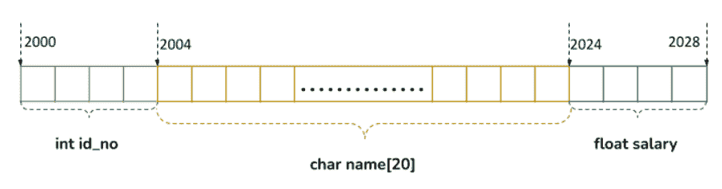

# C 语言中的结构

> 原文：<https://learnetutorials.com/c-programming/structures>

在本教程中，您将学习在 C 语言中构造一个名为 struct 的用户定义数据类型。您将学习如何定义、声明和访问结构和结构成员。此外，你将掌握嵌套结构的概念，并在简单的例子的帮助下在结构中使用关键字 typedef。

在 C 语言中，像 int 这样经常使用的标记，float 是内置的数据类型。但是在 C 语言中有一个构造用户定义数据类型的规定，叫做自定义数据类型。**结构**是创建这些数据类型的有用武器。

## 如何在 C 语言中定义结构？

结构是由单个或多个数据类型组成的用户定义的数据类型，每个结构都有一个特定的名称。结构中的数据元素或属性被称为成员。

数组和结构之间的基本区别是数组的所有元素需要是相同的数据类型。而结构可以包含不同的数据类型，这就是为什么结构总是优于数组的原因。

**语法:**

宣言的原型是

```c
 struct struct_name
{
    data_type member_1;
    data_type member_2;
    ...
    ...
    data_type member_n;
}; 

```

其中，`struct`是通知编译器程序中定义了结构的关键字。`struct_name`表示用于声明该特定结构类型的基本变量的结构的名称。`member_1`、`member_2`、...，`member_n`是相同或不同数据类型的结构成员。结构成员必须在花括号`{}`中声明，并以分号(`;`结束。最后但同样重要的是，结构定义必须在右大括号后以分号结束。下面是结构定义的例子:

```c
 struct employee  
{  
 int id_no;  
   char name[20];  
   float salary;  
}; 

```

这里我们定义了一个名为`employee`的结构，它有三个成员`id_no`、`name`和`salary`。另一个需要注意的要点是，定义一个结构在被声明之前不会保留任何内存空间。因此，只有当我们声明一个结构类型的变量时，结构及其成员才变得活跃。让我们看看如何用 C 语言创建一个结构变量。

## 如何声明结构变量

为了使用一个结构，我们需要为它们创建变量，以便在内存中为该结构分配一些空间。这可以通过两种方式实现:

1.  ### 使用结构定义

    ```c
     struct struct_name
    {
        data_type member_1;
        data_type member_2;
        ...
        ...
        data_type member_n;
    } var_1, var_2; 

    ```

    下面是一个例子:

    ```c
     struct employee  
    {  
     int id_no;  
       char name[20];  
       float salary;  
    } emp_1,emp_2; 

    ```

2.  ### 在`main()`函数中使用关键字 struct

    ```c
     struct struct_name var_1,var_2; 

    ```

    下面是一个例子:

    ```c
     int main()
    {
       struct employee emp_1,emp_2;
    } 

    ```

在这两种情况下，我们都声明了两个变量`emp_1`和`emp_2`。

### 结构变量的内存分配

现在我们来看一下 C 语言中结构的内存分配，重要的是要明白编译器只有在变量声明之后才会在内存中为结构预留空间。保留内存的顺序遵循定义结构成员的顺序。因此，在我们的例子中，对于每个变量(`emp_1`和`emp_2`，我们有 3 个结构成员(`id_no`、`name`、`salary`)。为了便于理解
，内存分配可以可视化如下



从图中可以明显看出结构`employee`的大小是 28 字节的内存。

## 如何访问结构成员？

要访问结构的每个元素，我们必须使用点运算符(。)或成员操作符。原型是

```c
 var_1.member_1;
var_1.member_2; 

```

例子

```c
 emp1\. id_no;
emp2.name; 

```

## 如何初始化结构成员

我们可以用两种不同的方式初始化结构变量的值。

1.  ### 使用花括号

    ```c
     struct struct_name
    {
        data_type member_1;
        data_type member_2;
        ...
        ...
        data_type member_n;
    }var_1 = {value for member_1, value for member_2,...},
     var_2 = {value for memeber_1, value for member _2,.}; 

    ```

    下面是一个例子:

    ```c
     struct employee  
    {  
     int id_no;  
       char name[20];  
       float salary;  
    }emp_1={1001,"Tom",5000}; 

    ```

2.  ### 使用点运算符

    ```c
     var_1.member_1 =value;
    var_1.member_2 = value; 

    ```

    下面是一个例子:

    ```c
     emp_2.id_no = 1002;
    emp_2.salary = 6000.00; 

    ```

## c 结构示例

下面给出了一个简单的程序，演示了结构和结构成员的定义、声明和初始化..

```c
 #include<stdio.h>
#include<string.h>
struct employee
{
    int id_no;
    char name[20];
    float salary;
}emp_1={1001,"Tom",5000};

int main()
{
    struct employee emp_2;

    strcpy(emp_2.name,"Jerry");
    emp_2.id_no = 1002;
    emp_2.salary = 6000.00;

    printf("Employee 1 Details\n");
    printf("Name:%s\n",emp_1.name);
    printf("ID Number:%d\n",emp_1.id_no);
    printf("Salary:%f\n\n",emp_1.salary);

    printf("Employee 2 Details\n");
    printf("Name:%s\n",emp_2.name);
    printf("ID Number:%d\n",emp_2.id_no);
    printf("Salary:%f\n",emp_2.salary);

    return 0;
} 

```

**输出:**

```c
 Employee 1 Details
Name:Tom
ID Number:1001
Salary:5000.000000

Employee 2 Details
Name:Jerry
ID Number:1002
Salary:6000.000000 
```

在本例中，您可以观察到`strcpy()`函数用于将字符串值赋给字符串变量，而不是使用`=`。从前面的教程中，我们已经了解到在 C 语言中不可能将两个字符串变量等同起来。

## C 语言中的结构数组

在上面的程序中，我们通过创建 2 个结构变量只存储了 2 个员工的详细信息。但是如果我们需要存储 50 名员工的数据呢？为 50 名员工创建 50 个变量会令人厌烦。所以 C 语言实现的最佳解决方案是结构数组。

结构数组可以看作是结构变量的集合。每个结构变量存储不同实体的信息。阵列结构的原型如下:

```c
 struct struct_name var[n]; 

```

其中 n 是变量的数量。

让我们看看如何使用数组结构存储 5 名员工的数据:

```c
 int main()
{
    struct employee emp[5];
    int i;

    printf("Enter Data of 5 employees\n");
    for(i=0; i<5;i++)
    {
      printf("Enter Id_no. :");
      scanf("%d", &emp[i].id_no);
      printf("Enter name :");
      scanf("%s",emp[i].name);
      printf("Enter Salary :");
      scanf("%d", &emp[i].salary);
    }

    printf("Record of 5 Employees\n");
    for(i=0; i<5; i++)
    {

      printf("Id_no : %d\t", emp[i].id_no);
      printf("Name : %s\t", emp[i].name);
      printf("Salary. : %d\n", emp[i].salary);
    }
    return 0;

} 

```

在这个程序中，可以看到我们为 5 个员工创建了一个名为`emp`的变量作为数组。在处理数组时，我们经常使用`for`循环来输入和输出数据。该程序的输出将是 5 名员工的数据，包括他们的`id_no`、`name`和`salary`。

## 结构中的类型定义

typedef 只不过是 C 语言中一种特殊类型的关键字，它不能创建新类型的变量，但它有能力为用户定义或内置的数据类型分配新的名称。

**语法:**

typedef 的声明语法如下所示:

```c
 typedef data_type new_name; 

```

我们还可以使用结构创建新的数据类型。通过使用 typedef，我们可以更改它的名称，稍后我们可以将这个新名称用于结构变量。这里有一个例子来启发这个程序。

```c
 struct universe 
{
        char Earth [5] ;
        char Moon [4] ;
};
typedef struct universe UNV;
UNV u; 

```

这里`universe`是一个新的结构，就在它声明之后，我们用关键词 typedef 给了它一个新的名字`UNV`。现在我们可以在任何需要的地方使用术语`UNV`来代替‘宇宙’。这里我们已经在最后一个参数中通过 typedef 定义了变量`u`。

上述语句的另一种形式是:

```c
 typedef struct 
{
        char Earth [5] ;
        char Moon [4] ;
} universe; 
universe u; 

```

现在我们将考虑一个简短的程序，引用 typedef 的用法。

```c
 #include <stdio.h>
#include<string.h>
struct universe
{
        char Earth [5] ;
        char Moon [4] ;
};
typedef struct universe UNV;
UNV u;
main()
{
  strcpy(u.Earth,"Blue Planet");
  printf  ("Earth : %s\n", u.Earth) ;
  strcpy(u.Moon,"Fossil Planet");
  printf("Moon : %s\n",u.Moon);
} 

```

**输出:**

```c
 Earth : Blue Planet
Moon : Fossil Planet 
```

## C 语言中的嵌套结构

C 用结构实现的另一个特性是嵌套结构。另一个结构内的结构称为**嵌套结构**。嵌套结构通过在另一个结构中声明一个结构，就像我们在一个结构中声明其他结构成员一样，便于创建复杂的数据类型。

嵌套可以通过两种方式完成:

1.  ### Use a separate structure

    ```c
     struct structure1
                  {
                         - - - - - - - - - -
                         - - - - - - - - - -
                  };

                  struct structure2
                  {
                         - - - - - - - - - -
                         - - - - - - - - - -
                         struct structure1 var;
                  }; 

    ```

2.  ### Using embedded structure

    ```c
     struct structure2
                  {
                         - - - - - - - - - -
                         - - - - - - - - - -

                  struct structure1
                  {
                         - - - - - - - - - -
                         - - - - - - - - - -

                  }var_structure1;
    }var_structure2; 

    ```

### 如何访问嵌套结构成员

我们可以通过使用点操作符链来轻松访问嵌套结构成员。

```c
 var_structure2.var_structure1.member; 

```

例如，我们可能需要在结构中存储员工实体的出生日期。由于该属性包含日期、月份和年份等子元素，我们需要将其定义为另一个结构，并将其嵌套到员工结构中。

### 使用独立结构的嵌套结构示例

```c
 #include<string.h>
struct DOB
{
    int dd;
    int mm;
    int yy;
};
struct employee
{
    int id_no;
    char name[20];
    struct DOB dob;
};

int main()
{
    struct employee emp;

    emp.id_no=1001;
    strcpy(emp.name,"TOM");
    emp.dob.dd = 17;
    emp.dob.mm = 02;
    emp.dob.yy = 2000;

    printf("Employee Details\n\n");
    printf("Name:%s\n",emp.name);
    printf("ID Number:%d\n",emp.id_no);
    printf("DOB(dd:mm:yyyy):%d-%d-%d\n\n",emp.dob.dd,emp.dob.mm,emp.dob.yy);

    return 0;
} 

```

**输出:**

```c
 Employee Details

Name:TOM
ID Number:1001
DOB(dd:mm:yyyy):17-2-2000 
```

这个程序解释了如何嵌套两个独立的结构。该计划中定义的两种结构是 DOB 和雇员。DOB 在员工内部声明，并使用点运算符链进行访问。

### 嵌入结构的嵌套结构示例

通过在员工结构中定义和声明 DOB 结构，可以使用嵌入式结构实现相同的功能，如下所示。这种嵌套的主要优点是它减少了代码大小。然而，当嵌套深度超过两个时，它就不适用了。

```c
 #include<stdio.h>
#include<string.h>

struct employee
{
    int id_no;
    char name[20];
    struct DOB
{
    int dd;
    int mm;
    int yy;
}dob;
};

int main()
{
    struct employee emp;

    emp.id_no=1001;
    strcpy(emp.name,"TOM");
    emp.dob.dd = 17;
    emp.dob.mm = 02;
    emp.dob.yy = 2000;

    printf("Employee Details\n\n");
    printf("Name:%s\n",emp.name);
    printf("ID Number:%d\n",emp.id_no);
    printf("DOB(dd:mm:yyyy):%d-%d-%d\n\n",emp.dob.dd,emp.dob.mm,emp.dob.yy);

    return 0;
} 

```

注意:结构的嵌套可以扩展到任何程度。