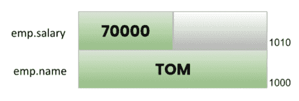
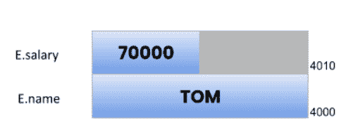
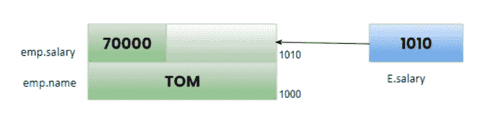

# C 语言中作为函数参数的结构

> 原文:[https://learnet utortials . com/c-programming/structures-as-function-arguments](https://learnetutorials.com/c-programming/structures-as-function-arguments)

在本教程中，您将掌握通过值调用和引用方法调用将结构作为函数参数传递。此外，你将学习借助简单的例子将结构返回到函数。

在开始本教程之前，我们假设您已经掌握了 C 语言中结构和函数的基本知识。如果没有，您可以参考我们的 C 中的[函数和 C](../c-programming/functions) 中的[结构教程来更好地理解这个主题。](../c-programming/structures)

我们可以像一般变量一样使用结构作为函数参数。结构支持按值调用和按引用过程调用。所以基本上 C 向用户提供了 3 种不同的方式来传递结构给函数。

*   第一种方法是将结构成员传递给函数。
*   其次，我们可以将整个结构传递给函数(按值调用)。
*   第三，我们可以将结构作为指针传递(通过引用调用)

## 如何将结构成员作为函数参数传递

让我们从理解下面给出的简单程序开始。

```c
 // How to pass structure members to a function
#include<stdio.h>
struct employee
{
    char name[20];
    int id_no;
    int salary;
};
// function declaration
void display_structure(char name[], int id_no, int salary);

int main()
{
    struct employee emp = {"Tom", 1001, 70000};
    display_structure(emp.name, emp.id_no, emp.salary);// function call

    return 0;
}
// function definition
void display_structure(char name[], int id_no, int salary)
{
    printf("Name of Employee: %s\n", name);
    printf("Id No of Employee: %d\n", id_no);
    printf("Salary of Employee: %d\n", salary);
    printf("\n");
} 

```

在上面的代码片段中，我们创建了一个名为`employee`的结构，它有 3 个成员，即`name`、`id_no`和`salary`。由于该结构总是在主函数之外声明，因此该结构具有全局范围，这意味着该结构的生命存在于整个程序中。

就在结构的下面，我们给出了函数声明，它向编译器提供了它可以在程序中期望一个函数的信息。这里函数声明不返回任何值，因为这里给出的类型是`void`。函数名为`display_strucute`，它实际上打印作为参数传递的结构成员的值。

在主函数内部，结构变量`emp`被声明和初始化，从而在内存中分配一些空间。稍后在传递实际参数的地方调用该函数。现在形式参数取实际参数的值。
最后，我们定义了打印结构的函数。输出将是:

```c
 Name of Employee: Tom
Id No of Employee: 1001
Salary of Employee: 70000 
```

这种将结构成员传递给函数的方式的缺点是，在结构中成员数量有限的情况下，这种方式很有帮助。

## 如何通过值将结构传递给函数

c 语言支持的另一种方法是通过将结构变量作为参数传递给函数来传递整个结构。此方法也称为按值调用方法，因为对结构成员变量所做的任何更改都不会反映在原始结构中。

您可以通过查看下面的示例来见证这一点:

```c
 // Passing entire structure to function as call by value
#include<stdio.h>
#include<string.h>

struct employee
{
    char name[10];
    int salary;
};

void update(struct employee E)// formal argument
{
    E.salary = 80000;
    printf("Salary of %s updated to %d\n",E.name,E.salary);
}

int main()
{
    struct employee emp;
    strcpy(emp.name,"Tom");
    emp.salary = 70000;
    printf("Salary of %s in main function is given as %d\n",emp.name,emp.salary);

    update(emp);//actual argument
    printf("Salary of %s after function call is %d\n",emp.name,emp.salary);

    return 0;
} 

```

让我们仔细检查程序，清楚地理解价值召唤的概念。我们都知道所有的程序都是从 main()函数开始的，所以首先我们使用下面的语句创建了一个结构变量`emp`。

```c
 struct employee emp; 

```

每当创建一个结构变量时，在内存中将根据结构成员的大小分配一些空间。在我们的例子中`emp`将在内存中分配 14 个字节。`emp`的内存分配会是这样的:



借助`printf`功能，显示结构成员的值。

在下一行，我们调用了用户定义的函数，如下所示:

```c
 update(emp); 

```

这里，我们将整个结构`emp`(实际参数)传递给函数调用的函数定义。现在控制转移到函数定义`update()`上，其中形式参数`E`取实际参数的值，即整个结构本身。下面显示了内存分配。



当比较两幅图像时，你可以看到它们在记忆位置上的不同。这表明两个结构位于不同的位置，并且彼此完全独立。

```c
 E.salary = 80000; 

```

所以在`update()`函数中，`E. salary`被分配了一个新的工资，`80000`，并被打印在该函数中。当函数结束时，控制返回到主函数，在那里我们再次打印工资值，这给你输出`70000`。

由此，我们可以得出结论，在按值调用方法的情况下，对形式参数所做的任何更改都不会反映回实际参数。

上述程序的输出如下所示:

```c
 Salary of Tom in main function is given as 70000
Salary of Tom updated to 80000
Salary of Tom after function call is 70000 
```

现在，让我们讨论一下将结构传递给函数时，按值调用方法的一些限制。

1.  如果结构的大小很大，复制结构可能需要一些时间，从而影响程序的效率。
2.  将结构复制到形式参数会消耗额外的内存存储空间。

## 如何通过引用将结构传递给函数

为了克服值调用的局限性，C 语言利用指针来传递结构。对上述程序稍加修改，实现了如下的引用调用方法:

```c
 // Passing entire structure to function as call by reference
#include<stdio.h>
#include<string.h>
struct employee
{
    char name[20];
    int salary;
};

void update(struct employee *E)//E points the location of structure
{
    E->salary = 80000;
    printf("Salary of %s updated to %d\n",E->name,E->salary);
}

int main()
{
    struct employee emp;
    strcpy(emp.name,"Tom");
    emp.salary = 70000;
    printf("Salary of %s in main function is given as %d\n",emp.name,emp.salary);

    update(&emp);// passing the address of structure emp
    printf("Salary of %s after function call is %d\n",emp.name,emp.salary);

    return 0;
} 

```

在这个代码片段中，在函数调用时，我们没有在这里传递结构，而是传递了结构的地址`emp`。形式变元 E 会取地址，指向结构`emp`本身的内存位置。

现在两个结构`E`和`emp`位于同一位置，因此对形式论证所做的任何改变都将完美地反映在实际论证中。

以下描述澄清了这一概念:



我们在程序中所做的另一个更改是，我们使用箭头运算符(->)来获取结构变量的值，而不是使用点运算符来访问成员变量。

程序的输出将是:

```c
 Salary of Tom in main function is given as 70000
Salary of Tom updated to 80000
Salary of Tom after function call is 80000 
```

与按值调用不同，在 update()函数中修改的工资反映在主函数中，这也是因为值修改实际上发生在原始结构本身中。

### 如何将结构数组作为函数参数传递

也可以将结构数组传递给函数，就像传递整数数组一样。
以下示例说明了将结构数组传递给函数的方式。

```c
 #include<stdio.h>
#include<string.h>
struct employee
{
    char name[20];
    int id_no;
    int salary;
};

int main()
{
    struct employee emp[3]={
        {"TOM",10001,70000},
        {"JERRY",10002,75000},
        {"GILL",10003,80000},
        };
    display_structure(emp); //function call

    return 0;
}
// function definition
void display_structure(struct employee E[])
{
    for(int i=0;i<3;i++){
     printf("Employee %d\n",(i+1));
    printf("Name: %s\n",E[i].name);
    printf("Id_no: %d\n",E[i].id_no);
    printf("Salary:  %d\n",E[i].salary);
     printf("\n");
    }

} 

```

**输出:**

```c
 Employee 1
Name: TOM
Id_no: 10001
Salary:  70000

Employee 2
Name: JERRY
Id_no: 10002
Salary:  75000

Employee 3
Name: GILL
Id_no: 10003
Salary:  80000 
```

将一组结构传递给一个函数一点也不困难。我们需要在函数中正确使用数组原型，并使用 for 循环遍历数组中的每个元素。

### 如何将结构返回函数

到目前为止，我们已经看到了如何将结构传递给函数，现在是时候学习结构返回给函数了。

这里给出了一个计算两个复数之和的例子。我们知道一个复数包含一个实部和一个虚部。两个复数的相加意味着两个实数部分的相加和两个虚数部分的相加，如下程序所示。

```c
 #include<stdio.h>
#include<conio.h>

struct complex
{
    float real;
    float imag;
};

struct complex add(struct complex, struct complex);
int main()
{

  struct complex c1,c2,c3;
  printf("Enter the first complex number:");
  scanf("%f%f",&c1.real,&c1.imag);
  printf("Enter the second complex number:");
  scanf("%f%f",&c2.real,&c2.imag);
  c3= add(c1,c2);
  if (c3.imag<0)
   printf("The sum of two complex numbers is %.1f - %.1fi",c3.real,-c3.imag);
  else
    printf("The sum of two complex numbers is %.1f + %.1fi",c3.real,c3.imag);
  return 0;
}

struct complex add(struct complex x,struct complex y)
{
    struct complex z;
    z.real=x.real+y.real;
    z.imag=x.imag+y.imag;
    return z;
}; 

```

在上面的代码片段中，结构是复杂的，有两个成员实数和浮点数据类型的图像。

```c
 struct complex add(struct complex, struct complex); 

```

该语句是函数名为`add`的函数声明，它返回一个结构数据类型，也传递两个结构。

在主函数中，我们使用结构变量`c1`和`c2`输入了两个复数。在`c3`中，存储从功能`add`返回的值。

加法函数以两个复数为自变量`x`和`y`，将`x`和`y`的实部的增加值存储在`z`中，对虚部同样如此。最后，该函数返回增加值，即 z。基于 c3 中的值，输出显示如下:

```c
 Enter the first complex number:2.1
3.2
Enter the second complex number:4.5
5.6
The sum of two complex numbers is 6.6 + 8.8i
----------------------------------------------------------------------------------

Enter the first complex number:2
3
Enter the second complex number:-5
-5
The sum of two complex numbers is -3.0 - 2.0i 
```