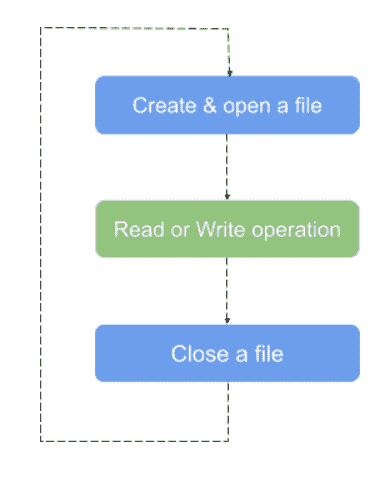
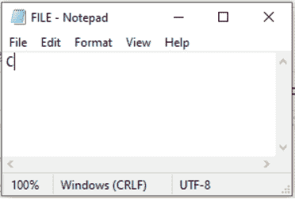
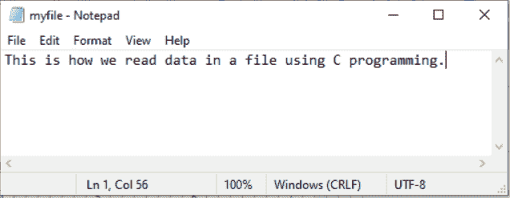

# C 语言中的文件处理

> 原文：<https://learnetutorials.com/c-programming/file-handling>

在本教程中，您将通过示例掌握所有关于 C 文件和文件操作的知识。您将学习什么是文件，如何打开和关闭文件，以及通过 C 编程读写文件的一些基本方法。

## 什么是文件？

文件是具有特定名称的字节集合。确切地说，文件是系统存储上的一个命名位置，用于存储相关数据以供将来使用。数据可以是简单的文本文件、视频或音频文件，也可以是任何复杂的可执行程序。我们使用文件系统在硬盘等非易失性存储器中实现持久存储。

## 为什么用 C 文件？

当我们编译和运行一个程序时，我们肯定会得到一个输出。一旦我们退出程序，所有的输入和输出都会从内存中删除。输入/输出功能帮助我们将这些数据以文件的形式存储在硬盘或可移动磁盘中，从而确保数据的永久存储。另一个原因是，当处理大数据时，文件很容易，因为将大数据输入程序根本不被认为是公平的做法。可以使用文件命令访问存储在文件中的数据。此外，文件很容易在计算机之间传输。

## 文件类型

文件分为两种类型:


1.  **二进制文件**是包含图像、音频等非文本值的文件。通常，二进制文件包含 0 和 1 形式的对象。二进制文件是**。将**文件存储在您的计算机中，这些文件不便于用户使用，因此不可读，但安全性很高。
2.  **文本文件**是包含结构化为行的文本值的文件。简而言之，文本文件包含多行文本值。每一行以一个特殊的字符结束，称为行尾，通常用**保存。txt** 文件。

## C 语言中的文件操作

下面列出了处理文件时需要执行的 4 个基本操作。它们按处理顺序排列。

1.  创建新文件
2.  打开现有文件
3.  读者
4.  关闭打开的文件

### 文件处理流程图



## 如何打开文件？

由于文件仍然存储在磁盘上，我们需要通过声明如下所示类型文件的指针来创建文件和程序之间的链接。

```c
 FILE *fptr; 

```

然后我们可以先打开一个文件，以便读取或写入它。`fopen()`功能一般用于做这项工作。它告诉操作系统打开文件名以及打开它的原因。如果操作系统成功，它会将文件第一个字节的地址作为指向结构文件的指针发送出去。这个函数的原型是:

```c
 FILE *fopen (const char *filename, const char *mode); 

```

在哪里

*   **文件名**给出要打开的文件的名称，
*   **模式**代表文件的打开模式(r，w，a - read，write，append)

假设我们要打开一个文件“ **Data.dat** ”进行读取。在这种情况下，参数将是:

```c
 FILE *fptr; 
fptr= fopen("DATA.dat", "r"); 

```

这里的“r”表示文件本质上是只读的。显然，参数的第二个参数决定了文件的属性:
下面是显示文件不同打开模式的表格。

| **模式** | **表示** | **描述** |
| r | 阅读 | 打开文本文件进行阅读。**如果文件不存在，fopen()** 返回 Null |
| w | 写 | 以只写模式打开文本文件进行覆盖。如果文件不存在，则创建一个文件 |
| a | 附加 | 在文件末尾追加文件，而不修剪现有的。创建一个不存在的文件。 |
| r+ | 直读式记录 | 打开文件进行读取和写入 |
| w+ | 直读式记录 | 以读写模式打开文件 |
| a+ | 追加读写 | 以附加模式打开文件进行读写。 |
| 元素铷的符号 | 二进制读取 | 打开二进制文件进行读取 |
| 世界银行 | 二进制写入 | 打开二进制文件进行写入。 |
| 腹肌 | 二进制追加 | 打开一个二进制文件，在文件末尾追加 |
| rb+ | 二进制读写 | 打开二进制文件进行读写 |
| wb+ | 二进制读写 | 打开二进制文件进行写入和读取 |
| ab+ | 二进制追加读写 | 以读写模式打开二进制文件进行附加 |

## 如何关闭文件？

读或写后，必须关闭，`fclose()`功能完成工作。`<stdio.h>`头文件中提到了函数的原型。

```c
 fclose(fp); 

```

该函数使用`fp`，一个指向文件结构的指针，与`fopen`函数完全相似。当我们在文件中写入数据时，它最初存储在缓冲区中。当缓冲区变满或编译器遇到`fclose()`函数时，数据实际上被写入磁盘。

## 如何读写文件？

有几个函数可用于读取和写入文件中的数据。为了便于理解，下面列出了一些函数。

| **Sl 号** | **功能** | **描述** |
| one | fprintf（） | 将数据写入文件 |
| Two | fscanf（） | 从文件中读取数据 |
| three | fputc() | 将字符写入文件 |
| four | fgetc（） | 从文件中读取字符 |
| five | fseek（） | 将文件指针设置到特定位置 |
| six | fputs() | 将字符串写入文件 |
| seven | fgets() | 从文件中读取字符串 |
| eight | ftell（） | 返回当前位置 |
| nine | 倒带() | 在开头设置文件指针 |
| Ten | fread() | 从二进制文件中读取数据 |
| Eleven | fwrite（） | 将数据写入二进制文件 |

### 写入文本文件

向文本文件写东西，最简单的就是`putc`。它的原型是这样的:

```c
 putc (int ch, FILE *stream); 

```

这里有一个例子，说明了这个函数的应用。

```c
 #include <stdio.h>
main()
{
   FILE *fp; 
   char ch; 
   fp= fopen ("FILE.txt", "w");
   while ((ch=getche()) != '\r') 
       putc (ch, fp);
} 

```

在本程序中，`getche`将进行单字符输入并存储在变量`ch`中。`putc`将使用文件指针`fp`将该字符写入目标文件“ **FILE.txt** ”。



`fputs `是另一个函数，能够一次在文件中写入一个字符串。它的语法是

```c
 fputs (const char *str,  FILE *stream); 

```

### 从文本文件读取

`fgetc`函数是读取文件内部数据最简单的工具。这个函数的原型是

```c
 fgetc(FILE *stream); 

```

我们可以使用“while 循环”来读取多个字符。

```c
 while ((ch= fgetc (fp)) !=EOF) 
   printf ("%c", ch); 

```

就像‘fputs’一样，有一个函数叫做‘fgets’。如果输入流引用有' n '个字符，那么它将能够读取(n-1)个字符。

#### **从文本文件中读取的示例**

假设我们有一个如下所示的文件，名为 myfile.txt，其中包含一些数据。



让我们用`fgetc`编写一个简单的 c 程序来读取文件。

```c
 #include<stdio.h>

void main()
{
    FILE *fp;
    char c;

    fp=fopen("myfile.txt","r");

    while((c=fgetc(fp))!=EOF){
    printf("%c",c);
}
fclose(fp);
} 

```

该程序输出包含在文件 myfile.txt 中的数据，控制台上打印的输出为

```c
 This is how we read data in a file using C programming. 
```

## 二进制输入输出函数

到目前为止，我们已经讨论了文本文件。但是我们也可以通过 C 编程读取、写入或编辑二进制文件。在这种情况下，第二个参数是“rb”而不是“r”。同样，“w”被“wb”取代。

```c
 fp= fopen ("binary.bin", "rb"); 

```

在文本文件的情况下，' \n '被视为单个字符，而在二进制文件中，它被视为两个连续的字符。此外，我们不能在二进制文件的末尾添加任何“文件结尾”字符。

“fread”和“fwrite”是基本功能，多用于读取或写入读取这类文件。他们的原型是:

```c
 size_t fwrite (void *buf,  int size,  int, count,  FILE *fp); 

```

和

```c
 size_t fread (void *buf,  int size,  int, count,  FILE *fp); 

```

*   **缓冲区**:简称 buf，是一个指针，包含数据将要存储的地址。缓冲区是临时存储数据的存储位置。
*   **大小**:以字节为单位读取或写入的每个元素的大小
*   **计数**:要读取或写入的元素数量
*   **流**:指向要从中读取或写入数据的文件对象的指针。

检查下面写结构的程序

```c
 #include<stdio.h>
#include<stdlib.h>
struct Book
{
    char Title[20];
    int price;
};

int main()
{
    struct Book B;
    FILE *fp;

    fp=fopen("Book.txt","wb");
    if(fp==NULL)
    {
        printf("Error: Cannot open file");
        exit(1);
    }

    printf("\n Enter the title of the book:");
    gets(B.Title);
    printf("\n Enter the price of the book:");
    fflush(stdin);
    scanf("%d",&B.price);

    fwrite(&B,sizeof(struct Book),1,fp);
    printf("Data is stored in th file successfully in binary format");
    fclose(fp);
    return 0;
} 

```

**输出:**

```c
 Enter the title of the book:Alchemist

Enter the price of the book:1500

Data is stored in the file successfully in binary format 
```

在上面的程序中，我们创建了一个结构书，其成员是书名和价格。在主函数中，我们声明了一个文件指针 fp，并打开 Book.txt 文件来写书籍的标题和价格。但是我们需要以二进制格式存储数据，所以我们使用 fwrite()函数。之后，您可以遍历文件位置并检查文件中存储了哪些详细信息。由于详细信息是以二进制格式存储的，所以您只能读取少量数据。

为了读取二进制格式的数据，可以使用 fread()函数，如下图所示。

```c
 #include<stdio.h>
#include<stdlib.h>
struct Book
{
    char Title[20];
    int price;
};

int main()
{
    struct Book B;
    FILE *fp;

    fp=fopen("Book.txt","rb");
    if(fp==NULL)
    {
        printf("Error: Cannot open file");
        exit(1);
    }

    fread(&B,sizeof(struct Book),1,fp);
    printf("\nTITLE OF BOOK : %s",B.Title);
    printf("\nPRICE OF BOOK : %d",B.price);
    fclose(fp);

} 

```

**输出:**

```c
 TITLE OF BOOK : Alchemist
PRICE OF BOOK : 1500 
```