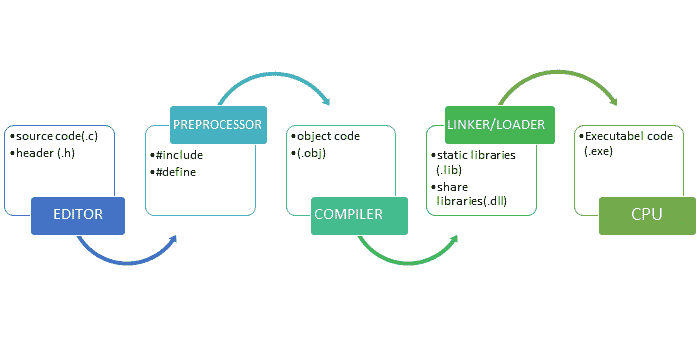
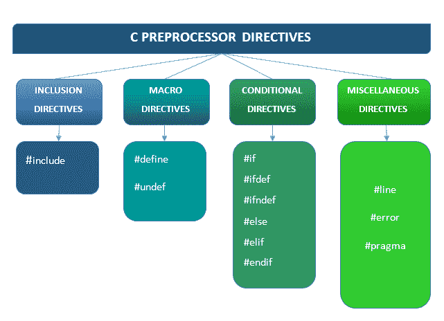

# C 语言中的预处理程序

> 原文：<https://learnetutorials.com/c-programming/preprocessor-directives>

在本教程中，您将借助简单的示例了解 C #中的预处理程序指令，如# include、#define、#if 等。

## C 语言中的预处理程序指令是什么？

C 语言中的 C 预处理器指令，通常用术语“CPP”来表示，以三种不同的方式运行。它的功能是

*   文本替换工具，指导编译器用一组定义的指令替换某个术语。因为它允许用户定义宏，所以也被称为宏处理器。
*   将其他文件的内容插入源文件的插入工具。
*   通过从文件中删除代码段进行编译的条件工具。

在 C 语言中，我们必须先编译一个程序才能运行。预处理器是一种特殊类型的程序，它在被编译器处理之前处理程序的某些部分。这可以可视化如下:



哈希符号(#)表示包含预处理器。虽然我们可以在程序的任何部分使用它，但通常的做法是在程序的开始就定义它。

## 预处理器指令分类

C 语言的主要预处理器指令根据功能分为四组。



## 1.包含指令

显然，您已经注意到几乎没有任何程序没有使用#include 预处理器。几乎每个程序都是这样开始的:

```c
 #include <stdio.h>
main()
{
} 

```

这意味着写在头文件`stdio. h`中的所有内置函数都可以在程序内部使用。同样，根据程序的性质，我们可以在程序中包含标准头文件和用户定义的头文件。

## 2 .宏指令

### 2.1 #定义指令

正如本教程前面所讨论的，宏是可以用值替换的代码段。我们可以使用#define 指令创建宏。语法是:

```c
 #define token value 

```

在这里，预处理器的工作是在程序的每个场合用提到的字符替换标识符。宏分为两种类型:

1.  类似对象的宏
2.  类似函数的宏

**类似对象的宏**

通常用值替换标识符的宏被归类在类似对象的宏下。最常用于表示数字常数。下面是一个例子:

```c
 #define LIMIT 10 

```

这里，LIMIT 是替换值 10 的宏名。观察下面说明类似对象的宏的工作的例子。

```c
 #include<stdio.h>
#define LIMIT 10

int main()
{
    for(int i=1;i<=LIMIT;i++)
    {
        printf("%d\t",i);
    }
    return 0;
} 

```

在这里，编译器将把“极限”读作 10，并相应地处理程序，得到如下输出:

```c
 1       2       3       4       5       6       7       8       9       10 
```

**类似宏或参数化宏的功能**

参数化形式极大地增强了宏的功能，尤其是在执行数学计算时。它使宏像基于变量的函数一样工作。假设我们想确定一个数的立方。为此，通常我们必须创建一个函数，如:

```c
 int cube(int a)
{
   return a*a*a;
} 

```

使用参数化宏，我们可以在一行中完成相同的操作。

```c
 #define cube(a) ((a) * (a) *(a)) 

```

下面是一个例子:

```c
 #include<stdio.h>
#define CUBE(a) ((a)*(a)*(a))

int main()
{
  printf("%d",CUBE(10));
  return 0;
} 

```

**输出:**

```c
 1000 
```

我们必须记住，在程序中使用宏之前，我们必须使用指令#define 来定义它们

### 2.2 #不适用准则

C 语言中的 undef 指令用来取消一个宏的定义，明确表示取消已经定义的宏。语法是:

```c
 #undef token 

```

下面的程序演示了# undef 指令的工作原理。

```c
 #include<stdio.h>
#define CUBE(a) ((a)*(a)*(a))
#define LIMIT 20
#undef LIMIT
int main()
{
    printf("%d",CUBE(LIMIT));

    return 0;
} 

```

在上面的代码片段中，我们没有定义宏 LIMIT，因此当我们调用该函数时，输出显然是一个错误，如下所示

```c
 error: 'LIMIT' undeclared (first use in this function)| 
```

## 3.条件指令

C 程序设计中的条件指令用于检查程序中是否已经定义了宏，并指示预处理器包含或丢弃这组代码。我们可以借助指令#ifdef，#ifndef，#if，#else，#elif，#endif 来实现条件编译。现在让我们一个接一个地了解它们:

### 3.1 #ifdef 指令:

#ifdef 预处理器指令检查由#define 定义的宏是否存在，如果条件满足，允许编译一段代码。否则这部分代码将不会被编译。#ifdef 的原型如下:

```c
 #ifdef MACRO
    //Set of codes
#endif 

```

### 3.2 #ifndef 指令

该指令检查宏是否存在，并执行放置在 ifndef 和 endif 之间的一组代码。语法如下:

```c
 #ifndef MACRO
    //Set of codes
#endif 

```

现在让我们观察一下#ifdef 和 ifndef 如何在程序中实现。

```c
 #include<stdio.h>
#define CUBE(a) ((a)*(a)*(a))
#define LIMIT 20

int main()
{
    #ifdef LIMIT
    printf("Given limit is %d",LIMIT);
    #endif // LIMIT

    #ifndef CUBE
    printf("Cube %d :",CUBE(3));
    #endif // CUBE

    return 0;
} 

```

**输出:**

```c
 Given limit is 20 
```

### 3.3 #if、#else 和#elif

所有这些指令只有在满足指定的条件或表达式时才执行代码。

**if #的语法如下:**

```c
 #if macro_expression
    //Set of codes
#endif 

```

**else #的语法:**

```c
 #if macro_expression
    //Set of codes for if part
#else
 // set of codes for else part
#endif 

```

**elif #的语法**

```c
 #if macro_expression
    //Set of codes for if part
#elif
 // set of codes for elif part
#else
 //set of codes for else part
#endif 

```

```c
 #include<stdio.h>
#include<conio.h>

#define AGE 

int main()
{

    #if AGE >=18
    printf("YOU ARE ELIGIBLE FOR VOTING");
    #else
    printf("YOU ARE NOT ELIGIBLE FOR VOTING");
    #endif
} 

```

## 预处理算子

有不同类型的预处理器运算符。现在，我们将讨论最常用的。它们在这里:

### 一、宏连续(\)运算符

通常像#这样的宏定义工作，直到它遇到一个新的行。有时我们需要宏足够大，以容纳所有的字符，将所有这些写在一行中会妨碍程序的可读性。延续运算符(' \ ')告诉编译器将下一行视为前一行的一部分。这里有一个例子:

```c
 //Continuation Operator in C

#include<stdio.h>
# define CUBE(a) \
        printf("Cube of %d is %d\n",a,((a)*(a)*(a)));
int main()
{
    CUBE(6);
    return 0;
} 

```

**输出:**

```c
 Cube of 6 is 216 
```

### 二.字符串(#)运算符:

STRINGIZE 运算符是用于操作字符串的预处理运算符之一。顾名思义，宏的 stringize 运算符能够将参数的参数转换为字符串常量。此运算符仅适用于仅接受参数的宏。

```c
 #define Macro_name(arg) #arg 

```

考虑以下示例:

```c
 #include <stdio.h>
#define display(text)  #text

int main(void)
 {
    printf(display(WELCOME TO LEARN E TUTORIALS));
    return 0;
} 

```

**输出:**

```c
 WELCOME TO LEARN E TUTORIALS 
```

说明:在这段代码中，我们将一个宏传递给 printf()函数。由于宏是在程序之前编译的，预处理器会将显示(欢迎学习电子教程)扩展为“欢迎学习电子教程”。稍后，我们将 printf()函数作为 printf(“欢迎学习电子教程”)并输出。

### 三.令牌粘贴(##)运算符:

标记粘贴操作符是一个预处理器操作符，用于在宏中粘贴作为参数给出的两个单独的标记。符号“##”通过组合放置在其两侧的标记充当连接者。##运算符可用于以下令牌:

1.像变量名、函数名等标识符。2.关键字和变量名，如 int、while、volatile 等。3.数据类型，如字符串、数字、字符、真或假。4.数学运算符和标点符号，如(，=，)；等等。

语法

```c
 #define Macro_name(arg1,arg2,...,argN) arg1##arg2##...##argN 

```

检查以下程序:

```c
 #include <stdio.h>

#define join(x, y)  x##y

int main()
{
 printf("join(20, 30) = %d\n", join(20, 30));

 return 0;
} 

```

**输出:**

```c
 join(20, 30) = 2030 
```

### 四.定义的()运算符:

该操作符的工作是检查标识符是否已由#define 定义。它有两个二进制输出真和假。如果标识符在那里，它返回 1。否则，它将标记“0”。这里有一个例子描述了#defined 的应用。

```c
 // defined operator
#include <stdio.h>
#if !defined (FUNCTION)
      #define FUNCTION "Hello World!!"
       #endif

int main(void)
 {
          printf("\n\t %s ", FUNCTION);
          return 0;
} 

```

**输出:**

```c
 Hello World!! 
```

在这里，#defined 将寻找‘FUNCTION’宏。如果没有找到，将创建一个新的。后来在主函数下，编译器会把“function”这个词读成“Hello World！”。

更多探索:
[#线路指令](https://en.wikibooks.org/wiki/C_Programming/Preprocessor_directives_and_macros##line)
[#pragma 指令](https://en.wikibooks.org/wiki/C_Programming/Preprocessor_directives_and_macros##pragma)
[#错误指令](https://en.wikibooks.org/wiki/C_Programming/Preprocessor_directives_and_macros##error)