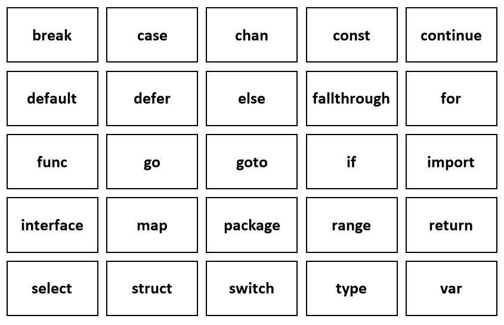

# Go 中的关键字

> 原文：<https://learnetutorials.com/golang/keywords-list>

在编程语言中，关键字是具有某种特殊含义的预定义单词。编程语言已经保留了关键字来执行一些预定义的操作。这些关键字也被称为保留字或保留名。不允许将这些字用作标识符，否则会出现编译时错误，从而中断程序执行。
Go 编程语言有 25 个关键字。y 值如下:



根据它们的用法，这些关键字可以分为四组:

| 申报 | 复合材料 | 控制流 | 函数修饰符 |
| 常量 | 陈 | 破裂 | 推迟 |
| 定义变量 | 连接 | 情况 | 去 |
| 功能 | 映射 | 继续 |  |
| 类型 | 结构体 | 系统默认值 |  |
| 进口 |  | 其他 |  |
| 包裹 |  | 失败 |  |
|  |  | 为 |  |
|  |  | 转到 |  |
|  |  | 如果 |  |
|  |  | 范围 |  |
|  |  | 返回 |  |
|  |  | 挑选 |  |
|  |  | 转换 |  |

让我们学习他们每一个人…

1.  ## 声明关键字

    声明关键字用于声明 Go 编程语言的各种元素。

    *   const

        在 Go 编程语言中，“const”关键字用于常量值的声明。一旦一个值被声明为常量值，那么就不可能改变或重新给它赋值。

        ```go
         const CONST_NAME type = value 

        ```

        ```go
         const C 
        ```

        ### 打印常量变量值的示例程序:

        ```go
         package main
        import ("fmt")

        func main() {
          const A int= 1
          const B = 2

          fmt.Println(A)
          fmt.Println(B)
        } 

        ```

        **输出:**

        ```go
         1
        2 
        ```

    *   var

        在 Go 编程语言中，“var”关键字用于变量的声明。变量用于存储计算机内存位置中的值。

        句法

        ```go
         var variable_name type = value 

        ```

        ```go
         variable_name := value 

        ```

        ### 打印变量值的示例程序:

        ```go
         package main
        import ("fmt")

        func main() {
          var variable_1 string = "Hello" 
          var variable_2 = "World" 
          a := 5 

          fmt.Println(variable_1)
          fmt.Println(variable_2)
          fmt.Println(a)
        } 

        ```

        **输出:**

        ```go
         Hello
        World
        5 
        ```

    *   fun

        在 Go 编程语言中，“func”关键字用于创建(或声明)函数。在程序中，函数是执行某些特定任务的代码块。函数内部的代码只在函数被调用时执行。

        句法

        ```go
         func FunctionName() {
         //codes of statements of the function
        } 

        ```

        ### 使用函数打印消息的示例程序:

        ```go
         package main
        import ("fmt")

        func Fun_Msg() {
          fmt.Println(" This is a message from the function ! ")
        }

        func main() {
          Fun_Msg() 
        } 

        ```

        **输出:**

        ```go
         This is a message from the function ! 
        ```

    *   type

        在 Go 编程语言中，“type”关键字用于创建新的类型，如结构(struct)、接口、指针等。

        句法

        ```go
         type type_name existing_type or type_definition 

        ```

        ### 使用 struct 打印个人详细信息的示例程序:

        ```go
         package main
        import ("fmt")

        type Person struct {
          name string
          age int
        }

        func main() {
          var p1 Person

          p1.name = "Mary"
          p1.age = 30

          fmt.Println("Name: ", p1.name)
          fmt.Println("Age: ", p1.age)

        } 

        ```

        **输出:**

        ```go
         Name: Mary
        Age: 30 
        ```

        注意:在 Go 编程语言中，结构用于将不同类型的项/值组合成一个类型。

    *   package

        在 Go 编程语言中，关键字“package”用于声明包。软件包用于将大量程序的相关特性组合成单个单元。使用包会更容易维护和理解程序。Go 程序必须有“主”包，否则不会被编译。

        句法

        ```go
         package package_name 
        ```

        ```go
         package main 

        ```

    *   import

        在 Go 编程语言中，关键字“import”用于将各种包链接到程序中。

        句法

        ```go
         Import “package_name” 

        ```

        例子

        ```go
         import “fmt”
         import “ost” 

        ```

2.  ## 复合关键字

    复合类型关键字用于表示复合类型。

    *   chan

        在 Go 编程语言中，关键字“chan”用于定义通道。信道是一种媒介，用于在戈罗提人之间进行通信。(链接:Go 中的通道)

        句法

        ```go
         var channel_name chan type 

        ```

        例子

        ```go
         package main
        import "fmt"
        func main() {

            var my_channel chan int
            fmt.Println("Value of channel: ", my_channel)
            fmt.Printf("Type of channel: %T ", my_channel)
        } 

        ```

        **输出:**

        ```go
         Value of channel: 
        Type of channel: chan int 
        ```

    *   interface

        在 Go 编程语言中，关键字“接口”用于表示一组方法签名。

        句法

        ```go
         type name_of_interface interface{
        //methods
        } 

        ```

        例子

        ```go
         package main
        import "fmt"
        type square interface {
            sarea() float64
            sperimeter() float64
        }
        type myvalue struct {
            side float64
        }
        func (m myvalue) sarea() float64 {
            return m.side*m.side
        }
        func (m myvalue) sperimeter() float64 {
            return 4*m.side
        }
        func main() { 
            var s square
            s = myvalue{2}
            fmt.Println("Area of square :", s.sarea())
            fmt.Println("Perimeter of square:", s.sperimeter())
        } 

        ```

        **输出:**

        ```go
         Area of square :4
        Perimeter of square:8 
        ```

    *   map

        在 Go 编程语言中，关键字“map”用于定义映射类型。映射是无序键值对的集合。映射用于执行查找、更新、删除和检索值。

        句法

        ```go
         var map_variable = map[key_type]value_type{key1:value1, key2:value2,……..} 

        ```

        例子

        ```go
         package main
        import ("fmt")

        func main() {
          var m = map[string]string{"Name": "Joy", "breed": "Siberian Husky", "age": "2021"}
          fmt.Printf("m\t%v\n", m)
        } 

        ```

        **输出:**

        ```go
         m map[{Name: Joy age: 2021 breed: Siberian Husky] 
        ```

    *   struct

        在 Go 编程语言中，关键字“struct”用于声明结构。结构用于将不同数据类型的值/成员的集合存储到单个变量中。

        句法

        ```go
         type struct_name struct {
          member1 datatype;
          member2 datatype;
          member3 datatype;
          member4 datatype;
         ..........
        } 

        ```

        例子

        ```go
         package main
        import ("fmt")

        type Employee struct {
          name string
          age int
          salary int
        }

        func main() {
          var emp1 Employee
          var emp2 Employee

          emp1.name = "Alex"
          emp1.age = 30
          emp1.salary = 10000

          emp2.name = "Mary"
          emp2.age = 50
          emp2.salary = 12000

          fmt.Println("Name: ", emp1.name)
          fmt.Println("Age: ", emp1.age)
          fmt.Println("Salary: ", emp1.salary)

          fmt.Println("Name: ", emp2.name)
          fmt.Println("Age: ", emp2.age)
          fmt.Println("Salary: ", emp2.salary)
        } 

        ```

        **输出:**

        ```go
         Name: Alex
        Age:30
        Salary:10000
        Name: Mary
        Age:50
        Salary:12000 
        ```

3.  ## 控制流

    这些关键字用于控制代码的流动。它也被称为决策，它意味着根据给定的条件执行一组代码。

    *   if

        当给定条件为真时，使用“if”关键字执行一个代码块，如果给定条件为假，则不执行该代码块。

        句法

        ```go
         if condition {
         //codes to be executed if the condition is true
        } 

        ```

        ### 打印两个数字中最大数字的示例程序:

        ```go
         package main
        import ("fmt")

        func main() {
          a := 10
          b := 2
          if a>b {
            fmt.Println(" The largest number is", a)
          }
        } 

        ```

        **输出:**

        ```go
         The largest number is 10 
        ```

    *   else

        当给定条件为假时，“else”关键字与“if”关键字一起使用来执行另一个代码块。

        句法

        ```go
         if condition {
         //codes to be executed if the condition is true
        } else {
        // codes to be executed if the condition is false
        } 

        ```

        ### 打印两个数字中最大数字的示例程序:

        ```go
         package main
        import ("fmt")

        func main() {
          a := 3
          b := 6
          if a>b {
            fmt.Println(" The largest number is", a)
          } else {
           fmt.Println(" The largest number is", b)
          }
        } 

        ```

        **输出:**

        ```go
         The largest number is 6 
        ```

    *   for

        “for”关键字用于以每次不同的值重复执行一个代码块。

        句法

        ```go
         for initialization; condition; increment/decrement {
         // codes to be executed
        } 

        ```

        ### 打印最多 10 个数字的示例程序:

        ```go
         package main
        import ("fmt")

        func main() {
          for i:=1; i <= 10; i++ {
            fmt.Println(i)
          }
        } 

        ```

        **输出:**

        ```go
         1
        2
        3
        4
        5
        6
        7
        8
        9
        10 
        ```

    *   continue

        ### 打印最多 5 个数字并跳过一个数字的示例程序:

        ```go
         package main
        import ("fmt")

        func main() {
          for i:=1; i <= 5; i++ {
            if i == 2 {
              continue
            }
            fmt.Println(i)
          }
        } 

        ```

        **输出:**

        ```go
         1
        3
        4
        5 
        ```

    *   break

        “break”关键字用于终止循环。循环结束后，剩余的代码将被执行。

        ### 打印多达 10 个数字并在 5:

        ```go
         package main
        import ("fmt")

        func main() {

          for i:=1; i <= 10; i++ {
            if i == 6 {
              break
            }
            fmt.Println(i)
          }
        } 

        ```

        **输出:**

        ```go
         1
        2
        3
        4
        5 
        ```

    *   goto

        “goto”关键字在函数中用于跳转到不带任何条件的标记语句。

        句法

        ```go
         label: statements
        …..
        ….
        goto label 

        ```

        例子

        ```go
         package main
        import "fmt"
        func main() { 
           a := 1
           LABEL: for a <= 5 {
              if a == 2 {
                 a = a + 1
                 goto LABEL
              }
              fmt.Printf("value of a = %d\n", a)
              a++     
           }  
        } 

        ```

        **输出:**

        ```go
         Output:
        value of a = 1
        value of a = 3
        value of a = 4
        value of a = 5 
        ```

    *   switch

        “switch”关键字用于执行多个代码块中的一个代码块。

    *   case

        “case”关键字与“switch”语句一起使用。在 switch 语句中，表达式与多个大小写值进行比较。如果此表达式与案例值匹配，则执行与案例相关联的代码。

        句法

        ```go
         switch expression {
         case a:
          // code of block
         case b:
          // code of block
         case c:
          // code of block
         ……………
        } 

        ```

        ### 打印月份名称的示例程序:

        ```go
         package main
        import ("fmt")

        func main() {

          month := 2

          switch month {
          case 1:
            fmt.Println("January")
          case 2:
            fmt.Println("February")
          case 3:
            fmt.Println("March")
          case 4:
            fmt.Println("April")
          case 5:
            fmt.Println("May")
          case 6:
            fmt.Println("June")
          case 7:
            fmt.Println("July")
          case 8:
            fmt.Println("August")
          case 9:
            fmt.Println("September")
          case 10:
            fmt.Println("October")
          case 11:
            fmt.Println("November")
          case 12:
            fmt.Println("December")  
          }
        } 

        ```

        **输出:**

        ```go
         February 
        ```

    *   default

        “default”关键字与“switch”语句一起使用，以便在找不到大小写匹配时执行代码块。此关键字是可选的。

        句法

        ```go
         switch expression {
         case a:
          // code of block
         case b:
          // code of block
         case c:
          // code of block
         ……………
        default:
         // code of block
        } 

        ```

        ### 示例程序

        ```go
         package main
        import ("fmt")

        func main() {
          var day int= 8

          switch day {
          case 1:
            fmt.Println("Monday")
          case 2:
            fmt.Println("Tuesday")
          case 3:
            fmt.Println("Wednesday")
          case 4:
            fmt.Println("Thursday")
          case 5:
            fmt.Println("Friday")
          case 6:
            fmt.Println("Saturday")
          case 7:
            fmt.Println("Sunday")
          default:
            fmt.Println("Invalid")
          }
        } 

        ```

        **输出:**

        ```go
         Invalid 
        ```

    *   fallthrough

        “fallthrough”关键字用在开关盒块内部。它用于将程序控制转移到下一个案例，即使表达式与当前案例匹配。

        ### 示例程序

        ```go
         package main
        import ("fmt")

        func main() {
          var day int= 5

          switch day {
          case 1:
            fmt.Println("Monday")
          case 2:
            fmt.Println("Tuesday")
          case 3:
            fmt.Println("Wednesday")
          case 4:
            fmt.Println("Thursday")
          case 5:
            fmt.Println("Friday")
            fallthrough
          case 6:
            fmt.Println("Saturday")
            fallthrough
          case 7:
            fmt.Println("Sunday")
          }
        } 

        ```

        **输出:**

        ```go
         Friday
        Saturday
        Sunday 
        ```

    *   range

        在 Go 编程语言中，关键字“range”在不同类型的数据结构中用于迭代所有元素。该范围主要用于循环。

        ### 示例程序

        ```go
         package main
        import "fmt"
        func main() {
            even := [5]int{2, 4, 6, 8, 10}
            for i, item := range even {
                fmt.Printf("even[%d] = %d \n", i, item)
            }
        } 

        ```

        **输出:**

        ```go
         even[0] = 2 
        even[1] = 4
        even[2] = 6
        even[3] = 8
        even[4] = 10 
        ```

    *   return

        在 Go 编程语言中，关键字“return”用于作为变量返回值。

    *   select

        在 Go 编程语言中，关键字“select”用于多通道操作。select 语句类似于 switch 语句。

        句法

        ```go
         select {
            case case1:
                // case 1...
            case case2:
                // case 2...
            case case3:
                // case 3...
            case case4:
                // case 4...
            default:
                        // default case...
        } 

        ```

        ### 示例程序

        ```go
         package main
        import ("fmt")

        func g1(chanel chan int) {
            chanel <- 10
        }

        func g2(chanel chan int) {
            chanel <- 30
        }

        func main() {

            chanel1 := make(chan int)
            chanel2 := make(chan int)

            go g1(chanel1)
            go g1(chanel2)

            select {
            case v1 := <-chanel1:
                fmt.Println("Got: ", v1)
            case v2 := <-chanel2:
                fmt.Println("Got: ", v2)
            }
        } 

        ```

        **输出:**

        ```go
         Got: 10 
        ```

4.  Function modifier

    函数修饰符关键字用于修改函数调用。

    *   defer

        在 Go 编程语言中，关键字“delay”用于延迟函数或方法的执行，直到周围的函数返回。

        句法

        ```go
         //function
        defer func func_name(parameter_list Type)return_type{
        // Code
        }

        // Method
        defer func (receiver Type) method_name(parameter_list){
        // Code
        }

        defer func (parameter_list)(return_type){
        // code
        }() 

        ```

        ### 示例程序

        ```go
         package main
        import "fmt"
        func mul(x, y int) int {
            r := x * y
            fmt.Println("Result: ", r)
            return 0
        }
        func show() {
            fmt.Println("Hello world")
        }
        func main() {
            mul(2, 5)
            defer mul(4, 3)
            show()
        } 

        ```

        **输出:**

        ```go
         Result: 10
        Hello world
        Result: 12 
        ```

    *   go

        在 go 编程语言中，关键字“Go”用于创建 goroutines。

        句法

        ```go
         func function_name(){
        // statements
        }
        go function_name() 

        ```

        ### 示例程序

        ```go
         package main
        import "fmt"

        func display(s string) {
            for i := 0; i < 5; i++ {
                fmt.Println(s)
            }
        }
        func main() {
            go display("Welcome")
            display("hello")
        } 

        ```

        **输出:**

        ```go
         hello
        hello
        hello
        hello
        hello 
        ```