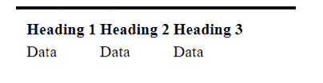
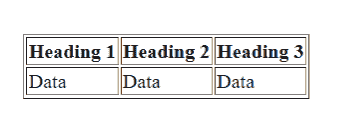

# HTML 表格

> 原文：<https://learnetutorials.com/html/table-tag>

在本 HTML 教程中，您将了解到 HTML 中的所有表格标签。我们还将讨论 HTML 中最常用的表格标签属性。

## HTML 中的 Table 标签有什么用？

HTML 表格标记用于以表格格式(行*列)演示数据。一行可以包含多列。使用元素和、标签定义，表格标题由

| and | Element, we can create a table that displays data in tabular form. Each table row consists of |
| Tag definition, table data is defined by | Label definition. HTML tables are used to manage the layout of pages, such as header section, navigation bar, body content, footer section, etc. However, it is recommended that you use div tags instead of tables to manage the page layout. |

示例
<表格>元素用于创建表格。要在<表格>元素内创建行，请使用< tr >元素，要在一行内创建列，请使用< td >

```html
 <!DOCTYPE html> 
<html> 
<head> 
</head> 
<body> 
    <h1>This is Style attribute</h1>      <p  height: 50px; color: blue " >It will add style property in element</p>      <p  color: red " >It will change the color of content</p> 
</body> 
</html> 

```

**Output**

默认情况下，表格没有任何边框。为了给表格添加边框，我们可以使用边框属性，也可以使用 CSS 边框属性。

## 用于创建表格的标签

```html
 <table border=1 cellpadding=10 cellspacing=10>
 <table border=1 cellpadding=10>
  <tr>
    <th>Heading 1</th>
    <th>Heading 2</th>
    <th>Heading 3</th>
  </tr>
  <tr>
    <td>Data</td>
    <td>Data</td>
    <td>Data</td>
  </tr>
</table> 

```

**Output**

| 标签 | 描述 |
| 标记用于定义表格的行。标记用于将列指定到一个组中进行格式化。标签与标签相关联，用于指定表格各列的格式属性。标签用于对表格的正文内容进行分组。标签用于对表格的表头内容进行分组。

&#124; 标签用于定义表格。

 &#124;
&#124;  &#124;
&#124;  &#124;
&#124;  &#124;  &#124;  &#124; 标记用于定义表格的标题。 &#124;
&#124;  &#124;  &#124;  &#124; 标签用于定义表格的数据。 &#124;
&#124;  &#124;<caption></caption>
&#124;  &#124;<caption>标签用于指定表格的标题。</caption>
&#124;  &#124;
&#124;  &#124;
&#124;  &#124;<colgroup><col></colgroup>
&#124;  &#124;<colgroup><col></colgroup>
&#124;  &#124;
&#124;  &#124;
&#124;  &#124;
&#124;  &#124;
&#124; --- &#124;
&#124;  &#124; <tfooter>标签用于对表格的页脚内容进行分组。</tfooter> &#124;

## 如何在表格中添加边框？

在 HTML 中向表格添加边框主要有两种方法

1.  通过使用边框属性
2.  通过使用 CSS 属性

### 使用边框属性添加边框

我们可以使用边框属性来指定表格的边框。

```html
 <table border=1>
  <tr>
    <th>Heading 1</th>
    <th>Heading 2</th>
    <th>Heading 3</th>
  </tr>
  <tr>
    <td>Data</td>
    <td>Data</td>
    <td>Data</td>
  </tr>
</table> 

```

**Output**

## 使用 CSS 属性添加边框

我们可以使用边框属性来指定表格的边框。

```html
 <style>  
table, th, td {  
  border: 1px solid black;  
}  
</style>
<table border=1>
  <tr>
    <th>Heading 1</th>
    <th>Heading 2</th>
    <th>Heading 3</th>
  </tr>
  <tr>
    <td>Data</td>
    <td>Data</td>
    <td>Data</td>
  </tr>
</table> 

```

**Output**

## 表格中列跨度的使用

您可以使用 colspan 属性使一个单元格跨多个列。单元格/行被分成许多列，列的数量由 colspan 属性决定。

```html
 <style>  
table, th, td {  
  border: 1px solid black;  
}  
</style>
<table border=1>
  <tr>
    <th>Heading 1</th>
    <th colspan=2>Heading 2</th>
  </tr>
  <tr>
    <td>Data</td>
    <td>Data</td>
    <td>Data</td>
  </tr>
</table> 

```

**Output**

## 表格中行跨度的使用

您可以使用 colspan 属性使单元格跨越多行。一个单元格将被分成多行。rowspan 属性确定划分的行数。

```html
 <style>  
table, th, td {  
  border: 1px solid black;  
}  
</style>
<table>    
<tr>
  <th>Heading 1</th>
  <td>Data</td>
</tr>    
<tr>
  <th rowspan="2">Heading 2</th>
  <td>Data</td>
</tr>    
<tr>
  <td>Data</td>
</tr>    
</table> 

```

**Output**

## 如何在 HTML 表格中添加单元格填充

每个单元格之间的间距称为单元格间距。默认设置为 2 像素。单元格间距属性用于指定单元格间距..

```html
 <table border=1 cellpadding=10>
  <tr>
    <th>Heading 1</th>
    <th>Heading 2</th>
    <th>Heading 3</th>
  </tr>
  <tr>
    <td>Data</td>
    <td>Data</td>
    <td>Data</td>
  </tr>
</table> 

```

**Output**

## 如何在 HTML 表格中添加单元格间距

单元格边缘和单元格内容之间的填充称为单元格填充。默认情况下，填充设置为 0。单元格填充是用于向单元格添加填充的属性。

```html
 <table border=1 cellpadding=10 cellspacing=10>
  <tr>
    <th>Heading 1</th>
    <th>Heading 2</th>
    <th>Heading 3</th>
  </tr>
  <tr>
    <td>Data</td>
    <td>Data</td>
    <td>Data</td>
  </tr>
</table> 

```

**Output**

## 向 HTML 表格添加标题

使用 |<caption>元素，我们可以为表格指定标题。打开标签后，必须放置

<caption>元素。默认情况下，标题显示在表格的顶部，但是您可以使用 CSS 标题侧属性调整其位置。</caption></caption>