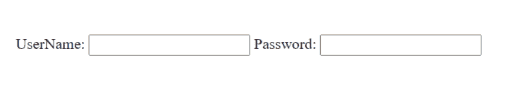
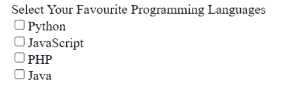
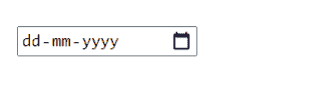

# HTML 表单

> 原文：<https://learnetutorials.com/html/form-elements>

在本 HTML 教程中，您将了解到关于 HTML 中的表单标签的所有知识。我们还将讨论不同的表单输入控件和表单属性。

## 表单在 HTML 中有什么用？

当我们想要从用户那里收集信息时，HTML 表单是必不可少的。例如，在用户注册过程中，您可能希望收集诸如用户名、电子邮件地址、电话号码等信息。表单将从网络用户那里收集信息，然后将这些信息发送到后端应用程序，如 CGI 或 PHP 脚本，以及许多其他应用程序。基于应用程序内部建立的需求逻辑，后端应用程序将对提供的数据进行必要的处理。文本字段、文本区域字段、下拉菜单、单选按钮、复选框和其他表单组件都是可能的。

## HTML 中的表单标签属性都有哪些？

| 属性 | 描述 |
| 接受字符集 | 它用于 accept-charset 参数定义表单提交将使用的字符编码。 |
| 行为 | 提交表单时，action 属性指示表单数据应该发送到哪里。 |
| 自动完成 | autocomplete 属性定义是否应该为表单启用或禁用自动完成。启用自动完成后，浏览器将根据用户以前给出的值自动完成值。 |
| enctype | enctype 参数定义了用户输入的表单数据在提交给服务器之前应该如何编码。 |
| 方法 | 方法属性确定表单数据应该如何传输。表单数据可以通过使用方法值作为“get”作为 URL 变量来提供，也可以通过使用方法值作为“post”作为 HTTP post 传输来提供。 |
| 名字 | 表单的名称是通过 name 属性指定的。表单提交后，name 属性用于引用 JavaScript 或表单数据中的项目。 |
| 关闭验证 | novalidate 是一个布尔属性。它用于说明用户输入的表单数据如果存在，是否不应在提交时进行验证。 |
| 能量损耗率 | rel 属性用于提供当前文档和链接文档之间的关系。 |
| 目标 | target 参数指定一个名称或关键字，用于定义提交表单后获得的响应应该显示在哪里。 |

## HTML 中使用的表单标签都是哪些？

| 标签 | 描述 |
|  | 它用于指定 HTML 表单。每个表单元素都将包含在这个标签中。 |
| <input> | 它用于指定输入控件的类型。 |
| <textarea></td> <td>它用于指定多行输入字段</td> </tr> <tr> <td><label/></td> <td>它用于指定输入元素的标签。</td> </tr> <tr> <td><fieldset/></td> <td>它用于将连接的元素组织成一个表单。</td> </tr> <tr> <td><legend/></td> <td>它用于为有组织的<fieldset>标签指定标题。</fieldset></td> </tr> <tr> <td><select/></td> <td>它用于指定下拉列表。</td> </tr> <tr> <td><option/></td> <td>它用于在下拉列表中指定选项。</td> </tr> <tr> <td><optgroup/></td> <td>它用于在选项标签中指定相关备选方案的集合。</td> </tr> <tr> <td><button/></td> <td>它用于指定可以单击的按钮。</td> </tr> <tr> <td><datalist/></td> <td>它用于定义一组预定义的输入控制选项。</td> </tr> <tr> <td><keygen/></td> <td>它用于指定表单密钥对生成器字段。</td> </tr> <tr> <td><output/></td> <td>它用于指定计算的结果。</td> </tr> </tbody> </table> <h2><form>HTML 中的元素</form></h2> <p>HTML 中的<code><form></code>元素用于创建接受用户输入的文档区域。它有许多用于向 web 服务器发送数据的交互功能，如输入字段、文本区域、密码字段等。</p> <div class="syntax"> <pre> <code class="html"> <form> //Form elements </form> </code> </pre> </div> <h2><input/>HTML 中的元素</h2> <p>HTML 中的<code><input></code>元素是一个基本的表单元素。它用于构造接受用户输入的表单域。我们可以利用多个输入字段从用户那里收集不同的信息。</p> <div class="code-example"> <h3>示例:接受名称的 HTML 输入字段</h3> <pre> <code class="html"> <form> Name: <input type=“text” name=“username”> </form> </code> </pre> </div> <div class="img-div"></div> <h2><textarea>HTML 中的元素</textarea>HTML 中的`<textarea>`元素是一个基本的表单元素。它用于用户的多行输入。可以使用“行”或“列”属性或使用 CSS 来指定<文本区域>的大小。

### 示例:接受地址的 HTML 输入字段

```html
 <form>  
  Address:<br>
  <textarea name=“address” cols=25 rows=5></textarea>
</form> 

```


## <label>HTML 中的元素</label>

HTML 中的< label >元素是一个基本的表单元素。它用于给表单输入控件赋予标签。

### 示例:文本字段的 HTML 标签

```html
 <form>  
  <label for="name">Name: </label>
  <input type="text" name="name" id="name">
</form> 

```


## HTML 表单中各种类型的输入控件

输入元素中的类型属性用于指定 HTML 表单中各种类型的输入控件。

&#124; 类型 &#124; 描述 &#124;
&#124; 文本 &#124; 它用于指定单行输入字段。 &#124;
&#124; 密码 &#124; 它用于指定单行密码输入字段。 &#124;
&#124; 使服从 &#124; 它用于指定表单提交按钮。 &#124;
&#124; 重置 &#124; 它用于指定复位按钮。 &#124;
&#124; 收音机 &#124; 它用于指定单选按钮，仅选择一个选项会有所帮助。 &#124;
&#124; 检验盒 &#124; 它用于指定有助于选择多个选项的复选框。 &#124;
&#124; 按钮 &#124; 它用于指定可点击的按钮。 &#124;
&#124; 文件 &#124; 它用于指定文件上传字段。 &#124;
&#124; 图像 &#124; 它用于指定以图像作为背景的按钮 &#124;
&#124; 颜色 &#124; 它用于指定颜色选择字段。 &#124;
&#124; 日期 &#124; 它用于指定日期选择字段。 &#124;
&#124; 日期时间-本地 &#124; 它用于指定日期和时间选择字段。 &#124;
&#124; 电子邮件 &#124; 它用于指定电子邮件输入字段。 &#124;
&#124; 月 &#124; 它用于指定月份选择字段。 &#124;
&#124; 数字 &#124; 它用于指定数字输入字段。 &#124;
&#124; 全球资源定位器(Uniform Resource Locator) &#124; 它用于指定 url 输入字段。 &#124;
&#124; 周 &#124; 它用于指定周选择字段。 &#124;
&#124; 搜索 &#124; 它用于指定搜索字段。 &#124;
&#124; 电话 &#124; 它用于指定电话号码输入字段。 &#124;

## 在 HTML 表单中输入文本字段

单行输入文本字段由“文本”类型的`<input>`元素定义。默认情况下，输入元素的类型是文本本身。

### 示例:HTML 输入文本字段

```html
 <form>  
  <label for="name">Name: </label>
  <input type="text" name="name" id="name">
</form> 

```


## HTML 表单中的密码字段

“**密码**类型的`<input>`元素允许用户在网站中安全地输入密码。密码字段中提供的文本被转换为“*”或“.”以便其他用户看不到它。

### 示例:HTML 输入密码字段

```html
 <form>  
  <label for="name">UserName: </label>
  <input type="text" name="name" id="name">
  <label for="password">Password: </label>
  <input type="password" name="password" id="password">
</form> 

```



## HTML 表单中的提交按钮

当点击事件发生时，类型为“**提交**的`<input>`元素定义了一个提交按钮，将表单发送到服务器。

### 示例:HTML 提交按钮

```html
 <form>  
  <label for="name">UserName: </label>
  <input type="text" name="name" id="name">
  <label for="password">Password: </label>
  <input type="password" name="password" id="password"><br>
  <input type="submit">
</form> 

```


## HTML 表单中的重置按钮

输入类型“**重置**”同样被指定为按钮，然而，当用户进行点击事件时，默认情况下，它重置所有输入的值。

### 示例:HTML 重置按钮

```html
 <form>  
  <label for="name">UserName: </label>
  <input type="text" name="name" id="name">
  <label for="password">Password: </label>
  <input type="password" name="password" id="password"><br>
  <input type="submit">
  <input type="reset">
</form> 

```


## HTML 表单中的单选按钮

单选按钮由`<input>`类型的“**单选按钮**定义，允许用户从一组相关选项中选择一个选项。在任何时刻，只能选择一个单选按钮。

### 示例:HTML 单选按钮

```html
 <form>  
  Select Your Favourite Programming Language <br>
  <input type="radio" name="lang" value="python">Python <br>
  <input type="radio" name="lang" value="js">JavaScript <br>
  <input type="radio" name="lang" value="php">PHP <br>
  <input type="radio" name="lang" value="java">Java <br>
</form> 

```


## HTML 表单中的复选框

`<input>`类型“**复选框**表示为方形框，可以选择或取消选择以从列表中选择。

### 示例:HTML 复选框

```html
 <form>  
  Select Your Favourite Programming Languages <br>
  <input type="checkbox" name="lang1" value="python">Python<br>  
  <input type="checkbox" name="lang2" value="js">JavaScript<br>  
  <input type="checkbox" name="lang3" value="php">PHP<br>  
  <input type="checkbox" name="lang4" value="java">Java<br>  
</form> 

```



## HTML 表单中的按钮

输入类型“**按钮**”指定可被配置为控制诸如点击事件的功能事件的基本按钮。

### 示例:HTML 按钮

```html
 <form>        <input type="button" value="I am a Button"  are learning HTML')">  
</form> 

```


## HTML 字段中的日期字段

类型为“**日期**的`<input>`元素创建了一个输入字段，允许用户以某种格式输入日期。可以使用文本字段或日期选择器界面输入日期。

### 示例:HTML 日期

```html
 <form>  
     <input type="date">  
</form> 

```

 |