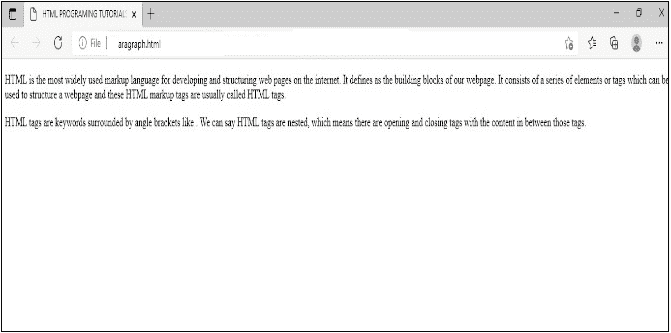

# HTML 程序：实现段落

> 原文：<https://learnetutorials.com/html/programs/paragraph-or-p-tag>

Html 段落用`<p>`标签定义。`<p>`和`</p>`标签内的文本将被视为一个段落。让我们看看 HTML 程序实现段落的例子。

## HTML 源代码

```html
<!DOCTYPE html>
 <html>
    <head>
        <title>
            HTML PROGRAMING TUTORIALS
        </title>
    </head>
     <body>
        <p> 
HTML is the most widely used markup language for developing and structuring web pages on the internet. It defines as the building blocks of our webpage. It consists of a series of elements or tags which can be used to structure a webpage and these HTML markup tags are usually called HTML tags. 
</p>
<p> 
HTML tags are keywords surrounded by angle brackets like <html>. We can say HTML tags are nested, which means there are opening and closing tags with the content in between those tags. 
</p>
    </body>
</html> 

```

## 输出

```html

```