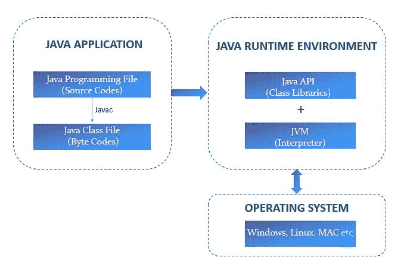
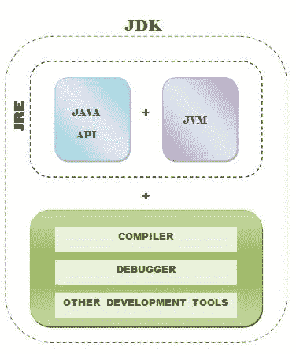

# Java 架构及其组件

> 原文：<https://learnetutorials.com/java/java-architecture-and-its-components>

在本教程中，我们将讨论 java 架构及其几个组件。您将掌握三个重要的 java 组件——JVM、JRE 和 JDK。这包括它们的工作原理以及它们之间的区别。

## Java 架构

架构是所有组件的基本计划，这些组件共同定义了系统，包括结构、接口、通信模式等。java 的综合架构是多个组件的融合。下面显示了 java 架构的概要草图。

java 的第一个也是最重要的组件是 Java 应用程序，它包括另外两个组件——Java 编程文件和 Java 类文件。java 类文件是在编译 Java 源文件时创建的文件。这里，源代码被转换成独立于机器的字节码。这些字节码然后被传递给 java 运行时环境(JRE)，这是 Java 的另一个重要组成部分。字节码现在与类库集成在一起，Java 虚拟机解释这些字节码，并将它们翻译成本机代码。因此，Java 体现了编译和解释的技术。

## JVM 到底是什么？

JVM 代表 Java 虚拟机。顾名思义，JVM 就像一个虚拟处理器，是 java 的核心元素之一。这个虚拟处理器的主要目标是解释字节码，并将它们转换成本机机器码。

JVM 在 Java 架构中的地位非常显著。从上图中可以看到，JVM 是 JRE 的一部分，被放在操作系统的顶部。这使得 JVM 能够轻松地与多个操作系统交互，这使得 java 如此强大和可移植。

## JVM 的工作方式

现在让我们深入研究一下 Java 虚拟机的工作系统。当您观察 Java 体系结构图时，您可以看到 JVM 由 3 个主要子系统组成。

1.  类加载器子系统
2.  运行时数据区(内存区)
3.  执行引擎

### 1.类加载器子系统及其工作

类加载器子系统是 Java 虚拟机不可避免的组成部分。类加载器子系统的职责不仅限于简单地查找类文件并将其加载到内存中，尽管它承诺验证导入的类文件的正确性、为类变量分配和初始化内存等等。所有这些活动都是通过三个过程实现的，即

*   装货
*   连接
*   初始化。

#### 装货

这是类加载器子系统的第一阶段，它有义务执行两个功能。首先找到虚拟机为特定类请求的字节码文件，然后将这些字节码加载到主内存中。基于类类型和类路径，类加载器分为三种类型。它们是:
引导加载程序

*   扩展类加载器
*   应用程序类加载器

#### 连接

这个中间阶段负责将类文件与 JVM 的运行时状态链接起来以便执行。这个阶段从验证过程开始，字节码验证器确保生成的字节码符合语言的语义，并且不会干扰 JVM 的完整性。
下一步是准备工作，JVM 为所有静态变量分配内存，并为它们分配观察变量类型的默认值。
链接阶段以一个称为解析的可选过程结束，JVM 用来自方法区的具体引用替换类、接口、方法等的所有符号引用。

#### 初始化

如 Java 8 虚拟机规范所述，类或接口的初始化包括执行其类或接口初始化方法。
当到达类加载的最后阶段时，类准备好积极参与应用程序。初始化涉及两个主要功能

1.  首先，借助程序员概述的一些初始化例程，用原始值初始化所有的类变量。
2.  其次，如果发现类的超类未初始化，那么它们必须被初始化

### 2.运行时数据区

运行时数据区或内存区是 Java 虚拟机的第二个重要部分。java 内存主要分为五个部分。这些是:

*   **方法区**:也称为类区，是类字节码和静态变量、常量一起装入的内存。因为一个 JVM 只包含一个方法区域，所以它在资源之间共享。
*   **堆**:这是类和数组的对象被分配的内存，在多个线程间通用共享。对象是在对象名称下创建的实例变量。
*   **Stack** :用简单的语言来说，这个内存区域将方法存储为一个帧并执行。在方法调用时，会形成一个框架，在执行或完成此方法后，框架会被销毁。局部变量也是嵌套的。
*   **电脑注册**:电脑代表程序计数器。在计算机体系结构中，程序计数器寄存器用于跟踪当前正在执行的指令。它包含当前正在执行的指令的地址，因此充当指针。我们知道 java 是一个多线程系统，所以每创建一个线程，就会相应地形成一个 PC 寄存器。
*   **原生栈**:原生方法栈用于 JVM 使用原生方法的情况。它包含当前正在执行的指令的地址，该指令是系统本地的。

### 3.执行引擎

执行引擎是 Java 虚拟机的核心部分，字节码在这里执行。正是这个阶段将人类可读的代码转化为机器语言的可执行代码。

执行引擎由三个主要的子组件组成。它们是:

*   **解释器**:java 虚拟机中的这个组件负责 Java 程序的读取和执行。它逐行读取高级代码，并在运行时将它们翻译成高级语言，从而确保程序的轻松执行。但是，它有一个限制，即重复转换代码中多次出现的同一方法。
*   **JIT 编译器** : JIT 代表及时。这个 JIT 编译器负责平衡解释器造成的执行速度慢的限制。它通过动态编译字节代码来提高性能，从而减少编译所需的总时间。这里的编译器指的是执行复杂优化以创建高质量机器可读代码的翻译器
    *   **中间代码生成器**–生成代码的独立中间表示
    *   **代码优化器**–优化以方面为目标的中间代码，以更少的资源高效地工作
    *   **目标代码生成器**–生成机器相关代码。
    *   **探查器**–负责定位热点，确定一个方法是否重复多次。
*   **垃圾收集器**:Java Virtual Machine 中的这个子组件帮助 Java 开发人员不至于因为必须显式释放内存而不堪重负。垃圾收集器会自动检测未使用或未引用的内存，并释放它们供以后使用，从而提高 java 的内存效率。

## Java 本地接口(JNI)

JNI 是一个非 java 编程接口，用于不能完全依赖 java 编写应用程序的情况。有时，您可能需要合并用 C、C++等其他语言编写的方法或库来运行您的应用程序。在这种情况下，您可以使用这个本机方法接口，它允许在 JVM 内部执行的 java 代码与用其他语言编写的应用程序和库一起工作。使用这个 JNI 框架的主要优势是代码的可重用性和高性能。

## 本机方法库

java 原生库是包含用非 Java 语言编写的代码或应用程序的库，例如 C、C++等。在 JNI 的帮助下，它们可以按照要求包含在 java 应用程序中。

## 什么是 JRE？

JRE 代表 Java 运行时环境。顾名思义，它主要用于运行 java 代码。JRE 包含我们前面讨论过的 java 虚拟机以及其他支持 Java 小程序运行的浏览器插件和工具。JRE 是 JDK 的重要组成部分之一。

## 什么是 JDK？

JDK 是 java 开发工具包的缩写，是一个功能丰富的软件开发环境，主要由 java 程序员用来开发 java 代码(Java 应用程序或小程序)。它包含构建和执行 java 代码所需的各种工具，例如

*   Java 运行时环境
*   翻译(java)
*   编译器(javac)
*   归档器
*   文档生成器(javadoc)等。

因此，如果你是一个 java 新手，让我们清楚地表明，要在你的系统中开发一个 JAVA 代码，你需要经历的第一步也是最重要的一步是将 JDK 下载到你的开发环境中，并建立路径。下载时，您可以选择所需的 java 版本和 java 版本。Java 版本有三种类型:

1.  Java 标准版(Java SE)
2.  Java 企业版
3.  Java 移动版(Java ME)

不要为 java 的安装费心太多，你将在我们的下一个教程——JAVA 安装和设置中一步一步地学习它。

## JVM vs . JRE vs . JDK

现在，让我们通过比较 3 个基本组成部分来总结到目前为止所学的一切。下面是关于 JVM、JRE 和 JDK 的相关性的最佳可视化。

下表列出了差异:

|   | java 开发工具包 | Java 运行时环境 | 虚拟机（Java Virtual Machine 的缩写） |
| 代表 | Java 开发工具包 | Java 运行时环境 | Java 虚拟机 |
| 是一个 | 软件开发工具 | 软件包 | 抽象机器 |
| 用于 | 开发应用程序 | 运行应用程序 | 解释 |
| 依赖 | 平台相关 | 平台相关 | 独立于平台 |
| 包含 | JVM、类库、编译器、调试器等等 | JVM，类库 | JDK 和 JRE 的子集 |