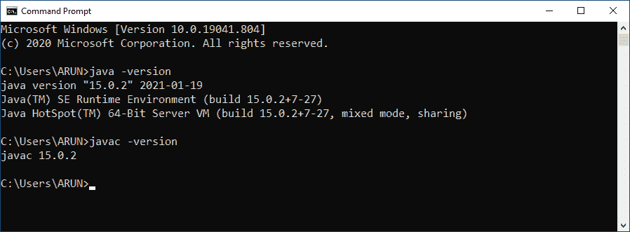
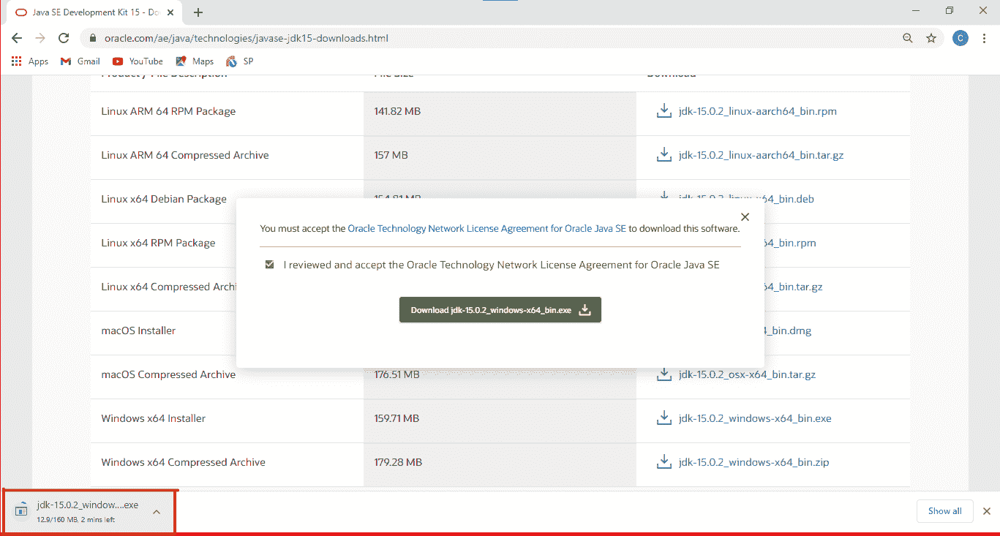
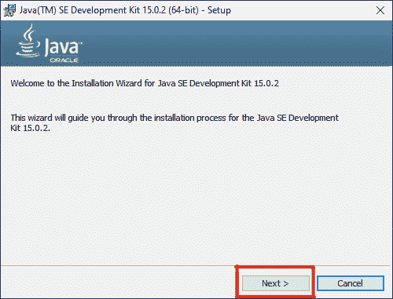
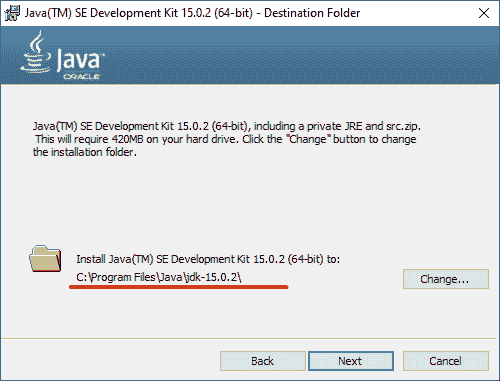
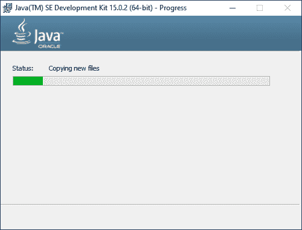
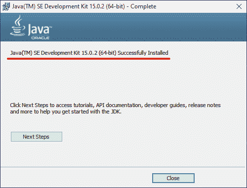
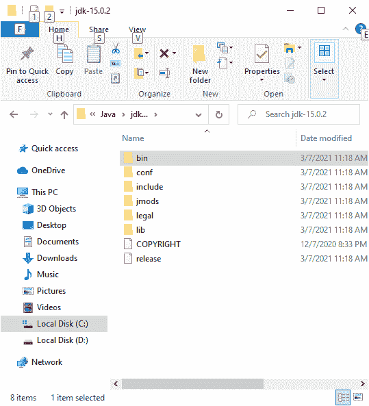
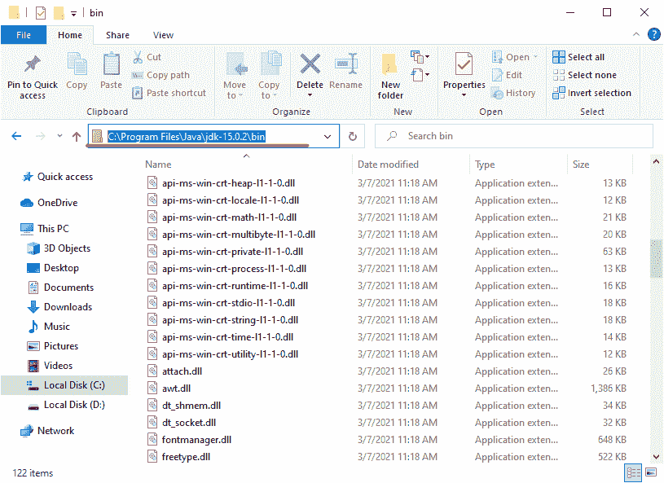
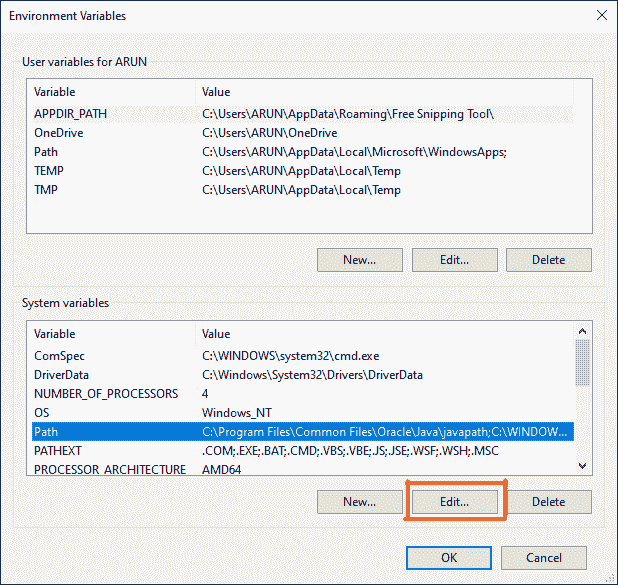

# windows 的 Java 安装和设置

> 原文：<https://learnetutorials.com/java/installation-and-setup-windows>

在本教程中，您将学习安装 JAVA JDK，并在您的 WINDOWS 系统中为其环境变量设置一个路径。

如果您是初学者，不知道如何开始使用 JAVA，本教程是您的最佳指南。首先，我们将检查 java 是否已经存在于您的系统中。如果没有，将护送您帮助解决一些徘徊在您脑海中的疑问，如如何免费下载和安装 java，我应该使用哪个版本的 java，如何在 JAVA 中设置或声明环境变量等。

## 如何检查是否安装了 JAVA

让我们从检查系统中是否存在 JAVA 开始。这可以通过简单地在你的系统中找到 java 的版本来实现，如果 java 已经存在，java 版本就会显示出来，否则就会显示一些错误信息。遵循下面的说明和相应的图片，以便于理解。

1.  如图所示，通过在搜索栏中键入“cmd”在计算机上打开命令提示符。
2.  在命令提示符下，如图所示输入“java - version”，然后按回车键。
    *   如果 java 不在您的系统中，则会出现一条消息“java 不能被识别为内部或外部命令、可操作程序或批处理文件。”将显示。
    *   如果 java 已经存在于您的系统中，那么您系统中的 java 版本将会显示，如下图所示。另外，你可以用的“javac”命令进行检查

## 如何免费下载 java？

现在我们确定系统中没有 java，所以是时候按照下面的指导方针免费下载 JAVA 了。

1.  打开您喜欢的任何浏览器。
    *   在搜索栏中键入“JDK 下载”，然后按回车键。您将看到如下所示的屏幕，其中包含来自官方 Java 网站甲骨文的链接。
2.  单击上面的链接，您将被引导至下面给出的 Java SE 下载页面。
    *   在创建本教程时，JAVA SE 15 是 JAVA 的最新版本。
    *   当您向下滚动该页面时，您还可以看到其他几个版本的 Java。
    *   要下载最新版本，请点击上面截图中红色矩形框内的 JDK 下载链接。
3.  这将带您进入 Java SE 开发工具包页面。
4.  当您向下滚动时，您将到达它显示 Java SE 开发工具包 15.0.2 的位置，这是创建本教程时可用的最新版本。在这下面，你可以找到这个 JAVA JDK 可以使用的各种操作系统。选择一个适合你的系统。
    *   对于 Windows 10 操作系统，jdk-15.0.2_windows-x64_bin.exe 文件可用，点击下载。
    *   随后，将出现如下截图所示的对话框。勾选您接受条款和条件的复选框，最后按下载按钮，将 JDK 套件下载到您的系统中。
5.  现在文件已经成功下载到你的系统

## 如何安装 java？

我们需要使用以下说明将它安装到我们的系统中。

1.  现在下载后立即打开 JDK 文件，或稍后从下载文件夹中打开。一打开就会出现一个对话框，点击是。
2.  这将带您进入如下所示的初始设置窗口，然后单击下一步。
3.  点击下一步，您将被带到另一个窗口，在那里您可以设置目标文件夹来安装 Java JDK 文件。可以选择
    1.  默认目标文件夹，然后单击下一步
    2.  要更改目标文件夹，只需单击其附近的更改按钮并更改位置，然后单击下一步。
4.  现在安装开始了，一个如下所示的窗口显示了安装的状态。
5.  安装完成后，将出现如下所示的窗口，显示 JDK 已成功安装到您的系统中。然后单击关闭。
6.  要验证安装是否成功，只需访问安装 Java 文件的位置。在我们的例子中，默认情况下，java 文件位于 C 驱动器的程序文件中，如下窗口所示。
7.  当您打开 Java Folder 时，您可以看到另一个名为 jdk.15.0.2 的文件夹，其中包含在 Java 中工作所需的所有必要文件夹和文件。
8.  打开 JDK 文件夹会显示一些与 Java 相关的文件夹，其中 bin 文件夹是最重要的一个，因为它占据了大部分与 Java 相关的可执行文件。

## 如何设置环境变量的路径？

我们已经看到，JDK 15.0.2 中的 bin 文件夹包含了所有的 java 可执行文件，为了与命令提示符或编辑器建立连接我们需要设置一个路径。路径通常是操作系统中的一个环境变量，用于指定文件系统中的一组目录。要设置路径，请使用以下说明:

1.  复制 bin 文件夹的路径
2.  通过单击屏幕左下角的窗口图标打开窗口设置。
3.  On hitting the Settings it will take you to another window where on the search bar just type “environment variables” which gives you two options 
    1.  编辑系统环境变量
    2.  编辑您帐户的环境变量。

    选择第一个选项并继续。

    
4.  窗口下方会出现。从“高级”选项卡中，选择环境变量按钮，然后单击确定。
5.  像下面这样的窗口会出现在你面前。这里
    1.  在系统变量中选择路径
    2.  然后点击编辑按钮。
6.  Now you will end up on the page shown below where you need to
    1.  粘贴复制的文件路径，然后按回车键。
    2.  然后单击确定

    现在路径设置好了。

7.  这是一个可选的设置，如果你想使用其他 java 相关工具，你可以通过点击系统变量中的新建按钮来设置一个 JAVA_HOME 路径。
8.  像下图这样的窗口会出现空白区域
    1.  您可以根据自己的意愿给出变量名，在这里，我们将其命名为 JAVA_HOME
    2.  变量值是 JDK 文件夹的路径。所以从系统中复制文件夹路径并粘贴，如图所示。
    3.  然后点击确定

这样，java 的安装和路径设置就完成了，现在您可以开始在工作中使用 JAVA 了。