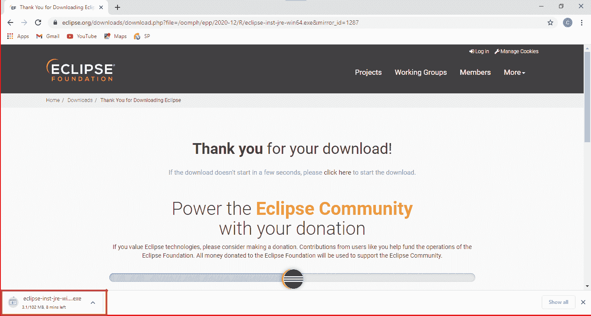
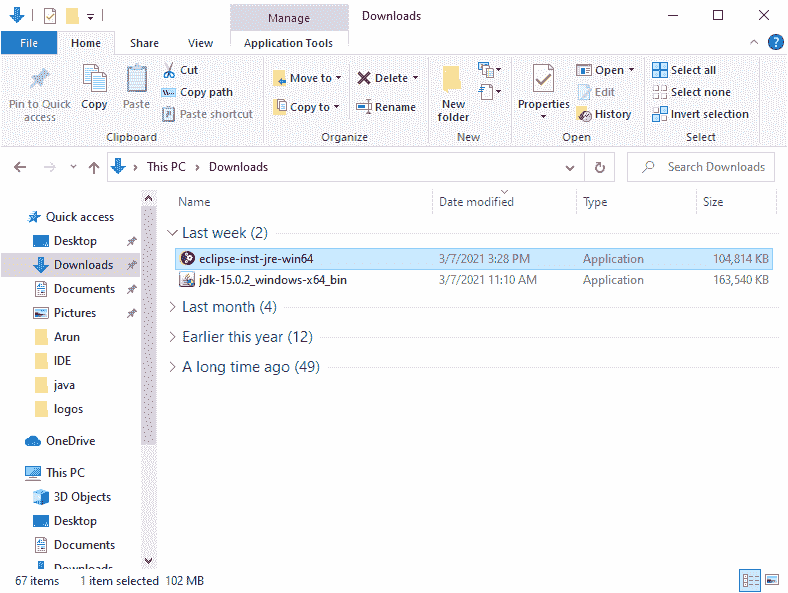
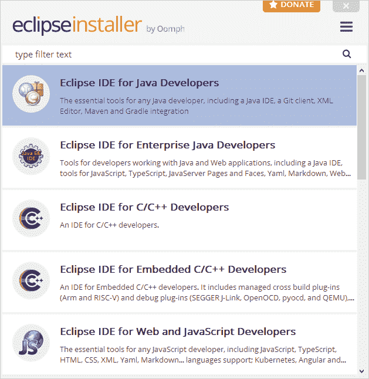
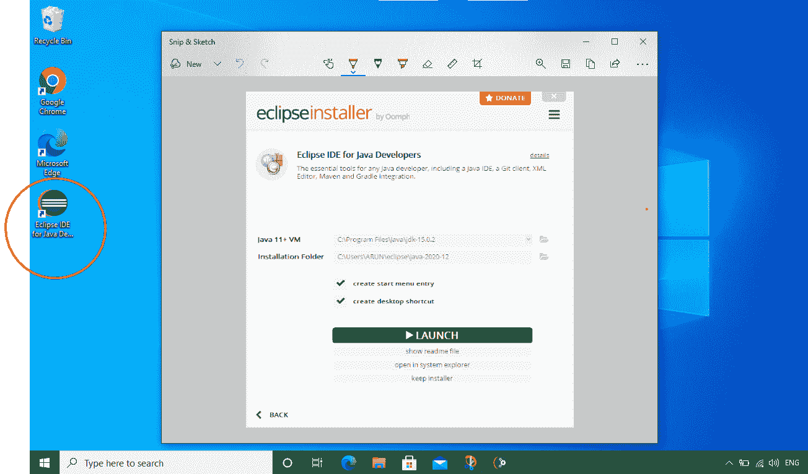
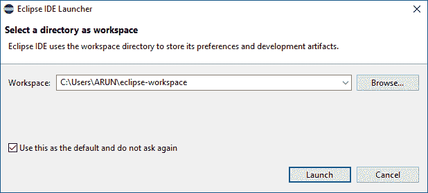

# windows 的 Java IDE 安装

> 原文：<https://learnetutorials.com/java/ide-installation-windows>

在本教程中，您将学习下载和安装 JAVA IDE，即 Eclipse。

## eclipse ide(eclipse ide)

Eclipse 确实是用于编写 java 应用程序代码的最佳集成开发环境。Eclipse 大部分是用 java 编写的，因此很容易与 Java 应用程序一起工作，但是借助于其他编程语言的一些插件应用程序，如 ADA、Erlang、Groovy、Haskell 等也可以使用 eclipse 开发。

其他一些你可以选择开发 java 应用的 IDE 有 IntelliJ IDEA、Netbeans、BlueJ、JDeveloper、jGrasp、JEdit、Kite 等。

现在让我们进入下载和安装 Eclipse IDE 的分步指南。

## 如何下载 eclipse IDE

1.  或者点击以下链接[www.eclipse.org](https://www.eclipse.org/)或者打开你最喜欢的浏览器，输入 Eclipse IDE 下载或者在搜索栏中点击回车。在那里你会得到官方网站作为建议。
2.  点击上面的链接，你将到达 eclipse 的主页，在那里你可以看到下载按钮，如下图所示。点击“下载 X86_64”按钮。
3.  再次点击“下载”按钮。
4.  现在，Eclipse 集成开发环境被下载到您的系统中。
5.  现在打开下载文件夹，您可以在其中看到 eclipse IDE 的下载。

## 如何安装 eclipse IDE

要安装 Eclipse 集成开发环境

1.  从下载文件夹打开 Eclipse IDE。
2.  打开 Eclipse IDE会出现如下画面
3.  一旦打开 eclipse，窗口下方就会出现，您可以选择第一个显示“面向 Java 开发人员的 Eclipse IDE”的插件。
4.  勾选“创建开始菜单条目”和“创建桌面快捷方式”复选框，然后点击安装按钮。
5.  Click on the “Accept Now “ button.

    现在点击“启动”按钮。

    
6.  单击启动按钮将启动 Eclipse 集成开发环境，屏幕上将出现如下窗口。
7.  在这里，您可以选择一个目录作为工作区。两个选项分别是
    1.  坚持默认目录，然后单击“启动”按钮
    2.  使用浏览按钮选择您想要的目录，然后单击“启动”按钮
8.  欢迎窗口后将出现。