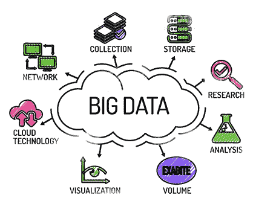
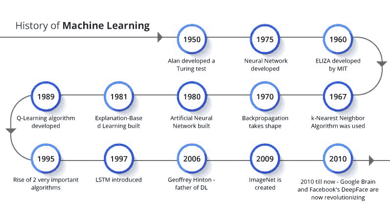
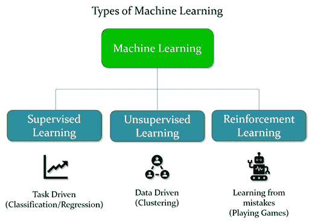

# 机器学习导论

> 原文：<https://learnetutorials.com/machine-learning/machine-learning-tutorial-for-begginers>

## 什么是数据科学？

许多公司对获取和分析更多数据感兴趣，无论是消费者行为数据、汽车摄像头数据，还是新药的生物医学数据。专门围绕数据开发问题并使用数学模型回答问题的人是**数据科学家**。

为什么**数据科学**现在这么火？如果你有数据，你可以提取这么多信息，做出更好的决定。这些决策可以让企业变得更有效率，或者对你眼睛看不到的商业趋势形成洞察。

## 什么是大数据？

**数据**是将信息编码到机器上的一种方式。无论何时制作包含不同类别、文本和数量的 Excel 电子表格，都有一个数据集。如果你有多个数据集，你把它们存储在一个叫做**数据库**的容器中。

**大数据**随着时间的推移，当我们继续在亚马逊上购物或使用 FitBit 记录心率时，会积累这些较小的数据集。这些数据集规模庞大，处理和存储大数据具有挑战性。然而，它们包含了机器学习算法可以用来解决不同问题的丰富信息。

## 机器学习导论

机器学习是世界上发展最快的技术之一，它已经在世界上大多数顶尖公司中占有一席之地。机器学习帮助计算机从数据和经验中学习，像人类一样做出自己的决定。机器学习使用各种算法和数理统计和模型从数据中学习并做出决策。

在我们的现代技术世界中，有很多使用机器学习的应用，如语音识别、语音识别、语音翻译、产品推荐、视频推荐、导航等等…

## 什么是机器学习？

到目前为止，只有人类能够从经验和数据中学习，能够根据数据和环境做出决策。我们有可以和我们的指令集一起工作的计算机。所有的指令都被硬编码到一台叫做程序的计算机上，以便正常工作。

现在，什么是计算机本身能够从数据和环境中学习，并能够就数据做出决策。另外，如果一个计算机系统可以根据数据自行改进呢；我们已经使用机器学习实现了它。

机器学习属于人工智能 AI。能够从提供的数据中分析和学习，并根据数据做出决策或答案的机器。

阿瑟·塞缪尔在 1959 年给出了机器语言这个术语。

通过使用来自被称为训练数据的巨大数据集的样本数据，机器学习算法能够构建模型，帮助提供决策，而无需对其编程。机器学习算法可以从数据中学习，它们可以自我改进，使其更加准确和高效。

## 机器学习的历史

机器学习的历史始于 1943 年，当时沃尔特·皮茨和沃伦·麦卡洛克提出了一本关于神经网络的书。1949 年，唐纳德·赫布出版了一本名为《行为的组织》的书，其中包括神经网络的关系，这是机器学习史上的第二个里程碑。阿瑟·塞缪尔在 1959 年首次提出了机器学习的概念。每年晚些时候，机器学习领域都有发展，直到现在。现在自动机器学习的概念正在进步。

## 机器学习和普通编程有什么区别？

在编程中，我们需要一个程序员，他能够编写被称为程序的指令，该程序具有执行与正在开发的软件相关的任务的逻辑。完美需要这么多专家。

机器根据指令检查和分析数据，以提供输出。数据中的任何微小变化都会使机器出现故障，或者它需要程序员对指令进行更改，这需要大量的时间和精力。

在机器学习的情况下，程序员的工作是由机器自己完成的。我们向机器提供输入数据和输出，机器分析和学习输入和输出之间的关系，以便发出指令。在机器学习中，程序员不需要对输入数据进行任何更改，因为机器会根据输入和输出数据发出指令。

## 机器学习的需求是什么？

数据是我们现代技术世界中最有价值和最主要的问题。海量数据及其分类和学习对于传统编程来说是非常困难的任务。机器学习的重要性来了，我们可以使用机器学习算法和模型自动从数据中学习，而不需要太多的努力和时间。

我们可以训练机器学习算法来建立模型，并在模型的帮助下，我们可以预测所需的输出。它还可以使用数据来改进它们。在接下来的教程中，我们可以了解更多这方面的需求。

## 机器学习是如何工作的？

在人工智能的情况下，机器学习是所有学习和决策发生的大脑。

就人类而言，我们从经验中学习，有了更多的经验，我们可以做出更准确的决定。如果我们面对一个新的情况，我们不能百分之百确定我们的决定会像已知的情况一样准确，会发生什么。

同样的逻辑也适用于机器，我们必须让机器从数据中学习以获得准确的输出。机器学习算法从数据中学习，并建立一个即使对于新数据也能预测输出的模型。

机器学习的准确性取决于数据量和数据质量以及我们为数据选择的算法。我们可以稍后了解细节。

当 Ml 遇到复杂的问题时，它会从所有来源收集数据，并对数据进行一些预处理，使其没有错误。然后我们制作一个名为训练数据的样本数据，输入到 ML 算法中。

该算法接受训练数据建立模型，能够预测输出。模型做好之后，我们要用新的数据来检验模型，以检验模型能否准确预测输出。

使用机器学习，我们不需要为新数据制定一套新的指令。

## 机器学习的特点

1.  它使用数据来学习和识别模式
2.  它可以从数据学习中提升自己
3.  它可以为人工智能做出数据驱动的决策
4.  如果数据量很大，机器学习和数据挖掘就很相似

## 机器学习的类型

根据我们提供的数据质量和我们期望从模型中得到的输出，机器学习方法可以分为三种类型，

1.  监督学习
2.  无监督学习
3.  强化学习
4.  半监督学习

此外，它们被分为许多类别，我们可以在接下来的教程中深入学习。

## 机器学习的编程语言

几种编程语言将允许您使用机器学习库，这样您就不必编写自己的算法。我们将简要描述用于机器学习的 3 种常见语言。

### 计算机编程语言

**Python** 是一种开源的通用编程语言，是当今数据科学社区的首选语言。这是因为:

1.  学习起来相对容易
2.  您可以执行许多与数据相关的任务
3.  它是开源的
4.  它有一个成熟的数据科学社区
5.  有许多用 Python 开发的库

### 稀有

不应该低估 **R** 编程语言。统计学家在翻译成另一种语言之前，首先用 R 语言开发尖端的统计和机器学习算法。
虽然 R 中的语法与 Python 相比有点笨拙，但它仍然有许多相同的好处。如果你想在你的项目中使用最新的机器学习算法，使用 r。

### 结构化查询语言

结构化查询语言是一种从数据库中操作和提取数据的语言。但是你可以直接或者通过 Python/R 脚本使用 SQL 运行机器学习算法。
这是在行业中实现机器学习的常见方式，也是开发数据科学工具箱时需要了解的重要语言。

## 如何找到机器学习项目

以下是一些受众包数据科学家欢迎的关于现实问题的网站:

1.  GitHub 包含许多需要开发人员的开源项目。
2.  Kaggle 是一个竞赛网站，允许你作为个人或团队的一部分来开发真实世界的解决方案。
3.  像 Upwork 或 Fiverr 这样的自由网站会让你看到真正的企业正在苦苦挣扎的工作。

## 摘要

*   数据科学使用数据和数学模型来优化行为和做出决策。
*   机器学习是一种技术，它使用数据来学习模式，并在给定新数据的情况下做出预测
*   机器学习可以应用于许多现实世界的问题。
*   许多编程语言将允许您快速使用机器学习。