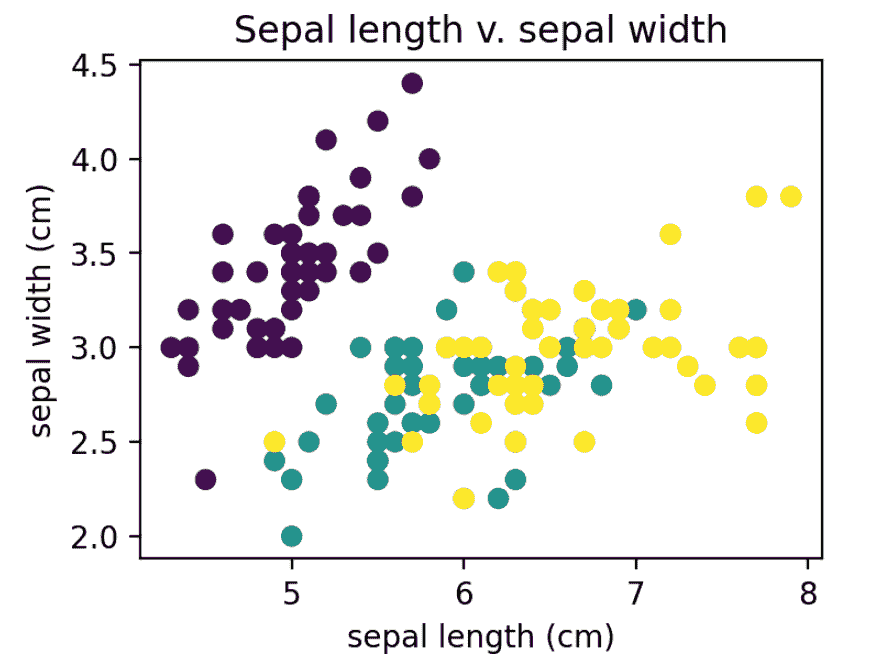
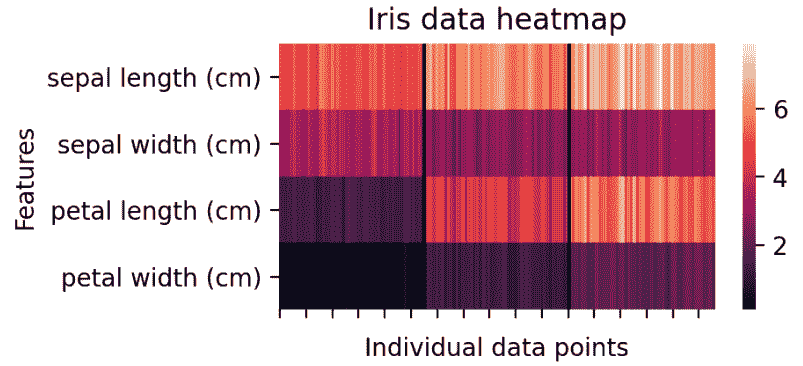

# 数据可视化和探索性数据分析

> 原文：<https://learnetutorials.com/machine-learning/data-visualization-and-exploratory-data-analysis>

## 什么是数据可视化？

数据可视化是创建数据可视化表示的过程。其核心是**数据可视化**允许我们可视化数据和交流见解。这是数据科学的一个关键部分，为了清楚地理解数据，我们使用图形、图表和其他图形表示来表示数据，在数字的情况下，我们使用点或条或线。

众所周知，图形表示非常容易理解数据，并且有助于发现数据中的错误，如大纲等。使用图形或其他图片表示，我们可以表示大量的数据，并且很容易理解。它允许关键人员做出数据驱动的决策。

## 什么是探索性数据分析？

数据专家使用探索性数据分析来分析和了解数据集的细节以及它们之间的关系和特征。

在机器学习工作流的数据分析阶段，数据科学家从我们试图理解和理解数据开始。这个过程叫做**探索性数据分析(EDA)** 。

## 为什么是探索性数据分析？

EDA 对于理解数据的底层结构至关重要。这有助于理解数据集变量之间的关系。探索性数据分析是数据科学家广泛使用的方法。借助 EDA，我们可以比传统方法更好地理解数据。在 EDA 过程中，我们使用图形来检查数据:

1.  查找数据中的错误
2.  有助于找到数据集中的隐藏模式
3.  检测数据集中的异常值
4.  检测数据中的异常事件
5.  生成要测试的假设

在 EDA 期间，我们还可以检查我们对数据所做的基本假设。通过可视化数据分布，我们可以看到什么样的统计技术和机器学习模型适合给定的分析。

## 常用地块

有不同的图表用于可视化数据，我们需要了解其中一些，以便进一步了解，包括

1.  散点图
2.  条形图
3.  直方图
4.  热图
5.  箱线图

### 散点图

**散点图**使用沿水平轴(x 轴)和垂直轴(y 轴)映射的点来显示两个变量之间的关系。每个点代表与每个要素相关联的单个数据点。如果点趋势以一定的顺序出现，数据之间就有某种联系。如果散点图完全分散，那么我们可以预期数据变量之间没有关系。

我们将可视化鸢尾数据集，这是一个经典的数据集，包含三种鸢尾花的萼片和花瓣的长度和宽度的测量值。

### 将虹膜数据集可视化为散点图

```

 from sklearn.datasets import load_iris
import matplotlib.pyplot as plt
import numpy as np
import pandas as pd

# Load Iris dataset
iris = load_iris() 

```

为了简化数据可视化方法，我们将创建一个熊猫数据框架。

```

 # Load the feature data and the label-encoded target variable.
df = pd.DataFrame(data= np.c_[iris['data'], iris['target']],
                 columns= iris['feature_names'] + ['target'])

# Concatenate the Iris species names.
df['species'] = pd.Categorical.from_codes(iris.target, iris.target_names)
print(df.head(10)) 

```

```

 sepal length (cm)  sepal width (cm)  ...  target  species
0                5.1               3.5  ...     0.0   setosa
1                4.9               3.0  ...     0.0   setosa
2                4.7               3.2  ...     0.0   setosa
3                4.6               3.1  ...     0.0   setosa
4                5.0               3.6  ...     0.0   setosa
5                5.4               3.9  ...     0.0   setosa
6                4.6               3.4  ...     0.0   setosa
7                5.0               3.4  ...     0.0   setosa
8                4.4               2.9  ...     0.0   setosa
9                4.9               3.1  ...     0.0   setosa

[10 rows x 6 columns] 
```

现在我们将获取 seoal 长度和 sepal 宽度数据，并绘制两者之间的关系。

```

 # Grab data
features = df[iris.feature_names]

# Make scatterplot and labels
plt.figure(figsize=(4, 3), dpi=200)
plt.scatter(x=features[iris.feature_names[0]],  # Sepal length
            y=features[iris.feature_names[1]],  # Sepal width      
            c=iris.target,                      # Iris species type
            cmap='viridis')                     # Color for each Iris species
plt.title("Sepal length v. sepal width")
plt.xlabel(iris.feature_names[0])
plt.ylabel(iris.feature_names[1]) 

```



图示为萼片长度和萼片宽度之间的关系。每个点的颜色对应不同种类的鸢尾。从散点图中，我们可以得出:
【萼片长、宽呈正相关，
对应紫色的物种与其他物种的分离度很高，可能表明它是唯一的。

散点图比 3 个特征更难解释，限制了它们在小的和低维数据集上的使用。

### Barplots

**条形图**显示**分类**数据和**数字**数据之间的关系，这些数据与每个类别相关联。数字数据可以表示从计数到基本度量(例如，平均值、中值、模式)的任何东西。

### Iris 数据分布柱状图:iris_barplot.py

```

from sklearn.datasets import load_iris
import matplotlib.pyplot as plt
import seaborn as sns
import numpy as np
import pandas as pd

# Load Iris dataset
iris = load_iris()

# Grab data
features = df[iris.feature_names]

# Make barplots by Iris species
plt.figure(figsize=(3, 2), dpi=200)
sns.countplot('species', data=df)

# Plot attributes
plt.title("Iris species counts")
plt.xlabel("Iris species")
plt.ylabel("Frequency") 

```


条形图显示数据集非常平衡。数据集中有相同的鸢尾属物种。这在分类问题中很重要——数据集越不平衡，预测其他类就越困难。

### 直方图

**直方图**类似于条形图，但它用于检查频率而不是趋势。直方图揭示了连续数据的底层数据分布。一个轴显示数据值，而另一个轴显示给定间隔内数据点的频率或**箱**。

### histogram_iris.py

```

from sklearn.datasets import load_iris
import matplotlib.pyplot as plt
import numpy as np
import pandas as pd

# Load Iris dataset
iris = load_iris()

# Load the feature data and the label-encoded target variable.
df = pd.DataFrame(data= np.c_[iris['data'], iris['target']],
                 columns= iris['feature_names'] + ['target'])

# Concatenate the Iris species names.
df['species'] = pd.Categorical.from_codes(iris.target, iris.target_names)
print(df.head(10))

# Grab data
features = df[iris.feature_names]

# Make histogram and by features
features.hist(figsize=(10, 10)) 

```


这些直方图表明，每个特征都有不同的分布。数据中的这种差异允许机器学习模型对数据进行分类。

### 热图

**热图**基本上是一个用颜色编码的矩阵。这意味着矩阵的每个单元格都是绿色到红色的，这取决于变量的值或风险。众所周知，绿色是一种健康的细胞，当它走向红色时，风险就会增加。这比数字更容易理解。

热图帮助我们可视化可能具有多个特征的多元数据集。它们创建了任意两对特征和/或观察之间关系的可视化地图。这些值可以是原始数据点或一些聚合指标。

### iris_heatmap.py

```

from sklearn.datasets import load_iris
import matplotlib.pyplot as plt
import seaborn as sns
import numpy as np
import pandas as pd

# Load Iris dataset
iris = load_iris()

# Load the feature data and the label-encoded target variable.
df = pd.DataFrame(data= np.c_[iris['data'], iris['target']],
                 columns= iris['feature_names'] + ['target'])

# Concatenate the Iris species names.
df['species'] = pd.Categorical.from_codes(iris.target, iris.target_names)
print(df.head(10))

# Make Heatmap
plt.figure(figsize=(4, 2), dpi=200)
ax = sns.heatmap(data=features.T)

# Heatmap attributes
ax.set(xticklabels=[]) 
plt.axvline(x=50, c='black')
plt.axvline(x=100, c='black')
plt.title("Iris data heatmap")
plt.xlabel("Individual data points")
plt.ylabel("Features") 

```



这张热图显示了原始数据值。黑线强调了三种不同鸢尾物种和个体特征值之间的区别。

### 拳击比赛

**箱线图**是可视化数据和一些与数据相关的有用汇总统计数据的简洁方法。

### iris bock plot:iris _ bock plot . py

```

from sklearn.datasets import load_iris
import matplotlib.pyplot as plt
import seaborn as sns
import numpy as np
import pandas as pd

# Load Iris dataset
iris = load_iris()

# Load the feature data and the label-encoded target variable.
df = pd.DataFrame(data= np.c_[iris['data'], iris['target']],
                 columns= iris['feature_names'] + ['target'])

# Concatenate the Iris species names.
df['species'] = pd.Categorical.from_codes(iris.target, iris.target_names)
print(df.head(10))

# Make boxplot
plt.figure(figsize=(7.5, 5))
plt.boxplot(x=features.T, labels=iris.feature_names)

# Plot Attributes
plt.xlabel("Features")
plt.ylabel("Measurements (cm)")
plt.title("Iris data distribution") 

```


橙色线代表中间值。整个方框显示了上四分位数和下四分位数内可接受值的分布，基本上是 50%的数据。胡须代表数据的顶部和底部 25%，不包括胡须顶部和底部的点。胡须可以定义为从方框中到达最大值和最小值的垂直线

萼片宽度中的一些数据点被归类为四分位数之外的异常值。这表明萼片宽度包含一些噪声数据。有趣的是，与其他特征相比，花瓣长度具有高度变化的值分布。这表明分离 Iris 类可能不是一个有用的特性。

## 摘要

数据可视化是数据的图形化表示，探索性数据分析被数据科学家用来借助数据可视化分析和学习数据之间的关系。
我们使用不同的方法以图形方式可视化数据，包括散点图、条形图、直方图、热图和箱线图。所有的方法都表示数据变量以及它们之间的一些关系、风险、频率或统计数据。