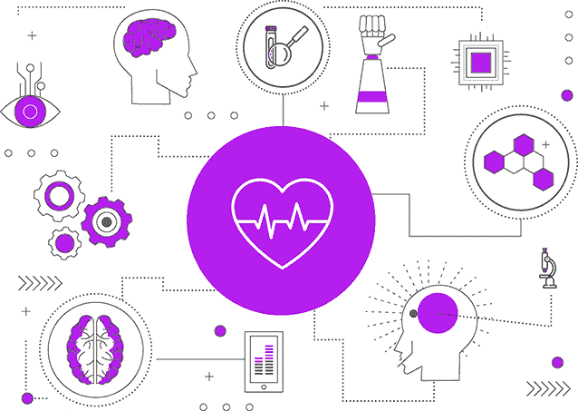
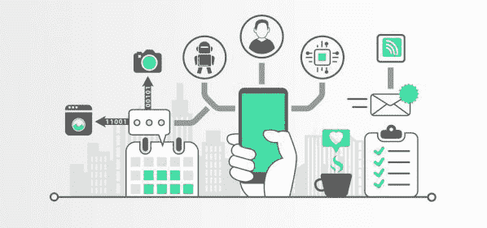
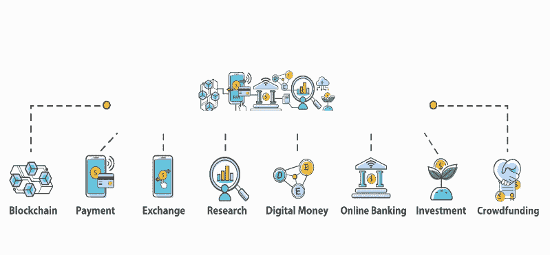

# 2021 年机器学习趋势

> 原文：<https://learnetutorials.com/machine-learning/trends-in-machine-learning>

机器学习是当今世界最具创新性的技术之一。在我们这个时代，数据量确实是巨大的，并且很难对数据进行排序、分类或找到数据内部的某种关系，机器学习可以很容易地完成这项任务。

像谷歌和网飞这样的全球最大公司，以及几乎所有使用机器学习来维护数据的电子商务公司。市场研究预测，机器学习在未来几年将呈上升趋势。人工智能也使用机器学习和数据科学来做出自我决定。

数据科学和机器学习技术正在推动几个行业的创新和决策。我们将讨论一些令人兴奋的应用以及在几个行业中使用机器学习和人工智能的应用趋势。

## 网络安全

**网络安全**是指通过硬件、软件和通过互联网传输的数据来应对威胁的方法。网络安全影响着当今现代经济的方方面面。数据泄露和黑客攻击大公司获取用户数据会造成不可挽回的损失。预计 2021 年全年这一数字将会增加。

机器学习可以根据过去的经验检测模式并推断新的行为。然而，在这种情况下，**欺诈和异常检测算法**旨在检测个人的不规则行为，将其标记为潜在的违规和威胁。

随着连接到互联网的产品被融入日常生活，能够自动检测危险活动并向用户发出警报的进一步发展将会很有帮助。

## 自动机器语言

我们正在进行机器语言的自动化，对于初学者和没有经验的工程师来说，轻松使用机器语言将是一项巨大的成就。这一发展也将有助于数据科学家用更少的努力使机器学习模型更加准确和有效。

使用像自动机器学习这样的工具，我们可以在没有太多机器学习算法经验的情况下，建立更精确、更高效的机器学习模型。有了自动化机器语言，我们可以在不知道机器学习的复杂性的情况下做出更多的改变。

## 医疗保健和生物技术

人工智能将继续推进医疗保健和生物技术应用。机器学习算法分析的生物医学数据集比手动分析的要多。已经开发了几种模型，它们在诊断病人时可以在人的水平上运行或比人更好。

此外，随着从人类样本中获得更多数据，可以作为各种疾病指标的生物标志物将有助于推进**精准医学**。这些算法将使医生能够更好地将患者分成更有效的特定治疗组。

## 物联网

**物联网**是指各种传感器和软件被整合到日常物品中，并通过互联网在设备和服务器之间交换数据。

在**自然语言处理**领域的创新，我们尝试教计算机如何理解语言，随着亚马逊的 Alexa 和苹果的 Siri 不断改进，在理解更多语言和口音方面也越来越好。

随着消费者不断采用智能技术，机器学习对于从用户那里获取数据并将其转化为更高质量的服务、产品，当然还有销售变得更加重要。

Alexa 会知道你什么时候需要更多的牙膏，甚至在你需要之前。你的 FitBit 可能最终能够在你出现症状之前预测到紧急的健康状况。随着更多数据的获取和建模，这些设备将对社会产生重大影响。

## 金融科技

**金融科技**，又名**金融科技**，是改善和自动化金融服务交付的技术和创新。

机器学习和数据分析正被用于个性化和目标用户体验，无论是在以在线商店和电子商务商店为中心的传统商店。客户数据用于改善客户体验、预测客户需求和建议个性化产品。

公司使用数据分析来改善运营、优化收入和预测需求以提高利润。

## 人工智能与伦理

2021 年，机器学习和人工智能有几个危险和误用引起了人们的关注。

自动化是一把双刃剑。算法容易受到偏见的影响，可能会做出错误的决定，比如衡量金融产品的风险，雇佣特定的人而不是其他人。这可能会伤害特定少数群体的个人。

此外，人工智能已经被用来操纵和欺骗人类。深度假货是合成生成的图像/视频，损害了人们对媒体的信任，使人们难以辨别什么是真的。

## 摘要

当我们看到机器学习在生物技术、电子商务、商业，甚至天气预报领域的应用，帮助人们了解灾难时，基于机器学习和数据科学有很多适用性和应用。

但是每一种技术或武器都有两面性一面是对人类有益的，另一面是对我们自己非常不利的。同样，我们看到机器学习技术可以更完美地用来欺骗人类。