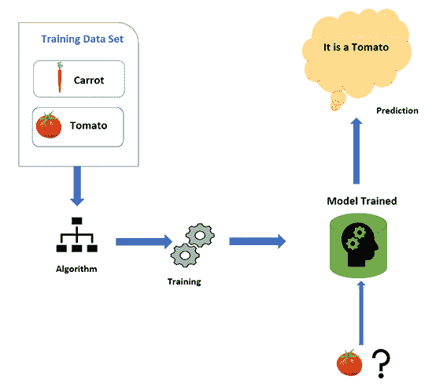
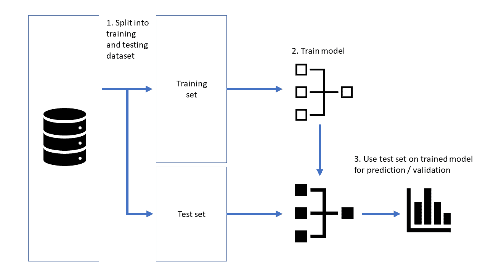

# 监督学习导论

> 原文：<https://learnetutorials.com/machine-learning/supervised-learning>

## 什么是监督机器学习？

当你看到监督学习这个术语时，你会怎么想；同样的逻辑也适用于这里。在监督学习中，机器学习时会有一个监督人。

监督学习意味着我们必须提供一个称为训练数据的样本数据来训练机器。该列车数据包含正确答案。训练机器后，我们提供需要测试的新数据。机器将使用我们之前提供的训练数据检查新数据，并预测输出。

为了更好地理解，考虑一个例子，我们有一篮子蔬菜，需要分类。

首先，我们从篮子里取出蔬菜样本。

假设我们拿一根胡萝卜，我们把胡萝卜的特性喂给机器般长的，向前逐渐变细，颜色为橙色。

接下来，我们拿一个西红柿，然后把它喂给机器——它的颜色是红色的，果肉是圆形的。

然后，我们将蔬菜提供给机器，机器在我们提供给机器的细节的帮助下正确识别胡萝卜和番茄。

我们首先提供给机器的细节叫做训练数据，这个过程叫做训练机器。然后我们给出的输入数据称为测试数据，机器在**监督学习**的基础上给出预测。

在监督学习中，我们提供输入和输出，机器的目标是找到一些映射关系来映射输入变量和输出。

在我们的世界中，监督学习被用于各种领域，如欺诈检测、电子邮件过滤、图像分类等。

## 监督学习是如何工作的

正如我们所知，监督学习涉及模型的训练，使用一些称为训练数据的样本数据。在本培训中，模型将了解数据集中的数据，并且它们可以分析和预测我们将提供的新数据的输出。

假设我们有一些不同形状和颜色的物体。

首先，我们必须从称为训练数据的数据集中获取样本数据来训练模型。在我们的例子中，我们将圆形、矩形和五边形的物体提取到训练数据中

然后我们为数据训练模型如下

1.  如果物体是红色的圆形，那么我们就把它归类为红球
2.  如果对象是一个矩形(四边)的形状和绿色，我们将其分类为绿色块
3.  如果物体是五边形(五边形)并且颜色为白色，我们将其归类为白色五边形

现在，使用训练数据训练模型，然后我们向模型提供新数据(新对象)，以便模型可以根据训练数据(颜色和边数)轻松地对它们进行分类，并预测输出。

## 监督学习的步骤

1.  接受要分析的数据集
2.  收集称为列车数据的样本数据
3.  将训练数据集拆分为训练数据集、验证集和测试集。
4.  检查训练数据集的特征，以便它可以预测所有数据集的输出。
5.  根据输出数据和输入数据为模型选择合适的机器学习算法。
6.  将训练数据应用于算法以训练模型，并使用验证集对其进行检查。
7.  在提供新数据检查效率之前，使用测试集检查模型

## 监督学习的优势

*   模型用可靠的经验来预测产量，因此更加准确。
*   我们对数据集和对象有了更多的了解
*   借助培训模型帮助提高绩效
*   帮助解决计算中的复杂问题。

## 监督学习的缺点

*   在解决复杂的任务时，它不可能非常可靠。
*   使用样本数据训练模型需要大量时间
*   如果我们提供任何不在训练数据中的数据，它会给出一个错误。
*   我们需要大量关于数据集和其中的类的知识。
*   对大量数据进行分类非常困难。

## 监督机器学习算法的类型

监督机器学习算法可以进一步分为两种，这取决于我们必须用算法完成的任务。这些是

1.  回归
2.  分类

### 回归

回归算法用于天气预报、股票预测等，因为回归算法需要输入和输出变量之间的关系。在回归中，输出必须是实值，并且它仅使用训练数据预测单个输出。
比如要预测一只股票的价值，输入的会是公司数据、业绩等很多因素。但是输出的将是一些真实的单值股票数量。
回归下工作的算法有很多。其中一些是，

1.  线性回归
2.  逻辑回归
3.  回归树
4.  非线性回归
5.  贝叶斯线性回归
6.  多项式回归

### 分类

顾名思义，该算法用于将给定的数据集分类或归类到不同的类中。这意味着当输出中包含一些分类数据时，将使用它。
如果数据只分为两类，比如分男女、真假、动物或鸟类那就叫二元分类。
如果它被分成两个以上的类，那么它就是多类。例如，我们必须把水果分成不同的类别。有许多算法在分类下工作，它们是

1.  天真的贝叶斯分类器
2.  随机森林
3.  决策树
4.  支持向量机