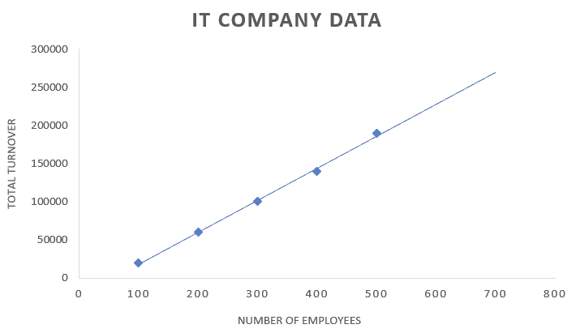
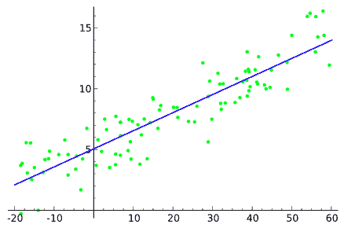
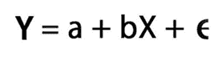
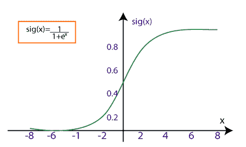
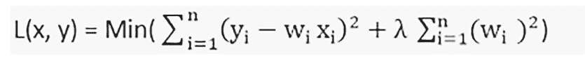

# 机器学习中的回归分析

> 原文：<https://learnetutorials.com/machine-learning/regression-analysis>

回归分析是一种简单的方法，显示我们可以称之为目标的单个预测值和多个预测值之间的某种关系。
这里，目标变量依赖于输入预测值，但输入值是独立的。如果目标值是一个连续值，比如工资、年龄或体重，我们可以使用回归分析。此外，我们在

*   股票预测
*   天气预报
*   房价预测

为了更好地理解，让我们简化回归分析，因为它将向我们展示目标值是如何变化的，该目标值依赖于输入值，其中任何一个输入值的变化与其他输入值相同。
我们来考虑一个 IT 公司连续五年关于员工数量和公司总营业额的数据的例子。

| 雇员人数 | 总营业额 |
| One hundred | $20000 |
| Two hundred | $60000 |
| Three hundred | $100000 |
| four hundred | $140000 |
| Five hundred | $190000 |
| Seven hundred | ？ |

上表包含员工人数和公司营业额的数据。作为一家信息技术公司，员工是资源，资源数量的增加会增加公司的营业额。

现在公司正在计划增加员工，他们想知道当年的总营业额。在这种情况下，我们可以依靠回归分析进行最佳预测。

在这里，回归将分析输入变量(在我们的例子中是雇员的数量)，并在变量之间建立关系，它根据这些输入变量预测连续和真实的输出。

我们使用图来显示使用输入和输出变量作为数据点的回归。回归将是一条直线或一条简单的曲线，它通过这个输入输出变量图中的数据点，与数据点的距离最小。回归线和数据点之间的距离可以告诉我们模型得到了输入和输出变量之间的关系。

## 回归分析的意义是什么？

当我们理解回归分析时，我们心中都有一个问题，为什么我们需要回归分析？在这个现代世界中，我们可以看到许多需要精确连续预测的实际应用依赖于输入变量，并且能够预测输入变量的变化如何影响输出预测。
让我们以股市为例我们可以轻松识别股票走势，这有助于投资。考虑一家公司，它可以使用回归分析来预测未来的市场销售与以前的数据和变化。像天气预报、经济预报和许多应用程序都使用回归分析。

### 利益

1.  它可以用独立的输入变量预测更精确的结果。
2.  我们能够理解对预测做出改变的强输入因素，像强和弱因素。
3.  发现市场趋势。

## 回归分析中使用的常用术语

1.  **目标或输出**:目标变量是回归分析的输出或预测变量。它取决于输入变量。
2.  **输入或预测器**:顾名思义就是输入，我们要提供给回归分析进行预测。预测变量可以是一个或多个，它们是独立变量。
3.  **大纲视图**:大纲视图是不准确的输入数据。顾名思义，大纲可能是非常错误的数据，可能会产生错误的预测。我们必须避免回归分析中的异常值。
4.  **欠拟合**:我们知道我们用训练数据来训练算法。如果算法甚至对列车数据也不能正常工作，我们称之为欠拟合。
5.  **过拟合**:这是一种我们的算法对列车数据正常工作，但对测试数据产生错误输出的情况。我们称这种情况为过度拟合。
6.  **共线性**:我们知道我们的输入或者预测变量是独立的。在某些情况下，输入变量之间会有某种关系，我们称之为共线。

## 回归的类型

我们在机器学习中使用的回归有各种类型，它们有不同的特征和重要性。我们必须根据数据和我们的需求选择一个，它们是

1.  线性回归
2.  逻辑回归
3.  多项式回归
4.  决策树回归
5.  随机森林回归
6.  里脊回归
7.  套索回归
8.  支持向量回归

### 线性回归

线性回归是机器学习中回归的基本类型。它使用统计方法进行预测。线性回归包含一个输入变量，我们将其表示为线性回归图的 X 轴，以及一个目标变量，我们将其表示为 Y 轴。线性回归在回归图上画一条线。

在线性回归中，如果存在一个以上的自变量，那么我们称之为多元线性回归。

线性回归由下式表示

*   y 是目标变量
*   **b** 是直线的斜率
*   **一**是截距
*   **e** 为误差

**线性回归的适用性为**

1.  房价预测
2.  薪资预测
3.  交通预测
4.  销售预测等。

### 逻辑回归

逻辑回归是另一种基于概率概念的回归分析方法，我们在需要解决分类问题时使用它。这意味着逻辑回归的输出变量将是二进制值“0”或“1”。

逻辑回归适用于需要分类的问题，如真或假、是或否、垃圾邮件或非垃圾邮件等。

在逻辑回归中，我们使用 sigmoid 曲线来表示输入(独立)和输出(目标)变量之间的关系。我们将物流回归表示为

哪里，

*   **f(x)** 是输出变量
*   **x** 为输入变量
*   **e** 为基数

最后，我们必须提供产生成形曲线图形的输入变量。

我们可以把逻辑回归分成三种类型，

*   **二进制**
*   **多类**喜欢水果类
*   **序数**像低中高

### 多项式回归

多项式回归非常类似于多元线性回归，但有一些修改。在多项式图中，输入和输出变量之间的关系将由 n 次表示，这意味着多项式回归由 X 轴和 Y 轴之间的非线性曲线表示。

考虑一个数据集，其中一些数据点以非线性方式绘制在图表中，在这种情况下，线性回归方法将无法正常工作。我们需要一条非线性曲线来连接所有的数据点，这叫做多项式回归。

在多项式回归中，实特征被转换成某种程度的多项式特征，我们称之为 n 次，并用多项式线拟合。

我们将多项式方程表示为

*   **Y** 是我们期望的输出
*   **θ0****θ1**，均为系数
*   **x** 是输入变量

### 决策树回归

决策树回归是一种树形结构，可用于分类和回归类型。我们知道，决策树结构有内部的节点、分支和叶子，它们都用于解决类别和数量数据的问题。

**决策树结构**

1.  节点表示属性的测试
2.  分支代表测试后的结果
3.  Leaf 表示输出或预测值。
4.  根代表父数据集

众所周知，它就像一个树形结构，从根数据集开始，分成代表父数据集子集的左右子节点。它再次分裂成他们的孩子，使他们成为父母。下面根据清晰的理解绘制了决策树。

### 随机森林回归

这是一种更复杂的回归方法，它结合了多个决策树回归。随机森林回归是一种非常强大的算法，可以用于分类和回归作业。

随机森林回归通过结合决策树和每个树结果的平均值来预测输出。随机森林回归中使用的决策树称为基本模型。随机决策树可以由以下公式表示

也就是 g(x)= f0(x)+ f1(x)+ f2(x)+....

随机森林回归有助于防止模型中的过拟合问题。

### 里脊回归

岭回归是一种灵活而强大的回归分析，当输入变量之间存在高度相关性时使用。如果共线性很高，我们将在岭回归方法中加入一些偏差。我们在偏差中加入的量称为岭回归中的惩罚。岭回归对过拟合问题不太敏感。

我们可以用下面的公式来表示岭回归

Ridge 将有助于解决具有大量参数并且它们之间具有高度相关性的问题。岭也被用来降低我们称之为 L2 正则化的模型的复杂性。

### 套索回归

像岭回归一样，拉索回归也通过增加一些惩罚来降低模型的复杂性。唯一的区别是我们在 Lasso 中把实际的金额加到一个罚金上，就像在 ridge 中我们使用金额的平方一样。

套索回归可以收缩到绝对零值。套索回归也称为 L1 正则化，由

### 支持向量回归

支持向量回归可以用于回归和分类算法。如果我们将其用于回归，我们称之为支持向量回归。支持向量使用连续的输入变量。

在支持向量回归中，我们试图找到一条线，它将到达几乎所有的数据点，并预测连续变量，称为具有最大余量的超平面。

支持向量回归的目的是用覆盖最大数量数据点的超平面建立边界线。

在该图中，绿线代表超平面，虚线代表相对于超平面的边界线。红点是数据点。