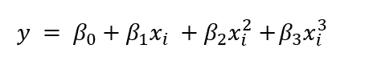
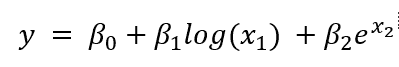
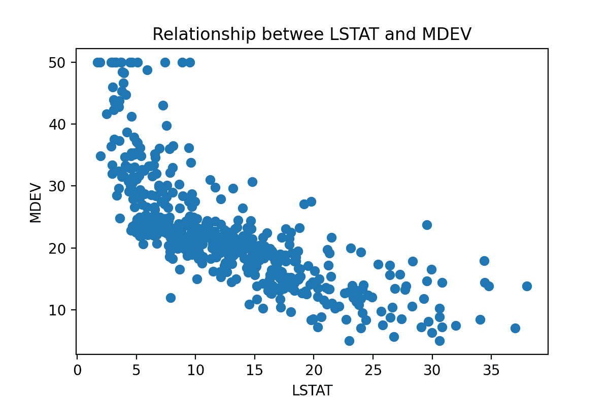
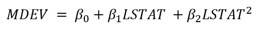
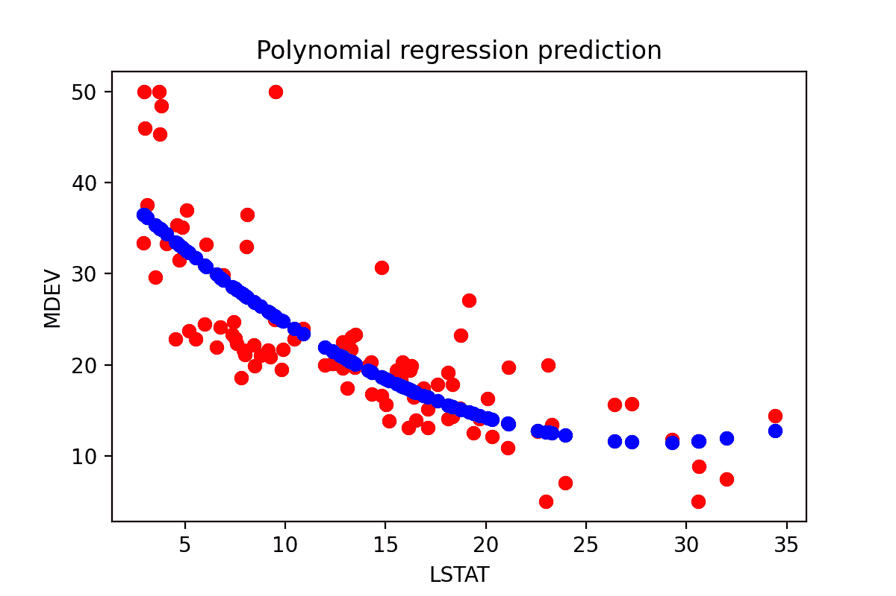

# 多项式回归

> 原文：<https://learnetutorials.com/machine-learning/polynomial-regression>

在前一节中，我们回顾了几种扩展线性模型的使用以减少过度拟合的方法。然而，如果数据和输出之间的关系确实是非线性的，我们需要采用更复杂的模型。

在多项式回归中，我们可以借助于第 n<sup>次变量在自变量和预测输出之间建立关系，这有助于显示比线性回归更复杂的关系。</sup>

多项式回归方程如下



我们可以说多项式回归是线性回归的一个特例，因为我们是在多元线性回归上加一个 n <sup>次</sup>次多项式来做多项式回归。简单地说，我们可以说多项式回归是一种线性回归，为了提高精度而做了一些修改。

多项式回归使用线性回归图，在包含复杂的非线性函数时做了一些修改。在这种情况下，我们使用的数据集不是线性的。

多项式回归的重要性

正如我们所知，第一点是我们不能对非线性数据集进行线性回归。如果我们这样做，它将会产生巨大的误差和非常低的精度。对于这样的非线性数据集，我们使用多项式回归，可以通过最大数据点来制作图。

对于非线性数据集，数据点将是非线性的，因此我们无法用线性线连接数据点。我们可以清楚地理解，使用图表。


因此，从比较图中，我们可以理解，如果数据集是非线性的，我们必须需要一个非线性图或多项式回归来获得良好的精度和更好的结果。

## 多项式回归的应用

我们可以在输入数据集不是线性的区域使用多项式回归，这意味着在一些复杂的结果中，例如

1.  一种疫情病的进展
2.  组织生长速度
3.  碳同位素分布。

本教程将探索如何使用多项式回归捕捉更多非线性趋势。

## 变得更加非线性

回想一下线性回归教程，如果回归系数β和预测因子 x 彼此成比例，则模型被认为是线性的，尽管数据集本身存在非线性变换。

下面的等式是一个线性回归问题，尽管它更复杂:



下面的等式是非线性的，因为它与预测值不成比例。


虽然我们可以使我们的模型更复杂，就像上面的等式一样，但我们将坚持用更高的多项式项使特征更复杂的情况。因此，模型仍然是线性的，因为关系可以用β来缩放，并且每个特征的贡献是相加的。

## 多项式回归的优势或长处

*   当考虑能够最好地捕捉输入和输出之间关系的非线性函数时，模型变得更加精确。
*   知道基础函数的形式可以描述一个自然的机械过程。
*   可以应用于大范围的功能。

## 多项式回归的缺点或不足

*   模型可以有许多参数，这取决于您希望模型有多复杂。
*   模型越复杂，越容易过度拟合。
*   对异常值敏感
*   异常值的存在会使输出结果不准确，误差很大。

## 用 Python 实现多项式回归

让我们考虑[波士顿数据集](https://www.cs.toronto.edu/~delve/data/boston/bostonDetail.html)，它包含与波士顿房价相关的数据。有一个变量叫做 LSTAT，它是属于人口中较低地位的个人的百分比。

让我们想象一下 LSTAT 和目标变量 MDEV 或波士顿房价中位数之间的关系。

```
 import matplotlib.pyplot as plt
plt.figure(dpi=200)
plt.scatter(df["LSTAT"], target)
plt.xlabel("LSTAT")
plt.ylabel("MDEV")
plt.title("Relationship between LSTAT and MDEV") 

```



MDEV 和 LSTAT 之间的关系不是线性的。如果我们试图通过这个数据集拟合一条线，我们不会得到很好的结果，因为非线性数据会扭曲这条线。

让我们尝试通过这两个变量创建一个简单的多项式模型。具体来说，我们可以使用以下关系来构建模型:



```
 from sklearn.preprocessing import PolynomialFeatures
from sklearn.linear_model import LinearRegression as lm

# Create the polynomial dataset with the squared term.
pol_model = PolynomialFeatures(degree=2)
lstat_pol = pol_model.fit_transform(pd.DataFrame(Xtrain["LSTAT"]))

# Fit a linear model
pol_model = lm().fit(lstat_pol, Ytrain)

# Plot it.
plt.figure(dpi=200)
plt.scatter(Xtrain["LSTAT"], Ytrain, color='red')
plt.scatter(pd.DataFrame(Xtrain["LSTAT"]), 
         pol_model.predict(lstat_pol), 
         color='blue')
plt.title("Polynomial regression prediction")
plt.xlabel('LSTAT')
plt.ylabel('MDEV') 

```



即使我们选择了一个相对简单的多项式，仅仅通过目测训练数据集(红色)和预测(蓝色)之间的关系，我们已经可以看出模型比直线更适合数据。

如果我们选择一个更复杂的模型，我们可能会得到更好的数据拟合。然而，随着我们继续增加更多的多项式项，我们有过度拟合的风险。这是我们需要系统评估的东西，使用交叉验证或关于数据集分布的先验知识等方法。

## 何时不使用多项式回归

不幸的是，多项式回归需要花费大量时间来训练，这取决于问题的计算复杂性——换句话说，我们试图拟合的方程的复杂性将影响计算时间。此外，随着模型变得更加复杂，它变得更容易过度拟合。因此，多项式回归可用于建模简单的非线性关系，但可能需要一些时间来微调和训练现实世界的情况。