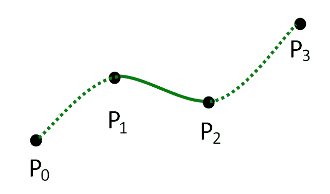
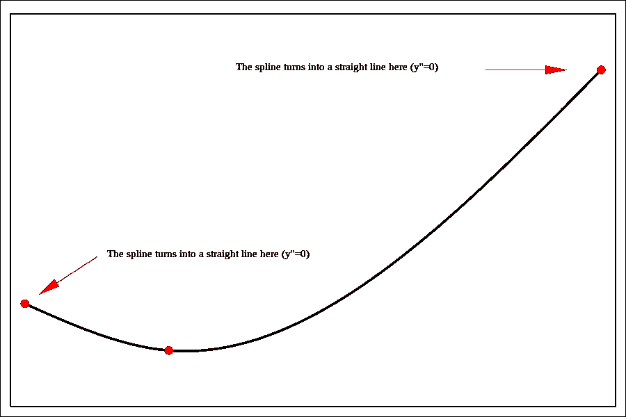
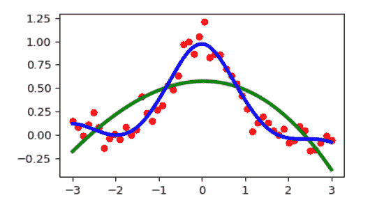
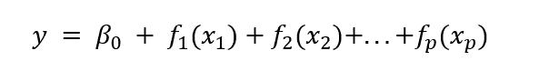

# 样条曲线或回归样条曲线

> 原文：<https://learnetutorials.com/machine-learning/regression-splines>

在前面的讲座中，我们已经讨论了线性回归，这是一条连接因变量和非因变量的直线，但是有了这条直线，并不总是可以做一条直线。然后是多项式回归来模拟非线性函数。然而，我们讨论了添加的多项式项越多，模型越容易过度拟合。

为了拟合描述真实数据的复杂形状，我们需要一种设计复杂函数而不过度拟合的方法。为此，我们必须制定一种新的方法，即非线性回归，但结合线性和非线性函数来拟合数据点，这被称为回归样条。

## 什么是样条曲线？

为了克服线性和多项式回归的缺点，我们引入了回归样条。正如我们所知，在线性回归中，数据集被认为是一个，但是在样条回归中，我们必须将数据集分成许多部分，我们称之为 **bin** 。我们划分数据的点叫做**结**，我们在不同的面元中使用不同的方法。我们在不同容器中使用的这些独立函数称为分段阶跃函数。

**样条**是一种通过将高次多项式函数分解成更小的分段多项式函数来拟合高次多项式函数的方法。对于每个多项式，我们拟合一个单独的模型，并将它们连接在一起。



## 为什么是样条曲线？

我们已经讨论了线性回归是一条直线，因此我们进行了多项式回归，但它会使模型过度拟合的问题。由于需要一种既能用于线性回归又能用于多项式回归的良好特性的模型，样条回归应运而生。虽然这听起来很复杂，但通过将每个部分分解成更小的多项式，我们降低了过度拟合的风险。

## 如何分解多项式

因为样条将多项式分解成更小的块，所以我们需要确定在哪里分解多项式。这种分裂发生的点叫做**结**。

在上例中，每个 P _x 代表一个结。曲线末端的结称为**边界结**，而曲线内的结称为**内部结**。

## 选择结的数量和位置

虽然我们可以目视检查这些结的位置，但我们需要设计系统的方法来选择结。

一些策略包括:

*   将结放置在高度可变的区域
*   指定自由度，并在整个数据中均匀地放置结
*   交叉验证

## 样条的类型

在不知道分段函数的一些微积分和性质的情况下，样条的数学可能看起来很复杂。我们将讨论这些算法下的直觉。

如果你对支撑样条曲线的特定数学感兴趣，我们可以让你参考特雷弗·哈斯蒂、罗维特·蒂布希拉尼和杰罗姆·弗里德曼的《统计学习的要素》第二版。这本中级到高级的教科书是有抱负的数据科学家必不可少的读物。

### 三次样条

**三次样条**要求我们平滑地连接这些不同的多项式函数。这意味着这些函数的一阶和二阶导数必须是连续的。下图显示了三次样条，以及一阶导数如何成为连续函数。


### 自然样条

多项式函数和其他类型的样条函数往往在函数的末端附近拟合不好。这种可变性会产生巨大的后果，尤其是在预测方面。自然样条通过强制函数在边界结之后是线性的来解决这个问题。



### 平滑样条

最后，我们可以考虑样条的正则化版本:平滑样条。如果系数的可变性很高，成本函数将受到惩罚。下图显示了需要平滑样条曲线来获得适当模型拟合的情况。


要在 Python 中实现样条，可以使用 [SciPy](https://www.scipy.org/) 库。这里可以找到一个有用的例子。

```
 import matplotlib.pyplot as plt
from scipy.interpolate import UnivariateSpline
rng = np.random.default_rng()
x = np.linspace(-3, 3, 50)
y = np.exp(-x**2) + 0.1 * rng.standard_normal(50)
plt.plot(x, y, 'ro', ms=5) 

```

### 使用平滑参数的默认值:

```
 spl = UnivariateSpline(x, y)
xs = np.linspace(-3, 3, 1000)
plt.plot(xs, spl(xs), 'g', lw=3) 

```

### 手动更改平滑量:

```
 spl.set_smoothing_factor(0.5)
plt.plot(xs, spl(xs), 'b', lw=3)
plt.show() 

```

**输出:**



## 广义可加模型

我们已经介绍了许多常用的非线性回归模型。在每种情况下，我们发现函数往往是线性模型的变体，但是我们堆叠了不同的复杂性层。**广义可加模型(GAMs)** 可以被认为是迄今为止所涵盖的方法的推广。

对于到目前为止描述的每个回归方法，我们添加了每个特征的贡献 **x** <sub>**i**</sub> 来预测一些结果 **y <sub>i</sub>** 。


在到目前为止描述的所有情况中，我们将**β<sub>p</sub>T3】和**x<sub>p</sub>T7】之间的关系强制为线性。多项式回归也是如此——我们只是将 **x <sub>p</sub>** 的上标改为最适合映射到 **y** 的上标。****

使用 GAMs，我们断言我们可以向模型中添加任何我们想要的函数，并通过将这些函数相加来预测 y。



其中函数 f_p 可以是将 y 链接到 x_p 的任何线性/非线性函数，因为函数链接 x 和 y，所以被称为**链接函数**。

GAMs 非常强大，并且由于模型的上瘾性质和框架内置的灵活性而易于解释。此外，该方法被正则化以避免过度拟合，增加了 GAMs 对于复杂回归任务和预测的吸引力。

GAMs 可以使用 [statsmodels](https://www.statsmodels.org/devel/gam.html) 库来实现。