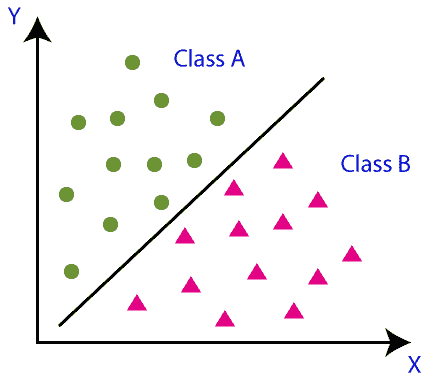
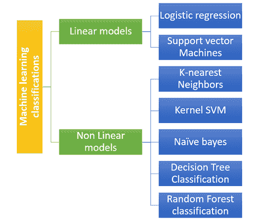
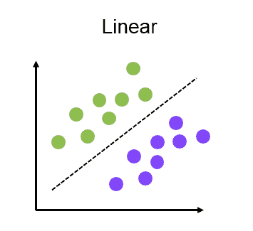
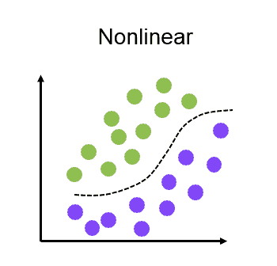

# 机器学习中的分类

> 原文：<https://learnetutorials.com/machine-learning/classification>

我们已经讨论了[监督学习](../../machine-learning/supervised-learning)，分为回归和分类。我们在前面的教程中学习了回归和回归的方法。现在我们要讨论分类算法。

## 什么是分类算法？

分类算法基于监督学习的原理，因为它需要训练数据集来训练模型。在分类算法中，我们基于训练数据集将数据分类为不同的类别。
比如我们要把邮件分类为垃圾邮件还是非垃圾邮件，或者简单的说，我们要按照性别分类为男性和女性，或者是或否等。
与回归相比，分类算法的输出是不同的，这将是一个使用训练数据集的监督方法来预测输出的类别。分类算法可以用公式表示，

**y=f(x)，其中 y =分类输出**

使用一张简单的图片，我们可以了解更多的分类，其主要目的是将数据分类到不同的类别。在下图中，有两个类别具有不同的属性和功能。因此，我们的目标是将具有相似属性的数据分成一个类，并将其他相似属性分成另一个类。

## 分类类型

分类可以分为两种类型，在此之前，我们必须了解术语分类器。分类器只不过是数据集中用来对数据进行分类的算法。

1.  **二元分类器**:顾名思义如果分类只有两个结果，就归入二元分类器。比如男性或女性，是或否，0 或 1 等。
2.  **多分类器**:如果一个分类算法的结果有两个以上的结果，那么它被称为多分类器。例如颜色、色调、形状等。

## 机器学习分类的类型

分类算法大致分为两种类型

1.  线性模型
2.  非线性模型

### 线性模型

线性模型可以分为

*   逻辑回归
*   支持向量机

### 非线性模型

非线性模型可以有不同的类型

*   k 近邻
*   内核 SVM
*   奈伊夫拜厄斯
*   决策树分类
*   随机森林分类

## 分类学习者

1.  懒惰的学习者
2.  热切的学习者

### 懒惰的学习者

顾名思义，在懒惰学习者中，训练数据集将被存储，并等待真正的数据进入，进行分类和训练模型。这里，分类基于存储在训练数据集中的相关数据。对于懒惰的学习者来说，预测需要更多的时间，而训练需要更少的时间。例子有 K-NN 算法和基于案例的推理。

### 热切的学习者

热切的学习者一得到训练数据集就制作模型。它不像我们在懒惰学习者中看到的那样等待测试数据集。它将在测试数据到达之前制作模型。例如决策树、朴素贝叶斯、人工神经网络等。

## 分类算法的应用

*   生物识别
*   药物分类
*   颜色和形状分类
*   语音识别
*   垃圾邮件检测
*   欺诈识别

## 分类器模型的评估

在监督学习中，一旦分类和回归模型完成，就需要对其进行评估。在分类模型中，我们有三种评估类型，它们是

### 1.保持方法

它是监督学习方法中最常用的测量分类器精度的方法。我们将把数据集分成训练数据集和测试数据集。

然后，我们为模型提供训练数据集，该数据集包含数据集及其对应的类别。然后用训练数据集学习模型。然后，我们将测试数据集提供给有数据集但没有相应类别的模型。该模型必须准确预测测试数据集的类别。

### 2 混淆矩阵

混淆矩阵或误差矩阵将以矩阵的形式获得描述我们模型性能的输出。矩阵行和列包含短格式的结果，其中包含多少正确和不正确的预测。查看下面的矩阵，获得一个想法。

### 3.日志丢失

对数损失是一种非常适合二进制分类模型的方法，这意味着输出将在数字 0 和 1 之间。在该方法中，我们假设较低的对数损失值意味着较高的精度，因为如果预测值和实际值之间的差异非常大，则对数损失值会增加。在二元分类中，交叉熵计算为
？(ylog(p)+(1？y)日志(1？p))

其中“y”是实际输出，“p”是预测输出