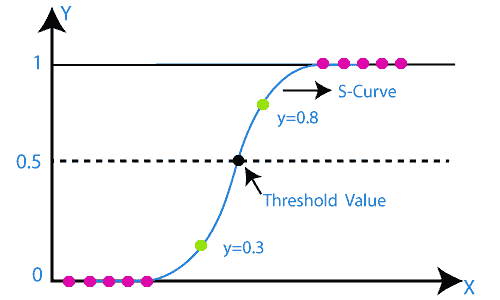
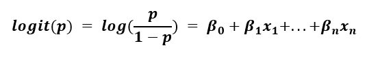
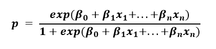

# 逻辑回归

> 原文：<https://learnetutorials.com/machine-learning/logistic-regression>

逻辑回归是监督学习分类算法下最简单和最基本的机器学习算法之一，它有助于使用输入或独立变量集将预测变量确定为一个类别。

我们可以说，当预测值本质上是二进制时，使用逻辑回归，这意味着如果预测变量只属于两个类别中的任何一个，如是或否或 0 或 1。但在某些情况下，它给出的概率值介于 0 和 1 之间。

逻辑回归用于预测概率，这与回归算法中的线性回归非常相似。唯一的主要区别是如何使用它们，因为逻辑回归用于线性回归属于回归类型的分类问题。

与图为直线的线性回归不同，逻辑回归图倾向于在 0 和 1 之间呈字母“s”的形状。从逻辑函数中的曲线，我们可以了解它是否是垃圾邮件，或者它是否是欺诈。

## 逻辑回归的类型

根据类别数和预测变量，我们可以将逻辑回归分为三种类型。正如我们上面讨论的，逻辑回归通常有二进制值，但内部有三种类型。

1.  二进制的
2.  多项式
3.  序数

### 二进制或二项式

正如我们在二进制分类中所知道的，预测变量只有两种可能性，要么为零，要么为一。这将像是一个是或否的条件，可用于检测垃圾邮件或非垃圾邮件。

### 多项式

在多项类型分类中，预测变量可能有三种或三种以上结果的概率，它们将是 A 型或 B 型或 C 型等，并且类别之间没有关系或依赖性。它用于制作不同的类别，如形状、颜色或水果等。

### 序数

这也是一个多项式分类，就像预测变量可能有三个或更多的结果，但结果的类别将被排序，这意味着它们有很强的关系或依赖性。例如，考虑学生类别的成绩，如好、非常好、优秀。三者互有数量意义。

## 逻辑回归中的假设

对于逻辑回归的平稳运行，我们有两个重要的假设，否则可能导致不准确或错误的结果。他们是

1.  预测变量或输出本质上必须是分类的
2.  输入变量不应具有多重共线性

## 实施逻辑回归的步骤

正如我们在前面的回归主题中了解到的，在逻辑回归实现中使用了相同的步骤

1.  数据预处理
2.  训练数据集
3.  预测测试集结果
4.  测试结果的准确性
5.  保存结果

## 线性回归和分类

到目前为止，您可能想知道我们是否可以将线性回归用于分类任务。毕竟，构建分类任务的一种方法是确定区分不同类别的最佳线。

然而，线性回归试图明确识别描述数据之间关系的趋势，而不是类的最佳分隔符。因此，**线性回归不是合适的分类方法**，原因如下:

1.  在线性回归中，我们试图预测一个对应于测试集的值。虽然这对于预测很有用，但是我们需要不同的度量来预测类。通常，**我们用概率来确定类归属**。
2.  当我们执行分类任务时，我们用离散值分配类。这就是所谓的**标签编码**。这些数字表示虽然对我们有用，但会扭曲回归中的模型系数。

## 逻辑回归和逻辑

**逻辑回归**通过尝试计算数据点属于给定类别的概率来解决这个问题。它是解决二元分类问题的一个有用模型。

### 逻辑回归的动机

假设我们有 80%的把握(p=0.8)给定的数据点属于 a 类，我们成功的几率为 p/(1-p)=0.8/(1-0.8)=4。这意味着我们成功的几率是 4:1，并且**几率**越高，给定结果的可能性就越大。

然而，理论上，赔率可以假设在 0 和∞之间的任何数字。这使得很难想出一些规则来对给定的数据点进行分类。因此，我们需要一个更好的度量来执行分类，一个直观的度量是使用概率。

### 逻辑回归建模

为了用概率来建模一个线性方程，我们需要执行 **logit** 或 **sigmoid** 函数。我们取等式左边的对数，我们假设它是成功的几率。

左侧被称为**对数赔率**，范围为-∞到∞。这本质上是概率意义上的线性回归问题:模型的输出可以是太阳底下的任何值，这对于分类问题是没有用的。

然而，在逻辑回归中，我们求解数据点属于给定类别的概率。如果我们算出代数，我们得到以下表达式:

这种形式确保 p 在 0 到 1 的范围内，这是我们进行二进制分类任务所需要的。

## 模型解释

解读模型结果，如果数据属于 A 类的概率小于 50%，相当于一个随机赋值(p<0.5)，那么我们可以说该数据点应该归入 b 类。

给定相同的数据，让我们比较线性回归和逻辑回归。A 类有 P = 0，而 B 类有 P = 1，它被绘制成 x 的函数。

*   正如你所看到的线性回归线，这条线很大程度上是倾斜的，不可解释的:你不能有小于 0 的概率，所以那些数据点不能被分类。
*   此外，我们可以观察到该线对类别分布高度敏感:一个类别的数据点多于另一个类别，这影响了线性回归结果。

出于这两个原因，我们可以有把握地说，线性回归器不是将数据分为两类并用一条线将数据分开的合适方法。相反，逻辑回归曲线完美地做到了这一点。此外，它是高度可解释的:这条线将给定数据点属于一个类的概率可视化为 x 的函数。

## 逻辑回归的局限性

虽然逻辑回归是执行二元分类的一种有价值且简单的算法，但我们在线性回归中所做的假设仍然适用于逻辑回归。