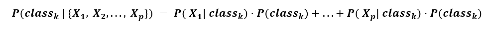

# 朴素贝叶斯

> 原文：<https://learnetutorials.com/machine-learning/naive-bayes>

朴素贝叶斯是用于解决分类问题的监督机器学习。朴素贝叶斯主要用于测试分类问题，它利用贝叶斯定理的原理工作。

我们知道，监督机器学习使用训练数据集来训练模型，在这种方法中，它使用高维训练集。朴素贝叶斯算法简单且非常精确，提高了模型的效率，使得模型给出预测的速度非常快。

朴素贝叶斯算法研究概率，被称为概率分类器算法。朴素贝叶斯算法的流行例子是文章分类器和垃圾邮件检测和过滤。

## 贝叶斯定理

与假设世界随机运行的传统统计方法相比，**贝叶斯统计**旨在利用过去事件或经验的知识对事件发生的概率进行建模。

贝叶斯定理的要点是，我们试图从数据中估计给定类的关系(或概率)，而不知道数据和类之间的因果关系。

从数学上讲，这可以用下面的公式来表示，我们将在后面的章节中详细介绍这些要点:

### 后验概率(或预测):P(类|数据)

P(class | data)是类与给定数据集相关联的概率。这就是所谓的**条件**或**后验概率**。

这是我们在分类问题中要估计的东西的正式定义:我们试图预测一个数据点属于特定类的机会，给定一些数据属性。

### 先验信息:P(类)

现在，给定类出现在数据集 P(类)中的概率相对容易估计——我们可以看到该类被观察的频率。这个术语被称为先验，因为它是从数据的先验知识中获得的。

### 可能性:P(数据|类别)

此外，数据点与给定类别(P(data | class))相关联的概率也很容易获得。在这种情况下，我们可能碰巧知道重要特征的某些阈值，这些阈值增加了数据点被分组到一个类中的机会。这就是所谓的可能性。

### 证据:P(数据)

最后，我们可能有(也可能没有)关于数据中给定特征分布的信息。这通常需要通过前面的大量例子来估计，因为这将提供我们的数据具有特定形式的证据。尽管如此，我们可以对数据进行假设，使我们可以忽略这个变量。

### 把它们放在一起

现在，如果我们重新审视这个公式，我们可以用能传达一些数学直觉的词语来重构贝叶斯定理:

虽然在实践中很难使用贝叶斯定理(因为我们通常没有确凿的证据)，但我们可以做出假设，让我们做出预测模型。一种简化被称为朴素贝叶斯。

### 为什么称之为朴素贝叶斯算法？

那么，为什么这个机器学习算法被称为幼稚的贝叶斯呢？正如我们所知，这种算法是基于贝叶斯定理，这就是为什么它被称为贝叶斯。现在天真的意思是特征相互独立。

假设我们有一个橙色，它有颜色和形状这样的特征，这些特征分别对特征有贡献，并且彼此不依赖。

## 朴素贝叶斯

朴素贝叶斯使用贝叶斯定理，但做了 1 个(朴素)假设来简化数学:假设训练数据集中的所有特征彼此无关。

换句话说，每个特征彼此独立，并且特征之间没有相关性(或反相关性)。

**这为什么重要？**既然不知道底层数据分布，选择不承认，那就可以忽略分母。因此，计算简化为一个加法公式，其中我们将每个 p 特征对观察给定 k 类的可能性的贡献相加:

注意:这意味着数据中的每个特征都与给定的类有某种预测关系，并且这种关系被假设为独立于数据中的其他特征。虽然这并不是在所有真实世界的数据集中都是如此，但这种方法令人惊讶地在高精度下运行良好！

上面显示的是一个朴素贝叶斯分类器，当添加额外的数据点时，它可以将 3 个类分开。请注意，圆圈的颜色较深。这表明这些预测是基于概率做出的。

## 朴素贝叶斯算法的实现

我们可以用一个简单的例子来检验朴素贝叶斯算法的工作原理，这样就很容易理解了。假设我们有一些关于天气的数据，我们需要一个预测，根据天气情况，我们是否可以在特定的一天出去。为此，我们必须采取一些步骤进行正确的预测
1。我们必须将给定的数据集转换成频率表
2。使用天气数据
3，利用降雨概率生成表格。使用贝叶斯定理预测输出

现在我们有一个问题:如果天气晴朗，我们能出去吗？

要获得解决方案，我们必须查看下表

|  | **展望** | **播放** |
| **0** | 下雨的 | 是 |
| **1** | 快活的 | 是 |
| **2** | 多云的 | 是 |
| **3** | 多云的 | 是 |
| **4** | 快活的 | 不 |
| **5** | 下雨的 | 是 |
| **6** | 快活的 | 是 |
| **7** | 多云的 | 是 |
| **8** | 下雨的 | 不 |
| **9** | 快活的 | 不 |
| **10** | 快活的 | 是 |
| **11** | 下雨的 | 不 |
| **12** | 多云的 | 是 |
| **13** | 多云的 | 是 |

现在我们有一张取决于天气情况的频率表

| 天气 | 是 | 不 |
| 遮蔽 | five | Zero |
| 下雨的 | Two | Two |
| 快活的 | three | Two |
| 总数 | Ten | five |

那么天气的可能性表就像

| 天气 | 不 | 是 |  |
| 遮蔽 | Zero | five | 5/14= 0.35 |
| 下雨的 | Two | Two | 4/14=0.29 |
| 快活的 | Two | three | 5/14=0.35 |
| 全部 | 4/14=0.29 | 10/14=0.71 |  |

准备好表格后，我们必须应用贝叶斯定理进行预测。

**P(是|晴)= P(晴|是)*P(是)/P(晴)**T2】P(晴|是)= 3/10= 0.3
P(晴)= 0.35
P(是)=0.71
所以 P(是|晴)= 0.3*0.71/0.35= 0.60

**P(无|晴)= P(晴|无)*P(无)/P(晴)**
P(晴|无)= 2/4=0.5
P(无)= 0.29
P(晴)= 0.35
所以 P(无|晴)= 0.5*0.29/0.35 = 0.41

从上面的计算来看，P(是|晴)> P(否|晴)
这意味着我们可以预测在晴天出门。

## 朴素贝叶斯的优点

*   正如我们所说，这是一种简单快速的机器学习算法
*   它将适用于二进制和多类
*   在多类数据集的情况下，它将做出良好且准确的预测。
*   它可以完美地用于文本分类

## 朴素贝叶斯的局限性

*   在为什么命名为朴素贝叶斯一节中，我们告诉它认为所有的特征都是独立的，所以它不能在特征中找到关系。

## 朴素贝叶斯的应用

*   有助于实时预测
*   它可以用于垃圾邮件过滤
*   用于医疗领域
*   有助于信用评分

## 朴素贝叶斯模型的类型

朴素贝叶斯算法有三种类型，它们是

1.  **高斯**:是模型假设特征为正态分布的方法。这意味着如果输出取值，这些值是连续的。模型认为它将是高斯分布。
2.  **多项式**:如果数据是分布多项式，我们将使用多项式朴素贝叶斯模型，它主要用于文本分类。
3.  **伯努利**:伯努利分类器类似于多项式，不同的是输出变量是独立的二元变量。它用于检测文档中是否存在单词。