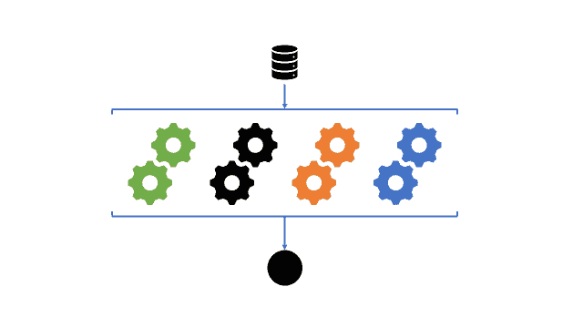

# 集成学习

> 原文：<https://learnetutorials.com/machine-learning/ensemble-learning>

到目前为止，我们一直在讨论单独的机器学习算法，这些算法有扩展到简单现实问题的实际应用。然而，当数据集变得更加复杂和庞大时，简单的机器学习算法开始崩溃，因为我们强加给模型的假设对于真实和动态数据并不成立。

本教程涵盖了**集成学习算法**，这是一系列机器学习算法，通过将多个模型组合在一起，使最佳模型获得准确的预测，从而解决了这个大的现实数据问题。

现在让我们考虑一个例子，让这个概念更加清晰。考虑一棵决策树来理解集成学习的概念。这里，我们需要一个基于输入到模型中的输入问题的预测结果。

在这个例子中，我们考虑这样一个问题:我们能在雨中出去吗？为此，决策树考虑了许多因素，并针对每个因素做出决定或提出另一个问题。因此，当我们检查上面的图像时，你可以理解，如果情况是阴的，我们可以出去。
如果是下雨的情况，我们要问是不是有风的雨。如果刮风，我们不能出去，否则我们可以出去。同样，当天气晴朗时，我们必须问湿度是否高。并据此做出决定。

如果我们使用集合方法，事情会更容易。集成方法可以自由选择决策树的一个小模型，并计算要选择的特征以及在每个决策分割中要问什么问题。

## 为什么是合奏学习？

### 更好的(平均)性能

**集成学习算法**结合多种算法来解决一个复杂的问题。它们类似于一家公司，由擅长解决复杂现实问题的专家组成。以策略方式组合算法比单独的回归器或分类器具有更好的性能。

然而，重要的是要注意，不是所有的集成方法都会优于简单的训练有素的模型。**相反，我们可以将集成学习模型视为风险缓解策略**。我们可以将几个不同的回归器和分类器的结果结合起来，至少得到一个表现良好的模型，而不是满足于一个训练不足的模型。

### 评估模型稳健性

值得注意的是，由多种机器学习算法产生的预测取决于初始启动条件。例如，K-means 聚类取决于聚类的数量和这些质心的初始化位置。

在任何给定的迭代中，即使我们保持超参数值不变，这些模型的预测也会改变。这就是所谓的**模型稳定性**，拥有一个对这些不同初始条件具有鲁棒性的模型是很重要的。

集合方法倾向于给出稳定的模式预测和预报。这是因为模型输出是组合在一起的，通常是通过对几个回归器的结果进行平均或在不同的分类器之间进行 T2 多数投票。生成的模型越多，由于大数定律，值往往越稳定。

### 非线性建模

集成模型将不同的模型与不同的假设和超参数相结合。因此，他们可以捕捉数据集中存在的更多差异。这意味着，与更简单的模型相比，他们可以识别数据中更多的非线性趋势。

## 集成学习的弱点

### 可解释性

集成学习模型的一个主要弱点是，因为它们更复杂，它们变得像黑盒一样——识别模型误差的来源以及模型如何得出结论变得更加困难。

### 过度拟合

因为集合模型捕捉更多的数据方差，它们更容易在数据中产生噪声和过度拟合。缓解这一问题的一种方法是应用正则化技术，并对最能捕捉数据趋势的适当超参数进行采样。

然而，我们也将在接下来的教程中讨论解决模型过拟合问题的算法特定的方法。

## 集成学习的类型

1.  Bagging 或 Bootstrap Aggregating:机器学习模型 bagging 是通过组合 Bootstrap 和 aggregation 模型以形成一个集成模型而形成的。考虑一些给定数据的示例，这些数据形成多个自举子样本。之后，为每个子样本形成决策树。最后，我们使用聚合算法来制作一个完美的模型，如图
2.  随机森林:和装袋方法差不多，只是有一点小变化。在决定在哪里拆分以及如何做决定时，打包方法有手边的所有功能可供选择。但是在随机森林方法中，我们是基于从特征中随机选择来进行分割的。在随机模型中，每棵树都是根据不同的特征分割的，当我们进行聚合时，这种程度的差异会产生一个很好的集成。请查看图片以获得更多理解。这几乎就像 bagging 方法，因为子样本是从一个巨大的数据集中使用的，但是树中的分割是基于不同的特征。特征就是形状。