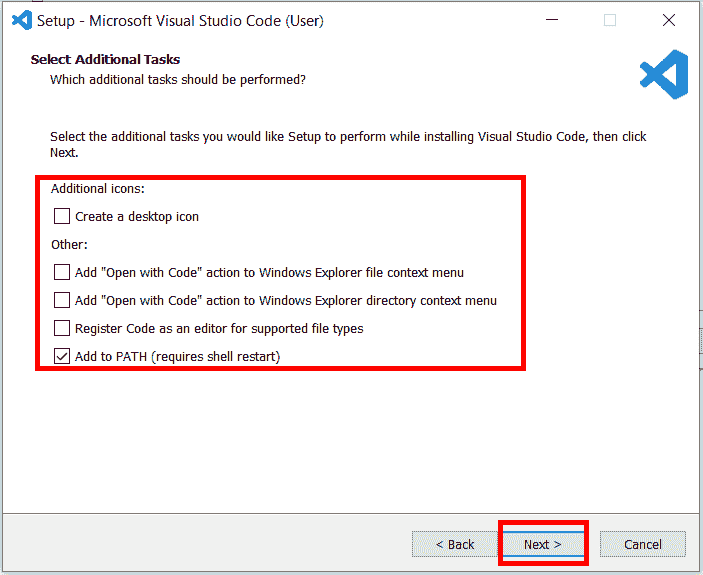
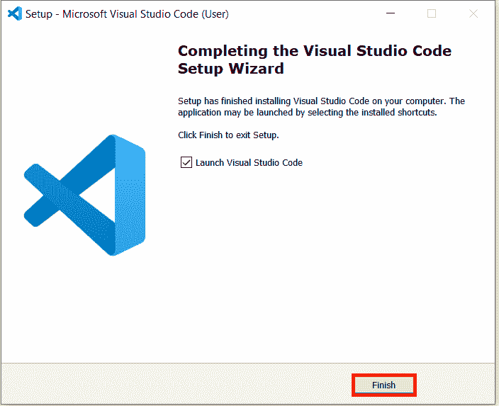
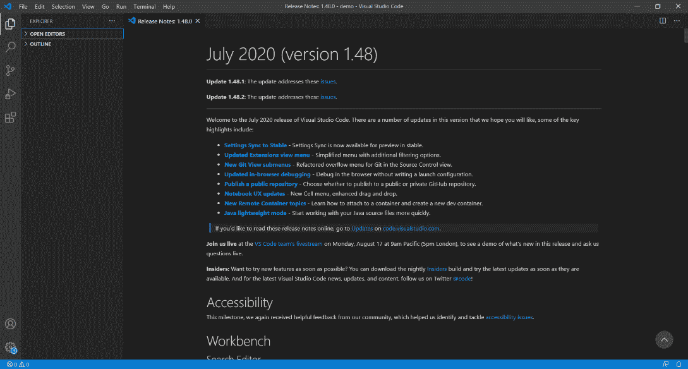
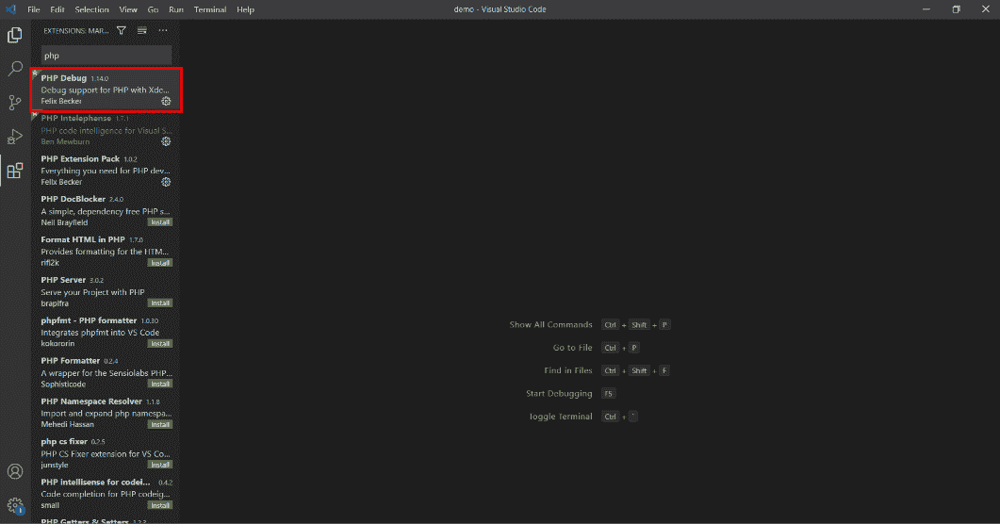
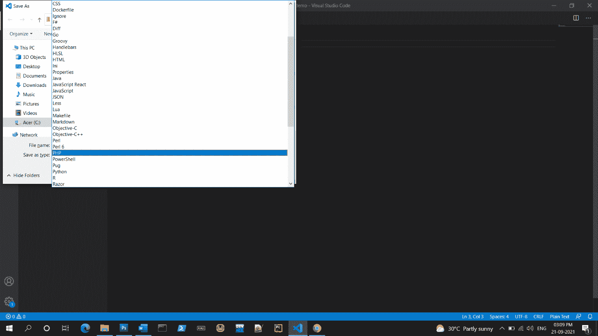

# PHP 的集成开发环境安装

> 原文：<https://learnetutorials.com/php/how-to-install-php>

在本教程中，我们使用 VS 代码进行 PHP 编程。

## VS 代码

Visual Studio Code 是微软开发的集成开发环境。这是一个跨平台的集成开发环境，适用于视窗、苹果操作系统和 Linux。VS Code 支持调试、代码片段、语法突出显示、智能代码完成等功能，它还嵌入了 GIT。它内置了对 JavaScript、TypeScript 和 NodeJS 的支持，它还拥有扩展其他编程语言的生态系统，如 PHP、Python、Java、C++、C、C#、Go 等。在 VS 代码中，安装扩展可以增加更多的特性。VS Code 还支持实时服务器，这是开发人员最需要的。根据 Stack Overflow 进行的调查，VS Code 被评为 2021 年最受欢迎的 IDE。

其他可以用来开发 PHP 的 ide 有 Eclipse、NetBeans、Atom 等。

## 如何下载和安装 VS 代码？

1.  To download VS Code you can visit the link [https://code.visualstudio.com/](https://code.visualstudio.com/) or search for VS Code in the web browser

    你可以去网站或者直接点击下载链接

2.  By clicking on the above link or visiting the website you will go to the main page of VS Code website. Here if you are using the Windows OS, you can directly click on Download for windows otherwise click on the down arrow icon near it.

    通过点击向下箭头，您将获得一个下拉菜单，并可以从中选择所需的选项

    

    如果您在步骤 1 中直接点击了下载链接，您将获得如下下载页面，并可以根据操作系统下载 VS 代码

    
3.  下载后，打开VS Code 文件
4.  打开文件时，将弹出新窗口，并要求同意许可时钟上的接受，然后单击下一步
5.  勾选您需要的，点击下一步
6.  文件准备安装点击安装按钮
7.  安装完成，现在点击【完成】按钮
8.  打开 VS 代码，我们可以看到发行说明和安装的版本
9.  点击左侧菜单栏上的扩展图标，我们可以安装 PHP 所需的扩展
10.  PHP 编程的推荐扩展是
11.  要安装分机，点击所需的分机
12.  现在点击安装按钮安装扩展
13.  要打开一个新文件，进入文件菜单，然后新建文件或使用快捷键 Ctrl + n
14.  写完代码后，我们可以通过进入文件菜单并保存或使用快捷键 Ctrl + s来保存文件
15.  之后，选择要保存文件的文件夹，并给出文件的名称
16.  之后，从另存为类型中选择 PHP 扩展，然后点击保存

要了解如何下载和安装 Eclipse IDE，请点击下面的链接
[【https://learnetutorials.com/java/ide-installation-windows】](https://learnetutorials.com/java/ide-installation-windows)