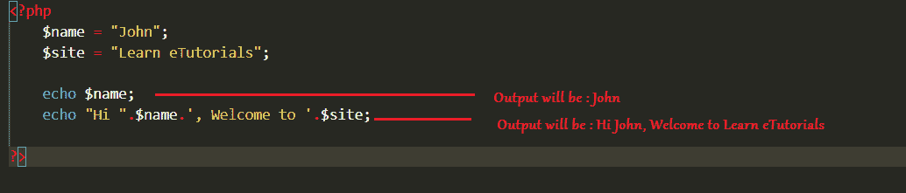
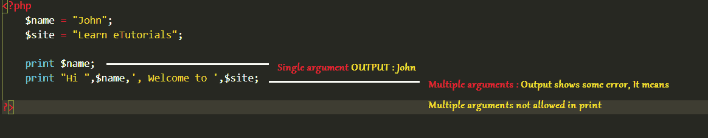

# PHP 回显和打印

> 原文：<https://learnetutorials.com/php/echo-and-print-statements>

在本 PHP 教程中，您将学习 PHP 中所有的打印功能。我们将详细讨论什么是 PHP 中的 echo 语句和 print 语句以及它们的区别。在 PHP 中，基本上有两种显示输出的方式。echo 语句最广泛地用于显示输出。

## PHP 中的 echo 语句是什么？

PHP 中的 echo 语句就像一个语言构造，从不作为函数运行，因此括号并不重要。语句的结尾用分号(**)表示；**)。echo 语句可以根据需要显示任意多的字符串。我们可以使用 echo 语句显示变量、数字、字符串、值和表达式的结果。

## 如何使用 echo 语句显示输出？

*   **Displaying single string using echo**

    要显示单个字符串，我们可以简单地在单引号(')或双引号("")内键入要显示的字符串前面的 echo。如果我们想显示变量值，我们应该使用双引号。

    例子

    ```php
     echo “Hi! Welcome to learnetutorials.com”;
    echo ‘We are learning about the PHP language’; 

    ```

    **输出:**

    ```php
     Hi! Welcome to learnetutorials.com
    We are learning about the PHP language 
    ```

*   **Displaying multiple arguments using echo**

    显示多个参数类似于这里的单个参数，我们使用逗号(，)来分隔这些参数。

    例子

    ```php
     echo “Hi”, ”All”, ”Welcome”, ”To learnetutorials.com”; 

    ```

    **输出:**

    ```php
     Hi All Welcome To learnetutorials.com 
    ```

*   **Displaying variables using echo**

    要显示变量，我们可以直接传递变量，也可以使用双引号(" ")。我们使用串联(。)运算符来连接参数。

    例子

    ```php
     $age = 18;
    echo “Age =”. $age;
    echo “Age = $age”; 

    ```

    **输出:**

    ```php
     Age = 18
    Age = 18 
    ```



## PHP 中的打印语句是什么？

PHP 中的 print 语句大部分与 echo 语句相同。Print 语句也可以作为一种语言构造，但是与 echo 语句相比，它更像是一个函数，对于像 echo 语句这样的括号来说并不重要。语句的结尾用分号(；).与 echo 语句不同，print 语句总是返回值 1，并且 print 语句不能显示多个参数。我们可以使用 echo 语句显示变量、数字、字符串、值和表达式的结果

### 如何使用 print 语句显示输出？

*   **Displaying single string using print**

    要显示单个字符串，它类似于 echo 语句；我们可以简单地键入 print，前面是我们希望在单引号(')或双引号("")中显示的字符串。如果我们想显示变量值，我们应该使用双引号。

    例子

    ```php
     print “Hi! Welcome to learnetutorials.com”;
    print ‘We are learning about the PHP language’; 

    ```

    **输出:**

    ```php
     Hi! Welcome to learnetutorials.com
    We are learning about the PHP language 
    ```

*   **Displaying variables using print**

    要显示变量，它类似于 echo 语句，我们可以直接传递变量，也可以使用双引号(" ")。我们使用串联(。)运算符来连接参数。

    例子

    ```php
     $age = 18;
    echo “Age =”. $age;
    echo “Age = $age”; 

    ```

    **输出:**

    ```php
     Age = 18
    Age = 18 
    ```



## echo 语句和 print 语句有什么区别？

| 回声语句 | 打印报表 |
| echo 可以使用逗号(，)传递多个参数 | print 语句不接受多个参数 |
| echo 语句不返回值 | print 语句总是返回值 1 |
| 相对来说，回声比印刷更快 | 相对来说，打印比回声慢 |
| echo 更像是一种没有函数的语言结构 | print 也是一种语言结构，但与 echo 相比，它更像是一种功能 |