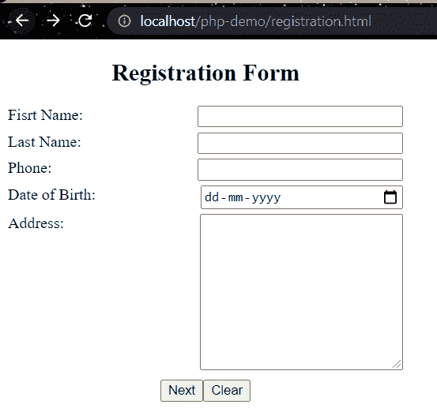
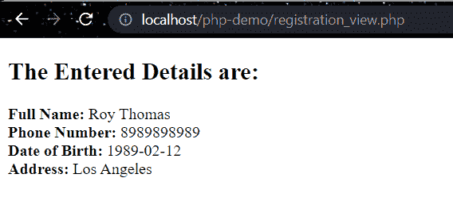
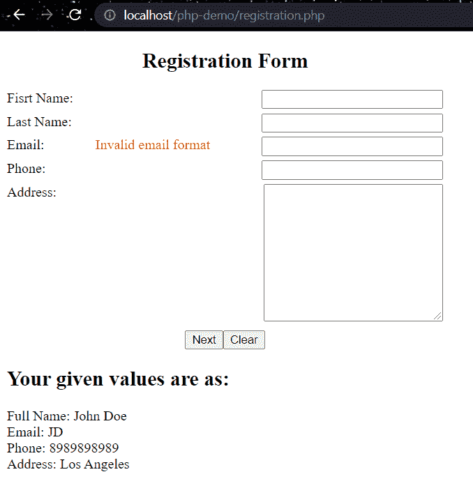
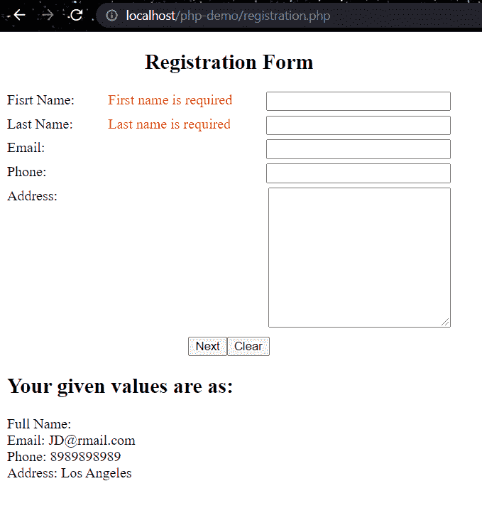

# PHP 表单

> 原文：<https://learnetutorials.com/php/forms>

在本 PHP 教程中，您将了解所有的表单以及 PHP 中各种类型的表单验证。我们将详细讨论创建表单和验证这些表单。

## PHP 中的表单是什么？

众所周知，PHP 是一种服务器端脚本语言，用于创建动态网页。表单用于接受来自用户的数据，这些收集的数据将存储在数据库中，或者这些数据将被处理并输出给用户。表单是一种包含图形用户界面元素(如输入框、复选框、单选按钮等)的 HTML 标记。该表格由

<form>定义...</form>

标签，而输入等 GUI 组件由表单元素定义。PHP GET 和 POST 方法用于将数据从用户传输到服务器。该方法将在 HTML 表单标记中定义。

## 使用 GET 方法创建表单

GET 方法用于在提交后从 HTML 表单中收集数据。当窗体使用 get 方法发送数据时，数据在查询字符串中可用，因此不会隐藏值。超全局数组变量$_GET 包含来自网址的值。因为 get 方法通过 URL 发送数据，所以它有 2000 个字符的限制。get 方法仅用于向服务器发送非敏感数据，因为它在 URL 中是可见的，所以传输密码等敏感数据是不安全的

### 例子:registration.html

```php
 <!DOCTYPE html>
<html lang="en">
<head>
  <title>Registration</title>
  <style>
   .row {
    display: flex;
    justify-content: space-between;
    margin-bottom: 5px;
   }
   .txtBox {
    width: 200px;
   }
   .btns {
    display: flex;
    justify-content: center;
    margin-top: 10px;
   }
  </style>
 </head>
 <body>
  <div class="content" >
   <h2 >Registration Form</h2>
   <form acti method="get">
    <div class="row">
     <label for="fName">Fisrt Name: </label>
     <input type="text" name="fName" class="txtBox" id="fName" />
    </div>
    <div class="row">
     <label for="lName">Last Name: </label>
     <input type="text" name="lName" class="txtBox" id="lName" />
    </div>
    <div class="row">
     <label for="phone">Phone: </label>
     <input type="text" name="phone" class="txtBox" id="phone" />
    </div>
    <div class="row">
     <label for="dob">Date of Birth: </label>
     <input type="date" name="dob" class="txtBox" id="dob" />
    </div>
    <div class="row">
     <label for="adrs">Address: </label>
     <textarea
      name="adrs"
      id="adrs"
      class="txtBox"
      cols="30"
      rows="10"
     ></textarea>
    </div>
    <div class="btns">
     <input type="submit" class="btn" value="Next" name="submit" />
     <input type="reset" class="btn" value="Clear" />
    </div>
   </form>
  </div>
 </body>
</html> 
```

**输出:**

```php
  
```

### 示例:registration_view.php

```php
 <!DOCTYPE html>
<html lang="en">
<head>     
<meta charset="UTF-8">  
<meta http-equiv="X-UA-Compatible"> 
<meta name="viewport">
    <title>Registration view</title>
</head>
<?php
if (isset($_GET['submit'])) {
    $fName = $_GET['fName']; 
    $lName = $_GET['lName'];  
    $dob = $_GET['dob'];     
    $ph= $_GET['ph'];
    $adrs = $_GET['adrs'];
    $fullName = $fName . " " . $lName;
}
?>
<body>
    <h2>The Entered Details are:</h2>
    <p>
        <strong>Full Name: </strong> <?php echo $fullName; ?><br>
        <strong>Phone Number: </strong><?php echo $ph; ?><br>
        <strong>Date of Birth: </strong><?php echo $dob; ?><br>
        <strong>Address: </strong><?php echo $adrs; ?>
    </p>
</body>
</html> 

```

**输出:**

```php
  
```

## 使用开机自检方法创建表单

POST 方法用于从提交后的 HTML 表单中收集数据。因为当窗体实现 post 方法来传输数据时，查询字符串中的数据是不可访问的，所以以这种方式维护安全标准。Post 请求常用于提交数据量巨大的表单，如文件上传、图片上传、登录表单、注册表单等。因为通过 post 请求提供的数据对 URL 浏览器不可见，所以是安全的。通过发布请求，您可以提交大量数据

### 例子:registration.html

```php
 <!DOCTYPE html>
<html lang="en">
 <head>
  <meta charset="UTF-8" />   <meta http-equiv="X-UA-Compatible" c />   <meta name="viewport" c />
  <title>Registration</title>
  <style>
   .row {
    display: flex;
    justify-content: space-between;
    margin-bottom: 5px;
   }
   .txtBox {
    width: 200px;
   }
   .btns {
    display: flex;
    justify-content: center;
    margin-top: 10px;
   }
  </style>
 </head>
 <body>   <div class="content" >    <h2 >Registration Form</h2>      
<form action =" registration_view.php " method="post">
    <div class="row">
     <label for="fName">Fisrt Name: </label>
     <input type="text" name="fName" class="txtBox" id="fName" />
    </div>
    <div class="row">
     <label for="lName">Last Name: </label>
     <input type="text" name="lName" class="txtBox" id="lName" />
    </div>
    <div class="row">
     <label for="phone">Phone: </label>
     <input type="text" name="phone" class="txtBox" id="phone" />
    </div>
    <div class="row">
     <label for="dob">Date of Birth: </label>
     <input type="date" name="dob" class="txtBox" id="dob" />
    </div>
    <div class="row">
     <label for="adrs">Address: </label>
     <textarea
      name="adrs" class="txtBox"
      cols="30"
      rows="10"
     ></textarea>
    </div>
    <div class="btns">
     <input type="submit" class="btn" value="Next" name="submit" />
     <input type="reset" class="btn" value="Clear" />
    </div>
   </form>
  </div>
 </body>
</html> 

```

**输出:**

```php
  
```

### 示例:registration_view.php

```php
 <!DOCTYPE html>
<html lang="en">
<head>
    <meta charset="UTF-8">
    <meta http-equiv="X-UA-Compatible" >
    <meta name="viewport" >
    <title>Registration view</title>
</head>
<?php
if (isset($_POST['submit'])) {
    $fName = $_POST['fName'];
    $lName = $_POST['lName'];
    $ph = $_POST['ph'];
    $dob = $_POST['dob'];
    $adrs = $_POST['adrs'];
    $fullName = $fName . " " . $lName;
}
?>
<body>
    <h2>The Entered Details are:</h2>
    <p>
        <strong>Full Name: </strong> <?php echo $fullName; ?><br>
        <strong>Phone Number: </strong><?php echo $ph; ?><br>
        <strong>Date of Birth: </strong><?php echo $dob; ?><br>
        <strong>Address: </strong><?php echo $adrs; ?>
    </p>
</body>
</html> 

```

**输出:**

```php
  
```

## PHP 中 GET 和 POST 方法的区别

| 得到 | 邮政 |
| Get 请求可以发送的数据量有限，因为数据被封装在头中。 | 在 post 请求中，可以发送大量数据，因为正文包含数据。 |
| 获取请求不安全，因为数据在 URL 中可见。 | 发布请求是安全的，因为数据在网址中不可见。 |
| 获取请求可以被书签标记。 | 帖子请求不能被书签标记。 |
| get 请求是幂等的。这表示第二个请求将被忽略，直到收到第一个请求的响应。 | 发布请求不是幂等的 |

## PHP 中什么是表单验证？

验证是指验证用户输入的过程。在 PHP 中，有两种形式的验证是可访问的。它们如下所示:
**客户端验证**:验证在客户端机器的网络浏览器上进行。
**服务器端验证**:数据上传后传输到服务器，服务器对服务器计算机进行验证测试。

## 应用于字段的各种验证规则

| 田 | 验证规则 |
| 名字 | 应该只包含字母和空格 |
| 电子邮件 | 应该包含“@”和“.” |
| 网站(全球资讯网的主机站) | 应该只包含有效的网址 |
| 收音机 | 应该至少选择一个 |
| 检验盒 | 应该至少选择一个 |

## 服务器端验证

### 如何检查网址是否有效？

为了检查输入的 URL 是否有效，我们检查属于有效关键字的字符，例如 https、ftp、www、a-z、0-9，..等等..

```php
 $website = input($_POST["site"]);
if (!preg_match("/\b(?:(?:https?|ftp):\/\/|www\.)[-a-z0-9+&@#\/%?=~_|!:,.;]*[-a-z0-9+&@#\/%=~_|]/i",$website)) {
   $websiteErr = "Invalid URL"; 
} 

```

### 如何检查电子邮件是否有效？

为了检查输入的电子邮件是否有效，我们检查字符并检查电子邮件是否包含“@”和“.”在里面。

```php
 $email = input($_POST["email"]);
if (!filter_var($email, FILTER_VALIDATE_EMAIL)) {
   $emailErr = "Invalid format and please re-enter valid email"; 
} 

```

**输出:**

```php
  
```

### 检查表单中的字段是否有效？

### 例子:registration.php

```php
 <!DOCTYPE html>
<html lang="en">
<head>
 <title>Registration</title>
 <style>
  .row {
   display: flex;
   justify-content: space-between;
   margin-bottom: 5px;
  }
  .txtBox {
   width: 200px;
  }

  .btns {
   display: flex;
   justify-content: center;
   margin-top: 10px;
  }
  .error {
   color: red
  }
 </style>
</head>
<div class="row">
    <label for="lName">Last Name: </label>
    <span class="error"> <?php echo $lNameErr; ?></span>
    <input type="text" name="lName" class="txtBox" id="lName" />

   </div>
   <div class="row">
    <label for="email">Email: </label>
    <span class="error"> <?php echo $emailErr; ?></span>
    <input type="text" name="email" class="txtBox" id="email" />

   </div>
   <div class="row">
    <label for="phone">Phone: </label>
    <input type="text" name="phone" class="txtBox" id="phone" />
   </div>
   <div class="row">
    <label for="adrs">Address: </label>
    <textarea name="adrs" id="adrs" class="txtBox" cols="30" rows="10"></textarea>
   </div>
   <div class="btns">
    <input type="submit" class="btn" value="Next" name="submit" />
    <input type="reset" class="btn" value="Clear" />
   </div>
  </form>
 </div>
 <?php

 if ($_SERVER["REQUEST_METHOD"] == "POST") {
  echo "<h2>Your given values are as:</h2>";
  echo "<p>Full Name: $fName $lName <br> Email: $email <br> Phone: $phone <br> Address: $adrs </p>";
 }

 function test_input($data)
 {
  $data = trim($data);
  $data = stripslashes($data);
  $data = htmlspecialchars($data);
  return $data;
 }

 ?>

</body>
</html> 

```

**输出:**

```php
  
```

```php
  
```