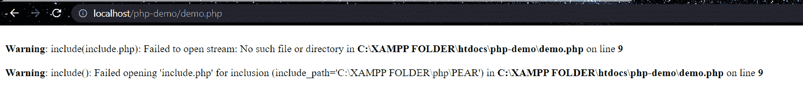

# PHP 包含和要求

> 原文：<https://learnetutorials.com/php/include-and-exclude-function>

在本 PHP 教程中，您将了解不同的文件插入方法包括和要求。我们将详细学习 include 和 require 方法的用法，以及如何使用它们和它们的区别。

## PHP 中包含和需要什么？

PHP 允许我们开发各种各样的小部件和方法，这些小部件和方法可以在几个页面上重用。在大量页面上编写这些例程的脚本需要很长时间。因此，使用文件包含技术，它允许您在许多应用程序中包含文件，同时节省您多次创建相同代码的工作。“PHP 允许您包含文件，允许您多次重用页面内容。当您希望将相同的 HTML 或 PHP 代码应用于网站的几个页面时，包括文件是非常有用的。”在 PHP 中，包含文件有两种方式。

1.  **包含()**功能
2.  **要求()**功能

这有助于创建可以在多个页面上重用的函数、页眉、页脚和组件。这将有助于开发人员轻松修改整个网站的风格。如果需要修改，不要修改更多的文件，只需修改包含的文件。

## PHP 中`include()`函数是什么？

`include()`函数将给定文件中的所有文本导入使用 include 函数的当前文件。如果加载文件时出错，`include()`方法会发出警告，但脚本会继续运行剩余的脚本。PHP include 用于包含基于路径的文件。您可以指定文件的相对路径或绝对路径。

句法

```php
include 'filename'; 

```

### 包含函数示例:demo_include.php 页面

```php
 <h1>It is the included page</h1> 
```

### 包括功能示例:demo.php 页面

```php
<!DOCTYPE html>
<html lang="en">
<head>
    <title>Include</title>
</head>
<body>
    <?php include 'demo_include.php' ?>
</body>
</html> 

```

**输出:**

```php
  
```

在上面的例子中，我们可以看到执行的页面是“demo.php”，页面中显示的文本是“demo_include.php”，我们可以看到通过在另一个页面中包含该页面，我们可以访问它。

输出:如果找不到页面

**输出:**

```php
  
```

如果没有找到该页面，它将显示警告并执行剩余的脚本。

## PHP 中`require()`函数是什么？

`require()`方法将给定文件中的所有文本插入到使用 require 函数的文件中。如果加载文件时出现错误，`require()`方法将引发致命错误并终止脚本的执行。`require()`和`require()`之间除了它们如何处理错误场景之外，没有什么区别。因为如果文件丢失或命名错误，脚本不应该继续执行，所以最好使用`require()`方法，而不是`require()`。您可以将前面的示例与`require()`方法一起使用，以获得相同的效果。

句法

```php
 require 'filename'; 

```

示例:demo_require.php 页面

```php
 <h1>It is the included page</h1>
```

例如:demo.php·佩奇

```php
 <!DOCTYPE html>
<html lang="en">
<head>
    <title>Include</title>
</head>
<body>
    <?php require 'demo_require.php' ?>
</body>
</html> 

```

**输出:**

```php
  
```

在上面的例子中，我们可以看到执行的页面是“demo.php”，页面中显示的文本是“demo_require.php”，我们可以看到，通过将页面放在另一个页面上，我们可以访问它。

**输出:**

```php
  
```

如果没有找到页面，那么它将抛出一个错误，并且不会执行剩余的脚本。

## PHP 中的 include 和 require 方法有什么区别？

包含和要求是同一个概念。但是，如果文件丢失或包含失败，include 方法将生成警告即 E_WARNING，并继续执行剩余的脚本，如果是 require 方法，将生成致命错误即 E_COMPILE_ERROR，并停止执行剩余的脚本。