# Python 安装和设置

> 原文：<https://learnetutorials.com/python/installation-tutorial>

在本教程中，您将掌握如何在系统中安装和设置 python。如果你是一个初学者，不知道如何开始，这个 python 安装和设置教程绝对适合你。本教程将教您检查系统中是否存在 python，如果不存在，将指导您解决如何免费安装 python、我应该安装哪个版本的 python、要使用哪些 python 安装命令、如何为 python 设置环境等问题。

现在一天中大多数电脑和 MACs 都已经安装了 python。因此，首先我们需要按照以下步骤检查 python 是否已经存在于您的系统中。

## 1.如何检查 Python 是否已安装

### 对于 Windows

*   通过在搜索栏中键入“cmd”打开计算机上的命令提示符。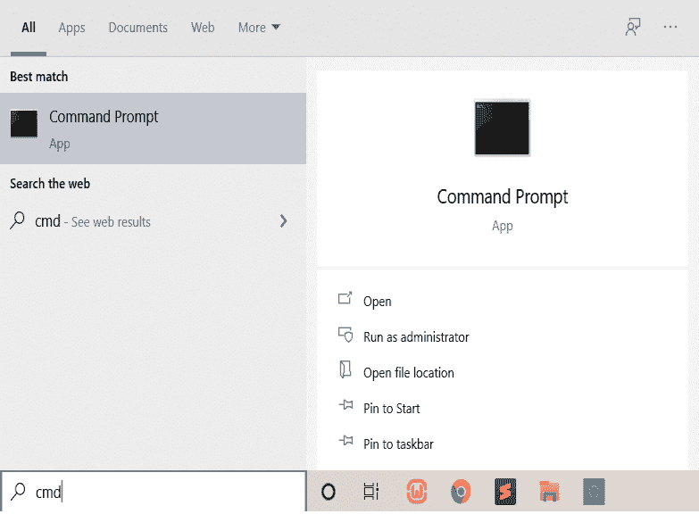
*   只需在命令提示符下键入“python”，如果 python 已经在您的窗口中可用，您将获得如下屏幕
*   如果它不在那里，你会得到一条消息，显示 python 在内部和外部都不可用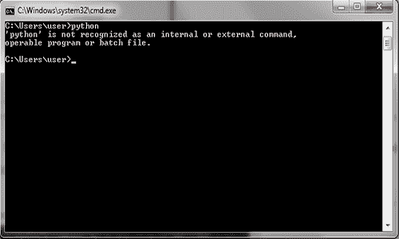

### 对于 mac/ linux

*   python 类型–版本

## 2.如何免费下载和安装 Python

如果您在系统中找不到 python，您需要使用下面的链接免费下载并安装 python，并按照下面明确提到的步骤操作。

*   要么点击这个链接[https://www.python.org/downloads/](https://www.python.org/downloads/)要么在任何浏览器如谷歌 chrome、internet explorer 等中使用这个链接。这将打开 python 的官方网站。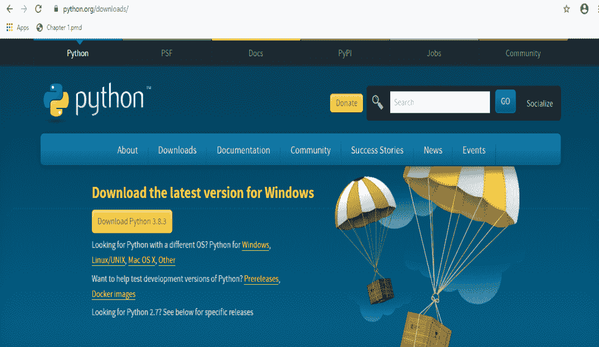
*   将鼠标悬停在下载选项卡上，您将看到如下所示的屏幕。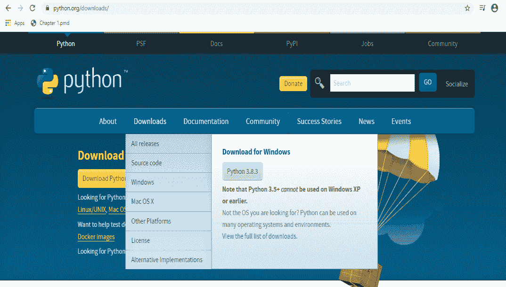
*   选择你的系统，windows 或 mac。我们在这里选择**窗户**。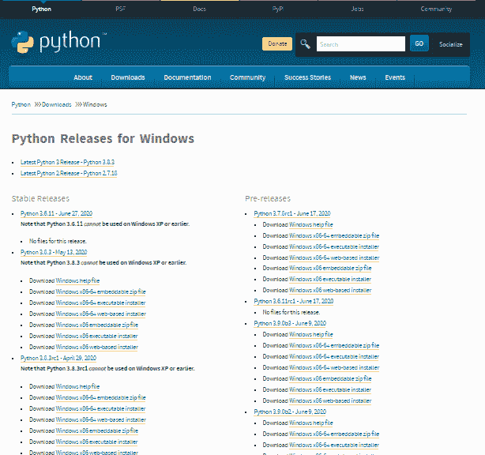
*   现在问题来了，我应该安装哪个版本的 python。我们建议使用最新版本的 **python 版本 3.8.3**
    1.  要选择合适的版本，您需要在下载之前了解计算机规范
    2.  要了解您的系统，只需右键单击“开始”菜单，然后单击“系统”。
    3.  将打开一个关于的窗口，您可以在其中找到**设备规格和窗口规格**。
    4.  在**设备规格**下，你会得到**系统类型**，它给你的想法是你的系统是 **32 位还是 64 位**。
    5.  您可以根据系统类型选择 32 位或 64 位的 python 版本。
*   下载完成后，运行。单击“立即安装”按钮安装 python。此外，勾选下方的复选框(将 Python 3.8 添加到路径中)以自动创建路径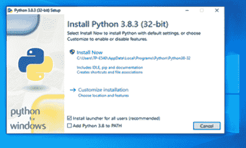
*   一个设置进度屏幕出现在你面前，等待它完成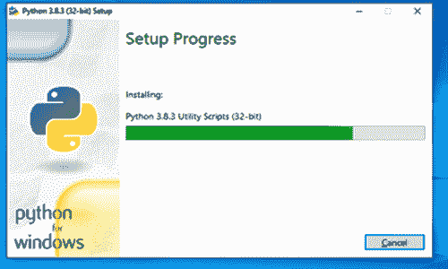
*   最后，您将看到一个屏幕，显示“设置成功”。要完成关闭，您需要点击关闭按钮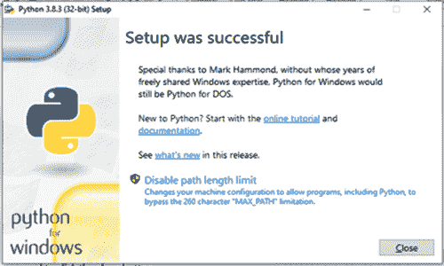
*   再次打开命令提示符并键入“python”。如果安装成功，您将直接进入 python 交互外壳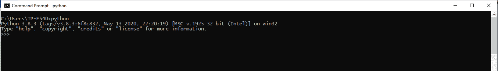

## 3.如何设置 Python 路径

路径是操作系统中的一个环境变量，用于指定文件系统中的一组目录。所有可执行程序都位于目录中。下面给出了一个 python 路径的例子，其中安装是一个位于名为 python 的文件夹中的 pdf 文档，该文件夹又位于名为 Tutorial 的文件夹中。

**C:\这台电脑\文档\教程\ Python \安装. pdf**

为了与编辑器建立连接，我们需要自动或手动设置路径。现在自动设置路径是可能的，但是，如果缺少与编辑器的连接，您需要手动设置路径

*   右键点击**我的电脑**，进入**属性**，然后点击**高级**选项卡，在这里可以找到**环境变量**。这样做是为了设置路径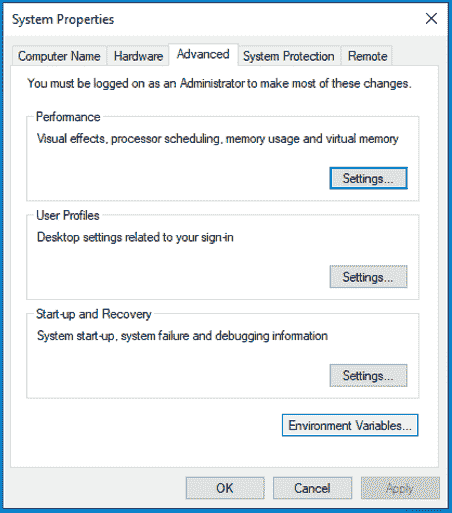
*   在用户变量部分添加新路径。键入路径作为变量名，并设置 python 安装目录的路径，如下所示。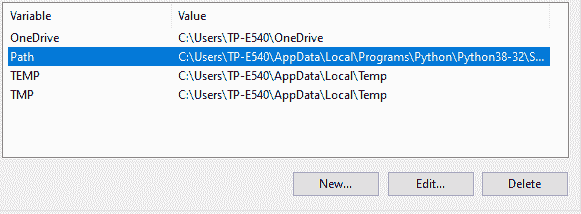
*   现在道路已经准备好了。重新启动命令提示符并再次键入 python，检查连接是否成功建立
*   如果是，python 解释器外壳将打开，您可以在其中执行代码
*   如果没有，请检查 python 的安装位置，并再次尝试上述步骤来检查路径。

但是，在您的计算机上安装 python 来学习本教程并不是强制性的，因为我们提供了交互式 python shell 来方便学习。