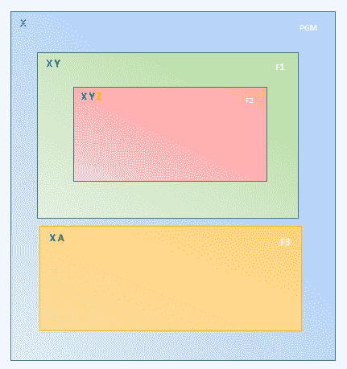

# Python 标识符和变量

> 原文：<https://learnetutorials.com/python/identifiers-variables>

这个 python 教程是上一个关于关键字的教程的延续。标识符和变量是任何编程语言的其他基本构件。在本教程中，您将详细了解 python 的这些基本工具。

## Python 标识符

Python 标识符是用户定义的几个实体的名称，如变量、函数、类等。用户可以按照下面提到的规则为 python 实体定义有效的名称。

1.  Python 标识符区分大小写，因此大写、小写及其混合表示被认为是不同的。例如

    ```py
    ADD, Add & add are considered as different identifiers

    ```

2.  Python 标识符必须以字母(大写或小写)或下划线(_)开头，后跟字母数字或下划线。

    ```py
    #Python valid identifiers example  
    _alpha , __beta, Theta_1,  _1day, Day, WEEK, M!

    ```

3.  Python 标识符从不以数字(0 到 9)开头。例如，7 天是无效的标识符。

    ```py
    7colours  # invalid identifier example
    _7colours #valid identifier
    ```

4.  Python 标识符可以包含字母数字，但不能包含特殊字符，如%、@、#、$...可以包括在内。例如，#标记是无效的标识符。

    ```py
    %per, $twenty,  #tag  #invalid identifiers
    ```

## Python 变量

Python 变量充当存储数据的容器。换句话说，每当创建变量时，都会在内存中分配特定数量的空间来存储数据。这种空间分配取决于变量的数据类型，您将在接下来的教程中学习。

### Python 中的变量声明和赋值

与其他编程语言相比，Python 不需要特定的变量声明。在给变量赋值时，python 会不自觉地用适当的数据类型声明该变量，从而为该值分配足够的内存。

### 示例 1:简单的 Python 程序

```py
age = 17
first_name = ‘Robert’
print(age)
print(first_name) 

```

在上面的例子中，`age` 是保持值 17 的容器。我们通过使用赋值操作符`=`赋值一个整数值`17` ，构造了一个名为`age `的 python 变量。在这里，python 会自动将其推断为整数类型，并且在内存中，会为这个 python 变量`age`分配一个 2 字节(或 4 字节)的空间。同样，python 变量`first_name `将值`Robert `存储为字符串类型。

**输出:**

```py
17
Robert 
```

### 示例 2:简单的 Python 程序

```py
first_name = ‘Robert’
print(first_name)
first_name = ‘Charles’
print(first_name)
first_name = “Charles”
print(first_name) 

```

**输出:**

```py
Robert
Charles
Charles 
```

在这种情况下，变量`first_name `最初被赋予值`Robert `，后来被修改为`Charles`，这表明 python 变量的值可以在任何时候被替换。

同样，python 认为单引号( ' )和双引号( " )对于字符串变量来说是相同的。

* * *

### 为多个变量设置多个值

Python 允许给一行中的多个变量分配多个值。见下文

### 示例 3:多个变量

```py
a, b, c = “Apple”, “Ball” ,”Cat”
I, F, S = 10, 9.99, TEN
print (a)
print (b)
print (c)
print (I, F, S) 

```

**输出:**

```py
Apple
Ball
Cat
10, 9.99, TEN 
```

### 将单个值设置为多个变量

同样在 python 中，我们可以使用下面的格式将单个值赋给多个变量。

### 示例 4:将单个值设置为多个变量

```py
A = B = C = “Apple” 
print (A)
print (B)
print (C)

```

**输出:**

```py
Apple
Apple
Apple 
```

## python 中的全局和局部变量

在 python 中，变量可以在 python 函数内部或外部声明。根据声明，我们可以确定变量的范围，范围是在函数内部还是外部。因此，python 变量分为两种类型，即局部变量和全局变量

现在让我们比较 python 编程语言中的全局和局部 python 变量

### 全局变量

1.  全局变量可以定义为在整个函数中具有生命的变量。
2.  它们在函数内部和外部都是活动的，因此变量的范围是全局的。
3.  函数中声明的全局变量总是以 Python 关键字“全局”作为前缀
4.  程序中的所有函数都可以访问全局变量。

### 局部变量

1.  局部变量可以定义为在函数内部有生命的变量。
2.  它们在函数之外是不活动的，因此变量的范围局限于给定的函数。
3.  局部变量被声明为普通变量，没有特定的关键字标记。
4.  局部变量的可访问性仅限于创建变量的函数。因此其他函数不能访问局部变量。



上图显示了 python 程序中全局和局部变量的一般视图。python 程序 PGM 包含变量 X、Y、Z 和 A，以及函数 F1、F2 和 F3。从图像中，我们可以推断出以下几点

1.  在 python 编程语言中，在程序中和所有函数之外声明的 Python 变量 X 总是被认为是一个全局变量。它可以访问 python 程序中的所有功能。
2.  函数 F1 包含其局部变量 Y，如果需要，可以访问变量 X。
3.  函数 F2 包含其局部变量 Z，如果需要，可以访问变量 X 和 Y，因为 F2 是嵌套函数
4.  函数 F3 包含其局部变量 A，如果需要，可以访问变量 X。您将在我们即将到来的教程中了解 Python 函数。

* * *

## Python 中的常量变量

常数可以定义为一种变量，其值在一段时间内保持不变。具体来说，该值不能更改。

实际上，常量在 python 编程语言中并不常用。常数通常包含在模块中。模块显然是保存变量、函数等的文件或容器。

#### 常量变量声明和赋值

1.  使用创建模块/文件。比如 py 扩展名，常量. py。
2.  用变量的值设置变量。这里常量变量的表示必须在大写字母中，以区别于通常的变量。`PI = 3.14 GRAVITY = 9.8`
3.  现在将这个新创建的模块 costant.py 导入 main.py

    ```py
    import constant
    print(constant.PI)
    print(constant.GRAVITY) 

    ```

    **输出:**

    ```py
    3.14
    9.8 
    ```