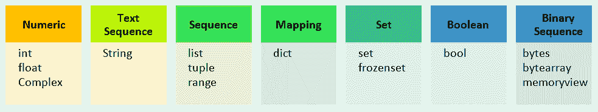
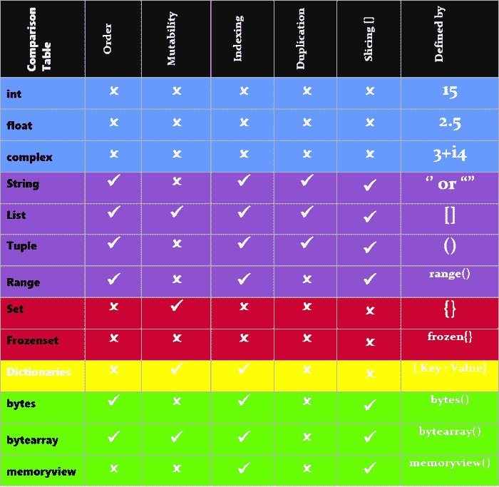

# Python 中的数据类型

> 原文：<https://learnetutorials.com/python/python-datatypes>

本教程的主要目的是启发 python 编程语言中数据类型及其分类的概念。

## Python 数据类型

python 中的数据类型可以定义为一种数据，一个变量或一个对象可以保存该数据并基于该数据执行操作。它有助于确定程序员想要解释的数据的类型和大小。

作为一种可解释的编程语言，python 隐式地将数据类型赋给一个变量。不需要具体声明。根据数据类型分配内存，这意味着数据及其操作所需的空间在内存中是动态安全的。

### 示例:定义各种类型的数据类型

```py
age = 17  #age is a variable of datatype  number
first_name = ‘Robert’ #first_name is a variable of datatype string
X = 21.5   #X is a variable of datatype float 

```

## 数据类型的分类

在 Python 编程语言中，数据类型大致分为 7 种构建类型，即数字、文本序列、序列、映射、集合、布尔和二进制序列。每种类型又根据其独特的特征被分为基本数据类型。



## Python 中的数字数据类型

在 python 中，当一个变量被赋予一个数值时，它就属于 Python 数字数据类型。数字数据类型由整数值、浮点值和复杂类型值组成，精确表述为

### 整数数据类型

Int 是 python 中的一种数字数据类型，包含正整数和负整数以及零。它不包含小数部分。

### 浮点数据类型

浮点数，也称为浮点数，由带符号的小数组成。

### 复杂数据类型

复数是由一个实部和一个虚部组成的数，其形式为 a+ib，其中 a 和 b 是实数，b 与一个虚单位 I 相关联。

### 示例:基于数字的数据类型

```py
i = 10  #i is a variable of type int  
print("i = ",i) 
f = 10.55 #f is a variable of type float  
print("f = ",f)
C =-5-6i #C is a variable of type Complex
print("C =",C) 

```

**输出:**

```py
i = 10
f = 10.55 
C = -5-6i 
```

## Python 中的字符串数据类型

在 Python 编程语言中，字符串数据类型是基于文本序列的数据类型。字符串通常是以双引号或单引号括起来的有限的 Unicode 字符序列。为了表示多行字符串，我们可以使用' ' '或' '。

### 示例:Python 中的字符串数据类型

```py
Str1 = ' First String '
Str2 = " Second String "
Str3 =    ' ' ' Multiple line …
 …String example ' ' ' 
print(str1)
print(str2)
print(str3) 

```

**输出:**

```py
First String
Second String
Mutliple line…
…String example 
```

## Python 中的列表数据类型

基于序列，Python 数据类型分为三类。他们是

### 目录

列表可以定义为有序的可变值集合。在 python 中，列表中的值用逗号分隔，并用方括号[ ]括起来。

### 元组

Python 元组也是本质上不可变的有序值集合。在 python 中，元组中的值用逗号分隔，并用圆括号或括号()括起来。

### 范围

Python 范围类型用于表示一系列固定的数字，也用于 for 循环和 while 循环中表示固定的迭代。

### 示例:基于序列的数据类型

```py
colorlist =  ['violet', 'yellow', 'blue', 'green', 'indigo']
colourtupe = ('violet', 'yellow', 'blue', 'green', 'indigo')

x=range(10)
y=list(range(10))

print( "List of colours :",colorlist)
print( "Tuple of colours :",colorlist)

print(x)
print('List values in range of 10 :',y) 

```

**输出:**

```py
List of colours : ['violet', 'yellow', 'blue', 'green', 'indigo']
Tuple of colours : ('violet', 'yellow', 'blue', 'green', 'indigo')
range(0, 10)
List values in range of 10 : [0, 1, 2, 3, 4, 5, 6, 7, 8, 9] 
```

## 在 Python 中设置数据类型

在 Python 编程语言中，集合实体是唯一的可散列实体的无序集合。两种内置集合类型是:

### 一组

Python 集合是一组既没有索引也没有排序的独特项目，并且是可变的。设定值不可散列。Python 集通常由花括号{ }包围，用逗号分隔。

### 冻结集合

Python Frozenset 包含一组本质上不可变且可散列的不同对象。

### 示例:在 Python 中设置数据类型

```py
colorset = {'violet','indigo','blue','green','yellow'}
print("Set of colours are :",colorset)

flowerset =frozenset({'jasmine','marigold','sunflower'})
print("Frozen set of flowers are:",flowerset) 

```

**输出:**

```py
Set of colours are : {'violet', 'yellow', 'blue', 'green', 'indigo'}
Frozen set of flowers are:  frozenset({'jasmine', 'marigold', 'sunflower'}) 
```

## Python 中的字典数据类型

在 Python 编程语言中，字典是组合对键和值的集合，它们是索引的、可变的，但不是按顺序的。组合对`Key: Values`封装在花括号{ }中，可以是任何数据类型。值是使用键提取的，相反的方式是不可能的。

### 示例:Python 中的字典数据类型

```py
D = {
"Flower":"Rose",
"Fruit":"Cherry",
"Age":20
}

A=D['Age']
F=D["Flower"]

print(D)
print("Age is ",A)
print("Flower is",F) 

```

**输出:**

```py
{'Flower': 'Rose', 'Fruit': 'Cherry', 'Age': 20}
Age is  20
Flower is Rose 
```

## Python 中的布尔数据类型

布尔数据类型是包含一个可能值的数据类型，真(1)或假(0)。

在 python 中，布尔数据类型使用 python 关键字“真”或“假”返回表达式的真值。

布尔型通常用于计算表达式。这个表达式可以是逻辑的、算术的等等，你将在后续的教程中学习。

### 示例:Python 中的布尔数据类型

```py
a = 100
b = 200

print(a > b)
print(a < b)
print(a == b)
print(a != b)

if a < b:
    print(a,'is less than', b)
else:
    print(a,' is greater than',b)

```

**输出:**

```py
False
True
False
True
100 is less than 200 
```

## Python 中的二进制序列数据类型

在 python 编程语言中，二进制序列数据类型分为三种类型。他们是

### 字节

字节主要是用于管理二进制数据的内置数据类型。字节实体是不可改变的单字节序列。

### 字节数组

bytearray 是用于控制二进制数据的另一个主要内置数据类型。与字节不同，字节数组本质上是可变的。

### memoryview

memoryview 在 python 代码中用于获取特定对象的内部数据。借助缓冲协议，它还支持字节和字节数组。

```py
a=b"Python"  #bytes datatype
x= bytes(10)  #bytes datatype 
y=bytearray(5)  #bytearray 
z=memoryview(bytes(10)) #memoryview 

print('a = ',a)
print('x = ',x)
print('y = ',y)
print('z = ',z)

```

**输出:**

```py
a =  b'Python'
x =  b'\x00\x00\x00\x00\x00\x00\x00\x00\x00\x00'
y =  bytearray(b'\x00\x00\x00\x00\x00')
z =  memory at 0x034D8268 
```

## 数据类型的比较

下表显示了常见因素以及数据类型与这些因素的比较。



从表中，我们可以推断出以下几点。

*   像字符串、列表、元组和范围这样的序列数据类型是支持索引和切片的有序数据类型。
*   在序列数据类型中，唯一的列表是可变的。
*   字符串、列表和元组允许重复值。
*   Set 是可变的，而 fozenset 是不可变的。
*   字节和字节射线支持排序、索引和切片。唯一的区别是字节是不可变的，而字节数组是可变的。

## Python 中的`type()`函数

我们已经了解到 python 是一种高度基于类型的编程语言。每个数据都有自己的类型。为了检索数据的类型，我们使用了一个内置函数，`type( )`函数。`type(object)`函数在向函数传递单个参数时返回特定的对象类型

类型函数的语法:`type(object)`

```py
 i = type(10)
print(i)   #returns  <class ‘int’>

f = type(10.55)
print(f)    #returns  <class ‘float’>

STR = type(‘Welcome’)
print(STR)  #returns  <class ‘str’>

List_ex =type [1,2,3,4,5,6]
print(List_ex)  #returns  <class ‘list’>

Set_ex =type({5,3,1,2})
Print(Set_ex)  #returns <class ‘set’>

D = {
“Flower” : ”Rose“
}
Print(type(D))  #returns <class ‘dict’> 

```

**输出:**

```py
 <class ‘int’>
<class ‘float’>
<class ‘str’>
<class ‘list’>
<class ‘set’>
<class ‘dict’> 
```