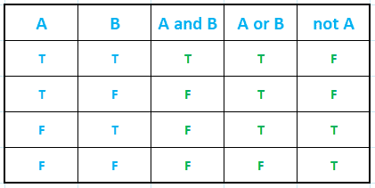

# Python 基本运算符

> 原文：<https://learnetutorials.com/python/python-operators>

在本教程中，我们将掌握 python 中的所有基本运算符及其表达式。此外，还将学习 python 中不同类型的运算符以及如何使用它们。

Python 运算符是执行某种计算的独特符号。运算符作用的对象或值在 python 中称为**操作数**。任何包含运算符和操作数的语句都称为**表达式**。

```py
 X = 50
Y = 20
Z = X + Y -10
print(Z) 

```

**输出:**

```py
60 
```

在上例中，`Z = X + Y -10`是以`+``-`为运算符的表达式，`Z``X``Y`&`10`为操作数。

## python 中有哪些不同类型的运算符？

下面列出了 python 中不同类型的运算符。

*   算术运算符
*   比较运算符
*   逻辑运算符
*   赋值运算符
*   身份操作符
*   成员操作符

## 算术运算符

python 中的算术运算符用于数学计算，如加法、减法、乘法、除法、模数等。

| 操作员 | 意义 | 描述 | 例子 |
| + | 添加 | 添加两个操作数或一元加号 | 10+2=12 |
| - | 减法 | 从左操作数中减去右操作数或一元减 | 10-2=8 |
| * | 增加 | 将两个操作数相乘 | 10*2=20 |
| / | 分开 | 将左操作数除以右操作数 | 10/2=5 |
| % | 系数 | 除法后的余数 | 10%2=0 |
| ** | 幂运算 | 执行指数计算 | 10**2=100 |
| // | 楼层划分 | 仅考虑商的整数部分，同时排除小数点后的值。 | 10//2=510//-4=-3 |

注意:在楼层内，当结果为负时，它会降到下一个最小整数值。

下面的例子给出了一些算术运算符及其计算。

```py
 X = 10
Y = 2

print('X+Y=',X+Y)
print('X-Y=',X-Y)
print('X*Y=',X*Y)
print('X/Y=',X/Y)
print('X%Y=',X%Y)
print('X**Y=',X**Y)
print('X//Y=',X//Y) 

```

**输出:**

```py
 X+Y= 12
X-Y= 8
X*Y= 20
X/Y= 5.0
X%Y= 0
X**Y= 100
X//Y= 5 
```

注意:除法的结果(商)总是用浮点数表示。

## 比较运算符

顾名思义，比较运算符也称为**关系运算符**比较两个操作数，并返回 True(如果条件满足)或 False(在 python 中作为结果)。

| 操作员 | 意义 | 描述 | 例子 |
| == | 等于 | 如果两个操作数相等，则返回真 | a==b |
| ！= | 不等于 | 如果两个操作数不相等，则返回真 | a！=b |
| > | 大于 | 如果左操作数大于右操作数，则返回真 | a>b |
| < | 不到 | 如果左操作数小于右操作数，则返回真 | 一 |
| >= | 大于或等于 | 如果左操作数大于或等于右操作数，则返回真 | a>=b |
| <= | 小于或等于 | 如果左操作数小于或等于右操作数，则返回真 | a<=b |

### 示例:比较运算符

```py
 a = 10
b = 2

print('a==b is',a==b)
print('a!=b is',a!=b)
print('a>b is',a>b)
print('a**=b is',a>=b)
print('a<=b is',a<=b)** 
```

****输出:****

```py
 <samp>a==b is False
a!=b is True
a>b is True
a**=b is True
a<=b is False**</samp> 
```

注意:比较运算符通常用于控制程序的流程。

## 逻辑运算符

逻辑运算符用于计算两个表达式或语句。三个基本的逻辑运算符是`and`、`or`和`not`。它们通常用于在类似于比较运算符的布尔上下文中控制程序的流程。布尔值为`True` (T)或`False` (F)。

| 操作员 | 意义 | 描述 | 例子 |
| 和 | 逻辑与/合取 | 当且仅当两个语句都为真时，返回真 | x 和 Y |
| 或者 | 逻辑或/析取 | 如果任一语句为真，则返回真 | x 还是 Y |
| 不 | 逻辑非/否定 | 如果操作数是否定的，则返回 true | 不是 X |



下面是一个例子:

```py
 x=12
print('x>5 and x<10 is',x>5 and x<10)
print('x>5 or x<10 is',x>5 or x<10)
print('not x<10 is', not x<10) 

```

**输出:**

```py
 x>5 and x<10 is False
x>5 or x<10 is True
not x<10 is True 
```

## 按位运算符

按位运算符用于操作位序列据。常见的逻辑运算符如算术运算符、比较运算符等处理字节，而按位运算符处理字节中的位。下表列出了常见的按位运算符。3 的二进制表示是 0000 0011，4 的二进制表示是 0000 0100。

| 经营者 | 意义 | 描述 | 例子 |
| & | 二进制与 | 如果两个操作数都为真，则结果为 1，否则为 0 | 3&4 =0 |
| &#124; | 二进制或 | 如果任何操作数为真，则结果为 1，否则为 0 | 3&#124;4=7 |
| ^ | 二进制异或 | 当且仅当两个操作数都为真时，结果为 1，否则为 0 | 3^4=7 |
| ~ | 二进制一的补码 | 结果是操作数的否定 | ~3=-4 |
| << | 二进制左移位 | 将位向左对齐 | Twelve |
| >> | 二进制右移 | 将位向右对齐 | Zero |

按位运算符示例:

```py
 a=3
b=4

print('a&b is',a&b)
print('a|b is',a|b)
print('a^b is',a^b)
print('~a is',~a)
print('a<<2 is',a<<2)
print('a>>2 is',a>>2) 

```

**输出:**

```py
 a&b is 0
a|b is 7
a^b is 7
~a is -4
a<<2 is 12
a>>2 is 0 
```

## 我们在哪里使用按位运算符？

位运算在现实世界中并不常见，因为它们通常用于低级运算。低级操作使用二进制格式 0 和 1 来操作数据。下面列出了使用按位运算符的一些领域。

*   主要用于嵌入式系统
*   数据压缩
*   加密
*   建立关系网
*   硬件操作
*   制图法

## 赋值运算符

赋值运算符如前面教程中所研究的，为变量赋值。例如，`a = 10`给变量`a`赋值`10`。python 中有一些复合赋值运算符。他们采用了相当于`a= a+10`的表达方式`a+=10`。让我们了解一些赋值运算符，如下表所示。

| 经营者 | 例子 | 意义 |
| = | a = 10 |   |
| += | a+=10 | a=a+10 |
| -= | a-=10 | a=a-10 |
| *= | a*=10 | a=a*10 |
| /= | a/=10 | a=a/10 |
| %= | a%=10 | a=a |
| //= | a/ | a=a//10 |
| **= | a**=10 | a=a**10 |
| &= | a&=10 | a=a&10 |
| &#124;= | a&#124;=10 | a=a&#124;10 |
| = | a^=10 | a=a^10 |
| >>= | a>>=10 | a=a>>10 |
| <<= | a<<=10 | a=a<<10 |

## 成员操作符

从前面的教程中，我们熟悉了成员操作符。python 中的成员操作符用于验证序列中成员的存在，如字符串、列表、元组、集合和字典。

python 中的两个成员操作符是:

*   中的**:如果该成员存在于序列中，则返回真**
*   **不在**中如果该成员在序列中不存在，则返回真。

### 成员运算符示例

```py
 A = {1,3,5,7,8}
print(3 in A)
print(8 not in A) 

```

**输出:**

```py
 True
False 
```

## 身份操作符

python 中的标识运算符用于比较两个变量的内存位置。如果两个变量的存储位置相同，则结果为真。

python 中的两个标识运算符是:

*   **为**:如果操作数指向相同的对象或相同的位置，则为真
*   **不是**:如果操作数指向相同的对象或相同的位置，则为假

### 身份操作员示例:

```py
 x1=10
x2=10
y1=y2='OP'
x1=[1,2,3]
print('x1 is x2 evaluates to',x1 is x2)
print('y1 is not x2 evaluates to',x1 is not x2)
print('x1 is x1 evaluates to',x1 is x1) 

```

**输出:**

```py
 x1 is x2 evaluates to False
y1 is not x2 evaluates to True
x1 is x1 evaluates to True 
```

## Python 中的运算符优先级

运算符优先级是指运算符对表达式求值的顺序。下面的列表提供了 python 中的运算符优先级。

| 命令 | 算术运算符 | 逻辑运算符 | 关系运算符 |
| one | 幂运算(**) | 不 | 相等(==) |
| Two | 补码()一元正，一元负 | 和 | 不等式(<>) |
| three | 乘法(*)，除法(/) | 或者 | 小于( |
| four | 楼层划分(\) |   | 大于(>) |
| five | 模量(%) |   | 小于或等于(< =) |
| six | 加法(+)、减法(-) |   | 大于或等于(> =) |