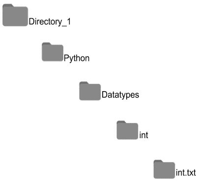

# Python 目录

> 原文：<https://learnetutorials.com/python/python-directories>

在本教程中，您将掌握关于 python 目录的一切，python 中操作系统模块的意义是什么，以及如何通过示例创建、更改、重命名和删除目录。

## 什么是 python 目录？

目录是一个简单的文件夹，包含一系列文件和子目录，而子目录又可能包含子目录和文件。在计算机系统中，目录用于以结构良好的方式组织文件。要获取文件或文件本身的内容，python 需要与操作系统进行交互，因此 python 允许将操作系统模块导入某个程序。

## 什么是操作系统模块？

标准实用程序模块下的 python 操作系统模块支持与操作系统相关功能的交互。操作系统模块提供了一些有助于操作文件和目录的功能。

在之前的教程中，我们已经学习了[导入一个模块](../python/python-modules-packages)。先回忆一下。

```py
import os 

```

要获取本模块中的方法，请使用以下语法:

```py
import os
print(dir(os))

```

输出将是操作系统模块中使用的方法列表，如下所示:

```py
['DirEntry', 'F_OK', 'MutableMapping', 'O_APPEND', 'O_BINARY', 'O_CREAT', 'O_EXCL', 'O_NOINHERIT', 'O_RANDOM', 'O_RDONLY', 'O_RDWR', 'O_SEQUENTIAL', 'O_SHORT_LIVED', 'O_TEMPORARY', 'O_TEXT', 'O_TRUNC', 'O_WRONLY', 'P_DETACH', 'P_NOWAIT', 'P_NOWAITO', 'P_OVERLAY', 'P_WAIT', 'PathLike', 'R_OK', 'SEEK_CUR', 'SEEK_END', 'SEEK_SET', 'TMP_MAX', 'W_OK', 'X_OK', '_AddedDllDirectory', '_Environ', '__all__', '__builtins__', '__cached__', '__doc__', '__file__', '__loader__', '__name__', '__package__', '__spec__', '_check_methods', '_execvpe', '_exists', '_exit', '_fspath', '_get_exports_list', '_putenv', '_unsetenv', '_wrap_close', 'abc', 'abort', 'access', 'add_dll_directory', 'altsep', 'chdir', 'chmod', 'close', 'closerange', 'cpu_count', 'curdir', 'defpath', 'device_encoding', 'devnull', 'dup', 'dup2', 'environ', 'error', 'execl', 'execle', 'execlp', 'execlpe', 'execv', 'execve', 'execvp', 'execvpe', 'extsep', 'fdopen', 'fsdecode', 'fsencode', 'fspath', 'fstat', 'fsync', 'ftruncate', 'get_exec_path', 'get_handle_inheritable', 'get_inheritable', 'get_terminal_size', 'getcwd', 'getcwdb', 'getenv', 'getlogin', 'getpid', 'getppid', 'isatty', 'kill', 'linesep', 'link', 'listdir', 'lseek', 'lstat', 'makedirs', 'mkdir', 'name', 'open', 'pardir', 'path', 'pathsep', 'pipe', 'popen', 'putenv', 'read', 'readlink', 'remove', 'removedirs', 'rename', 'renames', 'replace', 'rmdir', 'scandir', 'sep', 'set_handle_inheritable', 'set_inheritable', 'spawnl', 'spawnle', 'spawnv', 'spawnve', 'st', 'startfile', 'stat', 'stat_result', 'statvfs_result', 'strerror', 'supports_bytes_environ', 'supports_dir_fd', 'supports_effective_ids', 'supports_fd', 'supports_follow_symlinks', 'symlink', 'sys', 'system', 'terminal_size', 'times', 'times_result', 'truncate', 'umask', 'uname_result', 'unlink', 'urandom', 'utime', 'waitpid', 'walk', 'write'] 
```

## 如何获取当前工作目录？

现在如果你想知道你正在工作的当前目录的路径，你可以使用`getcwd()` 方法。

```py
import os
os.getcwd()

```

```py
'C:\\Users\\AppData\\Local\\Programs\\Python\\Python38-32' 
```

`getcwd()`方法以字符串形式返回 python 中当前工作目录的路径，如示例所示。您甚至可以使用`type()`方法检查结果的类型。

```py
import os
type(os.getcwd())

```

仔细思考`getcwd()`的输出，我们可以看到路径中使用了两个黑色斜线(`\\`)来分隔路径组件。额外的反斜杠充当以下字符串的转义字符。我们可以使用打印功能将它取出，同样的路径将更改为如下所示:

```py
import os
print(os.getcwd())

```

```py
C:\Users\AppData\Local\Programs\Python\Python38-32 
```

如果想以字节对象的形式获取当前工作目录的路径，只需在`getcwd()`方法后追加‘b’，即使用`getcwdb()`方法。

```py
import os
os.getcwdb() 

```

```py
b'C:\\Users\\AppData\\Local\\Programs\\Python\\Python38-32' 
```

## 如何更改工作目录？

要更改当前工作目录，我们可以使用内置方法`chdir()`。新路径应该作为参数给出。反斜杠(\\)和正斜杠(/)都可以用来分隔路径中的元素。

```py
import os
os.chdir('C:\\Users\\Desktop') 

```

现在工作目录从 python 文件夹变成了 Desktop。您可以通过简单地列出目录中的元素来检查目录中的更改。

## 如何列出文件或目录

我们可以使用`listdir()`方法列出目录或文件中的元素。如果您没有传递参数，那么它将提供当前目录中的所有元素。返回的列表将包含指定目录中的所有目录或文件。在这里，在我们的例子中，桌面上的所有文件夹和文件都显示为列表。

观察以下示例:

```py
import os
os.chdir('C:\\Users\\Desktop')
os.listdir() 

```

输出将是:

```py
['desktop.ini', 'EMAIL TEMPLATES.docx', ' 'New Microsoft Excel Worksheet.xlsx', 'New Microsoft Word Document (2).docx', 'New Microsoft Word Document.docx', 'notepad.py', 'PY PRO'] 
```

## 如何创建目录

要创建目录，我们使用内置的方法`mkdir()`。我们应该传递目录的路径作为参数。

```py
import os
os.mkdir('C:\\Users\\Desktop\\Directory_1') 

```

**输出:**


如果您试图创建一个已经存在于系统中的目录，那么您将会得到一个如下图所示的错误消息 [**文件存在错误**](../python/errors-exceptions-tutorial) 。

```py
import os
os.mkdir('C:\\Users\\Desktop\\PY PRO') 

```

**输出:**

```py
Traceback (most recent call last):
  File "<pyshell>", line 1, in <module>os.mkdir('C:\\Users\\Desktop\\PY PRO')
FileExistsError: [WinError 183] Cannot create a file when that file</module></pyshell> 
```

只要看一下`listdir()`的输出，就可以看到系统中已经有“PY PRO”文件夹了。

Python 还有一个名为`makedirs()`的内置方法，用于以嵌套结构创建目录。换句话说`makedirs()`该方法递归地创建目录，如下例所示:

```py
import os
os.makedirs('PYTHON/DataTypes/int')
os.makedirs('C/DataTypes/float')
os.makedirs('Java/DataTypes/float')
os.listdir() 

```

输出:

```py
['C', 'JAVA', 'PYTHON'] 
```

这将在目录中创建一个路径，即使它没有找到 1 级文件夹或目录。它按照我们给他们的顺序嵌套文件。在本例中，第 0 级文件夹是**目录 _1** ，在第 1 级创建了一个 PYTHON 文件夹，它在第 2 级又创建了另一个名为数据类型的文件夹，在第 3 级它包含文件夹 int。但是在上面的`os.listdir()`中只列出了特定级别的目录。



### 目录的层次结构

## 递归遍历目录

要列出一个目录的嵌套结构，我们可以使用`os.walk()`方法，它允许我们递归遍历一个目录。`os.walk()`方法在 for 循环的帮助下返回一个目录的根目录、子目录和文件。以下示例打印**目录 _1** 中的所有子目录和文件。

```py
import os
rootdir='C:\\Users\\TP-E540\\Desktop\\Programming Languages'
for roots,dirs,files in os.walk(rootdir):
 print("{0} has {1} files".format(roots, len(files))) 

```

**输出:**

```py
Output:
C:\Users\Desktop\Programming Languages has 8 files
C:\Users\Desktop\Programming Languages\C has 2 files
C:\Users\Desktop\Programming Languages\JAVA has 2 files
C:\Users\Desktop\Programming Languages\PYTHON has 2 files
C:\Users\Desktop\Programming Languages\PYTHON\DataTypes has 1 files
C:\Users\Desktop\Programming Languages\PYTHON\DataTypes\float has 1 file 
```

## 如何重命名目录？

假设您想要重命名一个目录，那么您可以使用 os 模块中可用的方法**重命名(源，目标)**。这个**重命名()**的方法需要两个参数，

**Source_name** :表示要更改的名称

**目的地名称**:表示新名称

```py
import os
os.rename('Directory_1','Programming Languages') 

```

**输出:**


在该示例中，最初，文件夹的名称是 Directory_1，它被重命名为编程语言。

当源目录“**目录 _1** 在系统中不可用时，系统将引发名为`[FileNotFoundError](../python/errors-exceptions-tutorial)`的异常。同样，当目的地“**编程语言**已经存在于系统中时，再次出现`[FileExistsError](../python/errors-exceptions-tutorial)` 异常。

## 如何删除目录

我们可以使用方法`rmdir()`从系统中删除一个目录，其中传递的参数是目录的路径

```py
import os
os.rmdir('C:\\Users\\Desktop\\IMAGES') 

```

这个例子意味着删除一个名为 IMAGES 的空文件夹或目录。该文件夹将从系统中删除。

如果我们再次尝试删除已删除的文件夹或系统中不存在的文件夹，会发生什么情况。观察以下示例:

```py
import os
os.rmdir('C:\\Users\\Desktop\\IMAGES') 

```

**输出:**

```py
Traceback (most recent call last):
  File "<pyshell>", line 1, in <module>os.rmdir('C:\\Users\\Desktop\\IMAGES')
FileNotFoundError: [WinError 2] The system cannot find the file specified: 'C:\\Users\\Desktop\\IMAGES'</module></pyshell> 
```

显然`FileNotFoundError` 会加注，因为系统中没有该文件。

考虑我们尝试删除非空目录的场景，这意味着目录由子文件夹或文件组成。口译员会举起 [`OSError`](../python/errors-exceptions-tutorial) 如下图所示:

```py
import os
os.rmdir('C:\\Users\\Desktop\\Programming Languages') 

```

**输出:**

```py
Traceback (most recent call last):
  File "<pyshell>", line 1, in <module>os.rmdir('C:\\Users\\Desktop\\Programming Languages')
OSError: [WinError 145] The directory is not empty: 'C:\\Users\Desktop\\Programming Languages'</module></pyshell> 
```

## 路径连接和分割

到目前为止，我们已经讨论了如何在单个平台上操作目录或文件。为了运行我们的程序而不考虑平台，我们必须使用独立于平台的目录或文件路径。这可以通过使用子模块 **os.path** 来实现。

与 **os.path** 子模块相关联的两个重要方法是:

1.  **加入()** -加入 python 中的路径元素

    ```py
    >>> import os
    >>> os.path.join('C:','Users','Desktop','Programming Languages') 

    ```

2.  **拆分()** -在 python 中拆分路径元素。

    ```py
    >>> import os
    >>> os.path.split('C:\\Users\\Desktop\\Programming Languages')
    ('C:\\Users\\Desktop', 'Programming Languages') 

    ```

## 检查目录是否存在

也可以检查系统中是否存在路径。要检查系统中是否存在目录，我们可以使用`exists()`功能或`isdir()`功能。这两个功能都位于子模块 **os.path** 中。以下示例显示了`exists()`函数如何检查路径的存在。

```py
>>> import os
>>> os.path.exists('C:\\Users\\TP-E540\\Desktop\\Programming Languages')
True
>>> os.path.exists('C:\\Users\\TP-E540\\Desktop\\File.txt')
True
>>> os.path.exists('C:\\Users\\TP-E540\\Desktop\\New')
False 

```

`isdir()`函数检查目录路径的存在，而不是文件路径的存在。以下示例将阐明这一点:

```py
>>> import os
>>> os.path.isdir('C:\\Users\\TP-E540\\Desktop\\Programming Languages')
True
>>> os.path.isdir('C:\\Users\\TP-E540\\Desktop\\New.txt')
False
>>> os.path.isdir('C:\\Users\\TP-E540\\Desktop\\New dir')
False 

```

所以我们可以总结为`exists()`函数检查路径是否存在。而`isdir()`功能检查目录路径是否存在。