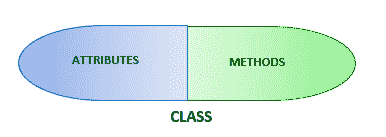
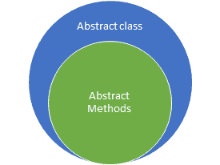

# Python——封装与抽象

> 原文：<https://learnetutorials.com/python/oops-encapsulation-data-abstraction>

在本教程中，您将掌握关于 python 中封装和抽象的 OOPs 概念的一切，以及它们之间的区别。此外，您将通过示例详细了解面向对象编程中的重要访问修饰符，如私有、公共和受保护。

在之前的教程中，您已经掌握了 python 中的继承概念。如果你是 OOPS 的新手，我们建议你学习我们的继承教程来熟悉 OOPS。

## 什么是封装

封装是面向对象编程(OOP)的重要组成部分之一，它允许将所有数据(属性和方法)包装成单个组件(类)，从而通过对直接访问变量或方法施加一些限制来防止数据的意外修改。



### 包装

该图向您展示了一个概念，即类是封装其所有数据(即属性和方法)的封装示例。

在现实世界中，把你的房子看作一个应用程序，它由卧室、餐厅、厨房等组成，可以看作是一个类。根据功能，你可以将不同的物品(数据)放在家里不同的地方(类)，比如卧室里的床，餐厅里的餐桌，厨房里的炉子。这就是现实生活中的封装。

封装通常被称为**数据隐藏**，因为它提供了一种访问控制机制。那么什么是数据隐藏呢？数据隐藏是将一个实体的数据向其他实体隐藏，以防止其他实体意外修改数据的过程。

考虑一下在你的房子里存放贵重物品如金钱和珠宝的情况。实际上，我们把它们放在一个柜子里，以躲避外部实体。编程中的数据隐藏也是如此。

## 数据隐藏是如何执行的

访问修饰符是面向对象编程中不可避免的元素，因为它们限制了对类中属性和方法的访问。与 C、Java 等不同，Python 没有特定的访问修饰符。Python 作为一种面向对象的编程语言，利用**下划线**来执行其他语言中的访问修饰符功能。

在 python 中，封装方法有点不同。基于对象属性在类中的可见性，属性被分为两类。它们分别是**私人**和**公共**。如果数据成员或成员函数可从程序的任何部分访问，则它被认为是公共的，而如果它的可见性仅限于定义的类，则它被认为是私有的。任何以双下划线作为前缀的数据或成员函数都是该类的私有函数。

下面的例子将为您提供一个关于封装的清晰画面。

```py
class Access:

    def __init__(self):

        #public attribute
        self.name= input('Enter your name :')

        #private attribute
        self.__secretcode=input("Enter your secret code :")          

    def permit(self):
        if self.name =='abc' and self.__secretcode =='123!':
         print("Access Granted" )
        else:
         print('Access Denied')

ob = Access()
ob.permit()

print(ob.name)     #public attribute is visible to external world
print(ob._secretcode)  #private attribute is invisible to external world 

```

这个例子是登录验证的简单形式。这里，属性**名称**表示为**公共**，属性密码表示为**私有**。可以看到`permit()`方法检查名称和 secretcode 是否满足条件。如果满足条件，则打印**访问许可**消息，否则打印**访问拒绝**消息。这显示了登录的后端过程。后来如果你试图用类的对象来检索属性**名字**和**密码**，你会得到名字，而密码给你一个错误。

以下是示例的输出:

```py
Enter your name :abc
Enter your secret code :123!
Access Granted

abc
Traceback (most recent call last):
  File "oops_ex.py", line 211, in <module>print(ob._secretcode)
AttributeError: 'Access' object has no attribute '_secretcode'

**OR**

Enter your name :klm
Enter your secret code :1234
Access Denied

klm
Traceback (most recent call last):
  File "oops_ex.py", line 211, in <module>print(ob._secretcode)
AttributeError: 'Access' object has no attribute '_secretcode'</module></module> 

```

观察输出，您已经注意到，在这两种情况下，当您尝试外部`access __secretcode`属性时，不存在属性错误`saying __secretcode`。这是通过一个名为名称管理的过程来实现的，在这个过程中，所有私有属性都通过在它们前面加上类名来进行内部屏蔽。例如，`attribute __secretcode`将在内部成为`_Access__secretcode`。从而对外界隐藏密码，实现数据隐藏。

您将通过运行`dir()`获得这些私有属性，如下例所示。

```py
print(dir(ob))

```

```py
['_Access__secretcode', '__class__', '__delattr__', '__dict__', '__dir__', '__doc__', '__eq__', '__format__', '__ge__', '__getattribute__', '__gt__', '__hash__', '__init__', '__init_subclass__', '__le__', '__lt__', '__module__', '__ne__', '__new__', '__reduce__', '__reduce_ex__', '__repr__', '__setattr__', '__sizeof__', '__str__', '__subclasshook__', '__weakref__', 'name', 'permit'] 
```

这使得访问像对象这样的私有属性成为可能。_ class name _ _ private attributename。更改上述程序的最后一行会得到以下输出:

```py
print(ob.name)     #public attribute is visible to external world
print(ob._Access__secretcode) #private attribute is invisible to external world 

```

**输出:**

```py
Enter your name :abc
Enter your secret code :123!
Access Granted
abc
123! 
```

## 什么是抽象

像封装一样，抽象是面向对象编程的基本构件之一。

抽象是向最终用户隐藏过程的内部实现的过程，只向外部世界显示数据的基本特征，以降低复杂性并提高效率。在编程环境中，将方法的签名与其定义隔离开来被称为抽象。它通常侧重于想法而不是功能。

在日常生活中，我们使用电视、冰箱、洗衣机等电器来满足一些特定的需求。我们不知道它的内部运作，或者我们没有兴趣知道。我们只是操作它们，深刻地说，它们的内部实现是从我们这里抽象出来的。

## 抽象是如何实现的

Python 抽象可以通过在程序中使用抽象类和方法来实现。那么什么是 python 中的抽象类和抽象方法呢？



### 抽象是如何实现的

**抽象类**是包含一个或多个抽象方法的类。当且仅当一个类至少包含一个抽象方法时，它才成为抽象类。如果一个方法被声明但未被定义，则称其为**抽象方法**。具体来说，一个**抽象方法**不包含任何实现。然而，所有的实现都可以在继承抽象类的子类的方法中定义。

需要注意的另一点是，默认情况下 python 不支持任何抽象类，但是我们可以通过从模块 **abc** 中导入一个名为 **ABC** (抽象基类)的类来实现。创建抽象类的语法如下。

```py
from abc import ABC
class class_name(ABC): 

```

让我们看看下面的例子来理解技术世界中的抽象概念。

```py
from abc import ABC

class Shape(ABC):         #abstract class
    def area_calc(self):  #abstract method
        pass 

```

这显示了抽象类的创建。这里**形状**是抽象方法`area_calc()`的抽象类。`area_calc()`这里没有定义方法，而是使用了 pass 语句。所以这个方法是声明的，但没有定义。如果我们试图为抽象类创建一个对象，会发生什么。参见以下示例:

```py
from abc import ABC

class Shape(ABC):         #abstract class
    def area_calc(self):  #abstract method
        pass

ob = Shape() 

```

**输出误差:**

```py
Traceback (most recent call last):
  File "oops_ex.py", line 225, in <module>ob = Shape()
TypeError: Can't instantiate abstract class Shape with abstract methods area_calc</module> 
```

现在让我们添加继承抽象类形状的子类 **Rect** 。如果实现没有在子类的方法中定义，会发生什么。

```py
from abc import ABC

class Shape(ABC):         #abstract class
    def area_calc(self):  #abstract method
        pass

class Rect(Shape):
        pass
obr = Rect() 

```

**输出误差:**

```py
Traceback (most recent call last):
  File "oops_ex.py", line 226, in <module>obr = Rect()
TypeError: Can't instantiate abstract class Rect with abstract methods area_calc</module> 
```

你会收到一个**类型错误**说我们不能实例化类 **Rect** 。所以这是定义方法的冲动，因为 **Rect** 是继承抽象类的子类。所有的实现都可以在 **Rect** 类的方法`area_calc()`中定义。仔细观察这个例子，学习抽象是如何工作的。

```py
from abc import ABC

class Shape(ABC):         #abstract class
    def area_calc(self):  #abstract method
        pass
class Rect(Shape):
    l=float(input('Enter length :'))
    b=float(input('Enter breadth :'))
    def area_calc(self):
        return(self.l*self.b)
obr = Rect()

print("Area of Rectangle is ",obr.area_calc()) 

```

**输出:**

```py
Enter length :10
Enter breadth :20
Area of Rectangle is  200.0 
```

关键的要点是，抽象类包含普通方法和抽象方法，我们不能实例化任何抽象类。

## 抽象与封装

抽象和封装是相似的，因为数据的抽象可以通过封装来实现。尽管抽象和封装是同步进行的，但是它们彼此之间有很大的不同。

| 抽象 | 包装 |
| 抽象隐藏不必要的数据，并向最终用户显示相关数据。 | 封装封装来自外部世界的数据和代码，以避免误用。 |
| 抽象在设计层面起作用 | 封装在应用程序级别工作 |
| 抽象侧重于程序的思想。 | 封装侧重于代码的功能或实现。 |
| 关注应该做什么 | 侧重于应该如何做 |
| 通过使用抽象类和抽象方法实现的抽象 | 封装使用下划线作为访问修饰符来保护外部实体的代码 |