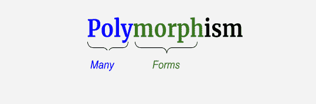

# Python 重载和覆盖

> 原文：<https://learnetutorials.com/python/method-overloading-overriding>

在本教程中，您将掌握面向对象编程的另一个重要概念，即 python 中的**多态性**。您将了解什么是多态性，在编程中实现多态性的不同方式。此外，您将详细掌握重载和覆盖的概念。

## python 中什么是多态性？

多态性是面向对象编程的基本构件之一。为了更清楚地理解它，让我们把多态这个词分解成多态和态射。通俗地说，poly 表示多，morph 表示形式。所以多态性意味着多种形式。



### python 中的多态性

在编程中，多态性可以被定义为一个实体有多种形式的过程。专门处理对象的 Python 显示了对象的多态性，这意味着对象有多种形式。

在现实生活中，我们人类是多态的，因为我们在不同的情况下表现不同。例如，我们在办公室和家里的行为不同。

## 什么是 python 中的鸭子打字？

鸭分型是实现多态性的一种方式，与动态分型有很大关系。鸭子打字得名于一句名言“**如果一个东西走路像鸭子，嘎嘎叫像鸭子，游泳像鸭子，那么它应该是一只鸭子**”。这意味着，行为像鸭子的东西应该是鸭子。例如，如果一个人像鸭子一样走路，像鸭子一样游泳，那么这个人可能就是鸭子。

支持**动态打字**的 Python、Javascript 等编程语言广泛使用了鸭子打字的概念。这些语言的独特和共同特点是它们没有显式声明变量类型。如果我们将同一个变量赋给另一个数据类型，编译器不会产生错误。观察以下示例:

```py
x = 5
print(type(x))
x = 'Learn eTutorial'
print(type(x)) 

```

**输出:**

```py
 <class 'int'> 
<class 'str'> 
```

这里我们首先给变量 **x** 赋值整数值 **5** ，使其成为一个`int`类型。稍后，我们用字符串值“**Learn ettorials**”重新分配同一个变量，使其成为**字符串**类型。这表明动态类型适用于诸如 int、str、list 等内置类。

同样，我们可以借助 duck type 在自定义类上实现动态类型化，在 duck type 中，突出**方法和属性**的存在，我们不检查类型和类，因为它们不太重要。

```py
class Duck:
    def walk_swim(self):
        print("I'm a duck, and I can walk and swim.")

class Robot:
     def walk_swim(self):
         print("I'm a Robot, and I can walk and swim.")

class Fish:
     def swim(self):
         print("I'm a fish, and I can swim, but not walk.")

for bird in Duck(),Robert(),Fish():
    bird.walk_swim() 

```

**输出:**

```py
I'm a duck, and I can walk and swim.
I'm a Robot, and I can walk and swim.
Traceback (most recent call last):
  File "poly_ex.py", line 118, in <module>bird.walk_swim()
AttributeError: 'Fish' object has no attribute 'walk_swim'</module> 
```

在上面的代码片段中，**鸟**是每个类的对象，并且正在测试每个类中`walk_swim()`方法的存在。鸭子班通过了测试，因为它肯定会走路和游泳。机器人类也是如此，因为它也实现了`walk_swim()`方法。但是 Fish 类以错误告终，因为它没有通过鸭子测试评估，因为它没有实现`walk_swim()`方法。

duck 类型的实际应用是迭代器、可调用和`len()`方法的排序。关键的一点是，当使用 duck 类型时，我们传递的是哪个类对象并不重要，重要的是对象应该有相关的方法。

## python 中什么是运算符重载？

在 python 中实现多态性的另一种方式是通过使用运算符重载。回想一下什么是操作员。任何执行某种计算的唯一符号都被称为运算符。所以**运算符重载**是根据所使用的操作数，以多种形式使用同一个运算符(比如+)的过程。查看下面显示运算符“+”行为变化的代码片段:

```py
a = 1
b = 2
print(a+b)

c ='Python'
print(c*3)

d = 'Programming'
e = 'Language'
print(d+e) 

```

**输出:**

```py
3
PythonPythonPython
ProgrammingLanguage 
```

这里**加运算符**对两个整数执行加法，同时对两个字符串执行串联。

你可能想知道这是怎么可能的，在这个操作员背后到底发生了什么。让我们将两个整数相加，并在内部分解，以了解这些整数背后的过程。

永远记住，python 中发生的任何事情都是基于对象的。这里 **a+b** 是有两个操作数的表达式，操作数 a 和 b 是‘int’类型，内部意思是 a 和 b 是**类 int** 的两个属性。显然，这个类必须有一些方法来计算它的操作数。所以当你使用 **a+b** 的时候，python 内部调用**魔法方法** - int。__ 添加 __(a，b)方法。

```py
a = 1
b = 2
print(int.__add__(a,b))

c ='Python'
print(str.__mul__('Python',3))

d = 'Programming'
e = 'Language'
print(str.__add__('Programming','Language')) 

```

**输出:**

```py
3
PythonPythonPython
ProgrammingLanguage 
```

所以当你使用

*   +运算符它调用一个`obj.__add__()`方法。
*   -操作员调用`obj.__sub__()`方法。
*   *操作员调用一个`obj.__mul__()`方法。

在 python 中，运算符重载适用于内置类，如 int、str、list 等。然而，我们也可以将操作符的可操作性扩展到用户定义的类。这可以使用运算符重载来实现。

```py
class Quantity:
    def __init__(self,w1,w2):
        self.w1=w1
        self.w2=w2

    def __str__(self):
        return "{} ,{}".format(self.w1,self.w2)

q1=Quantity(5,6)
q2=Quantity(7,8)

print(q1)
print(q2)

print(q1+q2) 

```

**输出:**

```py
(5 ,6)
(7 ,8) 
Traceback (most recent call last):
  File "poly_ex.py", line 51, in <module>print(q1+q2)
TypeError: unsupported operand type(s) for +: 'Quantity' and 'Quantity'</module> 
```

让我们打破这个例子来清楚地理解它。

*   我们定义了一个名为**数量**的类，它有两个属性 **w1** 和 **w2** 。
*   `__str__()`方法的工作原理与打印功能相同。此方法返回指定的数量。
*   **q1** 和 **q2** 是我们分别用两个不同的量(5，6)和(7，8)创建的两个实例。
*   接下来，我们尝试单独和组合打印实例中的属性。
*   从示例中可以很清楚地看到，print(q1)和 print(q2)工作顺利，但是 print(q1+q2)语句引发了名为 **Type Error** 的错误。这是因为我们没有定义要对操作数执行的操作，它只对内置类有效。

那么如何以用户自定义的方式实现操作者的可操作性呢？我们只需要在类中定义一个额外的方法，使得+运算符可以在对象上工作。为此，我们在课堂上实现了神奇的方法`__add__()`。

```py
class Quantity:
    def __init__(self,w1,w2):
        self.w1=w1
        self.w2=w2

    def __str__(self):
        return "{} ,{}".format(self.w1,self.w2)

    def __add__(self,other):
        w1=self.w1+other.w1
        w2=self.w2+other.w2
        return (w1,w2)

q1=Quantity(5,6)
q2=Quantity(7,8)

print(q1)
print(q2)

print(q1+q2) 

```

**输出:**

```py
(5 ,6)
(7 ,8)
(12, 14) 
```

当您调用 print(q1+q2)时，python 会调用方法来添加 Quantity 形式的方法。__ 添加 __(q1，q2)，相当于 q1。__ 添加 __(q2)。

## Python 中的神奇方法

**Magic** 或 **Dunder** 方法是 python 中任何添加双下划线的方法。邓德缺 **D** 双**下**。下表列出了 python 中使用的一些常见魔术方法。

| 操作员 | 表示 | 神奇的方法 |
| 添加 | q1+ q2 | ob . _ _ _ add _(Q1、q2) |
| 减法 | Q1–Q2 | 页:1 |
| 增加 | q1 * q2 | ob . _ _ _ mul _(Q1、q2) |
| 分开 | q1 / q2 | ob . _ _ _ true div _(Q1，q2) |
| 力量 | q1 ** q2 | 是吗？_ _ _ _ _ pow _(Q1，q2) |
| 楼层划分 | q1 // q2 | 是吗？_ _ _ flood v _(Q1、q2) |
| 模运算符 | q1 % q2 | ob . _ _ _ mod _(Q1、q2) |
| 按位左移 | q1 << q2 | ob . _ _ _ lshift _(Q1，q2) |
| 按位右移 | q1 >> q2 | ob . _ _ _ rsift _(Q1，q2) |
| 按位非 | ~q1 | ob . _ _ _ _ _ _ _(Q1) |
| 按位“与” | q1 和 q2 | 卒于 __ 和 __(q1，q2) |
| 按位“或” | q1 &#124; q2 | 卒于 __ 或 __(q1，q2) |
| 按位异或 | q1 ^ q2 | ob . _ _ _ _ _ _ _(Q1，q2) |
| 不到 | q1 < q2 | 页:1 |
| 小于等于 | q1 <= q2 | 是吗？_ _ _ _ _ _(Q1，q2) |
| 大于 | q1 > q2 | 页:1 |
| 大于等于 | q1 >= q2 | ob . _ _ _ ge _(Q1、q2) |
| 等于 | q1 == q2 | ob . _ _ _ eq _(Q1，q2) |
| 不等于 | q1！= q2 | 页:1 |

## Python 方法/函数重载

**方法重载**在面向对象编程中，是一种方法根据传递给该方法的参数表现不同的能力。方法重载支持**编译时多态性**。

很明显，如果一个类有两个同名的方法和不同数量的参数，那么这个方法就是重载的。观察下面的代码片段:

```py
class A:
    def add(self,a,b):
        s = a+b
        print(s)
    def add(self,a,b,c):
        s = a+b+c
        print(s) 

```

这里我们有一个名为 **A** 的类，有两种方法。两种方法使用相同的名称，即 **add()** 但是两种方法中的参数数量不同。一个方法有两个参数，而另一个方法有三个参数。这里 **add()的方法是重载**。

现在让我们检查一下在 python 中执行时它的输出会是什么。

```py
class A:
    def add(self,a,b):
        s = a+b
        print(s)
    def add(self,a,b,c):
        s = a+b+c
        print(s)

ob = A()
ob.add(10,20) 

```

```py
Traceback (most recent call last):
  File "poly_ex.py", line 73, in <module>ob.add(10,20)
TypeError: add() missing 1 required positional argument: 'c'</module> 
```

这里发生的事情是，由于两个方法具有相同的名称**，python 保留了类**中定义的最新方法，当进行函数调用时，它会检查最新的方法，即具有三个参数的方法。带有两个参数的 add()在类中保持不变。这意味着 python 不支持方法重载，不像其他 oop 语言。

注意:Python 不支持方法重载。

然而，幸运的是，我们有一种 python 方式来实现 python 中的方法重载。

```py
class A:
    def add(self,a = None,b = None, c = None):
        if a!=None and b!=None and c!=None:
         print (a+b+c)
        else:
         print(a+b)

ob = A()
ob.add(10,20)
ob.add(30,40,50)
ob.add('Programming','Tutorials') 

```

**输出:**

```py
30
120
ProgrammingTutorials 
```

上面的代码片段显示了如何通过一些技巧在 python 中实现方法重载。这里我们可以用三种不同的方式调用 add()方法。

*   ob.add(10，20)
*   ob.add(30、40、50)
*   ob.add('编程'，'教程')

让我再次提醒您，这不是实现方法重载的理想方式，因此不是 python 中的方法重载。但不知何故，我们在 python 中实现了方法重载。

## python 中的方法覆盖是什么？

**在面向对象编程语言中，覆盖**是支持**运行时多态性**的一个重要概念。当子类中的方法与其父类中的方法具有相同的名称**、相同数量的参数**和相同的返回类型**(签名)时，该方法被称为**覆盖了**。方法覆盖的主要好处是，子类可以为继承的方法提供自己的特定实现，甚至不需要更改父类方法。**

 **因此在方法覆盖中，我们有两个方法，一个在父类中被称为**覆盖方法**，一个在子类中被称为**覆盖方法**的继承方法。两种方法具有相同的名称和签名。

## 方法覆盖示例

为了使它更容易理解，检查一下有两个类的简单例子:父类- **妈妈**和子类- **女儿**。

```py
#Parent Class 
class Mom:
    def dance(self):
        print("Mom is dancing")
    def cook(self):
        print("Mom is cooking")    

#Child class
class Daughter(Mom):
        pass

d = Daughter()
d.dance()
d.cook() 

```

**输出:**

```py
Mom is dancing
Mom is cooking 
```

父类包含两种方法: **dance()** 和 **cook()** 打印一些消息。现在，我们保持子类为空，没有任何方法或属性，但是我们创建了一个子类的对象，并使用它来调用 Mom 中的方法。因为女儿继承自妈妈，所以它可以访问妈妈类中的方法并产生输出。

让我们创建覆盖 dance()方法的子类“女儿”。

```py
#parent class
class Mom:
    #overridden method
    def dance(self):
        print("Mom is dancing")
    def cook(self):
        print("Mom is cooking")    

#child class
class Daughter(Mom):
    #overriding method
    def dance(self):
        print("Daughter is dancing ")

d = Daughter()
d.dance()
d.cook() 

```

**输出:**

```py
Daughter is dancing
Mom is cooking 
```

现在当我们调用对象 d 时， **dance()** 方法的修改版本将执行，这在输出中得到了清晰的体现。因此，我们可以得出结论，子类覆盖了妈妈类的方法。**