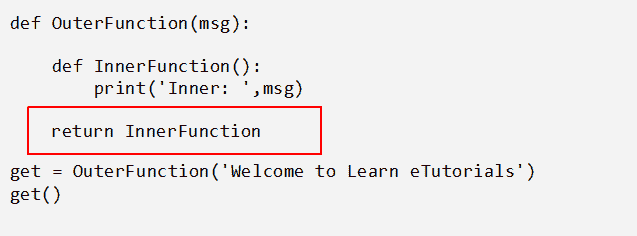

# Python 装饰器

> 原文：<https://learnetutorials.com/python/decorators>

在本教程中，您将学习什么是 python 装饰器，以及如何借助简单的示例来创建和使用它们。在开始这个教程之前，让我来揭示一个事实，装饰师很难理解！但我们向你保证，最终你会毫无疑问地掌握这个话题。

## python 中的装饰器是什么

装饰器是元编程的一部分，因为它们通过在编译时向现有的函数或类添加额外的功能来增强 python 代码。

装饰器可以被定义为一个函数，它接受另一个函数，并以一种或另一种方式修改后面函数的行为，而不显式修改实际的源代码。

在开始本教程之前，让我建议你用
函数式编程的基本主题来认知，这样你就可以毫不费力地掌握装饰者的概念。下面提供了关于这些基础知识的简单想法。

## python 中对象的概念:

Python 是一种美丽的语言，它广泛利用了对象的概念。在 python 中，从字面上看，一切都是一个对象。变量、常数、函数甚至类都是对象。下面的例子展示了一个函数如何作为一个对象工作。

### 示例:作为对象的函数

```py
def func1():
    print('Welcome to Learn eTutorials')

func1()

func2= func1
func2() 

```

**输出:**

```py
Welcome to Learn eTutorials
Welcome to Learn eTutorials 
```

当执行上述代码时，func1 和 func2 产生相同的输出。这表明 func1 和 func2 引用了同一个函数对象。

## 嵌套函数:

Python 允许在另一个函数中定义一个函数，通常称为嵌套函数或内部函数。下面是嵌套函数的一个简单例子。

```py
def OuterFunction(msg): 

                def Innerfunction():  
                                print(msg)
                InnerFunction() 

OuterFunction('Welcome to Learn eTutorials') 

```

## 将函数作为参数传递给另一个函数:

函数是 python 中的第一类对象。这意味着函数可以作为参数传递、分配给变量或者用作返回值，就像 python 中的其他对象(字符串、列表、元组等)一样。

### 示例:用作参数

```py
def say_hello(name):
    print('Hello',name )

def say_bye(name):
    print('Bye',name )

def Greet(func, name):
    return func(name)

Greet(say_hello,'TOM')
Greet(say_bye,'JERRY') 

```

**输出:**

```py
Hello TOM
Bye JERRY 
```

在上面的代码中，say_hello 和 say_bye 是两个以字符串(名称)作为参数的常规函数。另一方面，Greet()函数接受两个参数，一个是函数，另一个是字符串变量。在所有定义的函数中，Greet()是一个更高阶的函数，因为它以另一个函数作为参数。

## 从另一个函数返回函数

在 python 中，从另一个函数返回一个函数是可能的。在这种情况下，函数被视为返回值。以下示例从外部函数返回内部函数。



### 封闭结构

这里我们返回不带括号的 InnerFunction。这表示我们正在返回对构成闭包的 InnerFunction 的引用。查看我们之前的教程，了解更多关于闭包的知识。

上面提到的函数的四个特性使得 python 中的 decorator 成为可能。

## 写你的第一个室内设计师

现在让我们从一个简单的例子开始，试着理解这个程序。

### 示例:第一个装饰程序

```py
def decor_func(func):
    def wrap_func():
        print( '<' * 32)
        func()
        print('>' * 32)
    return wrap_func

def welcome():
    print('\nWELCOME ALL TO LEARN ETUTORIALS\n')

greet=decor_func(welcome)
greet() 

```

#### 解释:

在上面的例子中，我们有一个名为`welcome`的常规函数，它不接受任何参数，函数的目的是打印给定的消息“欢迎所有人学习练习曲”。
现在假设你想修饰功能`welcome()`同时你不想修改源代码。有可能吗？答案是肯定的。装饰者帮助你在不接触源代码的情况下装饰一个函数。

为了修饰`welcome()`，我们定义了一个装饰函数`decor_func`，它接受一个参数，这个参数就是一个函数。在`decor_func()`内部，我们再次定义了另一个函数，并将其命名为`wrap_func`，这不需要任何论证。`wrap_ func()`调用在`decor_func`中作为参数传递的函数，并将其(func)置于旨在修改的额外功能之间。在我们的例子中，函数前后都包含了`print()`。最后返回 wrap 函数，从而成为闭包。

所谓装饰发生在下面的语句中

```py
greet = decor_func(welcome) 

```

函数`welcome()`被修饰，返回的函数被分配给一个名字变量 greet。函数调用将产生输出，输出如下所示:

**输出:**

```py
<<<<<<<<<<<<<<<<<<<<<<<<<<<<<<<<

WELCOME ALL TO LEARN ETUTORIALS

>>>>>>>>>>>>>>>>>>>>>>>>>>>>>>>> 
```

从输出来看，很明显我们已经像包装礼物一样装饰了功能。在这里，装饰器纯粹充当原始函数的包装器，保持其本来的性质。从而增强了功能的美观性。

## 句法糖

计算机科学中的句法糖是编程语言中的句法，它使代码更容易使用。在 python 中声明装饰器的语法方法是使用@符号。上述代码可以更改如下:

### 例子:句法糖

```py
def decor_func(func):
    def wrap_func():
        print( '<' * 32)
        func()
        print('>' * 32)
    return wrap_func

@decor_func
def welcome():
    print('\nWELCOME ALL TO LEARN ETUTORIALS\n')

welcome() 

```

使用这种句法糖，我们可以更清楚、更优雅地表达代码。在这里，

```py
@decor_func 

is equivalent to:

greet=decor_func(welcome)
greet() 

```

## 一个函数上的多个装饰器

Python 允许装饰器的链接，从而能够在一个函数中使用多个装饰器。你唯一需要记住的是你希望在功能上应用的装饰者的顺序。检查下面的例子，获取堆叠装饰器的引用。

```py
#Stacked Decorators
def decor_func1(func):
    def wrap_func():
        print( '<' * 32)
        func()
        print('>' * 32)
    return wrap_func

def decor_func2(func):
    def wrap_func():
        print( 'XO' * 16)
        func()
        print('XO' * 16)
    return wrap_func

@decor_func1
@decor_func2
def welcome():
    print('\nWELCOME ALL TO LEARN ETUTORIALS\n')

#greet = decor_func(welcome)
#greet()
welcome() 

```

**输出:**

```py
<<<<<<<<<<<<<<<<<<<<<<<<<<<<<<<<
XOXOXOXOXOXOXOXOXOXOXOXOXOXOXOXO

WELCOME ALL TO LEARN ETUTORIALS

XOXOXOXOXOXOXOXOXOXOXOXOXOXOXOXO
>>>>>>>>>>>>>>>>>>>>>>>>>>>>>>>> 
```

上述程序包含两个装饰器功能，即`decor_func1`和`decor_func2`。这些装饰函数以特定的顺序堆叠，因此在输出中遵循模式。最初我们用`decor_func2`装饰迎宾功能，然后用`decor_func1`装饰迎宾功能。现在，如果我们改变装饰功能的顺序，输出将会不同。观察以下程序的输出。

```py
#Stacked Decorators
def decor_func1(func):
    def wrap_func():
        print( '<' * 32)
        func()
        print('>' * 32)
    return wrap_func

def decor_func2(func):
    def wrap_func():
        print( 'XO' * 16)
        func()
        print('XO' * 16)
    return wrap_func

@decor_func2
@decor_func1
def welcome():
    print('\nWELCOME ALL TO LEARN ETUTORIALS\n')

#greet = decor_func(welcome)
#greet()
welcome() 

```

**输出:**

```py
XOXOXOXOXOXOXOXOXOXOXOXOXOXOXOXO
<<<<<<<<<<<<<<<<<<<<<<<<<<<<<<<<

WELCOME ALL TO LEARN ETUTORIALS

>>>>>>>>>>>>>>>>>>>>>>>>>>>>>>>>
XOXOXOXOXOXOXOXOXOXOXOXOXOXOXOXO 
```

因此由此我们可以得出结论**装饰器功能的顺序在堆叠**时很重要。

因为装饰器类似于一个普通的函数，所以我们也可以在装饰器上暗示函数的所有特性。装饰器可以用在其他函数中，甚至可以用在其他文件中。因此，像函数一样，装饰器也是可重用的。

## 用参数装饰函数

当您观察到目前为止的程序时，您可以注意到内部函数保持为空。这意味着没有参数被传递给内部函数。然而，在某个时间点，可能需要传递参数。下面是一个将两个数相除的例子，考虑到被零除的可能性，我们在上面应用了装饰器。

```py
def check(func):
    def inner(x,y):
        print("Divide" ,x ,"by" ,y)
        if y == 0:
            print("Error: Division by zero is not allowed")
            return 
        return x / y
    return inner

@check
def division(a,b):
    return a/b

print(division(10,2)) 

```

**输出:**

```py
Divide 10 by 2
5.0 
```

这里，在这个例子中装饰函数是`check`，它把函数作为它的参数。内部函数也接受两个变量`x`和`y`。装饰函数检查变量`y`，即除法的分母部分是否为零。如果不等于零，输出如上，否则输出如下:

```py
Divide 10 by 0
Error: Division by zero is not allowed
None 
```

因此，在这里，我们创建的装饰器检查仅适用于分部功能。然而，我们知道装饰者不限于任何单一的功能；它也可以被其他函数使用。测试执行时间的通用装饰器的一个简单示例如下所示:

```py
from time import time
def timetest(func):
    def wrapper(*args,**kwargs):
        start_time=time()
        result = func(*args,**kwargs)
        end_time=time()
        print("Elapsed Time: {}".format(end_time - start_time))
        return result
    return wrapper

@timetest
def pow(a,b):
    return a**b
print(pow(500,5))

@timetest
def avg(n):
    if n == 0:
        return 0
    else:
        sum=0
        for i in range(n+1):
             sum=sum+i
        return sum/n
print(avg(599999)) 

```

**输出:**

```py
Elapsed Time: 0.0
31250000000000
Elapsed Time: 0.0957489013671875
300000.0 
```

在本例中，我们定义的两个函数是:

*   `pow()`求一个数的幂
*   `avg()`求 n 个数的平均值

这两个函数用一个叫做`timetes` t 的泛型函数来修饰，这个函数决定了执行时间。在这里，当您观察时，您可以看到两个函数向装饰器传递了不同数量的参数。即使这样，装饰器也能完美运行，你能猜到原因吗？

这是因为在我们的程序中，我们在内部函数`wrappe` r 中使用了`*args and **kwargs`，这使得装饰者能够接受任意数量的位置参数和关键字参数。

## Functools 和包装

最终，装饰者所做的只是用另一个函数包装或替换我们的函数。您可以通过尝试为上述程序打印如下函数名来证明这一点。

```py
print(pow.__name__)
print(avg.__name__) 

```

输出将是:

```py
wrapper
wrapper 
```

所以我们最终丢失了正在传递的函数的信息。解决这个问题的一种方法是在内部函数中重置它们，这被认为不是一种优雅的方法。

幸运的是 python 有一个替代方法，即我们可以利用包含**functools . wrapps**的 **functools** 模块。Wraps 是一个装饰器，它通过接受传递的函数来装饰内部函数，并将名称、文档字符串、签名等属性复制到内部函数的属性中。

检查下面的程序，它显示了我们如何在不丢失信息的情况下修饰上面的例子。

```py
from functools import wraps
from time import time
def timetest(func):
    @wraps(func)    
    def wrapper(*args,**kwargs):
        start_time=time()
        result = func(*args,**kwargs)
        end_time=time()
        print("Elapsed Time: {}".format(end_time - start_time))
        return result
    return wrapper

@timetest
def pow(a,b):
    return a**b
print(pow(500,5))

@timetest
def avg(n):
    if n == 0:
        return 0
    else:
        sum=0
        for i in range(n+1):
             sum=sum+i
        return sum/n
print(avg(599999))

print(pow.__name__)
print(avg.__name__) 

```

**输出:**

```py
Elapsed Time: 0.0
31250000000000
Elapsed Time: 0.09993958473205566
300000.0
pow
avg 
```