# R windows 安装

> 原文：<https://learnetutorials.com/r-programming/installation-and-setup-windows>

在本教程中，您将学习将 R 安装到您的 windows 操作系统中的整个过程。本教程的结构是，您将从探索如何在系统中安装 R 开始。然后你将学习安装 R 编程的 IDE，也就是 RStudio。之后，我会帮助大家熟悉 RStudio，以及如何在 RStudio 中运行 R 代码。最后但同样重要的是，您将了解如何将软件包安装和更新到 RStudio 中。

## 如何下载

1.  要在你的 windows 操作系统上安装 R，可以点击这个链接-[https://cran.r-project.org](https://cran.r-project.org)或者在你喜欢的浏览器上搜索，访问 R 编程的官方网站，如下图所示。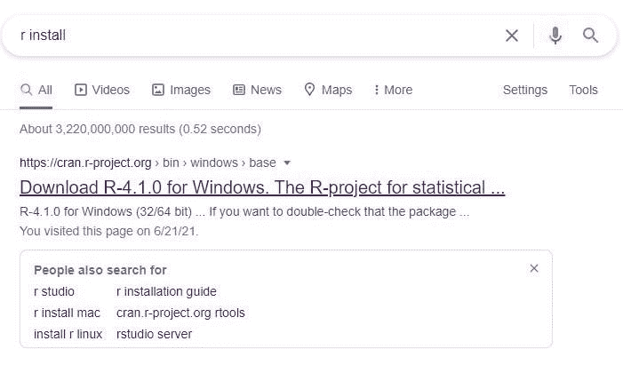
2.  现在你将到达 CRAN 的官方页面，在页面左上角你可以找到窗口的下载选项。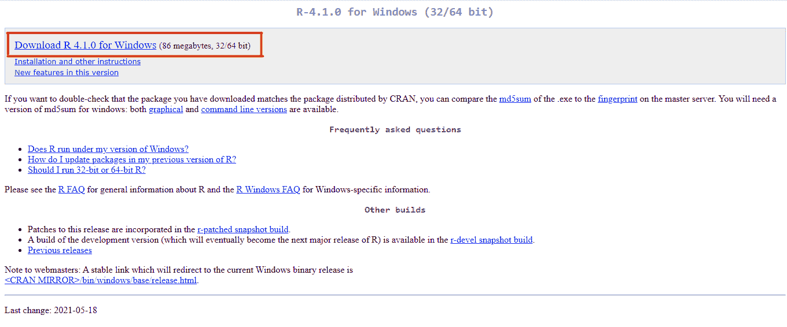
3.  点击下载链接将开始下载安装程序到您的系统。在屏幕的左下角，您可以找到。exe 文件。完成下载需要几秒钟的时间。
4.  现在 R 安装程序下载到您的系统。是时候设置 R 安装程序了。您可以在下载后立即安装它。或者您可以稍后通过双击。exe 文件。

## 如何安装

1.  安装设置从下面的对话框开始。您可以为安装程序选择所需的语言，然后单击“确定”。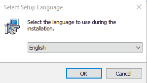
2.  出现的下一个窗口包含 GNU 许可证的信息，只需单击“下一步”继续。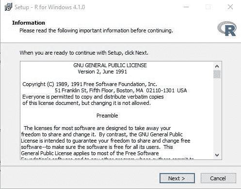
3.  然后，您可以选择要安装 R 的目标位置，然后单击“下一步”。请记住目标文件夹的路径，以便以后在选择不同文件夹时使用。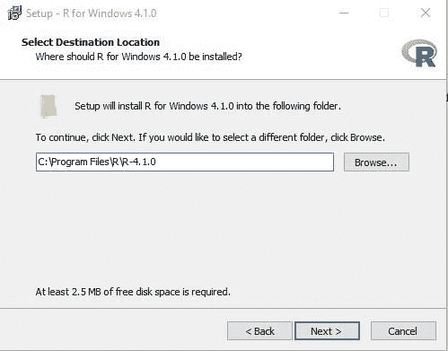
4.  现在，您可以根据操作系统的大小选择组件，然后单击“下一步”。默认情况下，它将位于所有复选框都被选中的自定义选项中。这里，我们选择了 64 位用户安装。
5.  接下来，系统将要求您根据自己的喜好自定义启动选项，然后单击“下一步”。我们在这里保持理想状态，如下所示。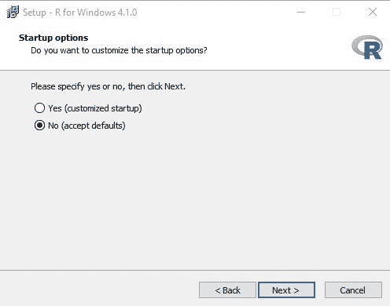
6.  在这一步中，您需要通过从系统中浏览一个文件夹来选择开始菜单文件夹，或者您可以像我们在这里所做的那样保留它。然后点击**下一步**按钮继续。
7.  现在，您可以选择要合并到设置中的其他任务。您可以通过勾选复选框来选择您的首选项，也可以通过取消选中复选框来删除它们。然后单击“下一步”按钮。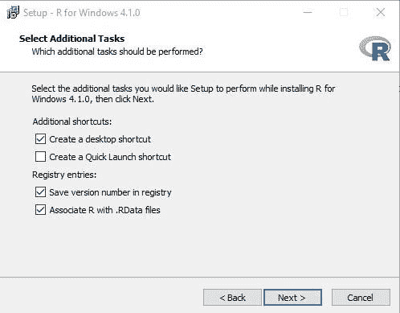
8.  现在安装开始，屏幕上将出现一个显示安装进度的窗口。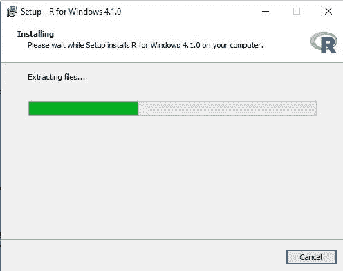
9.  最后，屏幕上会显示一个窗口，如图所示。单击“完成”按钮退出设置。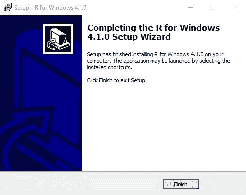
10.  现在 R 已经成功安装到您的系统中。要打开 R 控制台，请遵循路径 C 驱动器->程序文件-> R -> R-4.1.0(根据您的版本)->bin 文件夹-> R 或直接从桌面快捷方式打开它。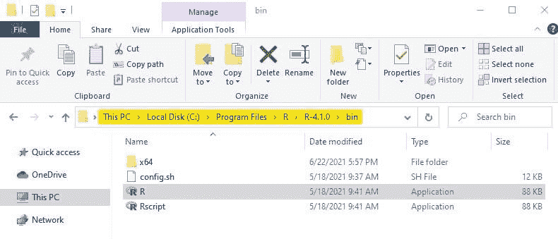
11.  R 控制台窗口将如下所示。

要写小的 R 代码，你可以依靠 R 控制台，但是要用 R 写大代码，你需要更多的用户友好和交互选项。最好的选择是安装像 RStudio 这样的集成开发环境。所以让我们来看看如何免费安装 RStudio。

## 如何安装 r studio

1.  要将 RStudio 安装到您的系统中，请访问链接-[https://www.rstudio.com](https://www.rstudio.com)T3
2.  点击下载，您将被引导至如下所示的页面。
3.  现在向下滚动以上页面到列出所有下载选项的位置。你可以选择免费版本免费下载，也可以选择其他选项。
4.  单击下载按钮将带您进入列出所有安装程序的页面。根据您的操作系统，您可以使用新版本或旧版本的 RStudio。
5.  点击版本将允许你下载 RStudio 安装程序到你的系统。现在打开 RStudio 安装程序，在您的系统中进行设置。屏幕上将出现如下窗口。单击“下一步”按钮继续。
6.  现在，您可以通过浏览位置来选择要安装 RStudio 的文件夹。然后点击**下一步**。
7.  在这里，您可以选择要创建快捷方式的开始菜单文件夹。然后点击安装按钮。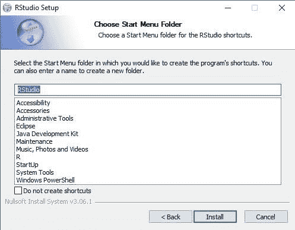
8.  点击安装按钮将开始安装，完成后，您将看到一个屏幕，下面有一个窗口。最后，单击“完成”按钮退出 Rstudio 设置。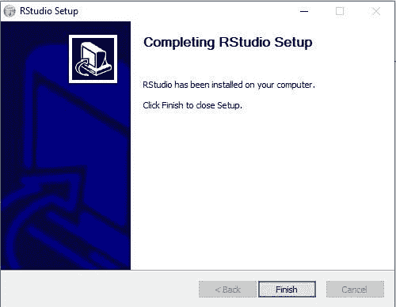

### 熟悉 R 工作室

现在 R studio 已经成功安装在你的系统中，你可以开始使用它来运行 R 程序了。在用 RStudio 编写 R 程序之前，让我们先熟悉一下 Rstudio。遵循一步一步将指导你。

1.  要打开 rstudio 应用程序，您应该记住安装 Rstudio 的文件夹。理想情况下，它会在 bin 文件夹中。路径如下: **C 盘- >程序文件- > RStudio - > bin** 。
2.  双击 rstudio 将打开 Rstudio 应用程序，如下所示。你可以看到 3 个不同的窗口。

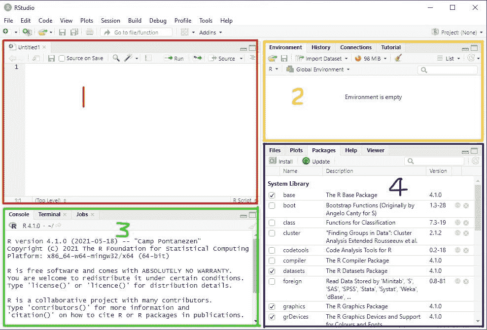