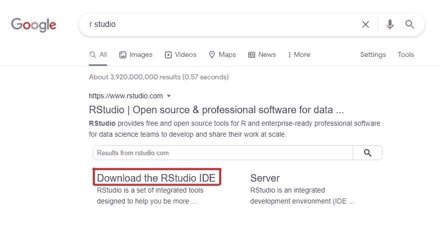
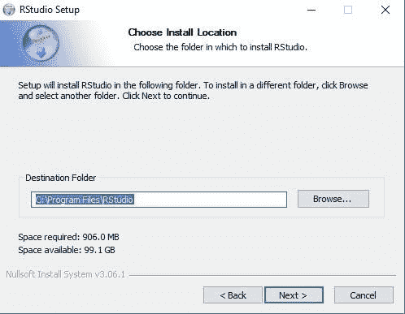
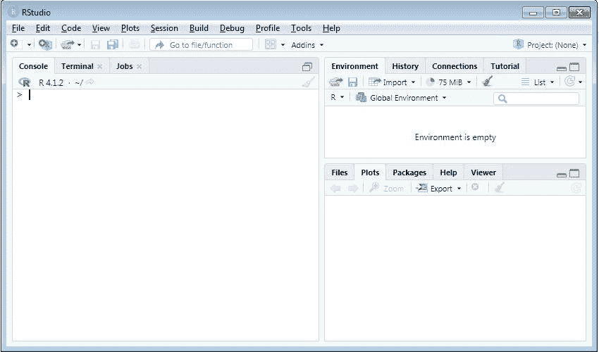
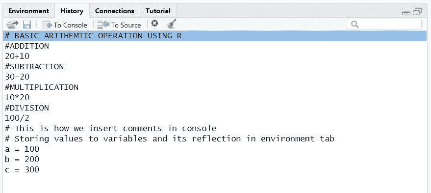
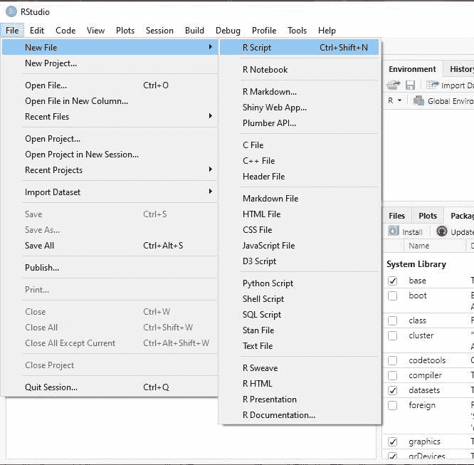

# Windows 的 RStudio 安装

> 原文：<https://learnetutorials.com/r-programming/r-studio-installation>

本教程的结构是，您将从探索什么是 RStudio 以及如何将 RStudio 安装到您的系统开始。之后，我会帮你熟悉 RStudio——控制台、环境、历史、包等不同选项卡的特色。

## RStudio 是什么？

RStudio 是一个用来运行 R 编程语言的**集成开发环境(IDE)** 。像许多其他 ide 一样，RStudio 也有一个控制台、语法荧光笔和其他用于绘图和建模的图形用户工具等。

RStudio 有两个版本——开源(免费)和商业许可。

## 如何安装 R studio？

1.  要将 RStudio 安装到您的系统中，请访问链接-[https://www.rstudio.com](https://www.rstudio.com)或在您最喜欢的浏览器中键入 r studio，然后选择“下载 RStudio IDE”。
2.  点击下载，您将被引导至如下所示的页面。
3.  现在向下滚动以上页面到列出所有下载选项的位置。你可以选择免费版本免费下载，也可以选择其他选项。
4.  单击下载按钮将带您进入列出所有安装程序的页面。根据您的操作系统，您可以使用新版本或旧版本的 RStudio。
5.  点击版本将允许你下载 RStudio 安装程序到你的系统。现在打开 RStudio 安装程序，在您的系统中进行设置。屏幕上将出现如下窗口。点击**下一步**按钮继续。
6.  现在，您可以通过浏览位置来选择要安装 RStudio 的文件夹。然后点击**下一步**。
7.  在这里，您可以选择要创建快捷方式的开始菜单文件夹。然后点击安装按钮。
8.  点击安装按钮将开始安装，完成后，您将看到一个屏幕，下面有一个窗口。最后，点击**完成**按钮退出 Rstudio 设置。

## 熟悉 R 工作室

现在 R studio 已经成功安装在您的系统上，您可以开始使用它来编写自己的 R 程序。在用 RStudio 编写 R 程序之前，让我们先熟悉一下 Rstudio。遵循一步一步的指南将指导您顺利使用集成开发环境。

1.  要打开 Rstudio 应用程序，您应该记住系统中安装 Rstudio 的文件夹。理想情况下，它会在 bin 文件夹中。路径如下: **C 盘- >程序文件- > RStudio - > bin。**
2.  双击 Rstudio 将打开 Rstudio 应用程序。Rstudio 的第一个外观将为您提供如下所示的布局，其中包含三个不同的窗格。每个窗格都包含执行特定功能的特定选项卡。

## 重要的工作室选项卡及其功能

### 1.控制台

RStudio 中的控制台选项卡是我们编写和执行 R 程序的地方。换句话说，控制台接受输入，执行操作，同时显示输出。

除了这些，控制台还会给你一些你正在处理的 R 的基本信息。您可以查看信息，并尝试通过在光标中键入命令来了解更多关于 R 的信息。

让我们看看控制台是如何操作的，以及在使用 RStudio 控制台时需要习惯的基本操作是什么。

1.  **How to clear a console?**

    在 R studio 中清除一个控制台使用命令 Ctrl + L。

    
2.  **How to insert comments in the console?**

    就像在 [Python](../python) 中，我们可以在 R 编程中使用#符号来注释一行。

    
3.  **How to do the basic arithmetic operation and display its output?**

    如您所知，控制台是唯一可以立即测试代码的地方。请看下面的截图，基本的算术运算是通过提供操作数和运算符来完成的。

    

你只需点击输入按钮就可以得到你想要的输出，就这么简单。

注意:为了增加可读性，请按两次或三次 enter 键

### 2.全球环境

“全局环境”选项卡在 R studio 中起着重要的作用，因为它可以被视为显示所有活动对象的工作空间。在 R Studio 中，我们导入的变量和数据都保存为对象。

当您在控制台中声明一个变量时，它将自动显示在环境选项卡中。

在上面的例子中，你有 3 个变量，即 a、b 和 c，它们分别被赋值为 100、200 和 300。在“环境”选项卡上，您可以看到已经声明的值。

除此之外，您还可以找到**历史**标签，该标签记录了您迄今为止在程序中使用的所有命令。见下面截图。

您可以在历史选项卡中看到我们到目前为止所做的所有操作。现在假设你想要**从历史**中删除一些选中的条目，可能吗？是的，它是。您可以使用工具栏中的红十字按钮。

现在**要清除整个历史记录条目**，您可以使用工具栏上显示的扫帚按钮。

### 3.包裹

RStudio 中的下一个不可避免的部分是包选项卡，它列出了运行 R 程序所必需的所有包。包是专门为执行特定任务而创建的可共享的 R 编译代码、数据、函数和文档的集合。

### 4.脚本或文本编辑器

你用 R 写的每个代码都必须保存在某个文件中以备将来使用。为此，您需要首先按照下图所示的步骤创建一个 R 文件，**文件- >新文件- > R 脚本**。另一个可用的选项是使用快捷方式 **Ctrl+Shift+N** 。

这将为您打开一个包含四个窗格的窗口，如下所示。第一个窗格是我们用来编写代码的文本编辑器。

因此，现在您已经获得了关于 RStudio 的一些基本知识，在下一章中，您将获得更多关于如何在文本编辑器中编写第一个代码以及如何在 RStudio 中运行 R 代码的启示，等等。追我们即将推出的教程，用 r 升级自己。