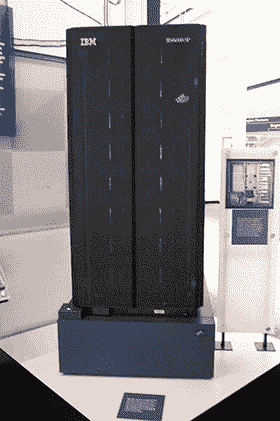

# 人工智能的类型

> 原文：<https://learnetutorials.com/artificial-intelligence/types-of-artificial-intelligence>

在本教程中，我们将讨论人工智能的类型，这意味着人工智能是如何分类的。正如我们所知，AI 被定义为机器分析数据和做出决策的能力，或在新情况下像人一样思考和行动的能力。

因此，我们可以将人工智能大致分为两类，首先，根据人工智能机器在某种情况下的能力，即根据数据进行分析和决策。

例如，用于自动驾驶汽车的人工智能只有一个狭窄的人工智能，这意味着它可以在不需要常识或一般背景知识的情况下，为特定目的完美地行动。在需要更高能力的情况下，AI 机器必须有更多的常识和背景数据等来进行决策，所以我们根据能力进行分类。

下一个基于功能的人工智能分类。我们已经讨论过人工智能被用于各种目的，从简单的移动游戏开始，甚至在军事实时情况下。所以我们必须根据功能来划分人工智能机器。

例如，在自动应答器的基本情况下，我们只需要一个简单的 AI 机器。以手机游戏为例，它只需要有限的内存和处理能力，就像我们根据功能划分人工智能一样。

我们将在下面的章节中详细讨论分类以外的内容。

## 人工智能类型 1:基于能力

根据**基于能力的分类**，有三种 AI 或基于 AI 的机器

1.  狭义人工智能
2.  通用人工智能
3.  超级 pi

### 1.狭义人工智能

狭义人工智能或弱人工智能是一种人工智能技术，它使一个高功能系统能够出于特定目的复制或超越人类智能。狭窄的人工智能被设计来执行特定的任务，或者它们是面向目标的，或者被限制在特定的或狭窄的区域。狭义智能系统只有特定的智能。现代人工智能的所有形式都可以分为弱/窄人工智能。

#### 狭义人工智能的例子

*   **图像和面部识别系统**:脸书和谷歌等社交媒体公司使用的自动识别照片中人物的系统是弱 AI 的表现形式。
*   **聊天机器人和对话助手**:谷歌助手、Siri 和 Alexa，以及客服聊天机器人。
*   **自动驾驶汽车**:特斯拉车型、自主无人机等自主/半自主汽车
*   **预测性维护模型**:这些模型依赖于数据，通常通过传感器收集，以帮助预测机器零件的故障，并提前提醒用户。
*   **推荐引擎**:这些系统可以预测用户可能喜欢或者接下来会搜索的内容。

| 优势 | 不足之处 |
| 

*   The execution efficiency of a single task is often better than that of human beings.
*   For example, a weak artificial intelligence system designed to identify cancer from X-ray may find cancer masses in images faster and more accurately than a trained radiologist.
*   The predictive maintenance platform can analyze the incoming sensor data in real time.

 | 

*   任务执行完全基于他们的设计，决策基于他们训练有素的数据。
*   复杂的模型是在海量数据上训练出来的。大量数据包含不正确的信息，因此根据这些数据训练的模型可能会意外地将不正确的数据内化为真实的，并且通常会给出不正确的结果。

 |

### 2.通用人工智能

人工通用智能或强大的人工智能是一个系统，它可以以比人类更高的效率执行他们设计的特定任务或分配给他们的特定功能，而他们是一个大零，可以做任何没有分配给他们的任务。AGI 机器被设计成像具有一般智力的人类一样解决问题。AGI 应该具备的特征是:

*   常识
*   背景知识
*   迁移学习
*   抽象
*   因果关系

人工智能系统现在无法实现 AGI，理论上用一种算法复制人脑是可能的。人工智能需要很长时间才能达到人工通用智能阶段。然而，过渡已经开始。

| 优势 | 不足之处 |
| 

*   一般的 AI 可以承载大量的任务。
*   AGI 可以完成任何人类能完成的任务。
*   可以扮演人类的每一个角色。
*   从金钱、时间和挽救的生命来看，AGI 可能是一个巨大的利好。

 | 

*   增强对人口的监视和控制。
*   小的组织团体会侵犯权力。
*   支撑着可怕的武器
*   破坏民主。
*   没有道德。

 |

### 3.超级人工智能

基于软件的系统拥有超越人类的智力。它是想象中的人工智能，不仅解释人类的行为，而且是机器将变得足够自我意识以超越人类智力和行为能力的地方。有了超级智能，机器可以想到人类根本无法想到的可能的抽象概念。人工智能在任何事情上都会非常非常出色，无论我们做什么，人工智能都会有更强的记忆力和更快的处理和分析能力。

| 优势 | 不足之处 |
| 

*   比今天人类的智力强大得多。
*   自我提升。

 | 

*   这可能是人类的威胁。
*   能够控制它的环境，防止人类关闭它。

 |

## 狭义人工智能 VS 通用人工智能

| 狭义人工智能 | 通用人工智能 |
| 

*   AI- Focus on limited tasks.
*   Have been trained for specific tasks.
*   Without self-awareness, consciousness and thinking ability.
*   To complete a task, the problems or tasks related to a specific task are interrelated.
*   Try using software

创建人工智能 | 

*   可以执行多个任务。
*   可以执行大量的任务。
*   完全自知。
*   独立决策。
*   尝试用硬件创建人工智能。

 |

## 人工智能类型 2:基于功能

根据基于功能的分类，有四种人工智能或基于人工智能的机器:

1.  反应机器
2.  有限内存机器
3.  心理理论
4.  自我感知人工智能

### 1.反应机器

反应机器是人工智能的基本类型。这种类型的机器不能存储记忆或使用任何经验来决定未来的行动。反应机器只能感知现状并对各自做出反应。他们不应该学习。反应机器的容量极其有限。这种类型的机器只能用于对有限的一组输入进行自动响应。反应机器不能参考他们过去的任何经验，也不能通过实践来改进自己的经验。IBM 的深蓝是一个反应机器类型的例子，它在 1997 年赢得了第一个计算机象棋冠军，击败了特级大师加里·卡斯帕罗夫。

| 优势 | 不足之处 |
| 

*   The most common AI types are relatively easy to implement.
*   Recognize the world and react.

 | 

*   I can't learn.
*   Data is not stored or memory is insufficient.

 |

### 2.有限记忆

有限内存机器可以在有限的时间内保留数据。保留的数据不能添加到他们的经验库中，只能在特定时期使用这些数据。与反应性记忆类型不同，有限记忆由机器学习模型组成，这些模型从以前学习的信息、事实、事件中提取信息，或者有限记忆类型的机器可以通过分析给它们的数据来学习。虚拟语音助手、聊天机器人、自动驾驶汽车和其他几种技术都使用这些类型。

使用有限记忆技术的自动驾驶汽车依赖于综合的和观察收集的知识的结合。他们的驾驶能力来自于分析他们的环境，检测外部因素的模式，并根据需要进行调整。自动驾驶汽车从出现在其视线内的其他交通参与者的运动中收集信息。软件分析数据并决定车辆的速度和方向。有限内存实现后，机器上的响应时间大大减少。

| 优势 | 不足之处 |
| 

*   Knowledge can be extracted from previous events.
*   Can perform complex classification tasks.

 | 

*   Complex algorithm

 |

### 3.心理理论

人工智能机器具有代表他人精神状态的人类能力，包括他们的信仰、欲望和意图，是心智理论类型的机器。这种人工智能仍然是希望，但是研究人员正在努力开发这种人工智能机器。要将人工智能融入人类社会，同样的推断人类心理状态的能力是前提。在过去的几年里，心智理论受到深度学习的推动。心理理论旨在跨越人工智能、认知科学和神经科学领域。神经科学研究者揭示了人类大脑中与心理理论有关的主要区域。有“头脑”的计算机还不存在。

| 优势 | 不足之处 |
| 

*   Understand human emotions.
*   Be able to socialize like human beings.

 | 

*   实施起来更具挑战性。
*   软件开发和维护非常昂贵。

 |

### 4.自我感知人工智能

自感知人工智能被认为是人工智能发展的最终目标。这种类型的机器提出了一个问题，即一台机器是否能变得真正有自我意识，或“有意识”，最好留给哲学家。自我感知人工智能机器的意识、情感和自我意识将是超级智能的。这将比人类的头脑更聪明。人工智能的自我意识仍然是一个假设的概念。

| 优势 | 不足之处 |
| 

*   Smarter than humans.
*   Equivalent to human beings in all senses.

 | 

*   侵入地球超过人类。
*   机器的动作可能变得无法控制。

 |