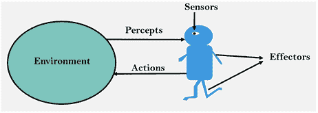
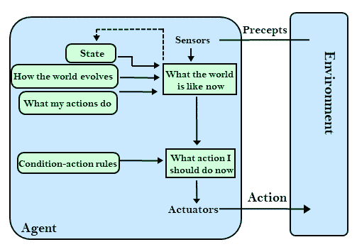
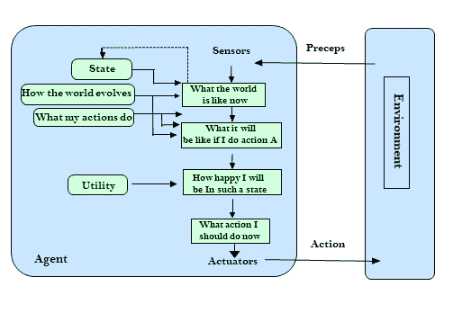
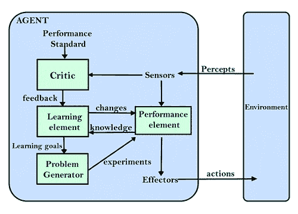

# 人工智能中的智能体

> 原文：<https://learnetutorials.com/artificial-intelligence/intelligent-agents-in-ai>

在本教程中，我们将讨论人工智能中的智能体。人工智能系统包含一个智能体及其环境。智能体是使人工智能能够采取行动的软件实体。智能体感知环境，使用执行器发起动作，代替用户进行操作。或者简单地说**智能体(IA)是一个做出决策的实体**。

## 什么是特工？

任何通过**传感器**识别环境并通过**执行器**作用于环境的事物都被称为**智能体**。智能体周期性地执行识别、思考和行动的任务。智能体可以是:

*   **人体智能体**:眼睛、耳朵等器官作为传感器，手、腿、声道作为执行器。
*   **机器人智能体**:摄像头、红外测距仪、传感器和各种电机
*   **软件智能体**:为特定任务设计的一套程序，比如检查收到的邮件内容，并将其归类为垃圾邮件，重要，非常重要。

## 什么是智能体？

智能体是一种智能体，它可以为具有某种程度个人主义的应用程序执行特定的、可预测的和重复的任务。这些智能体可以在执行任务时学习。这些智能体人具有一些人类的精神属性，如知识、信仰、意图等。恒温器、Alexa 和 Siri 都是智能体的例子。

智能体的主要功能是

*   感知:通过传感器完成
*   动作:通过执行器启动。

### 人工智能体的四个规则:

**规则 1** :必须具备识别环境的能力。
**规则 2** :决策来自观察。
**规则 3** :决定应该导致行动。
**规则 4** :动作一定要理性。

## 智能体是如何工作的？

**传感器**、**执行器**和**效应器**是智能体工作的三个主要组件。在进入详细讨论之前，我们应该首先了解传感器、效应器和执行器。

**传感器**:检测环境变化并将信息发送给其他设备的设备。智能体通过传感器观察环境。例如:摄像头、全球定位系统、雷达。

**执行器**:将能量转化为运动的机器部件。执行器负责移动和控制系统。例如:电动机、齿轮、轨道等。

**效应器**:影响环境的装置。例如:轮子和显示屏。

上图显示了这些组件在人工智能系统中的位置。
智能体通过传感器接收来自环境的感知或输入。利用这些获得的信息或观察，该智能体使用人工智能来做出决策。执行器随后将触发动作。感知历史和过去的行为会影响未来的决定。

## 智能体的特征

*   智能体具有某种程度的个人主义，允许他们自己执行某些任务。
*   即使在执行任务时，信息技术也能学习。
*   他们可以与其他实体如智能体、人类和系统进行交互。
*   可以适应新的规则。
*   目标导向的习惯

## 人工智能体的结构

智能体的结构可以看作是体系结构和智能体程序的结合

信息架构由三个主要部分组成:

1.  **架构**:智能体在其上执行的机器或由执行器和传感器组成的设备。PC、相机等就是例子。
2.  **智能体功能**:用于将感知映射到动作。感知序列是指智能体识别信息的历史。
3.  **智能体程序**:是智能体功能的实现。智能体程序在物理架构上的执行产生智能体功能。

**F: P* → A =** 智能体程序运行在物理架构上产生函数 f
简单的智能体程序可以定义为一个智能体函数，它将每个可能的感知映射到一个智能体可以执行的可能动作。
现在我们对什么是智能体有了清晰的认识。对于人工智能来说，基于逻辑(理性)的行为非常重要，因为智能体对每一个可能的最佳行为都获得正奖励，对每一个错误的行为都获得负奖励。现在看看理性和理性的智能体人。

## 理性主体

一个理想的理性智能体是一个能够以最好的行动执行并最大化性能度量的智能体。备选方案中的操作是基于以下因素选择的:

*   感知序列
*   内置知识库

理性主体的行为使主体在给定的感知序列中最成功。表现最好的智能体是理性智能体。

### 合理性

理性定义了合理、明智和具有良好判断力的水平。它关注的是行动和结果，这取决于智能体所识别的内容。合理性的衡量基于以下几点:

*   工作指标
*   关于环境的先验知识
*   智能体可以执行的最佳操作
*   感知序列

## 人工智能中的豌豆表示

这是一种人工智能体工作的模型。它用于对相似的智能体进行分组。环境、执行器和相应智能体的传感器被认为是由 PEAS 进行性能测量的。
PEAS 代表性能测量、环境、执行器和传感器。

1.  **性能度量**:每个智能体的性能根据他们的感知而变化，智能体的成功是使用性能度量单位来描述的。
2.  **环境**:智能体每一瞬间的周围。如果相应的智能体启动，环境将随时间变化。环境有 5 种主要类型:
    *   完全可观察和部分可观察
    *   情节性和连续性
    *   静态和动态
    *   离散和连续
    *   确定性和随机性
3.  **执行器**:启动动作并将动作输出传递给环境的智能体的一部分。
4.  **传感器**:智能体的一部分，为智能体获取输入。

智能体及其 PEAS 表示的示例

| 智能体人 | 工作指标 | 环境 | 执行器 | 传感器 |
| **真空吸尘器** | 清洁效率电池寿命安全 | 房间桌子木地板地毯各种障碍 | 车轮刷子真空吸出器 | 照相机灰尘检测传感器悬崖传感器颠簸传感器红外墙壁传感器 |
| **自动驾驶汽车** | 舒适的旅行安全最大距离 | 道路交通车辆 | 驾驶盘加速器刹车镜子 | 照相机全球（卫星）定位系统里程表 |
| **医院管理系统** | 病人的健康录取过程支付 | 医院医生病人 | 药方诊断扫描报告 | 症状患者的反应 |

## 人工智能体的类型

根据感知智能的能力和水平，智能主体可以分为五大类。

1.  简单反射剂
2.  基于模型的反射剂
3.  基于目标的智能体
4.  基于实用程序的智能体
5.  学习智能体

### 1.简单反射剂

这些智能体使用当前感知而不是感知历史来采取行动。智能体功能的基础是条件-动作规则。条件-动作规则是将条件映射到动作的规则。(例如:房间清洁剂仅在房间有灰尘时有效)。环境是完全可观察的，并且完全可观察的环境对于智能体功能的成功是理想的。简单反射剂的设计方法面临的挑战是:
非常有限的智能

*   不知道当前状态中无法识别的部分。
*   尺寸很难储存。
*   环境变化是不可适应的。

### 2.基于模型的反射智能体

基于模型的反射智能体在其行为中考虑了感知历史。这些智能体仍然可以在无法完全观察到的环境中很好地工作。他们用一个世界模型来选择各自的行动，并保持一种内在状态。
**模型**–理解世界上的事情是如何发生的，所以被称为基于模型的智能体。
**内部状态**–当前状态未被注意的特征用感知历史来表示。
更新智能体状态需要以下信息

*   世界是如何演变的。
*   智能体人的行为对世界的影响。

### 3.基于目标的智能体

为了描述能力，基于目标的智能体使用目标信息。这些智能体比基于模型的反射智能体具有更高的能力，因为支持决策的知识被显式建模，从而允许修改。对于这些智能体来说，关于当前状态环境的知识不足以决定要做什么。目标必须描述理想的情况。智能体需要知道这个目标。智能体选择行动来实现目标。在决定目标是否实现之前，这些智能体可能必须考虑一长串可能的动作。目标-描述理想的情况

### 4.基于效用的智能体

这些智能体做出的选择基于效用。效用度量的额外组成部分使它们比基于目标的智能体更高级。他们的行为不仅基于目标，也基于实现目标的最佳方式。当智能体必须从多个备选方案中执行最佳操作时，基于实用程序的智能体非常有用。通过将每个状态映射到一个实数来检查实现目标的每个动作的效率。

### 5.学习智能体

能够从以前的经验中学习的智能体是学习智能体。他们开始用他们的基础知识行动，然后通过学习，他们可以自动行动和适应。学习智能体可以学习，分析性能，提高性能。学习智能体具有以下概念组成部分:

*   **学习元素**:元素能够从以前的经验中学习。
*   **评论**:提供关于智能体在固定绩效标准方面表现如何的反馈。
*   **性能元素**:选择要执行的动作。
*   **问题生成器**:充当反馈智能体，执行某些任务，例如提出建议，这些建议将带来新的信息体验。

## 智能体的应用

在许多现实生活中，人工智能中的智能体已经得到了应用。

### 信息搜索、检索和导航

通过使用搜索引擎搜索信息，智能体增强了信息的访问和导航。智能体代表用户在短时间内执行搜索特定数据对象的任务。

### 重复性办公室活动

一些公司的一些功能领域已经实现自动化，以降低运营成本，包括客户支持和销售。

### 医疗诊断

患者被视为环境计算机键盘被用作接收患者症状数据的传感器，智能体使用这些信息来决定最佳的行动方案。通过执行器进行测试和处理。

### 用真空吸尘器打扫

对于真空吸尘器，要清洁的表面是环境(例如房间、桌子、地毯)。使用真空清洁中使用的传感器(摄像头、灰尘检测传感器等)。)感知环境条件。诸如刷子、轮子和真空吸尘器等致动器用于执行动作。

### 自动驾驶

在自动驾驶相机中，全球定位系统和雷达被用作收集信息的传感器。行人、其他车辆、道路或路标就是环境。像制动器这样的各种执行器被用来启动动作。